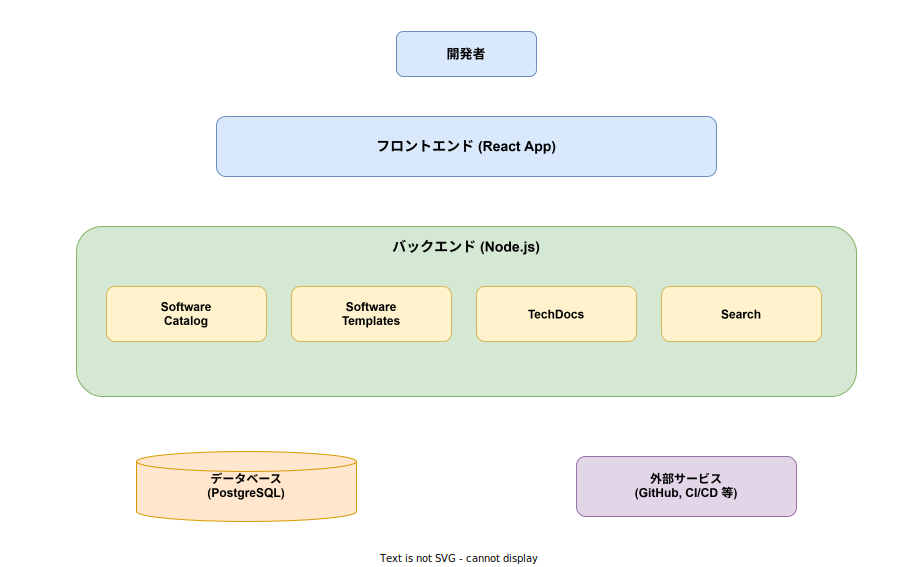

# Backstage: 基本

- 対象読者: Web アプリケーション開発経験のある開発者
- 学習目標: Backstage の全体像を理解し、ローカル環境で開発者ポータルを立ち上げられるようになる
- 所要時間: 約 40 分
- 対象バージョン: Backstage 1.35
- 最終更新日: 2026-04-12

## 1. このドキュメントで学べること

- Backstage が解決する課題と存在意義を説明できる
- 4 つのコア機能（Software Catalog・Software Templates・TechDocs・Search）の役割を理解できる
- Backstage のアーキテクチャ（フロントエンド・バックエンド・プラグイン）を把握できる
- ローカル環境で Backstage アプリケーションを起動できる

## 2. 前提知識

- Node.js と npm/yarn の基本操作
- React の基本的な概念（コンポーネント、Props）
- YAML の基本的な記法

## 3. 概要

Backstage は Spotify が社内で開発し、2020 年にオープンソース化した開発者ポータル構築フレームワークである。現在は CNCF（Cloud Native Computing Foundation）の Incubating プロジェクトとして管理されている。

組織の規模が大きくなると、サービス・API・ドキュメント・インフラが分散し、「どのチームが何を管理しているのか」「このサービスの API 仕様はどこにあるのか」といった情報の把握が困難になる。Backstage はこれらの情報を 1 つのポータルに集約し、開発者が必要な情報へ素早くアクセスできる環境を提供する。

## 4. 用語の整理

| 用語 | 説明 |
|------|------|
| Software Catalog | 組織内のすべてのソフトウェア資産（サービス、API、ライブラリ等）を一元管理するカタログ |
| Software Templates | 新しいプロジェクトやサービスを定型のテンプレートから作成する仕組み |
| TechDocs | マークダウンから技術ドキュメントサイトを自動生成する機能 |
| Entity | Catalog に登録される管理対象の単位（Component、API、System 等） |
| Plugin | Backstage の機能を拡張するモジュール。フロントエンドとバックエンドの両方に対応する |
| catalog-info.yaml | Entity の情報を記述する YAML ファイル。リポジトリのルートに配置する |

## 5. 仕組み・アーキテクチャ

Backstage は React 製のフロントエンドと Node.js 製のバックエンドで構成される。すべての機能はプラグインとして実装されており、コア機能もプラグインの一種である。



**コア機能（プラグイン）:**

| プラグイン | 役割 |
|-----------|------|
| Software Catalog | サービス・API・ライブラリ等のメタデータを収集・表示する中核機能 |
| Software Templates | 組織標準に沿った新規プロジェクトのスキャフォールディングを提供する |
| TechDocs | docs-as-code の手法でドキュメントをポータル内に統合表示する |
| Search | Catalog・TechDocs・その他プラグインの情報を横断検索する |

バックエンドは PostgreSQL 等のデータベースにエンティティ情報を永続化し、GitHub や CI/CD ツール等の外部サービスと連携してメタデータを同期する。

### Software Catalog のエンティティモデル

Software Catalog はソフトウェア資産をエンティティとして管理する。エンティティには以下の種類があり、相互に関係を持つ。


| エンティティ | 説明 |
|-------------|------|
| Domain | ビジネスドメイン。複数の System をグループ化する最上位の概念 |
| System | 関連する Component と API をまとめた論理的な単位 |
| Component | 実際のソフトウェア（サービス、Web サイト、ライブラリ等） |
| API | Component が公開するインターフェース仕様 |
| Resource | Component が依存するインフラ（データベース、S3 バケット等） |
| Group | チームや部門を表す組織単位 |
| User | 個々の開発者 |

## 6. 環境構築

### 6.1 必要なもの

- Node.js v18 以上
- Yarn（Classic v1 推奨）
- Git

### 6.2 セットアップ手順

```bash
# Backstage アプリケーションを新規作成する
npx @backstage/create-app@latest

# 作成されたディレクトリに移動する
cd my-backstage-app

# 開発サーバーを起動する
yarn dev
```

### 6.3 動作確認

ブラウザで以下の URL にアクセスし、Backstage のトップページが表示されることを確認する。

- フロントエンド: `http://localhost:3000`
- バックエンド API: `http://localhost:7007`

## 7. 基本の使い方

Backstage では、各リポジトリに `catalog-info.yaml` を配置することでソフトウェアを Catalog に登録する。

```yaml
# catalog-info.yaml: Catalog にサービスを登録するための定義ファイル
# apiVersion を指定する
apiVersion: backstage.io/v1alpha1
# エンティティの種類を Component に設定する
kind: Component
metadata:
  # サービスの名前を定義する
  name: my-service
  # サービスの説明を記載する
  description: ユーザー管理を担当するマイクロサービス
  # アノテーションで GitHub リポジトリを紐づける
  annotations:
    github.com/project-slug: my-org/my-service
spec:
  # コンポーネントのタイプを指定する（service, website, library 等）
  type: service
  # ライフサイクルを指定する（experimental, production 等）
  lifecycle: production
  # 所有チームを指定する
  owner: team-platform
```

### 解説

- `apiVersion`: Backstage の API バージョン。現在は `backstage.io/v1alpha1` を使用する
- `kind`: エンティティの種類。`Component`、`API`、`System` 等を指定できる
- `metadata.name`: エンティティの一意な識別名
- `metadata.annotations`: 外部サービスとの連携情報を記述する
- `spec.type`: Component のサブタイプ。組織ごとにカスタム定義も可能である
- `spec.owner`: エンティティの所有者（Group または User の名前）

## 8. ステップアップ

### 8.1 プラグインの追加

Backstage は豊富なプラグインエコシステムを持つ。公式およびコミュニティのプラグインを `packages/app`（フロントエンド）と `packages/backend`（バックエンド）にそれぞれ追加する。

```bash
# フロントエンドプラグインをインストールする
yarn --cwd packages/app add @backstage/plugin-tech-radar
```

```typescript
// バックエンドにプラグインを登録するコード例
// @backstage/backend-defaults からバックエンドを生成する
import { createBackend } from '@backstage/backend-defaults';

// バックエンドインスタンスを作成する
const backend = createBackend();

// Catalog プラグインを追加する
backend.add(import('@backstage/plugin-catalog-backend'));

// Scaffolder（テンプレート）プラグインを追加する
backend.add(import('@backstage/plugin-scaffolder-backend'));

// バックエンドを起動する
backend.start();
```

### 8.2 Software Templates によるプロジェクト作成

Software Templates を使うと、組織の標準に沿った新規プロジェクトを数クリックで作成できる。テンプレートは YAML で定義し、Git リポジトリの作成から CI パイプラインの設定まで自動化できる。

## 9. よくある落とし穴

- **catalog-info.yaml の配置忘れ**: リポジトリを Catalog に登録するには、ルートに `catalog-info.yaml` を配置し、Backstage に登録する必要がある
- **owner の不一致**: `spec.owner` で指定する名前は、Catalog に登録済みの Group または User の `metadata.name` と一致させる必要がある
- **プラグインのバージョン不整合**: Backstage 本体とプラグインのバージョンが合わないと起動エラーが発生する。`backstage-cli versions:bump` で一括更新できる
- **認証の未設定**: デフォルトではゲストアクセスが有効だが、本番環境では必ず認証プロバイダ（GitHub、Google 等）を設定する

## 10. ベストプラクティス

- すべてのリポジトリに `catalog-info.yaml` を配置し、Catalog への登録を標準プロセスにする
- エンティティの `owner` を必ず設定し、各サービスの責任チームを明確にする
- Software Templates を活用して新規プロジェクトの構成を統一する
- TechDocs でドキュメントをコードと同じリポジトリで管理する（docs-as-code）
- プラグインのバージョンは Backstage 本体のリリースに合わせて定期的に更新する

## 11. 演習問題

1. `npx @backstage/create-app@latest` で新しい Backstage アプリケーションを作成し、`yarn dev` で起動せよ
2. 任意のリポジトリに `catalog-info.yaml` を作成し、Backstage の画面から「Register Existing Component」で登録せよ
3. 登録したコンポーネントの詳細画面を確認し、どのような情報が表示されるかを把握せよ

## 12. さらに学ぶには

- 公式ドキュメント: <https://backstage.io/docs>
- Backstage GitHub リポジトリ: <https://github.com/backstage/backstage>
- CNCF Backstage プロジェクトページ: <https://www.cncf.io/projects/backstage/>
- Backstage プラグインディレクトリ: <https://backstage.io/plugins>

## 13. 参考資料

- Backstage 公式ドキュメント Overview: <https://backstage.io/docs/overview/what-is-backstage>
- Backstage Software Catalog: <https://backstage.io/docs/features/software-catalog/>
- Backstage Getting Started: <https://backstage.io/docs/getting-started/>
- Backstage Plugin Development: <https://backstage.io/docs/plugins/>
