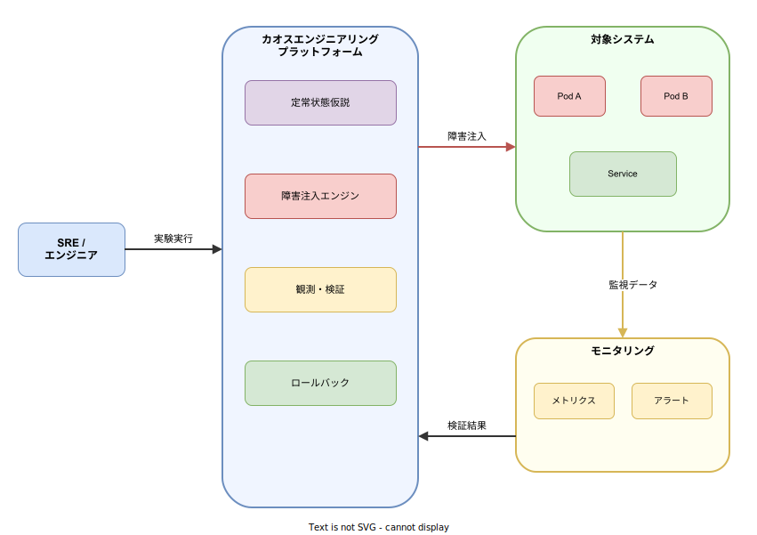
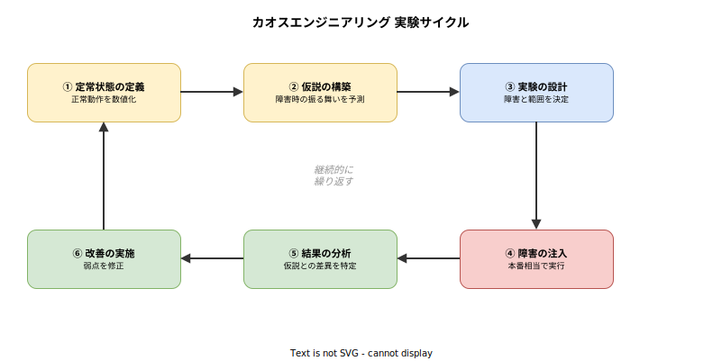

# Chaos Engineering: 基本

- 対象読者: Kubernetes やマイクロサービスの基本知識を持つ開発者・SRE
- 学習目標: Chaos Engineering の原則を理解し、簡単な実験を設計・実行できるようになる
- 所要時間: 約 30 分
- 対象バージョン: Chaos Toolkit 1.x / Litmus 3.x / Chaos Mesh 2.x
- 最終更新日: 2026-04-12

## 1. このドキュメントで学べること

- Chaos Engineering が「なぜ」必要なのかを説明できる
- 定常状態仮説に基づく実験の設計方法を理解できる
- 主要なツール（Chaos Toolkit・Litmus・Chaos Mesh）の特徴を比較できる
- Chaos Toolkit を使って最小限の実験を定義・実行できる

## 2. 前提知識

- 分散システムの基本概念（複数サービスが連携して動作すること）
- Kubernetes の基本操作（Pod、Deployment、Service の概念）
  - 参照: [Kubernetes: 基本](./kubernetes_basics.md)
- YAML の基本的な記法

## 3. 概要

Chaos Engineering（カオスエンジニアリング）は、本番環境のシステムが予期しない障害に耐えられることを検証するための規律ある実験手法である。Netflix が 2010 年に AWS へ移行した際、自社システムの耐障害性を確認するために「Chaos Monkey」を開発したことが起源とされる。

従来のテスト（単体テスト・結合テスト）は「既知の障害パターン」を対象とする。一方、Chaos Engineering は「未知の障害パターン」を発見するために、意図的に障害を注入し、システムの振る舞いを観察する。これにより、障害が実際に発生する前に弱点を特定し、修正できる。

Chaos Engineering は「ランダムに壊す」ことではない。科学的手法に基づき、仮説を立て、制御された実験を行い、結果を分析する体系的なアプローチである。

## 4. 用語の整理

| 用語 | 説明 |
|------|------|
| 定常状態（Steady State） | システムが正常に動作している状態を示す計測可能な指標（レスポンスタイム、エラー率等） |
| 定常状態仮説（Steady State Hypothesis） | 「障害を注入してもシステムは定常状態を維持する」という検証対象の仮説 |
| ブラストラディウス（Blast Radius） | 実験が影響を及ぼす範囲。実験では意図的にこの範囲を制限する |
| Game Day | チーム全体で障害シナリオを実行し、対応プロセスを訓練するイベント |
| プローブ（Probe） | システムの状態を観測・計測する仕組み |
| ロールバック（Rollback） | 実験後にシステムを元の状態に戻す操作 |

## 5. 仕組み・アーキテクチャ

Chaos Engineering のシステム構成は、プラットフォーム・対象システム・モニタリングの 3 層で成り立つ。



**プラットフォーム**は実験の定義・実行・検証・ロールバックを担う。**対象システム**は障害を注入される側のアプリケーション群である。**モニタリング**はシステムの振る舞いを計測し、定常状態からの逸脱を検知する。

実験は以下の 6 ステップのサイクルで繰り返し実施する。



1. **定常状態の定義**: レスポンスタイム p99 < 200ms、エラー率 < 0.1% など、正常を数値で定義する
2. **仮説の構築**: 「Pod を 1 つ停止しても定常状態は維持される」のように仮説を立てる
3. **実験の設計**: 注入する障害の種類・範囲・持続時間を決定する
4. **障害の注入**: 本番または本番相当の環境で障害を発生させる
5. **結果の分析**: 定常状態仮説が維持されたかを検証し、差異を特定する
6. **改善の実施**: 発見された弱点を修正し、レジリエンスを向上させる

## 6. 環境構築

### 6.1 必要なもの

- Python 3.8 以上
- pip（Python パッケージマネージャ）
- Kubernetes クラスタ（ローカル検証には minikube で可）

### 6.2 セットアップ手順（Chaos Toolkit）

```bash
# Chaos Toolkit をインストールする
pip install chaostoolkit

# Kubernetes 拡張をインストールする
pip install chaostoolkit-kubernetes

# インストールを確認する
chaos --version
```

### 6.3 動作確認

```bash
# ヘルプを表示して正常にインストールされていることを確認する
chaos --help
```

## 7. 基本の使い方

Chaos Toolkit では実験を YAML で定義する。以下はデータベース Pod の停止に対するサービスの耐障害性を検証する最小構成の実験定義である。

```yaml
# Chaos Toolkit 実験定義ファイル
# Pod停止時のサービス耐障害性を検証する実験
# 実験のタイトルを定義する
title: "Pod停止時のサービス耐障害性を検証する"
# 定常状態仮説を定義する
steady-state-hypothesis:
  # 仮説のタイトルを記述する
  title: "サービスが正常に応答している"
  # 検証用プローブのリストを定義する
  probes:
    - name: "ヘルスチェック"
      # プローブの種類を指定する
      type: "probe"
      # 期待するHTTPステータスコードを指定する
      tolerance: 200
      # HTTPプロバイダを使用する
      provider:
        type: "http"
        # ヘルスチェックエンドポイントのURLを指定する
        url: "http://localhost:8080/health"
# 障害注入メソッドを定義する
method:
  - name: "データベースPodを停止する"
    # アクションタイプを指定する
    type: "action"
    # Kubernetes Pod操作プロバイダを設定する
    provider:
      type: "python"
      # Pod操作モジュールを指定する
      module: "chaosk8s.pod.actions"
      # Pod停止関数を指定する
      func: "terminate_pods"
      arguments:
        # 対象Podのラベルセレクタを指定する
        label_selector: "app=postgres"
        # 対象の名前空間を指定する
        ns: "database"
    # アクション実行後の待機設定を行う
    pauses:
      # 30秒間待機してシステムの反応を観察する
      after: 30
# 実験後のロールバック操作を定義する
rollbacks:
  - name: "データベースを再起動する"
    # アクションタイプを指定する
    type: "action"
    # Kubernetesサービス起動プロバイダを設定する
    provider:
      type: "python"
      # サービス操作モジュールを指定する
      module: "chaosk8s.actions"
      # マイクロサービス起動関数を指定する
      func: "start_microservice"
      arguments:
        # デプロイメントマニフェストのパスを指定する
        spec_path: "k8s/postgres.yaml"
        # 対象の名前空間を指定する
        ns: "database"
```

### 解説

- `steady-state-hypothesis`: 実験前後で検証する定常状態。HTTP ヘルスチェックでステータス 200 を期待する
- `method`: 実行する障害注入アクション。`terminate_pods` で指定した Pod を停止する
- `pauses.after`: アクション実行後の待機秒数。システムの反応を待つために設定する
- `rollbacks`: 実験後の復旧操作。必ず定義してシステムを元に戻す

```bash
# 実験を実行する
chaos run experiment.yaml

# 実験結果のジャーナルを確認する
cat journal.json
```

## 8. ステップアップ

### 8.1 主要ツールの比較

| ツール | 特徴 | 実行方式 | 対象環境 |
|--------|------|----------|----------|
| Chaos Toolkit | CLI ベース、宣言的 YAML/JSON、拡張可能 | スタンドアロン | マルチプラットフォーム |
| Litmus Chaos | Kubernetes ネイティブ、CRD ベース | Kubernetes Operator | Kubernetes |
| Chaos Mesh | Kubernetes ネイティブ、Web UI あり | Kubernetes Operator | Kubernetes |
| Chaos Monkey | Netflix 製、インスタンス停止に特化 | エージェント | AWS / Kubernetes |

### 8.2 障害注入の種類

Chaos Engineering で注入する代表的な障害パターンは以下のとおりである。

| カテゴリ | 障害例 | 検証対象 |
|----------|--------|----------|
| インフラ | Pod 停止、Node 障害、ディスク障害 | 自動復旧、冗長性 |
| ネットワーク | レイテンシ増加、パケットロス、DNS 障害 | タイムアウト処理、リトライ |
| アプリケーション | CPU 高負荷、メモリ逼迫、プロセス停止 | オートスケール、リソース制限 |
| 依存サービス | 外部 API 障害、データベース切断 | フォールバック、サーキットブレーカー |

## 9. よくある落とし穴

- **本番環境でいきなり実行する**: ステージング環境から始め、ブラストラディウスを段階的に拡大する
- **ロールバックを定義しない**: 実験が失敗した場合にシステムを復旧できなくなる。rollbacks は必須である
- **定常状態を曖昧にする**: 「正常に動いている」ではなく「p99 < 200ms」のように数値で定義する
- **結果を分析しない**: 各実験の結果を記録・共有し、改善アクションにつなげる
- **複数障害を同時に注入する**: 原因の特定が困難になる。一度に一つの障害から始める

## 10. ベストプラクティス

- 定常状態仮説を必ず先に定義してから実験を設計する
- ブラストラディウスを最小限に保ち、段階的に拡大する
- 実験は自動化し、CI/CD パイプラインに組み込む
- 実験結果をチーム全体で共有し、ポストモーテムを実施する
- Game Day を定期的に開催し、障害対応プロセスを訓練する

## 11. 演習問題

1. 自分のチームが運用するサービスについて、定常状態を 3 つの指標で定義せよ
2. Chaos Toolkit を使い、Kubernetes 上の Pod を 1 つ停止する実験を YAML で記述し、実行せよ
3. 実験結果のジャーナルを分析し、システムの弱点と改善策を 1 つ以上挙げよ

## 12. さらに学ぶには

- Principles of Chaos Engineering: <https://principlesofchaos.org/>
- Chaos Toolkit 公式ドキュメント: <https://chaostoolkit.org/reference/concepts/>
- Litmus Chaos 公式ドキュメント: <https://litmuschaos.io/docs/>
- Chaos Mesh 公式ドキュメント: <https://chaos-mesh.org/docs/>

## 13. 参考資料

- Principles of Chaos Engineering: <https://principlesofchaos.org/>
- Netflix Technology Blog — Chaos Engineering: <https://netflixtechblog.com/tagged/chaos-engineering>
- Chaos Toolkit Core Concepts: <https://chaostoolkit.org/reference/concepts/>
- Litmus Chaos GitHub: <https://github.com/litmuschaos/litmus>
- Chaos Mesh GitHub: <https://github.com/chaos-mesh/chaos-mesh>
