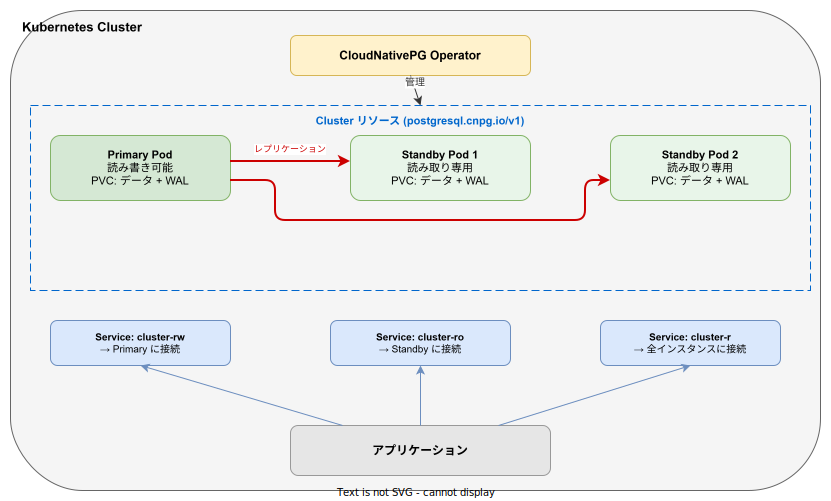
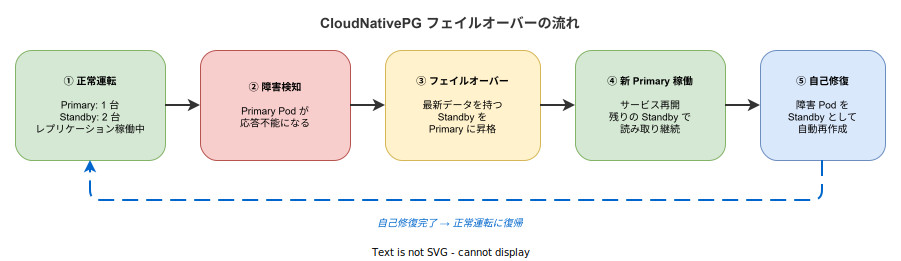

# CloudNativePG: 基本

- 対象読者: Kubernetes の基礎知識を持つ開発者
- 学習目標: CloudNativePG の全体像を理解し、Kubernetes 上に PostgreSQL クラスタをデプロイできるようになる
- 所要時間: 約 40 分
- 対象バージョン: CloudNativePG 1.26 / 1.27
- 最終更新日: 2026-04-12

## 1. このドキュメントで学べること

- CloudNativePG が解決する課題と存在意義を説明できる
- Operator と Cluster リソースの関係を理解できる
- Primary / Standby 構成と自動フェイルオーバーの仕組みを理解できる
- 最小構成の PostgreSQL クラスタを Kubernetes 上にデプロイできる

## 2. 前提知識

- Kubernetes の基本概念（Pod, Service, PVC, カスタムリソース）
- PostgreSQL の基本的な用途と役割
- YAML マニフェストの記法
- 関連 Knowledge: [Kubernetes: 基本](./kubernetes_basics.md)

## 3. 概要

CloudNativePG（略称: CNPG）は、Kubernetes 上で PostgreSQL クラスタを管理するためのオープンソースの Operator である。CNCF（Cloud Native Computing Foundation）の Sandbox プロジェクトとして管理されている。

従来、Kubernetes 上で PostgreSQL を運用するには、手動でのフェイルオーバー設定、バックアップスクリプトの管理、レプリケーションの監視など多くの運用作業が必要だった。CloudNativePG は `Cluster` というカスタムリソースを導入し、これらの運用を Kubernetes ネイティブに自動化する。外部の HA ツール（Patroni 等）を必要とせず、Kubernetes API と直接統合する点が特徴である。

## 4. 用語の整理

| 用語 | 説明 |
|------|------|
| Operator | Kubernetes のカスタムコントローラ。Cluster リソースの変更を監視し、PostgreSQL の状態を自動調整する |
| Cluster | CloudNativePG が提供するカスタムリソース。PostgreSQL クラスタの望ましい状態を宣言する |
| Primary | 読み書き可能な PostgreSQL インスタンス。クラスタに 1 台のみ存在する |
| Standby | Primary からレプリケーションでデータを受信する読み取り専用インスタンス |
| フェイルオーバー | Primary の障害時に Standby を自動で Primary に昇格させる仕組み |
| スイッチオーバー | 計画的に Primary を別のインスタンスに切り替える運用操作 |
| WAL | Write-Ahead Log。データ変更の記録であり、レプリケーションとリカバリの基盤となる |
| PVC | Persistent Volume Claim。Pod のデータを永続化するための Kubernetes リソース |

## 5. 仕組み・アーキテクチャ

CloudNativePG の Operator は Kubernetes クラスタ内にデプロイされ、`Cluster` リソースを監視する。`Cluster` リソースが作成されると、Operator は以下を自動生成する。

- PostgreSQL インスタンス用の Pod（Primary 1 台 + Standby N 台）
- 各 Pod に対応する PVC（データ用・WAL 用）
- アプリケーション接続用の Service（3 種類）



**Service の種類と用途:**

| Service 名 | 接続先 | 用途 |
|------------|--------|------|
| `cluster-rw` | Primary のみ | 読み書きが必要なアプリケーション接続 |
| `cluster-ro` | Standby のみ | 読み取り専用のクエリ分散 |
| `cluster-r` | 全インスタンス | 読み取り専用（Primary 含む） |

フェイルオーバーが発生すると、Service のエンドポイントが自動で切り替わるため、アプリケーション側の接続文字列を変更する必要はない。

## 6. 環境構築

### 6.1 必要なもの

- kubectl（Kubernetes CLI）
- Kubernetes クラスタ（minikube、kind、または本番クラスタ）
- Helm（推奨）または kubectl apply によるインストール

### 6.2 セットアップ手順

```bash
# CloudNativePG Operator を最新の安定版リリースからインストールする
kubectl apply --server-side -f \
  https://raw.githubusercontent.com/cloudnative-pg/cloudnative-pg/release-1.26/releases/cnpg-1.26.0.yaml

# Operator の Pod が Running になるまで待機する
kubectl get deployment -n cnpg-system cnpg-controller-manager

# カスタムリソース定義が登録されたことを確認する
kubectl get crd clusters.postgresql.cnpg.io
```

### 6.3 動作確認

```bash
# Operator のログを確認して正常起動を確認する
kubectl logs -n cnpg-system deployment/cnpg-controller-manager --tail=5
```

`Started CloudNativePG Controller Manager` と表示されればセットアップ完了である。

## 7. 基本の使い方

以下は 3 インスタンス（Primary 1 台 + Standby 2 台）の最小構成である。

```yaml
# CloudNativePG の最小構成クラスタ定義
# 3 インスタンスの PostgreSQL クラスタを作成する
apiVersion: postgresql.cnpg.io/v1
kind: Cluster
metadata:
  # クラスタの名前を定義する
  name: my-postgres
spec:
  # インスタンス数を 3 に設定する（Primary 1 + Standby 2）
  instances: 3
  # 各インスタンスのストレージサイズを指定する
  storage:
    size: 5Gi
```

### 解説

- `apiVersion`: CloudNativePG のカスタムリソース API バージョン
- `kind`: `Cluster` を指定することで Operator が PostgreSQL クラスタを管理する
- `spec.instances`: クラスタ内のインスタンス総数。Operator が自動で Primary 1 台 + 残りを Standby に構成する
- `spec.storage.size`: 各インスタンスに割り当てる PVC のサイズ

```bash
# マニフェストを適用する
kubectl apply -f cluster.yaml

# クラスタの状態を確認する
kubectl get cluster my-postgres

# 各 Pod の状態を確認する
kubectl get pods -l cnpg.io/cluster=my-postgres

# 自動作成された Service を確認する
kubectl get svc -l cnpg.io/cluster=my-postgres
```

## 8. ステップアップ

### 8.1 本番向けの設定

```yaml
# 本番向け構成のクラスタ定義
apiVersion: postgresql.cnpg.io/v1
kind: Cluster
metadata:
  # 本番クラスタの名前を定義する
  name: production-pg
spec:
  # インスタンス数を 3 に設定する
  instances: 3
  # PostgreSQL のパラメータを設定する
  postgresql:
    parameters:
      shared_buffers: "256MB"
      max_connections: "200"
  # データ用ストレージを設定する
  storage:
    storageClass: standard
    size: 50Gi
  # WAL 専用ストレージを分離する（I/O 性能向上）
  walStorage:
    storageClass: standard
    size: 10Gi
  # Pod のリソース制限を設定する
  resources:
    requests:
      memory: "512Mi"
      cpu: "1"
    limits:
      memory: "2Gi"
      cpu: "2"
  # Pod Anti-Affinity で異なるノードに分散配置する
  affinity:
    enablePodAntiAffinity: true
    topologyKey: kubernetes.io/hostname
```

### 8.2 フェイルオーバーの仕組み

CloudNativePG は Kubernetes API と直接統合してフェイルオーバーを実行する。外部の監視ツールは不要である。



Primary Pod が応答不能になると、Operator は最新のデータを持つ Standby を自動で Primary に昇格させる。その後、障害を起こした Pod を Standby として再作成し、クラスタの冗長性を回復する。

## 9. よくある落とし穴

- **インスタンス数を 1 にする**: Standby がないためフェイルオーバーが不可能になる。本番環境では最低 3 を推奨する
- **storageClass の未指定**: デフォルトの StorageClass が期待通りでない場合、PVC の作成に失敗する
- **Pod Anti-Affinity の未設定**: 全インスタンスが同じノードに配置されると、ノード障害で全滅する
- **直接 Pod を削除する**: `kubectl delete pod` ではなく `kubectl cnpg promote` 等の専用コマンドを使用する

## 10. ベストプラクティス

- インスタンス数は奇数（3 以上）に設定し、フェイルオーバーの信頼性を確保する
- データ用ストレージと WAL 用ストレージを分離して I/O 性能を向上させる
- `affinity.enablePodAntiAffinity` を有効にしてノード障害への耐性を持たせる
- `primaryUpdateStrategy: unsupervised` を設定し、ローリングアップデートを自動化する

## 11. 演習問題

1. 3 インスタンスの Cluster を作成し、`kubectl get pods` で Primary と Standby が起動することを確認せよ
2. `kubectl get svc` で 3 種類の Service が自動作成されることを確認せよ
3. Primary Pod を手動で削除し、Standby が自動で Primary に昇格することを観察せよ

## 12. さらに学ぶには

- 公式ドキュメント: https://cloudnative-pg.io/documentation/
- GitHub リポジトリ: https://github.com/cloudnative-pg/cloudnative-pg
- CNPG Plugin（kubectl プラグイン）: https://cloudnative-pg.io/documentation/current/kubectl-plugin/

## 13. 参考資料

- CloudNativePG 公式ドキュメント Architecture: https://cloudnative-pg.io/documentation/current/architecture/
- CloudNativePG Quickstart: https://cloudnative-pg.io/docs/1.28/quickstart
- CloudNativePG GitHub README: https://github.com/cloudnative-pg/cloudnative-pg
