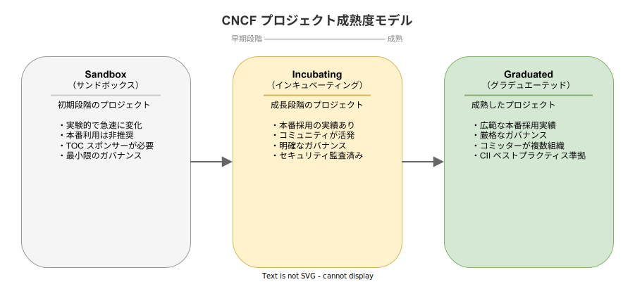
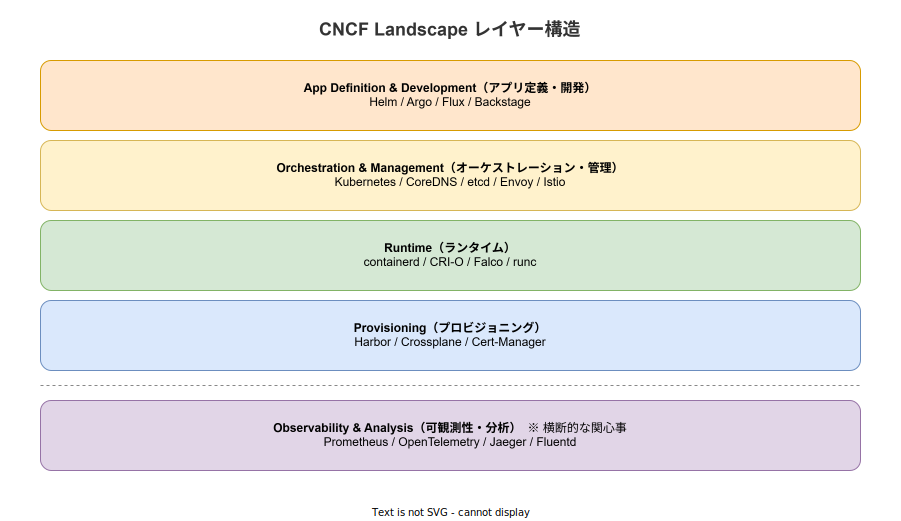

# CNCF: 基本

- 対象読者: クラウドやコンテナの基礎知識を持つ開発者・インフラエンジニア
- 学習目標: CNCF の役割・プロジェクト成熟度モデル・Landscape の構造を理解し、技術選定に活用できるようになる
- 所要時間: 約 30 分
- 対象バージョン: CNCF Landscape 2025
- 最終更新日: 2026-04-13

## 1. このドキュメントで学べること

- CNCF が「何であるか」「なぜ存在するか」を説明できる
- Cloud Native の定義と原則を理解できる
- プロジェクト成熟度モデル（Sandbox・Incubating・Graduated）の違いを区別できる
- CNCF Landscape の構造を理解し、技術選定の参考にできる

## 2. 前提知識

- クラウドコンピューティングの基本概念
- コンテナ（Docker）の基礎知識
- マイクロサービスアーキテクチャの概要（[マイクロサービスアーキテクチャ: 基本](./microservice-architecture_basics.md) 参照）

## 3. 概要

CNCF（Cloud Native Computing Foundation）は、クラウドネイティブ技術の普及と標準化を推進する非営利団体である。2015 年に Linux Foundation の傘下プロジェクトとして設立された。

CNCF の主な役割は以下の 3 つである:

- **オープンソースプロジェクトのホスティング**: Kubernetes をはじめとする主要プロジェクトの中立的な管理
- **エコシステムの育成**: ベンダー中立な環境でのコミュニティ形成と技術標準化
- **教育と認定**: CKA（Certified Kubernetes Administrator）などの認定プログラムの運営

### Cloud Native の定義

CNCF は「Cloud Native」を以下のように定義している:

> クラウドネイティブ技術は、パブリック・プライベート・ハイブリッドクラウドなどの動的な環境において、スケーラブルなアプリケーションの構築と実行を可能にする。コンテナ、サービスメッシュ、マイクロサービス、イミュータブルインフラストラクチャ、宣言型 API がこのアプローチの代表例である。

## 4. 用語の整理

| 用語 | 説明 |
|------|------|
| Cloud Native | クラウド環境の利点を最大限に活用するアプリケーション設計手法 |
| CNCF | Cloud Native Computing Foundation の略。クラウドネイティブ技術のオープンソース財団 |
| Linux Foundation | CNCF の親組織。Linux をはじめとするオープンソースプロジェクトを支援する非営利団体 |
| TOC | Technical Oversight Committee の略。プロジェクトの採用と成熟度評価を行う技術委員会 |
| TAG | Technical Advisory Group の略。特定の技術領域に関する助言を行うグループ |
| Landscape | CNCF が管理するクラウドネイティブ技術のカタログ。プロジェクトと商用製品を分類して一覧化したもの |
| Graduated | CNCF の最高成熟度レベル。広範な本番採用実績と厳格なガバナンスを持つプロジェクト |
| Incubating | 成長段階のプロジェクト。本番利用実績がありコミュニティが活発 |
| Sandbox | 初期段階のプロジェクト。実験的で本番利用は推奨されない |

## 5. 仕組み・アーキテクチャ

### プロジェクト成熟度モデル

CNCF はホストするプロジェクトを 3 段階の成熟度レベルで管理する。プロジェクトは Sandbox から始まり、条件を満たすと上位レベルに昇格する。

各レベルの主な昇格要件:

| 遷移 | 主な要件 |
|------|---------|
| Sandbox → Incubating | 本番採用事例 3 件以上、健全なコントリビューター基盤、セキュリティ監査の実施 |
| Incubating → Graduated | 広範な本番採用、コミッターが複数組織に分散、CII ベストプラクティス準拠 |

### 代表的な Graduated プロジェクト

| プロジェクト | 領域 | 概要 |
|-------------|------|------|
| Kubernetes | オーケストレーション | コンテナオーケストレーションの事実上の標準 |
| Prometheus | 監視 | メトリクス収集・アラート基盤 |
| Envoy | プロキシ | 高性能な L7 プロキシ・サービスメッシュデータプレーン |
| Helm | パッケージ管理 | Kubernetes アプリケーションのパッケージマネージャ |
| Argo | CI/CD | Kubernetes ネイティブな CI/CD・ワークフローエンジン |
| Harbor | レジストリ | コンテナイメージのセキュアなレジストリ |
| etcd | ストレージ | 分散キーバリューストア（Kubernetes の状態管理に使用） |
| containerd | ランタイム | 業界標準のコンテナランタイム |

### CNCF Landscape のレイヤー構造

CNCF Landscape は、クラウドネイティブ技術を機能レイヤーごとに分類している。上位レイヤーほどアプリケーションに近く、下位レイヤーほどインフラに近い。Observability は全レイヤーにまたがる横断的な関心事である。

## 6. 環境構築

CNCF 自体はインストールするソフトウェアではないため、環境構築は不要である。技術選定に活用するためのアクセス方法を示す。

### 6.1 CNCF Landscape へのアクセス

- Web: https://landscape.cncf.io/
- GitHub: https://github.com/cncf/landscape

### 6.2 フィルタリング

Landscape の Web UI では以下のフィルタで絞り込みが可能である:

- **Project Maturity**: Graduated / Incubating / Sandbox
- **Category**: App Definition, Runtime, Orchestration 等
- **License**: Apache 2.0, MIT 等

## 7. 基本の使い方

### 技術選定における CNCF の活用方法

CNCF プロジェクトを技術選定に活用する際の基本的な手順を示す。

1. **要件の明確化**: 解決したい課題（監視、CI/CD、サービスメッシュ等）を特定する
2. **Landscape で候補を探す**: 該当カテゴリの Graduated / Incubating プロジェクトを確認する
3. **成熟度を評価する**: プロジェクトの成熟度レベル、コントリビューター数、採用事例を確認する
4. **比較検討する**: 同カテゴリの複数プロジェクトを機能・エコシステム・コミュニティの観点で比較する

### CNCF Trail Map

CNCF は Cloud Native 導入のロードマップとして Trail Map を公開している。推奨される導入順序は以下のとおりである:

1. コンテナ化（containerd, CRI-O）
2. CI/CD（Argo, Flux）
3. オーケストレーション（Kubernetes）
4. 可観測性（Prometheus, OpenTelemetry, Jaeger）
5. サービスメッシュ（Envoy, Istio, Linkerd）
6. ネットワーキング・セキュリティ・ストレージ

## 8. ステップアップ

### 8.1 TAG（Technical Advisory Group）の活用

CNCF には技術領域ごとの TAG が設置されている。特定分野の最新動向やベストプラクティスを知るには TAG の成果物が有用である。

主な TAG: Security, Network, Runtime, Storage, App Delivery, Observability, Environmental Sustainability

### 8.2 CNCF 認定プログラム

CNCF はクラウドネイティブ技術の認定プログラムを提供している:

- **CKA**: Certified Kubernetes Administrator（クラスタ管理能力の認定）
- **CKAD**: Certified Kubernetes Application Developer（アプリ開発能力の認定）
- **CKS**: Certified Kubernetes Security Specialist（セキュリティ専門の認定）
- **KCNA**: Kubernetes and Cloud Native Associate（入門レベルの認定）

## 9. よくある落とし穴

- **Graduated = 最適解ではない**: Graduated は成熟度の指標であり、自分の要件に最適かどうかは別の判断が必要である
- **Landscape のすべてが CNCF プロジェクトではない**: Landscape には CNCF 非ホストの商用製品も含まれる。CNCF Projects フィルタで絞り込む必要がある
- **Sandbox プロジェクトの安易な本番採用**: Sandbox は実験段階であり、API の破壊的変更やプロジェクト終了のリスクがある
- **CNCF 外の選択肢を無視する**: CNCF がカバーしない領域や、CNCF 外により適した技術が存在する場合がある

## 10. ベストプラクティス

- 技術選定では Graduated プロジェクトを第一候補とし、要件に合わない場合に Incubating を検討する
- 同カテゴリに複数の Graduated プロジェクトがある場合は、既存スタックとの親和性で選択する
- プロジェクトの GitHub リポジトリでコントリビューター数、Issue 解決速度、リリース頻度を確認する
- CNCF End User Technology Radar（エンドユーザーによる技術評価）を参考にする

## 11. 演習問題

1. CNCF Landscape にアクセスし、Graduated プロジェクトの一覧を表示せよ。現在いくつの Graduated プロジェクトがあるか確認せよ
2. 自分のプロジェクトで「監視」が必要になった場合、CNCF Landscape からどのプロジェクトを候補に選ぶか、理由とともに 2 つ挙げよ
3. Sandbox と Graduated の違いを、ガバナンス・採用実績・リスクの 3 観点で比較表にまとめよ

## 12. さらに学ぶには

- CNCF 公式サイト: https://www.cncf.io/
- CNCF Landscape: https://landscape.cncf.io/
- Cloud Native 定義: https://github.com/cncf/toc/blob/main/DEFINITION.md
- CNCF Trail Map: https://github.com/cncf/trailmap
- 関連 Knowledge: [Kubernetes: 基本](./kubernetes_basics.md)、[Dapr: 基本](./dapr_basics.md)

## 13. 参考資料

- CNCF Charter: https://github.com/cncf/foundation/blob/main/charter.md
- CNCF Graduation Criteria: https://github.com/cncf/toc/blob/main/process/graduation_criteria.md
- CNCF Annual Report: https://www.cncf.io/reports/
- CNCF TOC: https://github.com/cncf/toc
