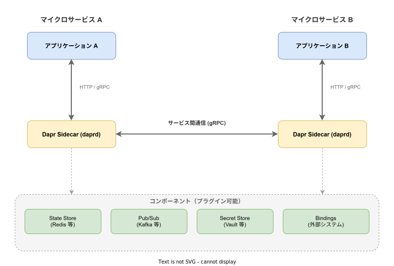
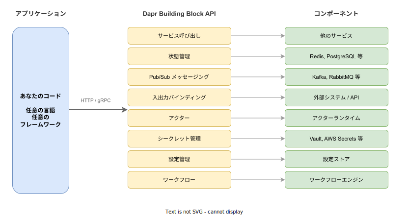

# Dapr: 基本

- 対象読者: マイクロサービスの基本概念を理解している開発者
- 学習目標: Dapr の全体像を理解し、サイドカーパターンと Building Block API の役割を説明できるようになる
- 所要時間: 約 40 分
- 対象バージョン: Dapr v1.17
- 最終更新日: 2026-04-12

## 1. このドキュメントで学べること

- Dapr が解決する課題と存在意義を説明できる
- サイドカーパターンの仕組みを理解できる
- 8 つの Building Block API の役割を区別できる
- Dapr CLI を使ってローカル環境でアプリケーションを実行できる

## 2. 前提知識

- マイクロサービスアーキテクチャの基本概念（[マイクロサービスアーキテクチャ: 基本](./microservice-architecture_basics.md)）
- Docker コンテナの基本操作
- HTTP / gRPC による API 通信の基礎知識

## 3. 概要

Dapr（Distributed Application Runtime）は、マイクロサービス開発を簡素化するためのポータブルなランタイムである。マイクロサービスを構築する際に繰り返し発生する共通課題（サービス間通信、状態管理、イベント配信、シークレット管理など）を、標準化された API として提供する。

Dapr の最大の特徴は **サイドカーパターン** を採用している点である。アプリケーションのコードを変更することなく、横に配置されたサイドカープロセス（daprd）経由で分散システムの機能を利用できる。言語やフレームワークに依存せず、HTTP または gRPC でサイドカーと通信するだけでよい。

## 4. 用語の整理

| 用語 | 説明 |
|------|------|
| サイドカー (daprd) | アプリケーションと並行して動作するプロセス。Building Block API を提供する |
| Building Block | Dapr が提供する分散システムの機能単位（状態管理、Pub/Sub 等） |
| コンポーネント | Building Block の裏側で動く具体的なインフラ実装（Redis、Kafka 等） |
| App ID | Dapr がアプリケーションを識別するための一意な名前 |
| Placement Service | アクターの配置を管理する Dapr のシステムサービス |
| Scheduler Service | スケジューリング機能を提供する Dapr のシステムサービス |

## 5. 仕組み・アーキテクチャ

Dapr はサイドカーパターンで動作する。各アプリケーションに `daprd` プロセスが 1 つずつ付随し、ローカルの HTTP / gRPC エンドポイントを通じて Building Block API を公開する。



アプリケーション同士の通信もサイドカー経由で行われる。アプリケーション A がアプリケーション B を呼び出す場合、A のサイドカーが B のサイドカーに gRPC で通信し、B のサイドカーがローカルの B に転送する。この仕組みにより、サービスディスカバリ・リトライ・暗号化が自動的に適用される。

## 6. 環境構築

### 6.1 必要なもの

- Dapr CLI
- Docker Desktop（ローカル開発用のコンテナ実行環境）

### 6.2 セットアップ手順

```bash
# Dapr CLI をインストールする（Windows の場合）
winget install Dapr.CLI

# Dapr ランタイムを初期化する（Redis・Zipkin コンテナが自動起動する）
dapr init

# インストールを確認する
dapr --version
```

### 6.3 動作確認

```bash
# Dapr のダッシュボードを起動して正常動作を確認する
dapr dashboard
```

ブラウザで `http://localhost:8080` にアクセスし、ダッシュボードが表示されればセットアップ完了である。

## 7. 基本の使い方

Dapr サイドカーと共にアプリケーションを実行する最小構成の例を示す。

```bash
# アプリケーションを Dapr サイドカーと共に起動する
dapr run --app-id myapp --app-port 3000 -- node app.js
```

### 解説

- `--app-id myapp`: サービスの識別名を指定する。他サービスからの呼び出し時にこの名前を使用する
- `--app-port 3000`: アプリケーションがリッスンするポートを指定する
- `-- node app.js`: 実際に起動するアプリケーションコマンド

サイドカー起動後、`http://localhost:3500` 経由で Building Block API にアクセスできる。

Kubernetes 上では、Pod のアノテーションでサイドカーを有効化する。

```yaml
# Dapr サイドカーを有効化する Kubernetes アノテーション
# Pod テンプレートの metadata.annotations に記述する
apiVersion: apps/v1
kind: Deployment
metadata:
  # Deployment の名前を定義する
  name: myapp
spec:
  # レプリカ数を指定する
  replicas: 1
  selector:
    # 管理対象の Pod を label で選択する
    matchLabels:
      app: myapp
  template:
    metadata:
      # Pod に付与する label を指定する
      labels:
        app: myapp
      annotations:
        # Dapr サイドカーの注入を有効化する
        dapr.io/enabled: "true"
        # アプリケーション ID を指定する
        dapr.io/app-id: "myapp"
        # アプリケーションのポートを指定する
        dapr.io/app-port: "3000"
    spec:
      containers:
        # アプリケーションコンテナを定義する
        - name: myapp
          # コンテナイメージを指定する
          image: myapp:1.0
          ports:
            # リッスンポートを指定する
            - containerPort: 3000
```

## 8. ステップアップ

### 8.1 Building Block API の全体像

Dapr は 8 つの Building Block API を提供する。各 API はプラグイン可能なコンポーネントによって実装される。



| Building Block | 用途 | API エンドポイント例 |
|----------------|------|---------------------|
| サービス呼び出し | サービス間の同期通信 | `POST /v1.0/invoke/{appId}/method/{method}` |
| 状態管理 | キーバリューストアの読み書き | `GET /v1.0/state/{storeName}/{key}` |
| Pub/Sub | 非同期メッセージング | `POST /v1.0/publish/{pubsubName}/{topic}` |
| バインディング | 外部システムとの入出力連携 | `POST /v1.0/bindings/{name}` |
| アクター | ステートフルな仮想アクター | `POST /v1.0/actors/{type}/{id}/method/{method}` |
| シークレット | シークレットストアからの取得 | `GET /v1.0/secrets/{storeName}/{key}` |
| 設定管理 | 設定値の取得と監視 | `GET /v1.0/configuration/{storeName}` |
| ワークフロー | 長時間実行ワークフローの管理 | `POST /v1.0-beta1/workflows/{name}/start` |

### 8.2 コンポーネントの設定

コンポーネントは YAML ファイルで定義する。以下は Redis を状態ストアとして設定する例である。

```yaml
# Redis を状態ストアとして設定するコンポーネント定義
apiVersion: dapr.io/v1alpha1
kind: Component
metadata:
  # コンポーネント名を定義する（API 呼び出し時にこの名前を使う）
  name: statestore
spec:
  # コンポーネントの種類を指定する
  type: state.redis
  # バージョンを指定する
  version: v1
  metadata:
    # Redis のホストアドレスを指定する
    - name: redisHost
      value: localhost:6379
    # Redis のパスワードを指定する（未設定の場合は空文字）
    - name: redisPassword
      value: ""
```

## 9. よくある落とし穴

- **サイドカーの起動順序**: アプリケーションはサイドカーの準備完了前に Dapr API を呼び出せない。ヘルスチェックエンドポイント（`/v1.0/healthz`）で確認する
- **App ID の重複**: 同一環境で App ID が重複すると、サービス呼び出しのルーティングが不定になる
- **コンポーネント名の不一致**: API 呼び出し時のストア名とコンポーネント定義の `metadata.name` が一致しないと接続エラーになる
- **ポート設定の誤り**: `--app-port` はアプリケーションのリッスンポートであり、サイドカーのポート（デフォルト 3500）ではない

## 10. ベストプラクティス

- コンポーネント定義を Git で管理し、環境ごとに分離する
- 本番環境ではシークレットをコンポーネント YAML にハードコードせず、Dapr の Secret Store 経由で取得する
- サービス呼び出しにはリトライポリシー（Resiliency）を設定する
- Zipkin や OpenTelemetry との連携で分散トレーシングを有効化する

## 11. 演習問題

1. Dapr CLI でローカル環境を初期化し、`dapr --version` でバージョンを確認せよ
2. 任意の HTTP サーバーを Dapr サイドカー付きで起動し、`curl http://localhost:3500/v1.0/healthz` でヘルスチェックが返ることを確認せよ
3. Redis 状態ストアを使い、`/v1.0/state/statestore` に対してデータの保存・取得・削除を実行せよ

## 12. さらに学ぶには

- 公式ドキュメント: <https://docs.dapr.io/>
- Dapr Quickstarts（公式チュートリアル集）: <https://github.com/dapr/quickstarts>
- 関連 Knowledge: [Kubernetes: 基本](./kubernetes_basics.md)、[マイクロサービスアーキテクチャ: 基本](./microservice-architecture_basics.md)

## 13. 参考資料

- Dapr 公式ドキュメント Concepts: <https://docs.dapr.io/concepts/>
- Dapr Sidecar Overview: <https://docs.dapr.io/concepts/dapr-services/sidecar/>
- Dapr Building Blocks: <https://docs.dapr.io/developing-applications/building-blocks/>
- Dapr GitHub リポジトリ: <https://github.com/dapr/dapr>
