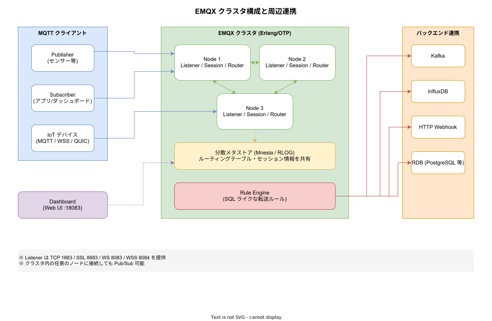
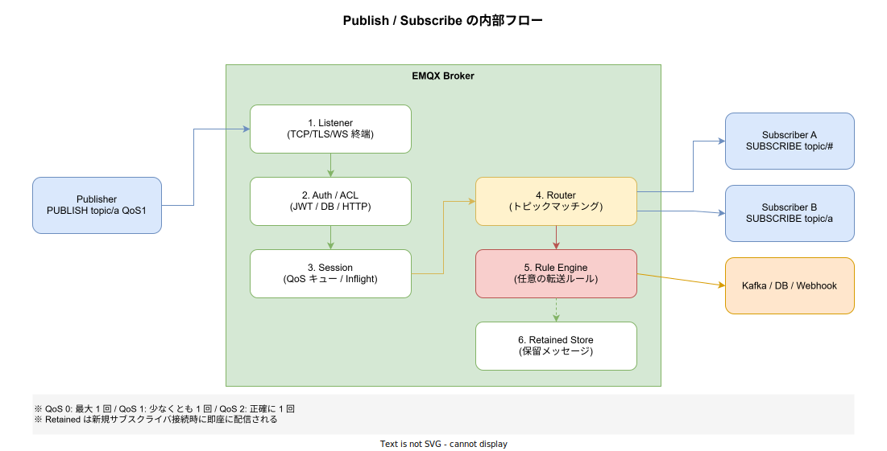

# EMQX: 基本

- 対象読者: MQTT や IoT メッセージングに触れ始めた開発者
- 学習目標: EMQX の全体像を理解し、ブローカーの起動から Pub/Sub、ルールエンジンによる外部連携までを説明できるようになる
- 所要時間: 約 45 分
- 対象バージョン: EMQX 5.x (Open Source Edition)
- 最終更新日: 2026-04-15

## 1. このドキュメントで学べること

- EMQX が解決する課題と、他の MQTT ブローカーとの立ち位置を説明できる
- MQTT の基本概念（QoS、トピック、Retained、Will）と EMQX 内部コンポーネントの対応関係を理解できる
- 単一ノードとクラスタ構成の違い、および分散メタストア（Mnesia / RLOG）の役割を把握できる
- ルールエンジンによる Kafka・DB・Webhook への連携パターンを説明できる
- Docker 上で EMQX を起動し、`mosquitto_pub` / `mosquitto_sub` で疎通確認できる

## 2. 前提知識

- TCP/IP・TLS の基礎
- Pub/Sub パターンの概念
- Docker の基本操作（環境構築で使用）
- MQTT 5.0 プロトコルの概要（知らない場合は先に `docs/20_architecture/.../mqtt_basics.md` 等を参照）

## 3. 概要

EMQX は、Erlang/OTP で実装された大規模分散型の MQTT ブローカーである。1 ノードで数百万のクライアント接続を扱えるスケーラビリティと、ノード追加による水平スケールを両立する点が特徴である。IoT・車載テレメトリ・産業機器からのデータ収集に広く採用されている。

MQTT ブローカー単体としての機能に加え、SQL ライクな文法でメッセージを条件判定して Kafka・データベース・HTTP Webhook などへ転送する「ルールエンジン」を内蔵している。これによりブローカーとストリーム処理の薄い接着層を一つのプロセスで完結できる。

Open Source Edition は Apache License 2.0 で配布され、同じコア上にエンタープライズ機能（マルチテナント、ファイル転送、より多くの Data Integration 等）を追加した商用版が存在する。

## 4. 用語の整理

| 用語 | 説明 |
|------|------|
| ブローカー | Pub/Sub のメッセージを仲介するサーバー。MQTT ではクライアント同士が直接通信せずブローカー経由で配送される |
| トピック | メッセージを分類する階層的な名前。`sensor/room1/temp` のように `/` 区切りで表現する |
| QoS | 配送保証レベル。0（最大 1 回）/ 1（少なくとも 1 回）/ 2（正確に 1 回）の 3 段階 |
| Retained メッセージ | トピックに紐づけて保持される最新メッセージ。新規サブスクライバ接続時に即座に配信される |
| Will メッセージ | クライアント切断時に自動で発行される遺言メッセージ |
| リスナー | TCP/TLS/WebSocket/QUIC などのプロトコル終端を担当するコンポーネント |
| セッション | クライアント単位のキューと Inflight 状態を保持するコンポーネント |
| ルーター | 発行されたメッセージをどのサブスクライバへ配送するかを決定するコンポーネント |
| Mnesia / RLOG | Erlang/OTP が提供する分散型データベース。EMQX はセッション情報やルーティング情報の共有に使う |

## 5. 仕組み・アーキテクチャ

EMQX は内部的に Listener・Session・Router・Rule Engine などのレイヤに分かれ、クラスタ全体で Mnesia（RLOG: Replication Log）によりメタ情報を共有する。



クラスタ内の任意のノードにクライアントが接続しても、Router が分散メタストアを参照して適切なノードのサブスクライバへメッセージを届ける。そのため、ロードバランサで前段分散しても Pub/Sub の整合性は保たれる。

Publish から配送までの内部フローは次の通りである。



Listener で接続を終端した後、Auth/ACL で認証・認可を行い、Session がメッセージを受け取る。Router がトピックマッチングを行ってサブスクライバへ配送し、並行して Rule Engine が外部連携先への転送を行う。

## 6. 環境構築

### 6.1 必要なもの

- Docker（Docker Desktop または Docker Engine）
- `mosquitto-clients`（`mosquitto_pub` / `mosquitto_sub` を利用）

### 6.2 セットアップ手順

```bash
# EMQX コンテナを起動する(MQTT / WS / Dashboard のポートを公開)
docker run -d --name emqx \
  -p 1883:1883 -p 8083:8083 -p 8883:8883 -p 18083:18083 \
  emqx/emqx:5

# 起動確認
docker ps | grep emqx
```

### 6.3 動作確認

```bash
# ダッシュボードにアクセスし、初期ユーザー(admin / public)でログインする
# http://localhost:18083
```

ダッシュボードでノードが緑色の `running` 状態で表示されればブローカーは正常である。

## 7. 基本の使い方

`mosquitto_sub` と `mosquitto_pub` を 2 つのターミナルで起動し、QoS 1 で Pub/Sub を行う。

```bash
# [ターミナル 1] sensor/# 配下のトピックをサブスクライブする(QoS 1)
mosquitto_sub -h localhost -p 1883 -t 'sensor/#' -q 1 -v

# [ターミナル 2] 温度データをパブリッシュする(QoS 1, Retained)
mosquitto_pub -h localhost -p 1883 \
  -t 'sensor/room1/temp' -q 1 -r -m '{"value":24.5,"unit":"C"}'
```

### 解説

- `-t 'sensor/#'`: ワイルドカード `#` は「それ以下のすべての階層」にマッチする。`sensor/+/temp` のように `+` を使うと 1 階層のみにマッチする
- `-q 1`: QoS 1 を指定。ブローカーからの PUBACK を待つため少なくとも 1 回の配送が保証される
- `-r`: Retained フラグ。以降に `sensor/room1/temp` をサブスクライブしたクライアントにも最新値が即座に配信される

Rust から MQTT を扱う最小例は次の通りである。

```rust
// EMQX への接続と QoS1 Publish の最小コード例
// Cargo.toml に rumqttc = "0.24" と tokio = { version = "1", features = ["full"] } を追加する
use rumqttc::{AsyncClient, MqttOptions, QoS};
use std::time::Duration;

#[tokio::main]
async fn main() -> Result<(), Box<dyn std::error::Error>> {
    // 接続オプションを構築する(client_id / host / port)
    let mut opts = MqttOptions::new("rust-publisher", "localhost", 1883);
    // キープアライブ間隔を 5 秒に設定する
    opts.set_keep_alive(Duration::from_secs(5));

    // 非同期クライアントとイベントループを生成する
    let (client, mut eventloop) = AsyncClient::new(opts, 10);

    // 温度値を 1 件 Publish する(QoS1, retain=false)
    client
        .publish("sensor/room1/temp", QoS::AtLeastOnce, false, r#"{"value":24.5}"#)
        .await?;

    // PUBACK を受け取るまでイベントループを 1 回進める
    let _ = eventloop.poll().await?;
    Ok(())
}
```

## 8. ステップアップ

### 8.1 ルールエンジンによる外部連携

EMQX 5.x では SQL ライクな文法でメッセージを選別・加工し、Kafka・HTTP・DB 等へ転送できる。以下は `sensor/#` の温度が 30 度を超えたものだけを Webhook へ送る例である。

```sql
-- ルール: 30 度超の温度メッセージを抽出して JSON を整形する
SELECT
  topic,
  payload.value as temperature,
  clientid,
  timestamp
FROM "sensor/#"
WHERE payload.value > 30
```

このルールに Webhook アクションを紐づけると、条件に一致したメッセージだけが外部エンドポイントへ POST される。ブローカー側でフィルタするためサブスクライバ側の負荷を下げられる。

### 8.2 クラスタ化

EMQX は `EMQX_CLUSTER__DISCOVERY_STRATEGY=static` などの環境変数でクラスタを構成する。複数ノードを同じ cookie で起動すると、ノード間で Mnesia/RLOG 経由でセッション情報が共有される。Kubernetes 上では公式 Helm Chart と Operator を使うのが標準的である。

## 9. よくある落とし穴

- **ワイルドカード `#` と `+` の混同**: `#` は 0 階層以上にマッチするため末尾でしか使えない。`sensor/#/temp` のような使い方は不正である
- **QoS 2 の過剰利用**: QoS 2 は 4 回のハンドシェイクが発生するため高負荷になりやすい。重複排除が別層で可能なら QoS 1 で十分なことが多い
- **Retained メッセージのクリア忘れ**: Retained は明示的に空ペイロード(`-n`)で Publish しないと残り続ける。センサー廃止時の掃除を設計に含める
- **匿名接続のまま本番運用**: 初期状態で匿名接続が許可されているディストリビューションが多い。本番では必ず認証を有効化する
- **単一ノードでの永続セッション**: Clean Session=false のクライアントはそのノードに張り付く。ノード障害時の引き継ぎにはクラスタ化が必要

## 10. ベストプラクティス

- トピック設計は `<domain>/<device_id>/<metric>` のように階層と長さを統一する
- 本番では TLS(8883) と X.509 クライアント証明書、または JWT 認証を有効化する
- ルールエンジンで重要メッセージは永続キュー(Kafka 等)に逃がし、ブローカーは揮発系の中継点として扱う
- メトリクスは Prometheus エンドポイントで収集し、接続数・メッセージレート・Queue 滞留を監視する
- クライアント ID に UUID を用いて衝突による強制切断を避ける

## 11. 演習問題

1. `mosquitto_pub -r` で Retained メッセージを残した後、新しい `mosquitto_sub` で即座に受信できることを確認せよ
2. QoS 0 と QoS 1 を切り替えた状態で、ブローカーを一瞬停止して再起動した場合のメッセージロスの差異を観察せよ
3. ルールエンジンで `sensor/#` からの payload を HTTP Webhook (`https://webhook.site`) へ転送するルールを作成し、動作を確認せよ

## 12. さらに学ぶには

- 公式ドキュメント: https://docs.emqx.com/en/emqx/latest/
- MQTT 5.0 仕様: https://docs.oasis-open.org/mqtt/mqtt/v5.0/mqtt-v5.0.html
- GitHub リポジトリ: https://github.com/emqx/emqx
- 関連 Knowledge: `kubernetes_basics.md`, `dapr_basics.md`

## 13. 参考資料

- EMQX Documentation - Introduction: https://docs.emqx.com/en/emqx/latest/introduction/introduction.html
- EMQX Rule Engine: https://docs.emqx.com/en/emqx/latest/data-integration/rules.html
- EMQX Clustering: https://docs.emqx.com/en/emqx/latest/deploy/cluster/introduction.html
- MQTT Essentials (HiveMQ): https://www.hivemq.com/mqtt-essentials/
