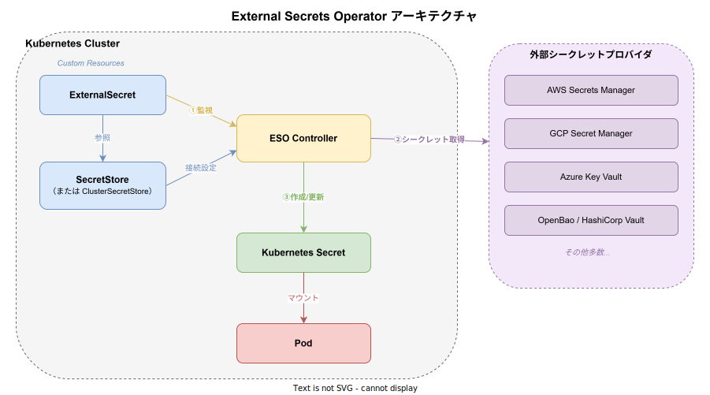
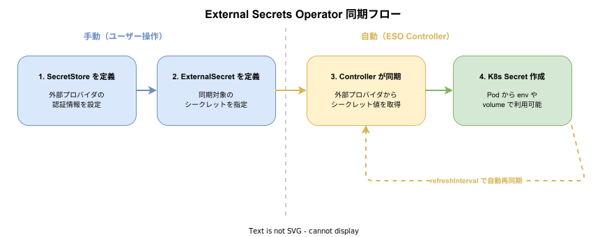

# External Secrets Operator: 基本

- 対象読者: Kubernetes の基本操作を理解しているが External Secrets Operator は未経験の開発者・インフラエンジニア
- 学習目標: ESO の全体像を理解し、外部プロバイダのシークレットを Kubernetes Secret として同期できるようになる
- 所要時間: 約 40 分
- 対象バージョン: External Secrets Operator v0.17.x（API version: external-secrets.io/v1）
- 最終更新日: 2026-04-13

## 1. このドキュメントで学べること

- External Secrets Operator が解決する課題と存在意義を説明できる
- SecretStore・ExternalSecret・Kubernetes Secret の関係を理解できる
- Helm を使って ESO をインストールできる
- SecretStore と ExternalSecret を定義して外部シークレットを同期できる

## 2. 前提知識

- Kubernetes の基本操作（kubectl, Pod, Secret, Namespace）
- [Kubernetes: 基本](./kubernetes_basics.md)
- YAML の記法
- Helm の基本操作（任意。インストール手順で使用する）

## 3. 概要

External Secrets Operator（以下 ESO）は、外部のシークレット管理システムから Kubernetes Secret へシークレットを自動同期する Kubernetes Operator である。

従来、外部プロバイダのシークレットを Kubernetes で利用するには、手動でコピーするか独自スクリプトを書く必要があった。ESO はこの作業を宣言的なカスタムリソースで自動化する。指定した間隔で外部プロバイダを定期的にポーリングし、変更があれば Kubernetes Secret を自動更新する。

ESO は AWS Secrets Manager、GCP Secret Manager、Azure Key Vault、HashiCorp Vault / OpenBao など 20 以上のプロバイダに対応しており、プロバイダごとの差異をカスタムリソースの設定で吸収する。

## 4. 用語の整理

| 用語 | 説明 |
|------|------|
| ESO（External Secrets Operator） | 外部シークレットの同期を管理する Kubernetes Operator |
| SecretStore | 外部プロバイダへの接続情報を定義する名前空間スコープのカスタムリソース |
| ClusterSecretStore | SecretStore のクラスタスコープ版。全名前空間から参照可能 |
| ExternalSecret | 同期対象のシークレットキーと出力先を定義するカスタムリソース |
| PushSecret | Kubernetes Secret を外部プロバイダへ逆方向に書き出すカスタムリソース |
| Provider | シークレットの取得元となる外部サービス（AWS、GCP、Azure 等） |
| refreshInterval | ESO が外部プロバイダをポーリングする間隔 |
| remoteRef | ExternalSecret 内で外部プロバイダ上のシークレットキーを指す参照 |

## 5. 仕組み・アーキテクチャ

ESO は Kubernetes のカスタムコントローラとして動作する。ExternalSecret リソースを監視し、SecretStore の接続設定に基づいて外部プロバイダからシークレットを取得し、Kubernetes Secret として作成・更新する。



同期は以下のフローで実行される。ステップ 1〜2 はユーザーが手動で行い、ステップ 3〜4 は ESO Controller が `refreshInterval` ごとに自動で繰り返す。



## 6. 環境構築

### 6.1 必要なもの

- Kubernetes クラスタ（v1.25 以上を推奨）
- Helm v3
- 外部シークレットプロバイダのアカウントと認証情報

### 6.2 セットアップ手順

```bash
# Helm リポジトリを追加する
helm repo add external-secrets https://charts.external-secrets.io

# リポジトリ情報を更新する
helm repo update

# external-secrets 名前空間に ESO をインストールする
helm install external-secrets external-secrets/external-secrets \
  --namespace external-secrets --create-namespace
```

### 6.3 動作確認

```bash
# ESO の Pod が Running であることを確認する
kubectl get pods -n external-secrets

# CRD が登録されていることを確認する
kubectl get crd | grep external-secrets
```

## 7. 基本の使い方

GCP Secret Manager を例に、外部シークレットを同期する最小構成を示す。

### 7.1 SecretStore の作成

```yaml
# SecretStore: 外部プロバイダへの接続情報を定義する
apiVersion: external-secrets.io/v1
kind: SecretStore
metadata:
  # SecretStore の名前を指定する
  name: gcp-store
  # 名前空間を指定する
  namespace: demo
spec:
  provider:
    gcpsm:
      # GCP プロジェクト ID を指定する
      projectID: my-project-id
      auth:
        secretRef:
          # サービスアカウントキーを含む既存の Secret を参照する
          secretAccessKeySecretRef:
            name: gcp-sa-key
            key: credentials.json
```

### 7.2 ExternalSecret の作成

```yaml
# ExternalSecret: 同期対象のシークレットを定義する
apiVersion: external-secrets.io/v1
kind: ExternalSecret
metadata:
  # ExternalSecret の名前を指定する
  name: demo-external-secret
  # 名前空間を指定する
  namespace: demo
spec:
  # 同期間隔を指定する（1 時間ごと）
  refreshInterval: 1h
  secretStoreRef:
    # 参照する SecretStore の名前を指定する
    name: gcp-store
    # SecretStore の種類を指定する
    kind: SecretStore
  target:
    # 作成される Kubernetes Secret の名前を指定する
    name: app-secret
    # ESO が Secret のオーナーとなる（ExternalSecret 削除時に Secret も削除）
    creationPolicy: Owner
  data:
    # 外部シークレットと Kubernetes Secret のキーをマッピングする
    - secretKey: DB_PASSWORD
      remoteRef:
        # 外部プロバイダ上のシークレット名を指定する
        key: database-password
```

### 解説

- `secretStoreRef` で接続先プロバイダの設定を参照する。SecretStore と ExternalSecret を分離することで、認証情報の管理を一元化できる
- `refreshInterval` で同期間隔を制御する。`1h` は 1 時間ごとにプロバイダを確認する
- `target.name` が作成される Kubernetes Secret の名前になる。Pod からはこの名前で参照する
- `remoteRef.key` が外部プロバイダ上のシークレット名に対応する

## 8. ステップアップ

### 8.1 ClusterSecretStore

ClusterSecretStore はクラスタスコープのリソースであり、全名前空間の ExternalSecret から参照できる。複数の名前空間で同じプロバイダを使う場合に SecretStore の重複定義を避けられる。

```yaml
# ClusterSecretStore: クラスタ全体で共有する接続情報
apiVersion: external-secrets.io/v1
kind: ClusterSecretStore
metadata:
  # クラスタスコープのため namespace は不要
  name: global-gcp-store
spec:
  provider:
    gcpsm:
      # GCP プロジェクト ID を指定する
      projectID: my-project-id
```

ExternalSecret 側では `kind: ClusterSecretStore` を指定して参照する。

### 8.2 テンプレートによる Secret の整形

`target.template` を使うと、取得した値を加工して Kubernetes Secret に格納できる。接続文字列の組み立てなどに有用である。

### 8.3 PushSecret

PushSecret は同期の方向を逆にし、Kubernetes Secret の値を外部プロバイダへ書き出す。クラスタ内で生成した証明書を外部に保管する場合などに使用する。

## 9. よくある落とし穴

- **SecretStore の認証情報不足**: SecretStore が参照する認証用 Secret が存在しない場合、同期が `SecretSyncedError` で失敗する。ESO インストール前に認証用 Secret を作成する
- **refreshInterval の設定ミス**: `0` を指定すると Controller のデフォルト値が適用される。明示的に間隔を指定する
- **名前空間の不一致**: SecretStore は名前空間スコープのため、ExternalSecret と同じ名前空間に作成する。名前空間をまたぐ場合は ClusterSecretStore を使用する
- **creationPolicy の誤解**: `Owner`（デフォルト）では ExternalSecret 削除時に Secret も削除される。Secret を残したい場合は `Orphan` を指定する

## 10. ベストプラクティス

- プロバイダの認証には Workload Identity（GCP）や IRSA（AWS）などの Pod ベース認証を優先し、静的キーの使用を避ける
- refreshInterval はプロバイダの API レートリミットを考慮して設定する（一般的には 1h 程度）
- ClusterSecretStore を使って接続情報を一元管理し、各名前空間では ExternalSecret のみを定義する
- `creationPolicy` と `deletionPolicy` を明示的に設定し、Secret のライフサイクルを制御する
- ExternalSecret の `status` を監視し、同期エラーを早期検知する

## 11. 演習問題

1. Helm で ESO をインストールし、CRD が登録されていることを確認せよ
2. 任意の外部プロバイダに対する SecretStore を作成し、ExternalSecret でシークレットを同期せよ
3. ClusterSecretStore を作成し、異なる名前空間の ExternalSecret から参照して動作を確認せよ

## 12. さらに学ぶには

- 公式ドキュメント: https://external-secrets.io/
- GitHub リポジトリ: https://github.com/external-secrets/external-secrets
- 対応プロバイダ一覧: https://external-secrets.io/latest/provider/aws-secrets-manager/
- 関連 Knowledge: [Kubernetes: 基本](./kubernetes_basics.md)、[OpenBao: 基本](./openbao_basics.md)

## 13. 参考資料

- External Secrets Operator 公式ドキュメント Introduction: https://external-secrets.io/latest/introduction/overview/
- External Secrets Operator API Specification: https://external-secrets.io/latest/api/spec/
- External Secrets Operator GCP Provider Guide: https://external-secrets.io/latest/provider/google-secrets-manager/
- External Secrets Operator Helm Installation: https://external-secrets.io/latest/introduction/getting-started/
