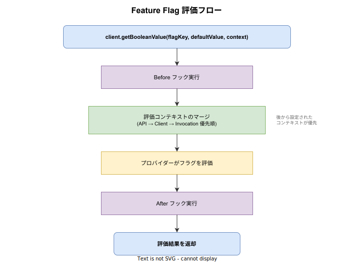

# Feature Flag: 基本

- 対象読者: Web アプリケーション開発の基本経験がある開発者
- 学習目標: Feature Flag の概念を理解し、OpenFeature SDK を使った基本的なフラグ評価を実装できるようになる
- 所要時間: 約 30 分
- 対象バージョン: OpenFeature Specification（2025 年時点の仕様に基づく）
- 最終更新日: 2026-04-12

## 1. このドキュメントで学べること

- Feature Flag が「何であるか」「なぜ必要か」を説明できる
- Feature Flag の主な種類を区別できる
- OpenFeature SDK を使った基本的なフラグ評価を実装できる
- Feature Flag 運用時の注意点とベストプラクティスを理解できる

## 2. 前提知識

- Web アプリケーション開発の基本経験
- CI/CD パイプラインの概念的理解
- JavaScript / TypeScript の基本構文

## 3. 概要

Feature Flag（機能フラグ）は、コードのデプロイとリリースを分離するための手法である。アプリケーション内に条件分岐を設け、特定の機能の有効・無効を実行時に制御する。

従来のリリースでは「デプロイ = リリース」であり、新機能のデプロイはそのまま全ユーザーへの公開を意味していた。Feature Flag を導入すると、コードをデプロイ済みでも機能を無効にしておき、準備が整った時点で段階的に有効化できる。これにより、リリースのリスクを大幅に低減できる。

OpenFeature は CNCF（Cloud Native Computing Foundation）が策定したベンダー非依存の Feature Flag 標準 API である。特定のフラグ管理システムに依存しない統一的なインターフェースを提供する。

## 4. 用語の整理

| 用語 | 説明 |
|------|------|
| フラグキー | フラグを一意に識別する文字列（例: `new-checkout-flow`） |
| フラグ値 | 評価結果。boolean, string, number, object の型をとる |
| デフォルト値 | フラグ評価に失敗した場合に返される安全なフォールバック値 |
| 評価コンテキスト | フラグ評価に使う属性情報（ユーザー ID、地域、プラン種別等） |
| プロバイダー | OpenFeature SDK とフラグ管理システムをつなぐアダプター |
| ターゲティング | 条件に合致するユーザーのみにフラグを適用する機能 |
| OpenFeature | CNCF が策定したベンダー非依存の Feature Flag 標準 API |

## 5. 仕組み・アーキテクチャ

OpenFeature はアプリケーションとフラグ管理システムの間に抽象化レイヤーを設ける。プロバイダーを差し替えるだけでバックエンドを変更でき、アプリケーションコードの修正は不要である。


評価コンテキストはユーザー属性や環境情報を含むオブジェクトであり、フラグの評価結果に影響を与える。例えば「ユーザー ID が特定の値」や「地域が日本」といった条件でフラグの値を変えられる。

## 6. 環境構築

### 6.1 必要なもの

- Node.js 18 以上
- npm または yarn
- Docker（flagd の実行用）

### 6.2 セットアップ手順

```bash
# OpenFeature サーバー SDK をインストールする
npm install @openfeature/server-sdk

# flagd プロバイダーをインストールする（OSS のフラグ管理バックエンド）
npm install @openfeature/flagd-provider
```

### 6.3 動作確認

```bash
# flagd をコンテナで起動する（フラグ定義ファイルをマウント）
docker run -p 8013:8013 -v $(pwd)/flags.json:/flags.json \
  ghcr.io/open-feature/flagd:latest start --uri file:/flags.json
```

## 7. 基本の使い方

```typescript
// Feature Flag の基本的な評価を行うサンプルコード
// OpenFeature SDK と flagd プロバイダーを使用する

// OpenFeature SDK をインポートする
import { OpenFeature } from '@openfeature/server-sdk';
// flagd プロバイダーをインポートする
import { FlagdProvider } from '@openfeature/flagd-provider';

// flagd プロバイダーを設定する
await OpenFeature.setProviderAndWait(new FlagdProvider());

// クライアントを取得する
const client = OpenFeature.getClient();

// boolean フラグを評価する（第 2 引数はデフォルト値）
const isEnabled = await client.getBooleanValue('new-checkout-flow', false);

// フラグの値に基づいて処理を分岐する
if (isEnabled) {
  // 新しいチェックアウト画面を表示する
  renderNewCheckout();
} else {
  // 既存のチェックアウト画面を表示する
  renderLegacyCheckout();
}
```

### 解説

- `setProviderAndWait`: プロバイダーの初期化完了を待ってからフラグ評価を開始する
- `getClient()`: フラグ評価用のクライアントを取得する
- `getBooleanValue('new-checkout-flow', false)`: フラグキーを評価し、失敗時は `false` を返す
- デフォルト値 `false` により、フラグ管理システムに障害が発生しても既存機能で安全に動作する

## 8. ステップアップ

### 8.1 Feature Flag の種類

Feature Flag は用途に応じて 4 種類に分類される。

| 種類 | 用途 | ライフサイクル |
|------|------|---------------|
| リリースフラグ | 未完成機能の段階的公開 | 短命（公開完了後に削除） |
| 実験フラグ | A/B テストによる効果測定 | 短〜中命（実験終了後に削除） |
| 運用フラグ | システム負荷時の機能制限（キルスイッチ） | 長命（障害対応用に維持） |
| パーミッションフラグ | ユーザー権限に応じた機能出し分け | 長命（権限制御として維持） |

### 8.2 評価フロー

フラグ評価は以下の手順で実行される。



評価コンテキストは API レベル・クライアントレベル・呼び出しレベルの 3 階層で設定でき、後から設定されたものが優先される（Invocation > Client > API）。フックは評価の前後に任意の処理（ログ記録、テレメトリ送信等）を挿入する仕組みである。

## 9. よくある落とし穴

- **フラグの放置**: 不要になったフラグを削除せずに放置すると、コードの可読性が低下し技術的負債になる。リリースフラグは公開完了後に速やかに削除する
- **デフォルト値の軽視**: フラグ管理システムの障害時にデフォルト値が使われる。安全側に倒した値（既存機能を使う `false` 等）を設定する
- **フラグの過剰使用**: すべての変更に Feature Flag を付けると管理コストが増大する。リスクの高い変更に絞って適用する
- **テスト不足**: フラグの ON / OFF 両方のパスをテストしないと、片方のパスにバグが潜在する

## 10. ベストプラクティス

- フラグキーには一貫した命名規約を設ける（例: `<チーム名>-<機能名>`）
- 各フラグにオーナー（責任者）を割り当て、ライフサイクルを管理する
- リリースフラグは作成時に削除予定日を設定する
- フラグの ON / OFF 両方のコードパスを自動テストでカバーする
- 運用フラグ（キルスイッチ）はデフォルト値を「機能有効」にし、障害時に OFF で機能を停止する設計にする

## 11. 演習問題

1. 自身のプロジェクトで Feature Flag を導入すべき機能を 1 つ挙げ、そのフラグの種類（リリース / 実験 / 運用 / パーミッション）を判断せよ
2. OpenFeature SDK を使い、評価コンテキストに `targetingKey` を設定して `getBooleanValue` を呼び出すコードを書け
3. フラグ管理システムが停止した場合にアプリケーションがどう振る舞うべきか、デフォルト値の設計指針を説明せよ

## 12. さらに学ぶには

- OpenFeature 公式サイト: https://openfeature.dev/
- OpenFeature 仕様書: https://github.com/open-feature/spec
- flagd（OSS フラグ管理バックエンド）: https://github.com/open-feature/flagd

## 13. 参考資料

- OpenFeature Documentation: https://openfeature.dev/docs/reference/intro
- OpenFeature Specification - Flag Evaluation: https://github.com/open-feature/spec/blob/main/specification/sections/01-flag-evaluation.md
- Pete Hodgson "Feature Toggles" (martinfowler.com): https://martinfowler.com/articles/feature-toggles.html
