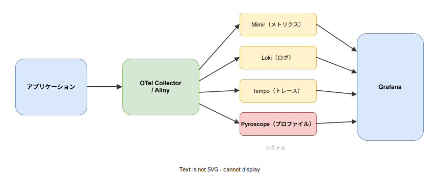

# Grafana Pyroscope: 基本

- 対象読者: オブザーバビリティの基本概念を理解している開発者
- 学習目標: Grafana Pyroscope の全体像を理解し、継続的プロファイリングによるアプリケーション性能分析の仕組みを説明できるようになる
- 所要時間: 約 40 分
- 対象バージョン: Grafana Pyroscope v1.x 以降
- 最終更新日: 2026-04-13

## 1. このドキュメントで学べること

- 継続的プロファイリングが解決する課題と、オブザーバビリティスタックにおける位置づけを説明できる
- Pyroscope の主要コンポーネント（Distributor・Ingester・Querier 等）の役割を理解できる
- Docker で Pyroscope を起動し、SDK からプロファイルデータを送信する最小構成を構築できる
- Push モードと Pull モードの違いを説明できる

## 2. 前提知識

- メトリクス・ログ・トレースの基本概念
- Docker コンテナの基本操作
- 関連 Knowledge: [Grafana Tempo: 基本](./grafana-tempo_basics.md)、[OpenTelemetry Collector: 基本](./otel-collector_basics.md)

## 3. 概要

Grafana Pyroscope は、Grafana Labs が開発するオープンソースの継続的プロファイリングプラットフォームである。アプリケーションの CPU 使用率、メモリ割り当て、I/O 操作などのリソース消費を関数レベルで可視化する。

従来のプロファイリングは開発・テスト環境で一時的に実施するものであった。Pyroscope は本番環境で常時プロファイリングデータを収集し、時系列で保存する。これにより「いつ」「どの関数が」「どれだけリソースを消費したか」を過去に遡って分析できる。

Pyroscope は Grafana のオブザーバビリティスタック（Mimir・Loki・Tempo）と同じアーキテクチャ設計を採用しており、メトリクス・ログ・トレースとプロファイルを相互に関連付けて分析できる。

## 4. 用語の整理

| 用語 | 説明 |
|------|------|
| 継続的プロファイリング | 本番環境で常時プロファイルデータを収集し、時系列で蓄積する手法 |
| フレームグラフ | 関数の呼び出し階層とリソース消費を可視化する図表。横幅がリソース消費量を表す |
| プロファイルタイプ | CPU・メモリ（alloc/inuse）・Goroutine・Mutex・Block など収集データの種類 |
| Push モード | アプリに SDK を組み込み、プロファイルデータを Pyroscope に送信する方式 |
| Pull モード | Grafana Alloy がアプリの pprof エンドポイントからデータを取得する方式 |
| Distributor | プロファイルデータを受信し、Ingester に振り分けるコンポーネント |
| Ingester | 受信したプロファイルを処理し、Object Storage に永続化するコンポーネント |
| Querier | Ingester と Object Storage からプロファイルデータを検索するコンポーネント |
| Query Frontend | クエリを最適化し、Querier に配分するコンポーネント |
| Store Gateway | Object Storage 上のブロックに効率的にアクセスするコンポーネント |
| Compactor | Object Storage 上のブロックを結合・最適化するコンポーネント |

## 5. 仕組み・アーキテクチャ

### オブザーバビリティスタックにおける位置づけ

Pyroscope はメトリクス（Mimir）・ログ（Loki）・トレース（Tempo）に次ぐ「4 つ目のシグナル」としてプロファイルを担当する。



### Pyroscope のアーキテクチャ

Pyroscope は Mimir・Loki・Tempo と同様のマイクロサービスアーキテクチャを採用している。緑の矢印が書き込みパス、青の矢印が読み取りパスを示す。


**書き込みパス**: SDK（Push）または Alloy（Pull）から受信したプロファイルデータは Distributor を経由して Ingester に渡される。Ingester はデータを処理し、Object Storage に永続化する。

**読み取りパス**: Grafana からのクエリは Query Frontend で最適化された後、Querier に配分される。Querier は Ingester（直近のデータ）と Store Gateway 経由で Object Storage（過去のデータ）の両方を検索する。

## 6. 環境構築

### 6.1 必要なもの

- Docker Desktop

### 6.2 セットアップ手順

```bash
# Pyroscope の Docker イメージを取得する
docker pull grafana/pyroscope:latest

# Docker ネットワークを作成する
docker network create pyroscope-demo

# Pyroscope をモノリシックモードで起動する（ポート 4040）
docker run --rm --name pyroscope \
  --network=pyroscope-demo \
  -p 4040:4040 \
  grafana/pyroscope:latest
```

### 6.3 動作確認

```bash
# Pyroscope の準備状態を確認する
curl http://localhost:4040/ready
```

`ready` が返れば起動成功である。ブラウザで `http://localhost:4040` にアクセスすると Pyroscope UI が表示される。

## 7. 基本の使い方

Go アプリケーションに SDK を組み込み、プロファイルデータを送信する最小構成を示す。

```go
// Pyroscope SDK を使用した Go アプリケーションの最小プロファイリング構成
package main

// 必要なパッケージをインポートする
import (
 "log"
 // Pyroscope Go SDK をインポートする
 "github.com/grafana/pyroscope-go"
)

func main() {
 // Pyroscope プロファイラを起動する
 profiler, err := pyroscope.Start(pyroscope.Config{
  // アプリケーション名を指定する
  ApplicationName: "my-go-service",
  // Pyroscope サーバのアドレスを指定する
  ServerAddress: "http://localhost:4040",
  // 収集するプロファイルタイプを指定する
  ProfileTypes: []pyroscope.ProfileType{
   // CPU プロファイルを有効化する
   pyroscope.ProfileCPU,
   // ヒープの使用中オブジェクト数を有効化する
   pyroscope.ProfileInuseObjects,
   // ヒープの使用中バイト数を有効化する
   pyroscope.ProfileInuseSpace,
  },
 })
 // エラーが発生した場合はログ出力して終了する
 if err != nil {
  log.Fatalf("Pyroscope の起動に失敗: %v", err)
 }
 // プログラム終了時にプロファイラを停止する
 defer profiler.Stop()

 // アプリケーションのメイン処理をここに記述する
}
```

### 解説

- `ApplicationName`: Pyroscope UI でアプリケーションを識別する名前
- `ServerAddress`: Pyroscope サーバの URL
- `ProfileTypes`: 収集するプロファイルの種類。CPU・メモリ（inuse/alloc）・Goroutine 等から選択する
- SDK はバックグラウンドで定期的にプロファイルデータを Pyroscope サーバに Push する

## 8. ステップアップ

### 8.1 データ収集方式の選択

| 方式 | 仕組み | 適用場面 |
|------|--------|----------|
| Push（SDK） | アプリに SDK を組み込み、Pyroscope に直接送信 | 言語固有の詳細プロファイルが必要な場合 |
| Pull（Alloy） | Grafana Alloy が pprof エンドポイントを定期スクレイプ | Kubernetes 環境でサイドカー展開する場合 |

Go・Java・Python・Ruby・Node.js・.NET・Rust・eBPF に対応している。

### 8.2 デプロイモード

| モード | 特徴 | 適用場面 |
|--------|------|----------|
| モノリシック | 全コンポーネントを単一プロセスで実行 | 開発・テスト・小規模環境 |
| マイクロサービス | コンポーネントを個別プロセスで実行 | 本番環境・大規模環境 |

### 8.3 Grafana との統合

Grafana のデータソースとして Pyroscope を登録することで、メトリクス・ログ・トレースからプロファイルへシームレスに遷移できる。Explore Profiles プラグインでフレームグラフを表示し、CPU やメモリのボトルネックを関数レベルで特定する。

## 9. よくある落とし穴

- **オーバーヘッドの過大評価**: 継続的プロファイリングの CPU オーバーヘッドは一般に 2〜5% 程度である。ただし全プロファイルタイプを有効化すると増加するため、必要なタイプのみ選択する
- **ローカルストレージの使用**: デフォルトのローカルストレージは開発用である。本番環境では S3・GCS・MinIO 等のオブジェクトストレージを使用する
- **アプリケーション名の不統一**: SDK の `ApplicationName` が環境ごとに異なると、Pyroscope UI で正しく集約されない。命名規則を統一する
- **Push と Pull の混在**: 同一アプリで Push と Pull を併用するとデータが重複する。どちらか一方に統一する

## 10. ベストプラクティス

- 本番環境ではマイクロサービスモードを採用し、コンポーネントを個別にスケールする
- `ApplicationName` に環境名やサービス名を含め、識別しやすくする（例: `prod.api-gateway`）
- Grafana のデータソースに Pyroscope を追加し、メトリクスアラートからプロファイルに遷移するワークフローを構築する
- 必要最小限のプロファイルタイプのみ有効化し、オーバーヘッドとストレージコストを抑制する
- Compactor を有効化してブロックの肥大化を防止する

## 11. 演習問題

1. Docker で Pyroscope を起動し、`/ready` エンドポイントが応答することを確認せよ
2. Go（または任意の言語）のサンプルアプリに Pyroscope SDK を組み込み、Pyroscope UI でフレームグラフが表示されることを確認せよ
3. Pyroscope UI でプロファイルタイプを切り替え（CPU → メモリ）、それぞれのフレームグラフの違いを説明せよ

## 12. さらに学ぶには

- 公式ドキュメント: <https://grafana.com/docs/pyroscope/latest/>
- Grafana Pyroscope GitHub: <https://github.com/grafana/pyroscope>
- 関連 Knowledge: [Grafana Tempo: 基本](./grafana-tempo_basics.md)、[OpenTelemetry Collector: 基本](./otel-collector_basics.md)
- Explore Profiles: <https://grafana.com/docs/grafana/latest/explore/simplified-exploration/profiles/>

## 13. 参考資料

- Grafana Pyroscope Documentation: <https://grafana.com/docs/pyroscope/latest/>
- Pyroscope Architecture: <https://github.com/grafana/pyroscope/blob/main/pkg/pyroscope/PYROSCOPE_V2.md>
- Pyroscope Go SDK: <https://github.com/grafana/pyroscope-go>
