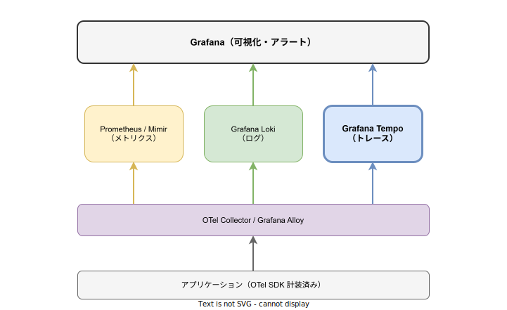

# Grafana Tempo: 基本

- 対象読者: オブザーバビリティの基本概念を理解している開発者
- 学習目標: Grafana Tempo の全体像を理解し、トレースデータの収集・保存・検索の仕組みを説明できるようになる
- 所要時間: 約 40 分
- 対象バージョン: Grafana Tempo v2.x 以降
- 最終更新日: 2026-04-13

## 1. このドキュメントで学べること

- Grafana Tempo が解決する課題と、オブザーバビリティスタックにおける位置づけを説明できる
- Tempo の主要コンポーネント（Distributor・Ingester・Querier 等）の役割を理解できる
- Docker で Tempo を起動し、トレースを送受信する最小構成を構築できる
- TraceQL の基本構文を使ってトレースを検索できる

## 2. 前提知識

- 分散トレーシングの基本概念（スパン・トレース・トレース ID）
- YAML の読み書き
- Docker コンテナの基本操作
- 関連 Knowledge: [OpenTelemetry Collector: 基本](./otel-collector_basics.md)

## 3. 概要

Grafana Tempo は、Grafana Labs が開発するオープンソースの分散トレーシングバックエンドである。トレースデータの保存と検索を担う。

Tempo の最大の特徴は、トレースデータにインデックスを作成しない設計にある。Jaeger や Zipkin などの従来のトレーシングバックエンドはインデックスを維持するためにデータベース（Elasticsearch や Cassandra）を必要とする。一方 Tempo はオブジェクトストレージ（S3・GCS・MinIO 等）のみで動作するため、運用コストとストレージコストを大幅に削減できる。

Tempo は Grafana・Prometheus/Mimir・Loki と深く統合されており、メトリクスやログからトレースへのシームレスな遷移（Exemplar 連携）を実現する。

## 4. 用語の整理

| 用語 | 説明 |
|------|------|
| スパン（Span） | 1 つの処理単位を表すデータ。開始時刻・終了時刻・属性を持つ |
| トレース（Trace） | 1 つのリクエストに関連するスパンの集合。トレース ID で紐づく |
| Distributor | トレースデータを受信し、Ingester に振り分けるコンポーネント |
| Ingester | 受信したトレースを WAL に書き込み、ブロックとしてストレージに永続化する |
| Querier | Ingester（最近のデータ）と Object Storage（過去のデータ）からトレースを検索する |
| Query Frontend | クエリを分割・キャッシュし、Querier に配分して効率化する |
| Compactor | Object Storage 上のブロックをバックグラウンドで結合・最適化する |
| TraceQL | Tempo 独自のトレースクエリ言語。PromQL や LogQL に着想を得ている |
| OTLP | OpenTelemetry Protocol。トレースデータ送受信の標準プロトコル |

## 5. 仕組み・アーキテクチャ

### オブザーバビリティスタックにおける位置づけ

Tempo はメトリクス（Prometheus/Mimir）・ログ（Loki）と並び、トレースを担当するバックエンドである。OTel Collector を経由してデータを受信し、Grafana から検索・可視化される。



### Tempo のアーキテクチャ

Tempo は複数のコンポーネントで構成される。緑の矢印が書き込みパス、青の矢印が読み取りパスを示す。


**書き込みパス**: OTel Collector から OTLP で受信したトレースは Distributor を経由して Ingester に渡される。Ingester は WAL（Write-Ahead Log）にデータを書き込み、一定量が蓄積されるとブロックとして Object Storage に永続化する。

**読み取りパス**: Grafana からの TraceQL クエリは Query Frontend で分割・最適化された後、Querier に配分される。Querier は Ingester（直近のデータ）と Object Storage（過去のデータ）の両方を検索し、結果を統合して返す。

## 6. 環境構築

### 6.1 必要なもの

- Docker Desktop
- OTel Collector または Grafana Alloy（トレース送信用）

### 6.2 セットアップ手順

```bash
# Tempo の Docker イメージを取得する
docker pull grafana/tempo:latest

# 設定ファイルを指定して Tempo コンテナを起動する
# -p 3200: HTTP API ポート、-p 4317: OTLP gRPC ポート、-p 4318: OTLP HTTP ポート
docker run -d --name tempo \
  -p 3200:3200 -p 4317:4317 -p 4318:4318 \
  -v $(pwd)/tempo.yaml:/etc/tempo.yaml \
  grafana/tempo:latest \
  -config.file=/etc/tempo.yaml
```

### 6.3 動作確認

```bash
# Tempo の HTTP API にアクセスしてステータスを確認する
curl http://localhost:3200/ready
```

`ready` が返れば起動成功である。

## 7. 基本の使い方

最小構成の設定ファイル（`tempo.yaml`）を示す。ローカルファイルシステムをストレージとして使用する構成である。

```yaml
# Tempo 最小構成の設定ファイル
# モノリシックモードで全コンポーネントを単一プロセスで実行する

# HTTP API サーバのリッスンポートを指定する
server:
  http_listen_port: 3200

# トレースデータの受信プロトコルを定義する
distributor:
  receivers:
    # OTLP gRPC レシーバを有効化する
    otlp:
      protocols:
        # gRPC でトレースを受信するエンドポイントを設定する
        grpc:
          endpoint: "0.0.0.0:4317"
        # HTTP でトレースを受信するエンドポイントを設定する
        http:
          endpoint: "0.0.0.0:4318"

# Ingester の設定を定義する
ingester:
  # トレースの最大保持時間を指定する
  max_block_duration: 5m

# トレースデータの保存先を設定する
storage:
  trace:
    # ローカルファイルシステムをバックエンドに使用する
    backend: local
    # WAL の保存パスを指定する
    wal:
      path: /var/tempo/wal
    # ブロックの保存パスを指定する
    local:
      path: /var/tempo/blocks
```

### 解説

- `server`: Tempo の HTTP API ポート。Grafana からの接続やヘルスチェックに使用する
- `distributor.receivers`: トレースの受信設定。OTLP の gRPC（4317）と HTTP（4318）を有効化している
- `ingester`: WAL からブロックへの変換設定。`max_block_duration` でブロック化の間隔を制御する
- `storage.trace`: トレースの永続化先。本番環境では `backend: s3` や `backend: gcs` を使用する

## 8. ステップアップ

### 8.1 デプロイモード

Tempo には 2 つのデプロイモードがある。

| モード | 特徴 | 適用場面 |
|--------|------|----------|
| モノリシック | 全コンポーネントを単一プロセスで実行 | 開発・テスト・小規模環境 |
| マイクロサービス | コンポーネントを個別プロセスで実行 | 本番環境・大規模環境 |

モノリシックモードは `target: all`（デフォルト）で起動する。マイクロサービスモードでは各コンポーネントを個別にスケールでき、Kafka を WAL として使用することで耐久性を確保する。Helm チャート `tempo-distributed` を使用してデプロイするのが一般的である。

### 8.2 TraceQL

TraceQL は Tempo 独自のクエリ言語であり、スパンの属性を条件にトレースを検索できる。

```traceql
// サービス名が "api-gateway" のスパンを含むトレースを検索する
{ resource.service.name = "api-gateway" }

// HTTP ステータスが 500 のスパンを検索する
{ span.http.status_code = 500 }

// 処理時間が 1 秒を超えるスパンを検索する
{ duration > 1s }
```

TraceQL メトリクスを使えば、トレースデータから RED メトリクス（Rate・Errors・Duration）を動的に生成できる。

```traceql
// エラー率をサービスごとに集計する
{ status = error } | rate() by (resource.service.name)
```

## 9. よくある落とし穴

- **インデックスがないためタグ検索が遅い**: Tempo はトレース ID による検索に最適化されている。タグベースの検索にはメトリクスや Exemplar からトレース ID を特定するワークフローが推奨される
- **ローカルストレージの使用**: `backend: local` は開発用である。本番環境ではオブジェクトストレージを使用しないとデータの耐久性が保証されない
- **Ingester の OOM**: 大量のトレースを受信すると Ingester のメモリが不足する。`ingester.max_block_duration` と `distributor.rate_limit` で制御する
- **OTLP ポートの競合**: OTel Collector と Tempo が同一ホストで OTLP ポート（4317/4318）を使用するとポートが競合する。Collector を経由する構成ではTempo 側の OTLP Receiver を別ポートに変更するか、Collector から直接 Tempo の内部 API に送信する

## 10. ベストプラクティス

- トレースの検索は Exemplar 連携（メトリクス → トレース）を活用し、トレース ID 経由で行う
- 本番環境ではマイクロサービスモードを採用し、コンポーネントを個別にスケールする
- オブジェクトストレージには MinIO（オンプレミス）または S3/GCS（クラウド）を使用する
- Compactor を有効化してブロックの肥大化を防止する
- サンプリングレートを適切に設定し、ストレージコストとトレースの網羅性のバランスをとる

## 11. 演習問題

1. Docker で Tempo をモノリシックモードで起動し、`/ready` エンドポイントが応答することを確認せよ
2. OTel Collector から OTLP でトレースを Tempo に送信し、Grafana の Explore 画面からトレース ID で検索せよ
3. TraceQL を使って特定のサービス名のトレースを検索し、処理時間が 500ms を超えるスパンを絞り込め

## 12. さらに学ぶには

- 公式ドキュメント: https://grafana.com/docs/tempo/latest/
- Grafana Tempo GitHub: https://github.com/grafana/tempo
- 関連 Knowledge: [OpenTelemetry Collector: 基本](./otel-collector_basics.md)、[Kubernetes: 基本](./kubernetes_basics.md)
- TraceQL ドキュメント: https://grafana.com/docs/tempo/latest/traceql/

## 13. 参考資料

- Grafana Tempo Documentation: https://grafana.com/docs/tempo/latest/
- Grafana Tempo Architecture: https://grafana.com/docs/tempo/latest/operations/architecture/
- TraceQL: https://grafana.com/docs/tempo/latest/traceql/
- OpenTelemetry OTLP Specification: https://opentelemetry.io/docs/specs/otlp/
