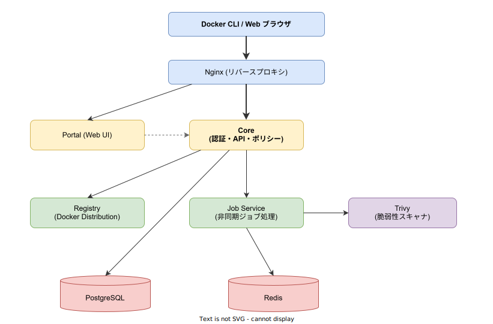
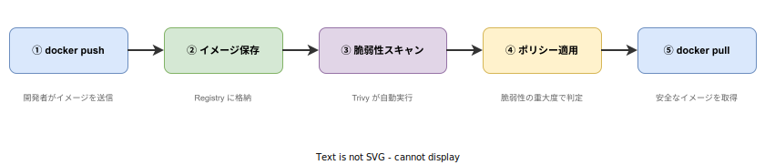

# Harbor: 基本

- 対象読者: Docker の基本操作（build / push / pull）を理解している開発者
- 学習目標: Harbor の役割・構成・基本操作を理解し、プライベートレジストリとして利用できるようになる
- 所要時間: 約 30 分
- 対象バージョン: Harbor v2.12
- 最終更新日: 2026-04-12

## 1. このドキュメントで学べること

- Harbor が解決する課題と Docker Hub との違いを説明できる
- Harbor のアーキテクチャと主要コンポーネントの役割を理解できる
- Harbor にイメージを push / pull する基本操作を実行できる
- 脆弱性スキャン・RBAC・レプリケーションの概念を理解できる

## 2. 前提知識

- Docker コンテナの基本概念（イメージ、コンテナ、レジストリ）
- `docker build` / `docker push` / `docker pull` の基本操作
- YAML の基本的な記法（Helm でのインストール時）

## 3. 概要

Harbor は、CNCF（Cloud Native Computing Foundation）が管理するオープンソースのコンテナレジストリである。Docker Hub のようなパブリックレジストリとは異なり、組織内にプライベートなレジストリを構築できる。

Docker Distribution（Docker の公式レジストリ実装）を基盤として、以下の機能を追加している:

- **アクセス制御**: プロジェクト単位の RBAC（ロールベースアクセス制御）
- **脆弱性スキャン**: Trivy による自動的なセキュリティ検査
- **イメージ署名**: コンテンツの信頼性を検証する仕組み
- **レプリケーション**: 複数のレジストリ間でイメージを同期する機能
- **Web UI**: ブラウザから操作できる管理画面
- **REST API**: CI/CD パイプラインとの統合

## 4. 用語の整理

| 用語 | 説明 |
|------|------|
| プロジェクト | Harbor 内のリソース管理単位。リポジトリ・メンバー・ポリシーをまとめる |
| リポジトリ | 同一イメージの異なるバージョン（タグ）を格納する場所 |
| アーティファクト | コンテナイメージや Helm チャートなど、レジストリに保存される成果物 |
| Robot アカウント | CI/CD 用の自動化専用アカウント。人間のユーザーとは権限を分離する |
| レプリケーション | レジストリ間でアーティファクトを自動同期する機能 |
| RBAC | ロールベースアクセス制御。管理者・開発者・ゲストなどの役割で権限を管理する |
| Trivy | Harbor に統合されたオープンソースの脆弱性スキャナ |

## 5. 仕組み・アーキテクチャ

Harbor は複数のコンポーネントで構成される。すべてのリクエストは Nginx を経由し、Core コンポーネントが認証・認可・API 処理を担当する。



**主要コンポーネント:**

| コンポーネント | 役割 |
|---------------|------|
| Nginx | リバースプロキシ。リクエストを受け付け、適切なコンポーネントに振り分ける |
| Core | 認証・認可・API・ポリシー管理を行う中核コンポーネント |
| Portal | ブラウザからの操作を提供する Web UI |
| Registry | Docker Distribution ベースのイメージストレージ |
| Job Service | レプリケーション・スキャン・GC などの非同期ジョブを処理する |
| Trivy | コンテナイメージの脆弱性を検出するスキャナ |
| PostgreSQL | メタデータ（プロジェクト、ユーザー、ポリシー等）を永続化する |
| Redis | ジョブキューとキャッシュに使用する |

**イメージのライフサイクル:**



## 6. 環境構築

### 6.1 必要なもの

- Kubernetes クラスタ（v1.20 以上）
- Helm（v3 以上）
- kubectl

### 6.2 セットアップ手順（Helm の場合）

```bash
# Harbor の Helm リポジトリを追加する
helm repo add harbor https://helm.goharbor.io

# リポジトリ情報を更新する
helm repo update

# Harbor をデフォルト設定でインストールする
helm install my-harbor harbor/harbor \
  --set expose.type=nodePort \
  --set externalURL=https://harbor.example.com \
  --namespace harbor --create-namespace
```

### 6.3 動作確認

```bash
# Pod の状態を確認する（すべて Running になるまで待つ）
kubectl get pods -n harbor

# ブラウザで Web UI にアクセスする
# デフォルトの管理者アカウント: admin / Harbor12345
```

## 7. 基本の使い方

Harbor へのイメージの push / pull は、Docker CLI の標準的な操作で行える。

```bash
# Harbor にログインする
docker login harbor.example.com

# ローカルイメージに Harbor のタグを付与する
# 形式: <Harbor ホスト>/<プロジェクト名>/<イメージ名>:<タグ>
docker tag my-app:latest harbor.example.com/my-project/my-app:v1.0

# Harbor にイメージを push する
docker push harbor.example.com/my-project/my-app:v1.0

# Harbor からイメージを pull する
docker pull harbor.example.com/my-project/my-app:v1.0
```

### 解説

- `docker login`: Harbor の認証情報を Docker に登録する。HTTPS 証明書が自己署名の場合は Docker デーモンに `insecure-registries` の設定が必要になる
- タグの形式は `<ホスト>/<プロジェクト>/<リポジトリ>:<タグ>` である。プロジェクトは Harbor 側で事前に作成する
- push 後、Web UI または API でイメージの脆弱性スキャン結果を確認できる

## 8. ステップアップ

### 8.1 脆弱性スキャンの活用

プロジェクト設定で「自動スキャン」を有効にすると、push 時に Trivy が自動で脆弱性を検出する。さらに「脆弱なイメージの pull を禁止」ポリシーを設定すれば、重大な脆弱性を含むイメージのデプロイを防止できる。

```bash
# API でスキャンを手動実行する
curl -X POST \
  "https://harbor.example.com/api/v2.0/projects/my-project/repositories/my-app/artifacts/v1.0/scan" \
  -u "admin:Harbor12345"
```

### 8.2 レプリケーション

レプリケーションルールを設定すると、Harbor インスタンス間や Docker Hub・GCR・ECR などの外部レジストリとの間でイメージを自動同期できる。災害復旧やマルチリージョン展開に有用である。

### 8.3 Robot アカウント

CI/CD パイプラインからの利用には Robot アカウントを推奨する。人間のユーザーとは独立した認証情報を持ち、必要最小限の権限（push のみ、pull のみなど）を付与できる。

## 9. よくある落とし穴

- **HTTPS 証明書の問題**: 自己署名証明書を使用する場合、Docker デーモンと Harbor の両方に CA 証明書を登録する必要がある。`x509: certificate signed by unknown authority` エラーが発生したら証明書設定を確認する
- **プロジェクトの未作成**: イメージの push 先プロジェクトが存在しないと push が失敗する。事前に Web UI または API でプロジェクトを作成する
- **ストレージの枯渇**: GC（ガベージコレクション）を定期実行しないと、削除したイメージのストレージが解放されない
- **デフォルトパスワードの放置**: 初期パスワード `Harbor12345` を変更せずに運用するのはセキュリティリスクである

## 10. ベストプラクティス

- すべてのプロジェクトで自動スキャンを有効にし、脆弱性のあるイメージの pull を制限する
- CI/CD には Robot アカウントを使用し、人間のユーザーアカウントを共有しない
- GC を定期的にスケジュールし、ストレージを適切に管理する
- LDAP / OIDC と連携し、組織のアイデンティティ基盤で認証を統一する
- レプリケーションを設定し、災害復旧に備える

## 11. 演習問題

1. Harbor をローカル環境にインストールし、Web UI にログインせよ
2. プロジェクトを作成し、任意の Docker イメージを push / pull せよ
3. push したイメージに対して脆弱性スキャンを実行し、結果を確認せよ

## 12. さらに学ぶには

- 公式ドキュメント: <https://goharbor.io/docs/>
- GitHub リポジトリ: <https://github.com/goharbor/harbor>
- CNCF プロジェクトページ: <https://www.cncf.io/projects/harbor/>

## 13. 参考資料

- Harbor 公式ドキュメント: <https://goharbor.io/docs/>
- Harbor Architecture Overview: <https://github.com/goharbor/harbor/wiki/Architecture-Overview-of-Harbor>
- Harbor REST API v2.0: <https://goharbor.io/docs/latest/build-customize-contribute/configure-swagger/>
