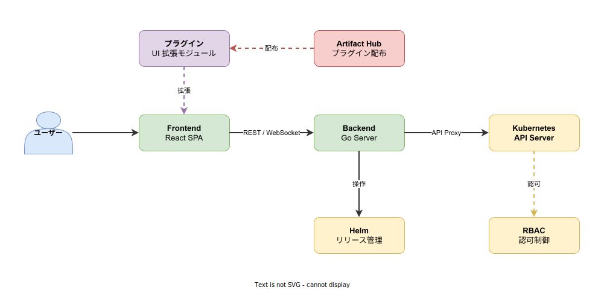
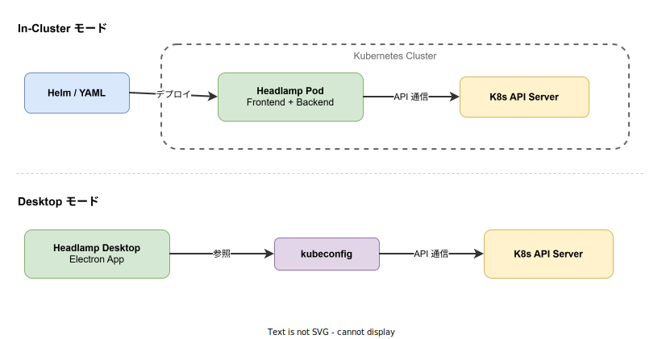

# Headlamp: 基本

- 対象読者: Kubernetes の基本概念（Pod、Deployment、Service 等）を理解している開発者・運用者
- 学習目標: Headlamp の全体像を理解し、クラスタにデプロイして Kubernetes リソースを GUI で管理できるようになる
- 所要時間: 約 30 分
- 対象バージョン: Headlamp 0.26.x
- 最終更新日: 2026-04-13

## 1. このドキュメントで学べること

- Headlamp が解決する課題と他の Kubernetes ダッシュボードとの違いを説明できる
- Headlamp のアーキテクチャ（Frontend・Backend・Plugin）を理解できる
- In-Cluster モードと Desktop モードの 2 つのデプロイ方法を把握できる
- Helm を使って Headlamp をクラスタにデプロイできる
- プラグインによる機能拡張の仕組みを理解できる

## 2. 前提知識

- Kubernetes の基本概念（Pod、Deployment、Service、Namespace）
- kubectl の基本操作
- Helm の基本的な使い方（推奨）

## 3. 概要

Headlamp は Kubernetes クラスタを GUI で管理するための Web UI（ダッシュボード）である。Kubernetes SIG（Special Interest Group）の公式プロジェクトとして開発されており、CNCF Sandbox プロジェクトでもある。

従来の Kubernetes Dashboard と比較して、Headlamp は以下の特徴を持つ。

- **プラグインシステム**: フォークを維持せずに UI を拡張できる
- **マルチクラスタ対応**: 複数のクラスタを 1 つの画面から切り替えて管理できる
- **2 つのデプロイモード**: クラスタ内 Pod としても、デスクトップアプリとしても動作する
- **Helm 統合**: Helm リリースの管理を UI 上で行える
- **軽量**: 最小限の依存で動作し、RBAC を通じてユーザーの権限を Kubernetes ネイティブに制御する

## 4. 用語の整理

| 用語 | 説明 |
|------|------|
| Headlamp | Kubernetes SIG 公式の Web UI ダッシュボード |
| In-Cluster モード | Headlamp を Kubernetes クラスタ内の Pod としてデプロイする方式 |
| Desktop モード | Headlamp を Electron ベースのデスクトップアプリとして使用する方式 |
| Plugin | Headlamp の UI を拡張するモジュール。React コンポーネントとして実装する |
| Artifact Hub | CNCF が運営するパッケージリポジトリ。Headlamp プラグインの配布にも使われる |
| Backend | Go で実装されたサーバー。Kubernetes API へのプロキシと認証を担当する |
| Frontend | React で実装された SPA。ユーザーが操作する Web UI 本体 |
| ServiceAccount | Kubernetes の認証単位。In-Cluster モードで Headlamp が API にアクセスする際に使用する |

## 5. 仕組み・アーキテクチャ

Headlamp は React 製の Frontend と Go 製の Backend で構成される。Backend は Kubernetes API Server へのリバースプロキシとして動作し、Frontend からのリクエストを中継する。



**主要コンポーネント:**

| コンポーネント | 技術 | 役割 |
|---------------|------|------|
| Frontend | React (TypeScript) | ユーザーが操作する Web UI。リソース一覧・詳細・編集画面を提供する |
| Backend | Go | Kubernetes API へのプロキシ、認証トークンの管理、Helm 操作を担当する |
| Plugin System | React | Frontend の UI を拡張する仕組み。ページ追加やリソースビューのカスタマイズが可能 |

Backend は Kubernetes API に対してプロキシとして機能するため、ユーザーの権限は Kubernetes の RBAC がそのまま適用される。Headlamp 独自の認可レイヤーは存在しない。

### デプロイモード

Headlamp は 2 つのモードで動作する。



- **In-Cluster モード**: Helm Chart または YAML マニフェストでクラスタ内に Pod としてデプロイする。チームで共有する用途に適する
- **Desktop モード**: Electron ベースのアプリケーションとしてローカル PC で実行する。kubeconfig を参照してクラスタに接続する。個人での開発・デバッグ用途に適する

## 6. 環境構築

### 6.1 必要なもの

- Kubernetes クラスタ（k3s、minikube 等）
- kubectl（クラスタに接続済み）
- Helm v3（In-Cluster モードの場合）

### 6.2 セットアップ手順（In-Cluster モード）

```bash
# Headlamp の Helm リポジトリを追加する
helm repo add headlamp https://kubernetes-sigs.github.io/headlamp/

# リポジトリ情報を更新する
helm repo update

# headlamp Namespace に Headlamp をインストールする
helm install headlamp headlamp/headlamp --namespace headlamp --create-namespace
```

### 6.3 動作確認

```bash
# Headlamp Pod の起動を確認する
kubectl get pods -n headlamp

# ポートフォワードで Web UI にアクセスする
kubectl port-forward -n headlamp svc/headlamp 8080:80
```

ブラウザで `http://localhost:8080` にアクセスし、ログイン画面が表示されることを確認する。ログインには ServiceAccount のトークンが必要である。

```bash
# ServiceAccount を作成する
kubectl create serviceaccount headlamp-admin -n kube-system

# cluster-admin 権限を付与する（開発環境用）
kubectl create clusterrolebinding headlamp-admin \
  --serviceaccount=kube-system:headlamp-admin \
  --clusterrole=cluster-admin

# トークンを取得する
kubectl create token headlamp-admin -n kube-system
```

取得したトークンをログイン画面に入力すると、ダッシュボードが表示される。

## 7. 基本の使い方

Headlamp は GUI 操作が中心だが、Helm values.yaml によるカスタム設定も可能である。

```yaml
# values.yaml: Headlamp の Helm Chart カスタム設定
# プラグインの監視を有効にする
config:
  watchPlugins: true

# プラグインマネージャを有効にする
pluginsManager:
  enabled: true
```

```bash
# カスタム設定で Headlamp をインストールする
helm install headlamp headlamp/headlamp \
  --namespace headlamp \
  --create-namespace \
  -f values.yaml
```

### 解説

- `config.watchPlugins`: プラグインディレクトリの変更を監視し、ホットリロードを有効にする
- `pluginsManager.enabled`: UI 上からプラグインをインストール・管理する機能を有効にする
- ログイン後、左メニューからリソース種別（Pods、Deployments、Services 等）を選択してクラスタの状態を確認できる

## 8. ステップアップ

### 8.1 プラグインによる機能拡張

Headlamp の最大の特徴はプラグインシステムである。プラグインは React コンポーネントとして実装し、Headlamp の API を通じて UI を拡張する。

公式プラグインの例:

| プラグイン | 機能 |
|-----------|------|
| app-catalog | Helm Chart のブラウジングとインストール |
| prometheus | Prometheus メトリクスの表示 |
| cert-manager | 証明書リソースの管理 UI |
| flux | Flux CD のリソース表示 |

プラグインは Artifact Hub から検索・インストールでき、`plugin.yml` で宣言的に管理する。

### 8.2 マルチクラスタ管理

Desktop モードでは kubeconfig に登録された複数のクラスタを切り替えて管理できる。In-Cluster モードでは、Backend の起動引数で複数のクラスタエンドポイントを指定する。

## 9. よくある落とし穴

- **トークンの有効期限切れ**: `kubectl create token` で生成したトークンにはデフォルトで有効期限がある。長期利用する場合は `--duration` フラグを指定するか、OIDC 認証を設定する
- **RBAC 権限不足**: Headlamp 自体にはアクセス制御がなく、ServiceAccount や Bearer Token の RBAC 権限がそのまま適用される。権限不足の場合はリソースが表示されない
- **cluster-admin の安易な付与**: 開発環境では cluster-admin を付与しがちだが、本番環境では必要最小限の権限を持つ ClusterRole を定義する
- **Ingress 未設定**: In-Cluster モードで外部からアクセスするには Ingress または LoadBalancer の設定が必要である。ポートフォワードは一時的な確認用途に留める

## 10. ベストプラクティス

- 本番環境では OIDC（OpenID Connect）認証を設定し、個人トークンの管理を避ける
- ServiceAccount に付与する権限は Namespace 単位で最小限に絞る
- プラグインは Artifact Hub で公開されている公式プラグインを優先的に使用する
- Helm の values.yaml をバージョン管理し、設定の変更履歴を追跡する
- Desktop モードは個人の開発・デバッグ用途に限定し、チーム共有には In-Cluster モードを使用する

## 11. 演習問題

1. Helm を使って Headlamp をクラスタにデプロイし、ブラウザからダッシュボードにアクセスせよ
2. ServiceAccount を作成し、特定の Namespace のみ参照可能な ClusterRole を付与してログインせよ。cluster-admin と比較してどのリソースが非表示になるか確認せよ
3. `pluginsManager.enabled: true` を設定し、UI 上からプラグインの一覧を確認せよ

## 12. さらに学ぶには

- 公式ドキュメント: <https://headlamp.dev/docs/latest/>
- Headlamp GitHub リポジトリ: <https://github.com/kubernetes-sigs/headlamp>
- Artifact Hub（プラグイン検索）: <https://artifacthub.io/packages/search?kind=21>
- 関連 Knowledge: [Kubernetes: 基本](./kubernetes_basics.md)

## 13. 参考資料

- Headlamp Architecture: <https://headlamp.dev/docs/latest/development/architecture>
- Headlamp Installation Guide: <https://headlamp.dev/docs/latest/installation>
- Headlamp Plugin Development: <https://headlamp.dev/docs/latest/development/plugins>
- Kubernetes RBAC: <https://kubernetes.io/docs/reference/access-authn-authz/rbac/>
