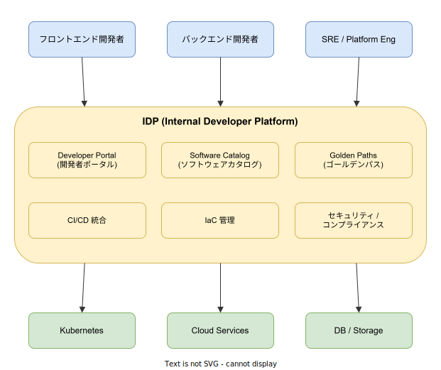
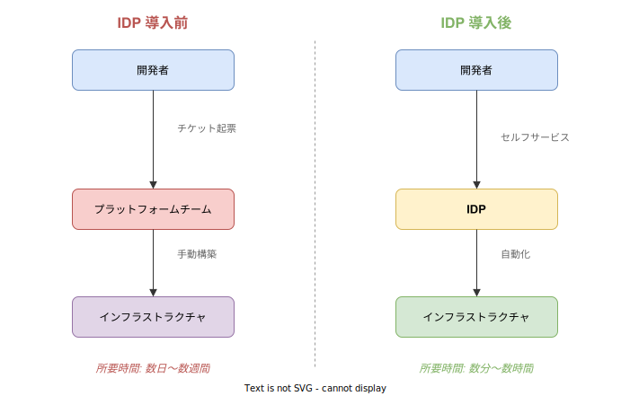

# IDP (Internal Developer Platform): 基本

- 対象読者: ソフトウェア開発の基礎知識を持つ開発者・SRE・エンジニアリングマネージャー
- 学習目標: IDP の概念と構成要素を理解し、なぜ IDP が必要とされるのかを説明できるようになる
- 所要時間: 約 35 分
- 対象バージョン: 概念のため特定バージョンなし（Backstage 1.35 を実装例として参照）
- 最終更新日: 2026-04-12

## 1. このドキュメントで学べること

- IDP（Internal Developer Platform）が何であるかを説明できる
- IDP が解決する課題と Platform Engineering との関係を理解できる
- IDP を構成するコア機能（カタログ・ゴールデンパス・セルフサービス等）の役割を把握できる
- IDP の導入がもたらす開発者体験の変化を具体的に説明できる

## 2. 前提知識

- ソフトウェア開発の基本的なワークフロー（コード → ビルド → デプロイ）
- コンテナと Kubernetes の基本概念（推奨）: [Kubernetes の基本](./kubernetes_basics.md)
- CI/CD の基本概念

## 3. 概要

IDP（Internal Developer Platform）は、開発者がインフラやツールを **セルフサービスで** 利用できるようにするためのプラットフォーム層である。開発者がチケットを起票してインフラチームの対応を待つ代わりに、IDP を通じて必要なリソースを自分で作成・管理できる。

組織が成長しマイクロサービスが増加すると、開発者が扱うべきツール・API・ドキュメント・インフラの数は指数的に増加する。この複雑さは **認知負荷**（Cognitive Load）と呼ばれ、開発者の生産性を著しく低下させる。IDP はこの認知負荷を軽減し、開発者が本来の業務であるアプリケーション開発に集中できる環境を提供する。

IDP を構築・運用する専門的な活動は **Platform Engineering**（プラットフォームエンジニアリング）と呼ばれ、Gartner が 2023 年の技術トレンドトップ 10 に選出したことで注目を集めた。

## 4. 用語の整理

| 用語 | 説明 |
|------|------|
| IDP | Internal Developer Platform の略。開発者向けのセルフサービス基盤 |
| Platform Engineering | IDP を設計・構築・運用するエンジニアリング活動 |
| Developer Portal | IDP の UI 層。開発者が情報にアクセスする Web インターフェース |
| Software Catalog | 組織内のサービス・API・インフラ等を一元管理するデータベース |
| Golden Paths | 組織が推奨するテンプレート化されたワークフロー。開発者を最適な手順に導く |
| セルフサービス | 開発者が他チームに依頼せず、自分でリソースの作成や操作を行えること |
| 認知負荷 | 開発者が業務で扱うべきツール・知識・手順の総量。高すぎると生産性が低下する |
| Backstage | Spotify が開発した OSS の開発者ポータル。IDP の UI 層として最も広く使われている |

## 5. 仕組み・アーキテクチャ

IDP は **開発者**・**プラットフォーム層**・**インフラストラクチャ** の 3 層で構成される。開発者はプラットフォーム層を通じてインフラに間接的にアクセスし、複雑さを意識せずにリソースを利用する。



**プラットフォーム層の主要機能:**

| 機能 | 役割 |
|------|------|
| Developer Portal | サービスやリソースの情報を参照・操作するための統一的な Web UI |
| Software Catalog | サービス・API・チーム・依存関係のメタデータを集約する単一ソースオブトゥルース |
| Golden Paths | 新規プロジェクト作成やデプロイ等の定型作業を標準化するテンプレート群 |
| CI/CD 統合 | ビルド・テスト・デプロイのパイプラインをプラットフォームに組み込む |
| IaC 管理 | Terraform・Helm 等のインフラ定義を抽象化し、開発者に簡易なインターフェースを提供する |
| セキュリティ / コンプライアンス | ポリシーの自動適用、脆弱性スキャン、コンプライアンスチェックを組み込む |

### IDP 導入前後の比較

IDP の導入は開発者のワークフローを根本的に変える。



IDP 導入前は、開発者がインフラを必要とするたびにプラットフォームチームにチケットを起票し、手動での構築完了を待つ必要があった。IDP 導入後は、開発者がセルフサービスポータルからリソースを直接作成でき、所要時間が数日から数分に短縮される。

## 6. 環境構築

IDP は単一のツールではなく、複数のツールを組み合わせて構築するプラットフォームである。

### 6.1 必要なもの

| 構成要素 | 代表的なツール |
|----------|----------------|
| Developer Portal | Backstage、Port、Cortex |
| ソースコード管理 | GitHub、GitLab |
| CI/CD | GitHub Actions、Argo CD、Jenkins |
| IaC | Terraform、Crossplane、Helm |
| コンテナオーケストレーション | Kubernetes |
| 監視・可観測性 | Prometheus、Grafana、OpenTelemetry |

### 6.2 セットアップ手順

IDP の構築は大規模なプロジェクトであるため、段階的に進める。推奨される最小構成（MVP）は以下の通りである。

1. Backstage で Developer Portal を立ち上げる（→ [Backstage の基本](./backstage_basics.md)）
2. Software Catalog にチームとサービスの情報を登録する
3. 1 つの Golden Path テンプレートを作成する

### 6.3 動作確認

Backstage の Developer Portal にアクセスし、以下が実現できることを確認する。

- 登録したサービスの一覧が Catalog で閲覧できる
- テンプレートから新しいプロジェクトを作成できる

## 7. 基本の使い方

IDP の中心的な利用パターンは、Golden Path による **セルフサービスでのリソース作成** である。以下は Backstage の Software Templates を使った Golden Path の定義例である。

```yaml
# ゴールデンパステンプレート: セルフサービスでサービスを作成する定義
# Backstage Scaffolder の API バージョンを指定する
apiVersion: scaffolder.backstage.io/v1beta3
# テンプレートであることを宣言する
kind: Template
metadata:
  # テンプレートの識別名を設定する
  name: service-template
  # ポータル画面に表示するタイトルを設定する
  title: サービス新規作成
spec:
  # テンプレートの所有チームを指定する
  owner: team-platform
  # 生成するコンポーネントの種類を指定する
  type: service
  # 開発者がポータルで入力するパラメータを定義する
  parameters:
    - title: サービス情報
      required:
        - name
      properties:
        # サービス名の入力フィールドを定義する
        name:
          title: サービス名
          type: string
  # テンプレート実行時の自動化ステップを定義する
  steps:
    # GitHub リポジトリを自動作成する
    - id: create-repo
      name: リポジトリ作成
      action: publish:github
      input:
        # リポジトリの URL をパラメータから動的に生成する
        repoUrl: github.com?owner=my-org&repo=${{ parameters.name }}
    # 作成したサービスを Software Catalog に自動登録する
    - id: register
      name: カタログ登録
      action: catalog:register
      input:
        # 前のステップで作成したリポジトリの URL を参照する
        repoContentsUrl: ${{ steps['create-repo'].output.repoContentsUrl }}
        # catalog-info.yaml のパスを指定する
        catalogInfoPath: /catalog-info.yaml
```

### 解説

この Golden Path テンプレートが実現する自動化フローは以下の通りである。

1. 開発者がポータル画面でサービス名を入力する
2. 組織標準の構成を持つ GitHub リポジトリが自動作成される
3. 作成されたサービスが Software Catalog に自動登録される

開発者はインフラの詳細を知る必要がなく、テンプレートに沿って数項目を入力するだけで、組織標準に準拠したサービスを即座に作成できる。

## 8. ステップアップ

### 8.1 IDP の成熟度モデル

IDP の構築は一度に完成させるものではなく、段階的に成熟させる。CNCF が提唱する Platform Engineering の成熟度モデルは以下の 4 段階である。

1. **Provisional**: チームごとにツールが乱立し、標準化の方針がない状態
2. **Operational**: 基本的なツールの統一と、手動プロセスのドキュメント化が完了した状態
3. **Scalable**: セルフサービスの仕組みが整い、Golden Paths が利用可能な状態
4. **Optimizing**: 利用状況の計測と継続的な改善が回っている状態

### 8.2 プラットフォームをプロダクトとして扱う

成功する IDP は、社内向けプロダクトとして運営される。具体的には以下の活動が含まれる。

- 開発者をユーザーとしてインタビューし、ペインポイントを特定する
- 機能のロードマップを策定し、優先順位を付けてリリースする
- 利用率・満足度を計測し、改善に活かす

## 9. よくある落とし穴

- **最初から完璧を目指す**: 全機能を一度に構築しようとすると、デリバリーが遅れ開発者のニーズとずれる。MVP から始めて段階的に拡張する
- **開発者の声を聞かない**: プラットフォームチームが一方的に構築すると使われないツールになる。定期的なフィードバック収集が不可欠である
- **抽象化レベルの誤り**: 過度な抽象化は柔軟性を失い、不足な抽象化は認知負荷を軽減できない。開発者が「何を知る必要がないか」を見極める
- **既存ツールの無視**: 組織内で使われているツールを無視して新規導入すると抵抗を招く。既存ツールの統合から始める

## 10. ベストプラクティス

- MVP から始め、最も影響の大きい 1〜2 つのペインポイントに集中する
- プラットフォームチームを専任で設置し、IDP を社内プロダクトとして運営する
- Golden Paths は「強制」ではなく「推奨」として提供し、必要に応じてオプトアウトを許可する
- Software Catalog を単一ソースオブトゥルースとして維持し、情報の鮮度を保つ
- DevEx（Developer Experience）指標を定期的に計測する（SPACE フレームワーク等）

## 11. 演習問題

1. 自分の組織の開発ワークフローを書き出し、「チケットを起票して他チームの対応を待つ」ステップを洗い出せ。セルフサービス化できるものはどれか検討せよ
2. 自組織で最も認知負荷が高い開発作業を 3 つ挙げ、それぞれに対して IDP がどのような解決策を提供できるか設計せよ

## 12. さらに学ぶには

- CNCF Platforms White Paper: <https://tag-app-delivery.cncf.io/whitepapers/platforms/>
- 関連 Knowledge: [Backstage の基本](./backstage_basics.md)（IDP の UI 層の実装）
- 関連 Knowledge: [マイクロサービスアーキテクチャの基本](./microservice-architecture_basics.md)
- 関連 Knowledge: [Argo CD の基本](../tool/argo-cd_basics.md)（CI/CD 統合の実装例）

## 13. 参考資料

- CNCF Platforms White Paper (2023): <https://tag-app-delivery.cncf.io/whitepapers/platforms/>
- Gartner「Top Strategic Technology Trends for 2023: Platform Engineering」
- Internal Developer Platform 公式サイト: <https://internaldeveloperplatform.org/>
- Team Topologies (Matthew Skelton, Manuel Pais): <https://teamtopologies.com/>
- Backstage 公式ドキュメント: <https://backstage.io/docs>
