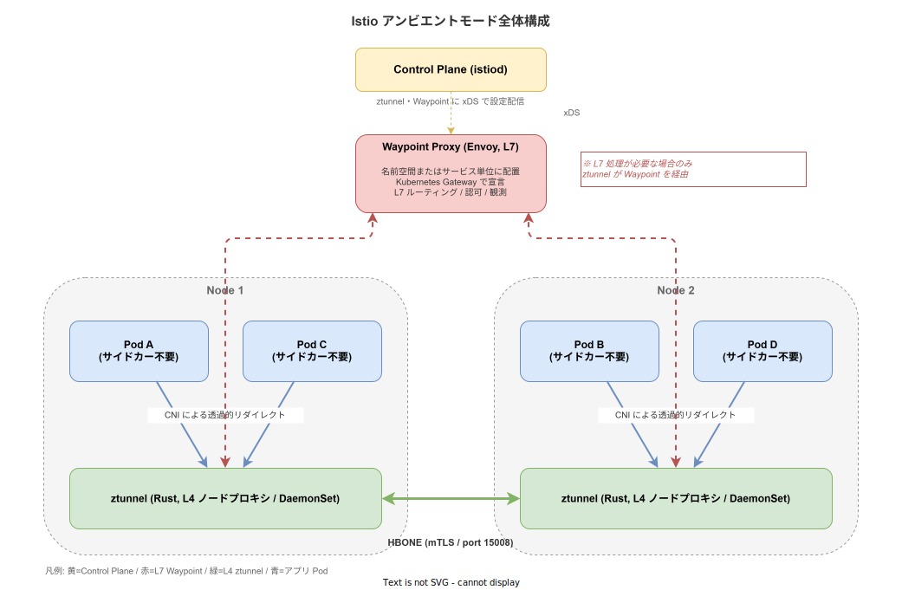
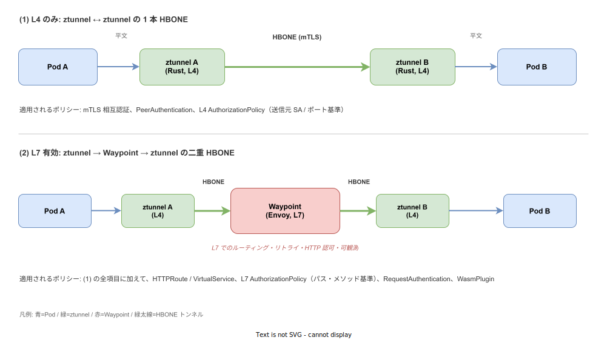

# Istio: アンビエントモード（Ambient Mode）

- 対象読者: Kubernetes と従来のサイドカー型サービスメッシュ（Istio / Linkerd 等）の基本を理解している開発者・SRE
- 学習目標: アンビエントモードが解決する課題・L4/L7 分離アーキテクチャ・ztunnel と Waypoint の役割・サイドカー方式との違いを説明し、最小構成で導入できるようになる
- 所要時間: 約 45 分
- 対象バージョン: Istio v1.24（2024-11-07 に ambient mode が GA）以降
- 最終更新日: 2026-04-19

## 1. このドキュメントで学べること

- アンビエントモードが既存のサイドカー方式に対して「なぜ」提案されたかを説明できる
- L4 プロキシ（ztunnel）と L7 プロキシ（Waypoint）を分離する設計思想を理解できる
- HBONE プロトコルを用いたデータパスの流れを追える
- サイドカー方式とアンビエント方式の混在運用が可能な理由を理解できる
- 最小構成でアンビエントメッシュに名前空間を組み入れ、Waypoint を追加できる

## 2. 前提知識

- Kubernetes の Pod・Service・Namespace の概念
- サービスメッシュとサイドカーパターンの基本（[Dapr: 基本](./dapr_basics.md) と比較して読むと理解が進む）
- mTLS と x509 証明書の概要
- Kubernetes Gateway API の存在（Waypoint は Gateway リソースとして宣言する）

## 3. 概要

Istio のアンビエントモード（Ambient Mode）は「アプリケーション Pod にサイドカープロキシを差し込まないサービスメッシュ運用方式」である。従来の Istio は各 Pod に Envoy サイドカーを注入して L4/L7 機能を一括で提供していたが、これにはメモリ常時消費・起動順序・再起動時の接続中断といった運用上の摩擦が伴っていた。

アンビエントはこの問題を「L4 はノード常駐の軽量プロキシに任せ、L7 は必要な場所にだけ配置する」という二層構造で解く。ノード単位で 1 個だけ動く Rust 製の **ztunnel** が L4（mTLS・認可・テレメトリ）を透過的に処理し、HTTP ルーティングや L7 認可など重い機能は必要な名前空間／サービスだけに **Waypoint Proxy** を別デプロイする。Pod 側は無改造・無再起動のままメッシュに入る。

2024-11-07 に Istio v1.24 で GA に到達しており、ztunnel・Waypoint・関連 API が Stable 指定を受けている。

## 4. 用語の整理

| 用語 | 説明 |
|------|------|
| ztunnel | Rust 製の L4 ノードプロキシ。DaemonSet として各ノードに 1 個常駐し、mTLS・L4 認可・テレメトリを担当 |
| Waypoint Proxy | Envoy ベースの L7 プロキシ。名前空間またはサービス単位に任意配置し、HTTP ルーティング・L7 認可・WASM を担当 |
| HBONE | HTTP CONNECT ベースの暗号化トンネル。mTLS の上で別コネクションを多重化する Istio 専用プロトコル（port 15008） |
| CNI リダイレクト | `istio-cni` が iptables / eBPF でノード内トラフィックを ztunnel へ透過誘導する仕組み |
| dataplane-mode ラベル | 名前空間に付与する `istio.io/dataplane-mode=ambient` ラベル。付与したネームスペースの Pod が即時メッシュに参加する |
| サイドカー方式 | 従来の Istio 動作モード。各 Pod に Envoy を注入する方式。アンビエントとの混在運用が可能 |

## 5. 仕組み・アーキテクチャ

アンビエントは「Pod の中にプロキシを差し込まない」代わりに、ノード常駐の ztunnel と任意配置の Waypoint という 2 系統のプロキシに役割を分担する。Control Plane である istiod は両者に xDS で設定を配信する。



Pod から出るトラフィックは CNI プラグインが透過的に ztunnel へ向け直す。ztunnel は送信先がメッシュ内であれば HBONE トンネル（port 15008、mTLS 上の HTTP CONNECT）にアップグレードし、対向ノードの ztunnel へ転送する。L7 ポリシーが必要なトラフィックだけ、ztunnel が Waypoint を経由するようルーティングを変える。

データパスは L4 のみの単純経路と、Waypoint を挟む二重 HBONE 経路の二択である。両方の流れを並べて示す。



L4 のみの場合、適用されるのは PeerAuthentication と L4 AuthorizationPolicy（送信元 ServiceAccount・ポート）まで。HTTPRoute・VirtualService・L7 AuthorizationPolicy・RequestAuthentication・WasmPlugin を使うときは Waypoint の有効化が必須となる。

## 6. 環境構築

### 6.1 必要なもの

- Kubernetes v1.27 以降のクラスタ（kind / minikube / マネージド Kubernetes のいずれか）
- `kubectl` CLI
- `istioctl` v1.24 以降
- クラスタノードで iptables または Istio CNI が利用可能であること

### 6.2 セットアップ手順

```bash
# Istio のアンビエント構成をインストールする（istio-system に ztunnel と istio-cni を展開）
istioctl install --set profile=ambient --skip-confirmation

# 対象の名前空間をアンビエントメッシュに組み入れる
kubectl label namespace default istio.io/dataplane-mode=ambient
```

### 6.3 動作確認

```bash
# 各ノードに ztunnel DaemonSet が起動していることを確認する
kubectl get pods -n istio-system -l app=ztunnel

# サンプルアプリを投入して接続性を確認する
kubectl apply -f https://raw.githubusercontent.com/istio/istio/release-1.24/samples/bookinfo/platform/kube/bookinfo.yaml

# productpage から details への呼び出しが mTLS 化されていることを istioctl で確認する
istioctl ztunnel-config workload
```

## 7. 基本の使い方

アンビエントに組み入れた名前空間のサービスに対して、Waypoint を追加して L7 ポリシーを適用する最小例を示す。

```yaml
# istio_ambient-mode の Waypoint 定義例
# 名前空間 default 内のサービスに対して L7 処理を適用する
apiVersion: gateway.networking.k8s.io/v1
kind: Gateway
metadata:
  # Waypoint をサービス単位の対象として扱うことを宣言する
  labels:
    istio.io/waypoint-for: service
  # Gateway リソース名。istio.io/use-waypoint で参照される識別子になる
  name: waypoint
  # Waypoint を配置する名前空間
  namespace: default
spec:
  # Istio が提供する Waypoint 専用の GatewayClass を指定する
  gatewayClassName: istio-waypoint
  listeners:
    # ztunnel と Waypoint の間は HBONE で通信するためプロトコルは HBONE 固定
  - name: mesh
    # HBONE 用の標準ポート
    port: 15008
    # Waypoint の受信プロトコル（Istio 独自の値）
    protocol: HBONE
```

### 解説

- `istio.io/waypoint-for: service` は「Kubernetes Service 向けトラフィックを処理する Waypoint」であることを示す。`workload`（Pod/VM IP 宛）や `all`（両方）も指定可能である。
- 適用スコープは `kubectl label ns default istio.io/use-waypoint=waypoint` のように別ラベルで指定する。ポッド単位 > サービス単位 > 名前空間単位の優先順で合成される。
- Gateway リソースの宣言だけでは適用されない。`use-waypoint` ラベルで「誰がこの Waypoint を使うか」を明示する二段構えになっている。

より簡便な方法として `istioctl waypoint apply -n default --enroll-namespace` を使うと、Gateway の作成と名前空間ラベル付与が一括で行われる。

## 8. ステップアップ

### 8.1 サイドカー方式との混在運用

アンビエント移行は段階的に進められる。名前空間 A は従来のサイドカー注入、名前空間 B はアンビエント、という混在配置が可能で、両名前空間間の通信も mTLS で保護される。移行段階で「挙動が変わるのはラベルを付けた名前空間だけ」という限定的な変更単位を取れるのが大きな利点である。

### 8.2 L4 認可と L7 認可の適用箇所

AuthorizationPolicy は L4 / L7 の属性が混在しうるため、Istio はポリシー内容を解析して適用場所を自動決定する。送信元 ServiceAccount や宛先ポートのみで判定できる L4 ルールは ztunnel に、HTTP パス・メソッド・ヘッダーに言及する L7 ルールは Waypoint に配布される。L7 ルールを含むポリシーを書いても Waypoint が無ければ想定どおりには動かない点に注意が必要である。

### 8.3 観測性の違い

サイドカー方式では Envoy 1 個が L4〜L7 すべてのメトリクスを出すが、アンビエントでは L4 メトリクスは ztunnel、L7 メトリクスは Waypoint から出る。ダッシュボードやアラート定義で「どちらのプロキシからの系列か」を区別する必要がある。

## 9. よくある落とし穴

- Waypoint を作っただけでは L7 ポリシーが効かない。`istio.io/use-waypoint` ラベルで対象を指定して初めて適用される。
- ztunnel は HTTP を終端しない。ゆえに「生の Envoy アクセスログ」のような L7 ログは L4 のみ構成では取得できない。L7 観測が必要なら Waypoint を置く。
- `istio.io/dataplane-mode=ambient` を付けた名前空間内に、従来の `istio-injection=enabled` ラベルが残っているとサイドカーが優先される。移行時は片方を削除すること。
- CNI の競合: 既存の CNI プラグイン（Cilium の kube-proxy replacement など）がある場合、Istio CNI のチェーニング設定が必要になる。

## 10. ベストプラクティス

- まず L4 のみ（ztunnel のみ）でメッシュを立ち上げ、mTLS と L4 認可のベースラインを確立してから、必要なサービスに限って Waypoint を追加する。最初から全サービスに Waypoint を置かない。
- Waypoint はサービス単位で絞る。名前空間単位の Waypoint は簡単だが、スケール時にボトルネックになりうる。
- ztunnel はノード共有リソースなので、ノード障害時の影響範囲が Pod 数に比例することを運用設計に織り込む（ノード退避手順・PDB 設定を従来より重視する）。
- バージョンアップは `istioctl upgrade` だけで済むが、ztunnel の再起動中はノード上 Pod の短時間の断が発生しうる。メンテナンスウィンドウで実施する。

## 11. 演習問題（任意）

1. サイドカー方式と比較して、アンビエントでメモリ消費が最大 90% 削減される技術的な理由を 2 点挙げよ。
2. Pod A（名前空間 `ns-a`, サイドカー方式）から Pod B（名前空間 `ns-b`, アンビエント方式）への通信はどの経路で流れるかを図示せよ。
3. 「`/admin` パスへの GET を特定 ServiceAccount のみ許可」というポリシーは ztunnel と Waypoint のどちらで評価されるか、理由とともに答えよ。

## 12. さらに学ぶには

- Istio 公式「Ambient Mode」: <https://istio.io/latest/docs/ambient/>
- Istio Blog「Istio Ambient Mode reaches GA」: <https://istio.io/latest/blog/2024/ambient-reaches-ga/>
- 関連 Knowledge: [Dapr: 基本](./dapr_basics.md)（サイドカー型ランタイムとの比較）
- 関連 Knowledge: [Kubernetes: 基本](./kubernetes_basics.md)（DaemonSet と CNI の前提）

## 13. 参考資料

- Istio Documentation, "Ambient Mode Overview" (<https://istio.io/latest/docs/ambient/overview/>)
- Istio Documentation, "Ambient Architecture" (<https://istio.io/latest/docs/ambient/architecture/>)
- Istio Documentation, "Ambient Data Plane" (<https://istio.io/latest/docs/ambient/architecture/data-plane/>)
- Istio Documentation, "Configure Waypoint Proxies" (<https://istio.io/latest/docs/ambient/usage/waypoint/>)
- Istio Blog, "Istio Ambient Mode reaches General Availability" (2024-11-07)
