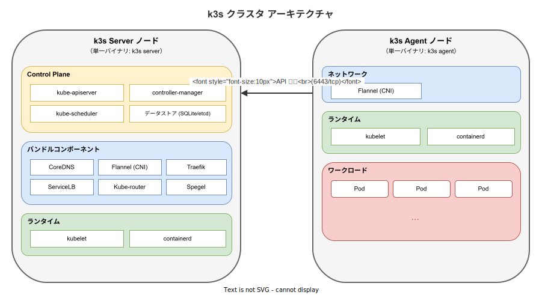

# k3s: 基本

- 対象読者: Kubernetes の基本概念（Pod, Deployment, Service）を理解している開発者
- 学習目標: k3s の特徴を理解し、クラスタの構築と基本運用ができるようになる
- 所要時間: 約 30 分
- 対象バージョン: k3s v1.31
- 最終更新日: 2026-04-12

## 1. このドキュメントで学べること

- k3s が解決する課題と標準 Kubernetes との違いを説明できる
- k3s のアーキテクチャ（Server / Agent）を理解できる
- k3s クラスタを構築し、kubectl で基本操作ができる
- HA（高可用性）構成の概要を理解できる

## 2. 前提知識

- Kubernetes の基本概念（Pod, Deployment, Service, kubectl）
  - 参照: [Kubernetes: 基本](./kubernetes_basics.md)
- Linux コマンドラインの基本操作
- Docker コンテナの基礎知識（イメージ、コンテナ）

## 3. 概要

k3s は Rancher Labs（現 SUSE）が開発した、軽量な CNCF 認定 Kubernetes ディストリビューションである。標準の Kubernetes は複数のバイナリと etcd の運用が必要で、リソース消費が大きい。k3s はこれらを **単一バイナリ（100MB 未満）** にパッケージ化し、エッジ、IoT、CI/CD、開発環境など、リソースが限られた環境でも Kubernetes を利用可能にする。

CNCF 認定を受けているため、標準の Kubernetes API と完全に互換性がある。既存の kubectl コマンドやマニフェストをそのまま使用できる。

## 4. 用語の整理

| 用語 | 説明 |
|------|------|
| Server | Control Plane を実行するノード。API Server やスケジューラ等を含む |
| Agent | ワークロードを実行するワーカーノード。kubelet と containerd が動作する |
| SQLite | k3s のデフォルトデータストア。etcd の代わりに使用される軽量 DB |
| Flannel | k3s にバンドルされた CNI プラグイン。Pod 間ネットワークを構築する |
| Traefik | k3s にバンドルされた Ingress コントローラ。外部アクセスを管理する |
| ServiceLB | k3s にバンドルされた LoadBalancer 実装。クラウド LB なしで動作する |
| Spegel | k3s にバンドルされた分散コンテナイメージレジストリミラー |

## 5. 仕組み・アーキテクチャ

k3s は Kubernetes のコンポーネントを **Server** と **Agent** の 2 つの役割に分類する。



**Server ノード** は Control Plane の全コンポーネント（API Server、スケジューラ、コントローラマネージャ）を単一プロセス内のゴルーチンとして実行する。デフォルトのデータストアは SQLite で、etcd、MySQL、PostgreSQL も選択可能である。CoreDNS、Flannel、Traefik、ServiceLB 等がバンドルされており、追加インストールは不要である。

**Agent ノード** は kubelet、containerd、Flannel を実行する。Server の API（6443/tcp）に接続し、ワークロードの実行指示を受け取る。

Server ノードもデフォルトで kubelet を実行するため、ワークロードの配置先として機能する。

## 6. 環境構築

### 6.1 必要なもの

- Linux マシン（x86_64、ARM64、ARMv7 対応）
- systemd または openrc ベースのシステム
- メモリ: Server 512MB 以上（推奨 2GB 以上）、Agent 256MB 以上

### 6.2 セットアップ手順

```bash
# k3s Server をインストールする（単一ノードクラスタ）
curl -sfL https://get.k3s.io | sh -

# クラスタの状態を確認する
sudo k3s kubectl get nodes
```

Agent ノードを追加する場合は、Server のトークンが必要である。

```bash
# Server でトークンを取得する
sudo cat /var/lib/rancher/k3s/server/node-token

# Agent ノードで実行する（SERVER_IP と TOKEN を置き換える）
curl -sfL https://get.k3s.io | K3S_URL=https://<SERVER_IP>:6443 K3S_TOKEN=<TOKEN> sh -
```

### 6.3 動作確認

```bash
# ノード一覧を表示してクラスタの稼働を確認する
sudo k3s kubectl get nodes

# システム Pod が正常に動作していることを確認する
sudo k3s kubectl get pods -n kube-system
```

`STATUS` が `Ready`、Pod が `Running` と表示されればセットアップ完了である。

## 7. 基本の使い方

k3s は kubectl をバンドルしているため `k3s kubectl` で操作できる。kubeconfig は `/etc/rancher/k3s/k3s.yaml` に自動生成される。

```bash
# kubeconfig を設定して kubectl を直接使用可能にする
export KUBECONFIG=/etc/rancher/k3s/k3s.yaml

# nginx Pod を作成する
kubectl run nginx --image=nginx:1.27

# Pod の状態を確認する
kubectl get pods

# Service を作成して外部公開する
kubectl expose pod nginx --port=80 --type=NodePort

# Service の詳細を確認する
kubectl get svc nginx
```

### 解説

- `k3s kubectl`: k3s にバンドルされた kubectl コマンド。標準の kubectl と同一の操作が可能である
- kubeconfig は自動生成されるため、手動での証明書設定は不要である
- `--type=NodePort` を指定すると、各ノードの割り当てポート経由で Service にアクセスできる

## 8. ステップアップ

### 8.1 高可用性（HA）構成

本番環境では Server ノードを 3 台以上で構成し、組み込み etcd を使用する HA 構成を推奨する。

```bash
# 1 台目の Server でクラスタを初期化する
curl -sfL https://get.k3s.io | K3S_TOKEN=SECRET sh -s - server --cluster-init

# 2 台目以降の Server をクラスタに参加させる
curl -sfL https://get.k3s.io | K3S_TOKEN=SECRET sh -s - server \
  --server https://<FIRST_SERVER_IP>:6443
```

### 8.2 バンドルコンポーネントの無効化

不要なコンポーネントは `--disable` フラグで無効化できる。

```bash
# Traefik を無効化して別の Ingress コントローラを使用する
curl -sfL https://get.k3s.io | INSTALL_K3S_EXEC="--disable=traefik" sh -
```

## 9. よくある落とし穴

- **kubeconfig のパーミッション**: `/etc/rancher/k3s/k3s.yaml` は root 所有である。一般ユーザーは sudo 経由か、ファイルをコピーして権限を設定する
- **ファイアウォール**: Server の 6443/tcp を Agent から到達可能にする必要がある
- **SQLite の制約**: SQLite は単一 Server 構成でのみ使用可能である。HA 構成では etcd または外部 DB が必須となる
- **ARM イメージ互換性**: ARM ノードではマルチアーキテクチャ対応のコンテナイメージを使用する

## 10. ベストプラクティス

- 本番環境では HA 構成（Server 3 台以上 + 組み込み etcd）を採用する
- 不要なバンドルコンポーネントは `--disable` で無効化し、リソースを節約する
- `--tls-san` フラグでロードバランサの IP / ドメインを証明書に追加する
- Agent ノードの追加・削除でスケーリングし、Server ノードは固定する

## 11. 演習問題

1. k3s Server を 1 台インストールし、`kubectl get nodes` で Ready 状態を確認せよ
2. 別マシンで k3s Agent をインストールし、2 ノードクラスタを構築せよ
3. nginx Deployment（レプリカ数 2）をデプロイし、Pod が複数ノードに分散することを確認せよ

## 12. さらに学ぶには

- k3s 公式ドキュメント: https://docs.k3s.io/
- 関連 Knowledge: [Kubernetes: 基本](./kubernetes_basics.md)
- k3s GitHub リポジトリ: https://github.com/k3s-io/k3s

## 13. 参考資料

- k3s Architecture: https://docs.k3s.io/architecture
- k3s Quick-Start Guide: https://docs.k3s.io/quick-start
- k3s HA with Embedded DB: https://docs.k3s.io/datastore/ha-embedded
