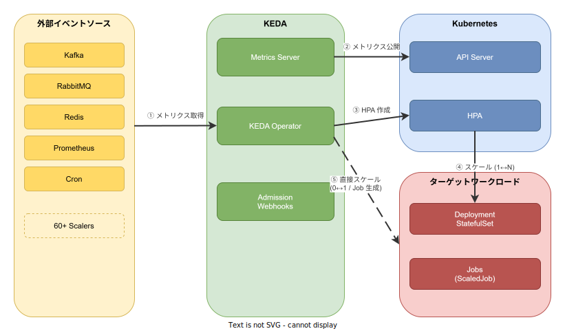

# KEDA: 基本

- 対象読者: Kubernetes の基本（Pod・Deployment・HPA）を理解している開発者
- 学習目標: KEDA の仕組みを理解し、ScaledObject を使ってイベント駆動のオートスケーリングを構成できるようになる
- 所要時間: 約 30 分
- 対象バージョン: KEDA v2.16
- 最終更新日: 2026-04-13

## 1. このドキュメントで学べること

- KEDA が解決する課題と、Kubernetes 標準の HPA との違いを説明できる
- KEDA の 3 つのコアコンポーネント（Operator・Metrics Server・Admission Webhooks）の役割を理解できる
- ScaledObject を記述して、外部イベントソースに基づくオートスケーリングを構成できる
- 「ゼロへのスケール」が実現される仕組みを説明できる

## 2. 前提知識

- Kubernetes の基本概念（Pod・Deployment・Service・HPA）
  - 参照: [Kubernetes: 基本](./kubernetes_basics.md)
- YAML の基本的な記法
- メッセージキュー（Kafka・RabbitMQ 等）の概念（必須ではないが理解を助ける）

## 3. 概要

KEDA（Kubernetes-based Event Driven Autoscaling）は、CNCF Graduated プロジェクトとして認定されたイベント駆動型のオートスケーリングソリューションである。

Kubernetes 標準の HPA は CPU やメモリといったリソースメトリクスに基づいてスケールする。しかし、メッセージキューの滞留数やデータベースの未処理レコード数といった「外部イベント」に基づくスケーリングは HPA 単体では実現が難しい。さらに HPA はレプリカ数を 0 にする（ゼロスケール）こともできない。

KEDA はこれらの課題を解決する。外部イベントソースのメトリクスを Kubernetes のメトリクスとして変換・公開し、HPA と連携してスケーリングを実行する。イベントがなくなればワークロードをゼロにまでスケールダウンし、イベントが発生すれば即座にスケールアップする。60 以上の組み込みスケーラーを備え、Kafka・RabbitMQ・Redis・Prometheus・Cron など多様なイベントソースに対応する。

## 4. 用語の整理

| 用語 | 説明 |
|------|------|
| KEDA Operator | CRD を監視し、HPA の作成や 0↔1 のスケール制御を行うコントローラ |
| Metrics Server | 外部イベントソースのメトリクスを Kubernetes API に公開するアダプタ |
| Admission Webhooks | CRD の設定値をバリデーションする Webhook |
| ScaledObject | Deployment や StatefulSet のスケーリングルールを定義する CRD |
| ScaledJob | Kubernetes Job の生成ルールを定義する CRD |
| TriggerAuthentication | スケーラーが外部サービスに接続する際の認証情報を定義する CRD |
| Scaler | 特定のイベントソースからメトリクスを取得するプラグイン（60 以上を内蔵） |

## 5. 仕組み・アーキテクチャ

KEDA は Kubernetes クラスタ内にデプロイされ、3 つのコンポーネントが連携して動作する。



**スケーリングの流れ（ScaledObject の場合）:**

1. ユーザーが ScaledObject を作成し、対象ワークロードとトリガー（イベントソース）を宣言する
2. KEDA Operator が ScaledObject を検知し、対応する HPA を自動作成する（③）
3. KEDA Metrics Server が外部イベントソースからメトリクスを取得し（①）、Kubernetes API に公開する（②）
4. HPA がメトリクスを参照し、1〜N のレプリカ数をスケールする（④）
5. メトリクスがゼロになると、KEDA Operator が直接レプリカを 0 にスケールする（⑤）
6. メトリクスが再発生すると、KEDA Operator が 0→1 にスケールし、以降は HPA が引き継ぐ

ScaledJob の場合は HPA を経由せず、KEDA Operator がイベント量に応じて Job を直接生成する（⑤）。

## 6. 環境構築

### 6.1 必要なもの

- Kubernetes クラスタ（v1.28 以上推奨）
- kubectl
- Helm v3

### 6.2 セットアップ手順

```bash
# KEDA の Helm リポジトリを追加する
helm repo add kedacore https://kedacore.github.io/charts

# リポジトリ情報を更新する
helm repo update

# keda 名前空間に KEDA をインストールする
helm install keda kedacore/keda --namespace keda --create-namespace
```

### 6.3 動作確認

```bash
# KEDA の Pod が Running であることを確認する
kubectl get pods -n keda
```

`keda-operator`、`keda-metrics-apiserver`、`keda-admission-webhooks` の 3 つが Running であれば完了である。

## 7. 基本の使い方

Prometheus のメトリクスに基づいてスケールする最小構成の例を示す。

```yaml
# KEDA ScaledObject の最小構成例
# HTTP リクエスト数に基づいて nginx をスケールする
apiVersion: keda.sh/v1alpha1
kind: ScaledObject
metadata:
  # ScaledObject の名前を定義する
  name: nginx-scaledobject
spec:
  # スケール対象の Deployment を指定する
  scaleTargetRef:
    name: nginx-deployment
  # ポーリング間隔（秒）を指定する
  pollingInterval: 30
  # スケールダウンまでの待機時間（秒）を指定する
  cooldownPeriod: 300
  # 最小レプリカ数（0 でゼロスケール有効）を指定する
  minReplicaCount: 0
  # 最大レプリカ数を指定する
  maxReplicaCount: 10
  # トリガー（イベントソース）を定義する
  triggers:
    # Prometheus スケーラーを使用する
    - type: prometheus
      metadata:
        # Prometheus サーバーの URL を指定する
        serverAddress: http://prometheus-server.monitoring:9090
        # 監視する PromQL クエリを指定する
        query: sum(rate(http_requests_total{deployment="nginx"}[2m]))
        # レプリカあたりの目標値を指定する
        threshold: "50"
```

### 解説

- `scaleTargetRef`: スケール対象のワークロード名を指定する。Deployment・StatefulSet が対象
- `pollingInterval`: KEDA がイベントソースをポーリングする間隔。デフォルトは 30 秒
- `cooldownPeriod`: 最後のトリガー発火からスケールダウン開始までの待機時間
- `minReplicaCount`: 0 を指定するとゼロスケールが有効になる
- `triggers`: 1 つ以上のスケーラーを定義する。複数指定時は最大値が採用される

```bash
# ScaledObject を適用する
kubectl apply -f scaledobject.yaml

# KEDA が HPA を自動作成したことを確認する
kubectl get hpa

# ScaledObject の状態を確認する
kubectl get scaledobject
```

## 8. ステップアップ

### 8.1 TriggerAuthentication で認証情報を分離する

外部サービスへの認証情報は TriggerAuthentication CRD で管理する。Secret から参照することで、ScaledObject にクレデンシャルを直接記述することを避けられる。

```yaml
# 認証情報を Secret から参照する TriggerAuthentication
apiVersion: keda.sh/v1alpha1
kind: TriggerAuthentication
metadata:
  # TriggerAuthentication の名前を定義する
  name: kafka-auth
spec:
  # Secret からパラメータを参照する
  secretTargetRef:
    # username パラメータを Secret から取得する
    - parameter: username
      name: kafka-credentials
      key: username
    # password パラメータを Secret から取得する
    - parameter: password
      name: kafka-credentials
      key: password
```

### 8.2 ScaledJob でバッチ処理をスケールする

長時間実行のバッチ処理には ScaledJob を使用する。イベント量に応じて Kubernetes Job が自動生成される。

```yaml
# キューの滞留数に応じて Job を生成する ScaledJob
apiVersion: keda.sh/v1alpha1
kind: ScaledJob
metadata:
  # ScaledJob の名前を定義する
  name: queue-processor
spec:
  # Job テンプレートを定義する
  jobTargetRef:
    template:
      spec:
        containers:
          # 処理コンテナを指定する
          - name: processor
            image: my-processor:latest
        # Job 完了後にコンテナを再起動しない
        restartPolicy: Never
  # 最大同時実行 Job 数を指定する
  maxReplicaCount: 30
  # トリガーを定義する
  triggers:
    - type: rabbitmq
      metadata:
        # キュー名を指定する
        queueName: tasks
        # 1 Job あたりのメッセージ数を指定する
        queueLength: "5"
      # 認証情報への参照を指定する
      authenticationRef:
        name: rabbitmq-auth
```

## 9. よくある落とし穴

- **minReplicaCount=0 と Deployment の初期レプリカ数の競合**: ScaledObject 適用後は KEDA がレプリカ数を制御する。Deployment 側の `replicas` 値は KEDA に上書きされる
- **pollingInterval を短くしすぎる**: ポーリング間隔が短いと外部サービスへの負荷が増大する。30 秒以上を推奨する
- **cooldownPeriod の未設定**: デフォルト 300 秒。短すぎるとスケールアップ直後にスケールダウンが発生し、フラッピングの原因となる
- **複数トリガー時の挙動の誤解**: 複数トリガーを定義した場合、デフォルトではそれぞれの希望レプリカ数の最大値が採用される

## 10. ベストプラクティス

- 認証情報は必ず TriggerAuthentication と Secret で管理し、ScaledObject に直接記述しない
- `cooldownPeriod` はワークロードの起動時間を考慮して設定する（起動に 60 秒かかるなら 300 秒以上を推奨）
- 本番環境では `minReplicaCount=1` として常に 1 Pod を稼働させ、コールドスタートを回避することを検討する
- ScaledObject の `fallback` を設定し、スケーラー障害時のデフォルトレプリカ数を定義する
- Prometheus や Grafana で KEDA 自体のメトリクス（`keda_scaler_*`）を監視する

## 11. 演習問題

1. Prometheus スケーラーを使った ScaledObject を作成し、`kubectl get hpa` で HPA が自動作成されることを確認せよ
2. `minReplicaCount: 0` を設定した状態でトリガー条件を満たさなくした場合、Pod 数が 0 になることを確認せよ
3. TriggerAuthentication を作成し、ScaledObject から `authenticationRef` で参照する構成に変更せよ

## 12. さらに学ぶには

- KEDA 公式ドキュメント: <https://keda.sh/docs/>
- KEDA Scalers 一覧: <https://keda.sh/docs/scalers/>
- KEDA GitHub リポジトリ: <https://github.com/kedacore/keda>
- 関連 Knowledge: [Kubernetes: 基本](./kubernetes_basics.md)

## 13. 参考資料

- KEDA 公式ドキュメント v2.16: <https://keda.sh/docs/2.16/>
- KEDA Concepts - ScaledObject: <https://keda.sh/docs/2.16/concepts/scaling-deployments/>
- KEDA Concepts - ScaledJob: <https://keda.sh/docs/2.16/concepts/scaling-jobs/>
- CNCF KEDA Project Page: <https://www.cncf.io/projects/keda/>
