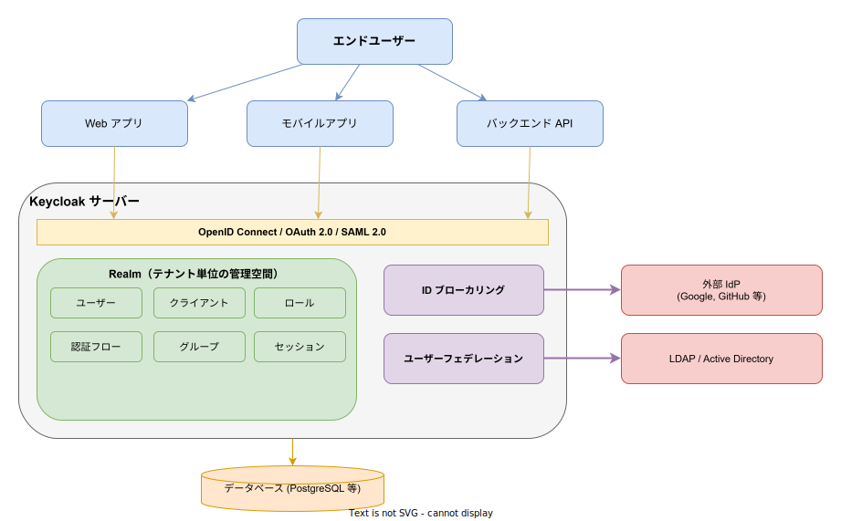
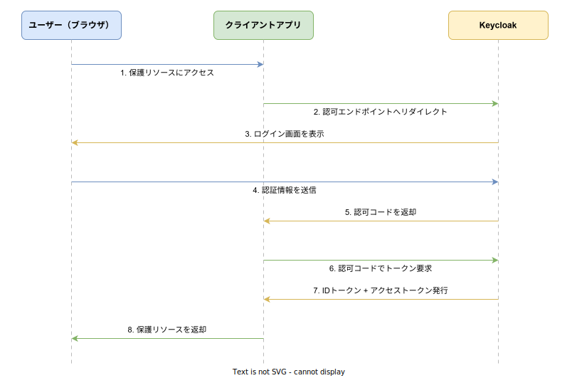

# Keycloak: 基本

- 対象読者: Web アプリケーション開発の基礎知識を持つ開発者
- 学習目標: Keycloak の全体像を理解し、アプリケーションに SSO を導入できるようになる
- 所要時間: 約 40 分
- 対象バージョン: Keycloak 26.x
- 最終更新日: 2026-04-12

## 1. このドキュメントで学べること

- Keycloak が解決する課題と存在意義を説明できる
- Realm・クライアント・ユーザー・ロールの関係を理解できる
- OpenID Connect 認可コードフローの流れを説明できる
- Docker で Keycloak を起動し、基本的な設定を行える

## 2. 前提知識

- HTTP リクエスト/レスポンスの基本的な仕組み
- JSON の基本的な記法
- Docker コンテナの基本操作（`docker run` 等）

## 3. 概要

Keycloak は、オープンソースの **IAM（Identity and Access Management）** ソリューションである。Red Hat が開発を主導し、CNCF のインキュベーションプロジェクトとして管理されている。

多くの Web アプリケーションでは、ユーザー認証・認可の実装が必要になる。しかし、パスワードの安全な保管、多要素認証、SSO（シングルサインオン）、外部 IdP 連携などを各アプリケーションで個別に実装するのはコストが大きく、セキュリティリスクも高い。Keycloak はこれらの機能を一元的に提供し、アプリケーション側は標準プロトコル経由で認証を委任するだけで済む。

## 4. 用語の整理

| 用語 | 説明 |
|------|------|
| IAM | Identity and Access Management。ユーザーの認証と認可を管理する仕組みの総称 |
| SSO | Single Sign-On。一度のログインで複数のアプリケーションにアクセスできる仕組み |
| Realm | テナントに相当する管理単位。ユーザー・クライアント・ロール等を分離して管理する |
| クライアント | Keycloak に認証を委任するアプリケーションの登録情報 |
| ロール | ユーザーに付与する権限の単位。Realm ロールとクライアントロールがある |
| グループ | ユーザーをまとめる単位。グループにロールを割り当て、所属ユーザーに一括適用できる |
| IdP | Identity Provider。認証情報を管理・提供する外部サービス（Google、GitHub 等） |
| OIDC | OpenID Connect。OAuth 2.0 を拡張した認証プロトコル。Keycloak の推奨プロトコル |

## 5. 仕組み・アーキテクチャ

Keycloak はアプリケーションと外部システムの間に位置し、認証・認可の中央ハブとして機能する。



**構成要素の役割:**

| 構成要素 | 役割 |
|----------|------|
| Realm | テナント単位の管理空間。本番・開発など環境ごとに分離できる |
| プロトコル層 | OIDC / OAuth 2.0 / SAML 2.0 を介してクライアントと通信する |
| ID ブローカリング | Google や GitHub などの外部 IdP でのログインを中継する |
| ユーザーフェデレーション | 既存の LDAP / Active Directory のユーザー情報を Keycloak に統合する |
| データベース | Realm 設定・ユーザー情報・セッション等を永続化する |

**OpenID Connect 認可コードフロー:**

Keycloak で最も一般的な認証フローである。ブラウザベースのアプリケーションに適している。



## 6. 環境構築

### 6.1 必要なもの

- Docker（Docker Desktop または Docker Engine）
- Web ブラウザ

### 6.2 セットアップ手順

```bash
# Keycloak を開発モードで起動するコマンド
# -p 8080:8080: ホストのポート 8080 をコンテナにマッピングする
# -e KC_BOOTSTRAP_ADMIN_USERNAME: 管理者ユーザー名を設定する
# -e KC_BOOTSTRAP_ADMIN_PASSWORD: 管理者パスワードを設定する
# start-dev: 開発モードで起動する（データは永続化されない）
docker run -p 8080:8080 \
  -e KC_BOOTSTRAP_ADMIN_USERNAME=admin \
  -e KC_BOOTSTRAP_ADMIN_PASSWORD=admin \
  quay.io/keycloak/keycloak:26.3 start-dev
```

### 6.3 動作確認

ブラウザで `http://localhost:8080` にアクセスし、管理コンソールのログイン画面が表示されることを確認する。`admin` / `admin` でログインできれば起動完了である。

## 7. 基本の使い方

管理コンソールから Realm とクライアントを作成し、認証を試す手順を示す。

### 7.1 Realm の作成

1. 管理コンソール左上のドロップダウンから「Create realm」を選択する
2. Realm name に `my-app` と入力し「Create」を押す

### 7.2 クライアントの登録

1. 左メニュー「Clients」→「Create client」を選択する
2. Client ID に `my-web-app` と入力する
3. Root URL に `http://localhost:3000` を入力する
4. Valid redirect URIs に `http://localhost:3000/*` を入力する

### 7.3 ユーザーの作成

1. 左メニュー「Users」→「Create new user」を選択する
2. Username に `testuser` と入力し「Create」を押す
3. 「Credentials」タブでパスワードを設定する（Temporary を OFF にする）

### 7.4 認証テスト

以下の URL にブラウザでアクセスすると、Keycloak のログイン画面にリダイレクトされる。

```bash
# 認可エンドポイントに直接アクセスして認証フローを確認する
# response_type=code: 認可コードフローを指定する
# client_id: 登録したクライアント ID を使用する
# redirect_uri: クライアントに設定したリダイレクト URI を使用する
# scope=openid: OpenID Connect スコープを要求する
curl -v "http://localhost:8080/realms/my-app/protocol/openid-connect/auth?\
response_type=code&\
client_id=my-web-app&\
redirect_uri=http://localhost:3000/&\
scope=openid"
```

認証成功後、リダイレクト先の URL に `code` パラメータが付与される。このコードをトークンエンドポイントで交換することでアクセストークンと ID トークンを取得できる。

## 8. ステップアップ

### 8.1 トークンの確認

Keycloak が発行するトークンは JWT（JSON Web Token）形式である。管理コンソールの「Sessions」から有効なセッションを確認できる。トークンの中身は以下で確認可能である。

```bash
# トークンエンドポイントで認可コードをトークンに交換する
# grant_type=authorization_code: 認可コードグラントを指定する
# client_id: クライアント ID を指定する
# code: 認可エンドポイントから取得した認可コードを設定する
# redirect_uri: 認可リクエスト時と同じ URI を指定する
curl -X POST "http://localhost:8080/realms/my-app/protocol/openid-connect/token" \
  -d "grant_type=authorization_code" \
  -d "client_id=my-web-app" \
  -d "code=<取得した認可コード>" \
  -d "redirect_uri=http://localhost:3000/"
```

### 8.2 ロールの活用

Realm ロールを作成し、ユーザーに割り当てることで、アプリケーション側でロールベースのアクセス制御を実現できる。トークンの `realm_access.roles` クレームにロール情報が含まれる。

## 9. よくある落とし穴

- **redirect URI の不一致**: クライアント設定の Valid redirect URIs と実際のリダイレクト先が一致しないと認証エラーになる。末尾のスラッシュや大文字小文字も厳密に一致させる
- **HTTPS の未設定**: 本番環境では SSL/TLS が必須である。`start-dev` モードは開発専用であり、本番では `start` コマンドと証明書設定を使う
- **master Realm の直接利用**: master Realm は管理用である。アプリケーション用には必ず新しい Realm を作成する
- **トークン有効期限の未考慮**: アクセストークンのデフォルト有効期限は 5 分である。リフレッシュトークンによる更新処理を実装する

## 10. ベストプラクティス

- アプリケーションごとに専用のクライアントを登録する
- ロールは最小権限の原則に従い、必要最小限を付与する
- 本番環境では必ず HTTPS を使用し、`sslRequired` を `all` に設定する
- パスワードポリシー（長さ・複雑性）を Realm レベルで設定する
- ブルートフォース保護を有効にする

## 11. 演習問題

1. Docker で Keycloak を起動し、新しい Realm `test-realm` を作成せよ。ユーザーを作成し、管理コンソールからログインできることを確認せよ
2. クライアントを登録し、ブラウザから認可エンドポイントにアクセスして、認可コードフローが動作することを確認せよ
3. Realm ロール `viewer` と `editor` を作成し、ユーザーに `viewer` ロールを割り当てよ。トークンにロール情報が含まれることを確認せよ

## 12. さらに学ぶには

- 公式ドキュメント: https://www.keycloak.org/documentation
- Getting Started ガイド: https://www.keycloak.org/getting-started/getting-started-docker
- Keycloak GitHub リポジトリ: https://github.com/keycloak/keycloak

## 13. 参考資料

- Keycloak Server Administration Guide: https://www.keycloak.org/docs/latest/server_admin/
- OpenID Connect Core 1.0 仕様: https://openid.net/specs/openid-connect-core-1_0.html
- Keycloak REST API ドキュメント: https://www.keycloak.org/docs-api/latest/rest-api/
