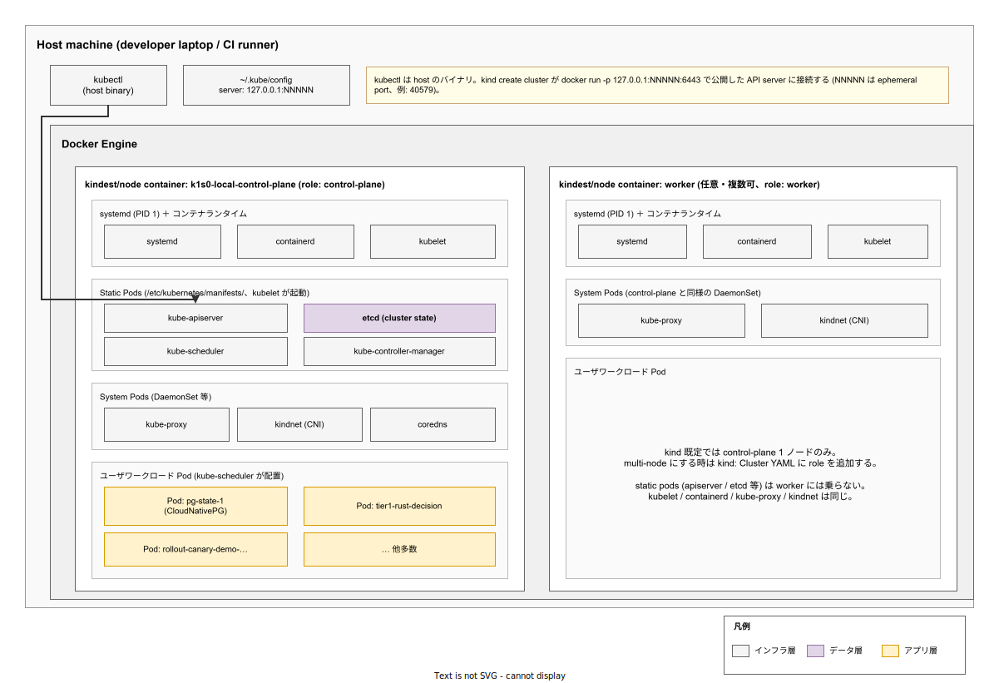

# kind: クラスタアーキテクチャ

- 対象読者: Kubernetes の基本概念（Pod, Deployment, Service）と Docker の基本操作を理解している開発者
- 学習目標: kind が Docker コンテナをノードとして Kubernetes クラスタをどう構築するかを説明でき、ローカル環境で起動・内部観察ができるようになる
- 所要時間: 約 30 分
- 対象バージョン: kind v0.31, kindest/node v1.31
- 最終更新日: 2026-04-30

## 1. このドキュメントで学べること

- kind が「Kubernetes IN Docker」と呼ばれる理由を説明できる
- 1 つの node container（Docker コンテナ）の中に何が入っているか（systemd / containerd / kubelet / Static Pod / System Pod / User Pod）を区別できる
- ホスト → node container → Pod の入れ子構造を理解し、`kubectl` がどう接続するか説明できる
- multi-node 構成時に control-plane と worker でどのコンポーネントが異なるか述べられる

## 2. 前提知識

- Kubernetes の基本概念（Pod, Deployment, Service, kubectl）
  - 参照: [Kubernetes: 基本](./kubernetes_basics.md)
- Docker の基本操作（イメージ, コンテナ, `docker run`, `docker exec`）
  - 参照: [Docker: 基本](../tool/docker_basics.md)
- Linux systemd の概念（PID 1, unit, journal）

## 3. 概要

kind は Kubernetes SIG が開発しているローカル開発用 Kubernetes ディストリビューションで、名前は「**K**ubernetes **IN** **D**ocker」の頭字語から来ている。最大の特徴は、クラスタの **1 ノード = 1 Docker コンテナ** として実装している点である。VM (minikube) や独立バイナリ (k3s) ではなく、既に普及している Docker コンテナを「ノードに見立てる」ことで、追加のハイパーバイザを必要とせず、ホスト OS は Docker さえ動けば良い。

主な用途は CI/CD のテスト環境と開発者ローカルの統合テストで、本番運用は想定されない。本リポジトリでも `tools/local-stack/` 配下のローカルスタックは全て kind の上で動いており、`k1s0-local-control-plane` というコンテナがその node container 実体である。

## 4. 用語の整理

| 用語 | 説明 |
|------|------|
| node container | kind が `docker run` で起動する Kubernetes ノード相当の Docker コンテナ。`kindest/node` イメージから生成される |
| kindest/node | kind 公式が公開している Docker イメージ。Ubuntu ベースで systemd, containerd, kubelet, kubeadm を内包する |
| Static Pod | kubelet が apiserver 経由ではなく `/etc/kubernetes/manifests/*.yaml` から直接起動する Pod。control-plane の core 機能 (apiserver / etcd / scheduler / controller-manager) はこの仕組みで動く |
| kindnet | kind 既定の CNI (Container Network Interface) プラグイン。シンプルな Pod 間ルーティングを実装する |
| kind bridge | node container が接続する Docker ブリッジネットワーク（既定名 `kind`）。同一クラスタの全ノードが同じブリッジに繋がる |

## 5. 仕組み・アーキテクチャ

kind クラスタは 3 層の入れ子構造で動く: **Host (Docker Engine)** > **node container (kindest/node)** > **Pod (containerd で起動)**。最外殻はホストで動く Docker Engine、その中で各ノードが Docker コンテナとして起動し、ノード内部の containerd がさらに Pod 用コンテナを起動する。



control-plane ノードに着目すると、PID 1 として `systemd` が動き、`containerd` と `kubelet` を systemd unit として管理する。kubelet は `/etc/kubernetes/manifests/` を監視し、ここに置かれた YAML から Static Pod として `kube-apiserver`、`etcd`、`kube-scheduler`、`kube-controller-manager` を直接起動する。これら 4 つは Kubernetes API 自身が立つ前から動かす必要があるため、API を介さず kubelet が単独で起動する仕組みが必要になる。

API server が立ち上がると以後はその API 経由で `kube-proxy`、`kindnet`、`coredns` が DaemonSet 等として配置され、最後にユーザの Deployment / StatefulSet 由来の Pod が起動する。`kubectl` はホスト側のバイナリで、`docker run -p 127.0.0.1:NNNNN:6443` で公開された ephemeral port を経由して node container 内の API server に接続する。

## 6. 環境構築

### 6.1 必要なもの

- Docker Engine 20.10 以上（Docker Desktop / colima / Linux daemon のいずれか）
- kind 本体 v0.31 以上
- kubectl v1.28 以上（kindest/node v1.31 の API に整合する系統）

### 6.2 セットアップ手順

```bash
# kind バイナリを取得する (Linux x86_64 の例)
curl -Lo ./kind https://kind.sigs.k8s.io/dl/v0.31.0/kind-linux-amd64
# 実行権限を付与し PATH の通る位置に移動する
chmod +x ./kind && sudo mv ./kind /usr/local/bin/kind
# control-plane 1 ノード構成のクラスタを既定設定で起動する
kind create cluster --name demo
```

### 6.3 動作確認

```bash
# ノード相当の Docker コンテナが起動していることを確認する
docker ps --filter label=io.x-k8s.kind.cluster=demo
# kubectl から API server へ到達できることを確認する
kubectl --context kind-demo get nodes
# control-plane コンテナの中に入って systemd / kubelet / containerd を観察する
docker exec -it demo-control-plane bash -lc "ps -ef --no-headers | head -20"
```

`docker ps` で `demo-control-plane` という名前のコンテナが見え、`ps` の出力に `/sbin/init` (systemd)、`containerd`、`kubelet`、`kube-apiserver` などが並ぶことを確認する。

## 7. 基本の使い方

### 7.1 multi-node 構成の宣言

```yaml
# kind-multi-node.yaml: control-plane 1 + worker 2 の構成定義
# kind: Cluster でクラスタ宣言を開始する
kind: Cluster
# kind の API バージョンを v1alpha4 で指定する
apiVersion: kind.x-k8s.io/v1alpha4
# nodes 配下に各ノードの role を列挙する
nodes:
  # 1 つ目のノードを control-plane として起動する
  - role: control-plane
  # 2 つ目のノードを worker として起動する
  - role: worker
  # 3 つ目のノードを worker として起動する
  - role: worker
```

```bash
# 上記の設定で multi-node クラスタを作る
kind create cluster --name multi --config ./kind-multi-node.yaml
```

### 解説

- `role: control-plane` のノードでは Static Pod として apiserver / etcd / scheduler / controller-manager が起動する
- `role: worker` のノードには Static Pod は配置されず、kubelet / containerd / kube-proxy / kindnet / coredns（DaemonSet）と user Pod のみが動く
- ノード間通信は Docker ネットワーク `kind` 上のブリッジで行われ、`docker network inspect kind` で参加コンテナを確認できる

### 7.2 ホスト port を Pod に到達させる

```yaml
# kind-portmap.yaml: NodePort/Ingress をホストに露出する設定
kind: Cluster
apiVersion: kind.x-k8s.io/v1alpha4
nodes:
  - role: control-plane
    # control-plane コンテナの 80 番をホスト側 8080 番にマップする
    extraPortMappings:
      - containerPort: 80
        hostPort: 8080
        protocol: TCP
```

`extraPortMappings` は内部的に `docker run -p` を追加する設定で、Ingress や NodePort Service を `localhost:8080` に届かせるために使う。クラスタ作成後に追加することはできず、`kind create cluster` 時に渡す必要がある。

## 8. ステップアップ

### 8.1 ローカルレジストリとの連携

CI で同じイメージを何度も pull すると遅いため、kind ではローカル Docker レジストリを `kind` ネットワークに参加させて node container から直接利用する構成が一般的である。本リポジトリでは `tools/local-stack/` 配下にこの方式の registry stack が組まれており、`registry-775dd48cb7-*` Pod がクラスタ内 registry として動作する。

### 8.2 kindest/node のバージョン固定

`--image kindest/node:v1.31.4` のように `--image` 引数で Kubernetes バージョンを指定できる。CI の再現性を担保したい場合は必ず固定する。kind バイナリのバージョンと kindest/node イメージのバージョンは独立で、互換ペアは kind の release notes に記載されている。

### 8.3 Postgres を kind 上に展開する

ローカル開発で頻出する Postgres を kind に立てる例を 2 つ示す。これらの Pod は Static Pod ではなく **User Pod** として `kube-scheduler` が配置するもので、5 章の図でいう Section D に入る。`kubectl port-forward` がホストから Pod まで到達できるのは API server の docker port mapping を経由するためで、追加の `extraPortMappings` は不要である。

#### 8.3.1 最小構成: Deployment + Service

開発のために短時間立てるだけなら StatefulSet すら不要。

```yaml
# pg-minimal.yaml: 開発用の最小 Postgres
# 1 レプリカの Deployment で Postgres を起動する
apiVersion: apps/v1
kind: Deployment
metadata:
  # リソース名は postgres-dev とする
  name: postgres-dev
spec:
  # 1 レプリカ固定 (HA は対象外)
  replicas: 1
  # ラベル selector で Pod を引き当てる
  selector:
    matchLabels:
      app: postgres-dev
  template:
    metadata:
      # Service と Deployment が共有するラベル
      labels:
        app: postgres-dev
    spec:
      containers:
        # 公式 Postgres 16 の Alpine 派生
        - name: postgres
          image: postgres:16-alpine
          # Postgres の標準ポートを公開する
          ports:
            - containerPort: 5432
          # 必要最小限の環境変数を設定する
          env:
            # 開発用のため平文。本番では Secret に格納する
            - name: POSTGRES_PASSWORD
              value: dev
---
# 同じ Pod を ClusterIP Service で expose する
apiVersion: v1
kind: Service
metadata:
  name: postgres-dev
spec:
  # ラベルで Pod を選択する
  selector:
    app: postgres-dev
  # 5432 -> 5432 のマッピング
  ports:
    - port: 5432
      targetPort: 5432
```

```bash
# クラスタに展開する
kubectl apply -f pg-minimal.yaml
# Pod が Ready になるまで最大 60 秒待つ
kubectl wait --for=condition=ready pod -l app=postgres-dev --timeout=60s
# host 側の 5432 を Service にフォワードする (バックグラウンド)
kubectl port-forward svc/postgres-dev 5432:5432 &
# host から psql で疎通確認する
PGPASSWORD=dev psql -h 127.0.0.1 -U postgres -c '\l'
```

注意: この構成は Volume を `emptyDir` 既定で使うため Pod 再起動で全データが消える。永続化したい時は次の CNPG を使う。

#### 8.3.2 本番志向の構成: CloudNativePG (CNPG) operator

CNPG は HA・バックアップ・メジャーバージョンアップを CRD で扱える Postgres operator。本リポジトリでも `tools/local-stack/manifests/60-cnpg/k1s0-cluster.yaml` で kind 上に展開しており、稼働中のクラスタは `k1s0-tier1/pg-state` に配置されている (Pod 名 `pg-state-1`)。

```yaml
# pg-cluster.yaml: CNPG Cluster CRD (抜粋)
# Cluster CRD でプライマリ数とストレージ要求を宣言する
apiVersion: postgresql.cnpg.io/v1
kind: Cluster
metadata:
  # クラスタ名 (Service 名の prefix にもなる: pg-state-rw, pg-state-ro)
  name: pg-state
  # 業務責務でネームスペース分離する
  namespace: k1s0-tier1
spec:
  # 1 インスタンス。HA する時は 3 にする
  instances: 1
  # 永続ボリューム要求。kind の標準 StorageClass で OK
  storage:
    size: 1Gi
  # 起動時に作る初期 DB とユーザを宣言する
  bootstrap:
    initdb:
      # 業務 DB 名
      database: app
      # アプリ用ユーザ
      owner: app
```

```bash
# operator を helm で展開する
helm repo add cnpg https://cloudnative-pg.github.io/charts
helm install cnpg cnpg/cloudnative-pg --namespace cnpg-system --create-namespace
# operator の Ready を待つ
kubectl wait --for=condition=available deploy/cnpg-cloudnative-pg -n cnpg-system --timeout=120s
# Cluster CRD を投入する
kubectl apply -f pg-cluster.yaml
# Cluster が healthy になるまで待つ (instance Pod の起動待ち)
kubectl wait --for=jsonpath='{.status.phase}'='Cluster in healthy state' \
  cluster.postgresql.cnpg.io/pg-state -n k1s0-tier1 --timeout=180s
# host から psql で接続する (CNPG が自動生成する -rw Service)
kubectl port-forward -n k1s0-tier1 svc/pg-state-rw 5432:5432 &
# CNPG が initdb で生成した app/app で接続する
psql -h 127.0.0.1 -U app -d app
```

CNPG は Pod 名を `<cluster>-<index>` で生成し、Read/Write 用 Service `<cluster>-rw` と Read Only 用 `<cluster>-ro` を自動で expose する。クラスタ削除時に PV を残すかは StorageClass の `reclaimPolicy` で決まる。

## 9. よくある落とし穴

- **「`kind delete cluster` で state が全部消える」**: kind は etcd を node container 内（`/var/lib/etcd`）に置くため、コンテナごと消えると永続データも全て失う。永続化したい場合は `extraMounts` でホスト側ボリュームを bind する。
- **「ホストから node container 内 Pod の IP に直接繋がらない」**: Pod の IP（例: 10.244.x.x）は kindnet が node container 内に張った CNI ネットワーク上のもので、ホストの routing table には載らない。ホストから接続する場合は `kubectl port-forward` か `extraPortMappings` を使う。
- **「ホスト再起動後にクラスタが自動復旧しない」**: kind は Docker daemon の auto-restart に明示的に依存しないため、ホスト再起動後は `docker start <name>-control-plane` で起動するか、kind でクラスタを再生成する必要がある。

## 10. ベストプラクティス

- **クラスタ名を必ず明示する**: `--name` を省略すると既定の `kind` になり、複数並走できない。プロジェクト名を含めて衝突を避ける（本リポジトリでは `k1s0-local`）。
- **CI では single-node を基本にする**: control-plane 1 ノードで足りるテストはそれで済ませる。multi-node はネットワーク試験など必要な時だけ使う。
- **`kind load docker-image` でイメージを pre-load する**: ホストでビルドしたイメージを node container に直接ロードできる。CI では registry pull より速い。
- **kind バイナリと kindest/node の両方を pin する**: kind だけ更新して node イメージを変えると Kubernetes バージョンも暗黙に変わるため、両方を CI で固定する。

## 11. 演習問題（任意）

1. `kind create cluster --name demo` で起動したクラスタの control-plane コンテナに `docker exec` で入り、`ps -ef` から **Static Pod として起動する 4 つのプロセス** を全て特定せよ。
2. `kind delete cluster --name demo` を実行した直後に `docker ps -a` を見て何が残っているかを確認し、kind の永続性に関する性質を一文で述べよ。
3. control-plane に置かれた Pod（例: `kube-proxy`）と worker に置かれた Pod を比較し、配置されるコンポーネントの相違点を 2 つ挙げよ。

## 12. さらに学ぶには

- 公式ドキュメント: https://kind.sigs.k8s.io/
- 設計文書: https://kind.sigs.k8s.io/docs/design/initial/
- 関連 Knowledge: [Kubernetes: 基本](./kubernetes_basics.md) / [k3s: 基本](./k3s_basics.md) / [Docker: 基本](../tool/docker_basics.md)
- 本リポジトリの利用例: `tools/local-stack/`（ローカルスタック起動スクリプト・マニフェスト）

## 13. 参考資料

- kind 公式 Quick Start (v0.31): https://kind.sigs.k8s.io/docs/user/quick-start/
- kind 設計ドキュメント "Initial Design": https://kind.sigs.k8s.io/docs/design/initial/
- kindest/node イメージ: https://hub.docker.com/r/kindest/node
- Kubernetes Static Pod 仕様: https://kubernetes.io/docs/tasks/configure-pod-container/static-pod/
