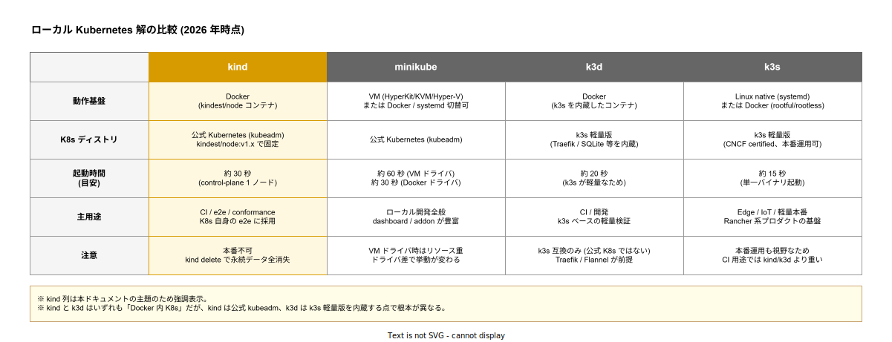

# kind: 基本

- 対象読者: ローカルで Kubernetes を動かしたい開発者。Kubernetes と Docker の概念は何となく知っているレベル
- 学習目標: kind が「何で・なぜ・いつ使うか」を言語化でき、minikube / k3d / k3s との使い分けを判断できる。1 コマンドでクラスタを起動・破棄できる
- 所要時間: 約 20 分
- 対象バージョン: kind v0.31, kindest/node v1.31
- 最終更新日: 2026-04-30

## 1. このドキュメントで学べること

- kind が解決する課題と「なぜ Docker コンテナをノードにするのか」の理由を説明できる
- kind と minikube / k3d / k3s のどれを選ぶべきかを判断できる
- 1 コマンドでクラスタを立ち上げ、kubectl で操作し、削除できる
- Kubernetes バージョンを CI で固定する方法を理解する

## 2. 前提知識

- Kubernetes の基本概念（Pod, Service, Deployment, kubectl）
  - 参照: [Kubernetes: 基本](./kubernetes_basics.md)
- Docker の基本操作（`docker run`, `docker ps`, `docker exec`）
  - 参照: [Docker: 基本](../tool/docker_basics.md)
- yaml の読み書き

## 3. 概要

kind は **K**ubernetes **IN** **D**ocker の頭字語で、Kubernetes SIG（公式 Special Interest Group）が開発するローカル開発・CI 用 Kubernetes ディストリビューションである。最大の特徴は「Kubernetes ノードをそのまま Docker コンテナとして起動する」こと。VM や独立バイナリは使わない。

CNCF Conformance を取得しているため標準 Kubernetes API と完全互換で、Manifest や Helm Chart はそのまま動く。本番運用には向かないが、Kubernetes 自身の e2e テストが kind 上で走るほど CI 用途では信頼されている。

「kind cluster がどう内部で動くか」（Static Pod の起動順、port mapping の仕組み、CNI など）は別ドキュメントに切り出している:

- 内部アーキテクチャ詳細: [kind: クラスタアーキテクチャ](./kind_architecture.md)

## 4. 用語の整理

| 用語 | 説明 |
|------|------|
| kind バイナリ | クラスタ作成・削除を行う Go 製 CLI。`kind create cluster` などを提供する |
| kindest/node | kind が起動する Docker イメージ。Ubuntu + systemd + kubeadm + kubelet を内包 |
| kind cluster | 同一 `--name` を共有する 1〜N 個の node container 群。1 ノード = 1 Docker コンテナ |
| kind context | kubectl の context。`kind-<cluster-name>` 形式で `kind create cluster` 時に自動生成・設定される |
| extraPortMappings | kind: Cluster 設定で Pod や Service をホストに露出するための docker port 公開設定 |

## 5. 仕組み・アーキテクチャ

kind の位置づけは「Docker daemon さえあれば動く Kubernetes」と一言で言える。同様の用途の選択肢である minikube / k3d / k3s と並べると、**動作基盤・K8s ディストリビューション・主用途**の 3 軸で住み分けが見える。



各ツールの本質的な違いを散文で要約すると:

- **kind**: Kubernetes SIG 公式。Docker コンテナを Kubernetes ノードに見立てる。kubeadm で組まれた「公式そのままの K8s」が動くため、CI でプロダクションと同じ挙動を試したい時に最適。
- **minikube**: Kubernetes 公式の老舗。VM ドライバ・Docker ドライバ・systemd ドライバを切り替えられる柔軟さが売り。dashboard や addon が豊富で「触って学ぶ」用途に向く。
- **k3d**: k3s を Docker でラップしたもの。kind に似ているが裏で k3s が動くため、Traefik/Flannel/SQLite といった k3s 特有の前提が入る。
- **k3s**: k3d が依存する軽量 Kubernetes ディストリビューション。Edge/IoT/軽量本番用途で本番運用にも採用される。

なお、本リポジトリのローカルスタック（`tools/local-stack/`）はすべて kind 上で動作している。`k1s0-local-control-plane` がその node container 実体である。

## 6. 環境構築

### 6.1 必要なもの

- Docker Engine 20.10 以上（Docker Desktop / colima / Linux daemon のいずれか）
- kind 本体 v0.31 以上
- kubectl v1.28 以上（kindest/node v1.31 の API に整合する系統）

### 6.2 セットアップ手順

```bash
# kind バイナリを取得する (Linux x86_64 の例)
curl -Lo ./kind https://kind.sigs.k8s.io/dl/v0.31.0/kind-linux-amd64
# 実行権限を付与し PATH の通る位置へ移動する
chmod +x ./kind && sudo mv ./kind /usr/local/bin/kind
# バージョンを確認する
kind version
```

macOS は `brew install kind`、Windows は `choco install kind` または `scoop install kind` でも導入できる。

### 6.3 動作確認

```bash
# 既定設定 (control-plane 1 ノード) でクラスタを起動する
kind create cluster --name demo
# kubectl から API server に到達できることを確認する
kubectl --context kind-demo get nodes
# 動作確認後にクラスタを削除する
kind delete cluster --name demo
```

`kind create cluster` で `kindest/node` イメージを pull し、`docker run` でコンテナを起動 → kubeadm で初期化 → CNI 配置 → Ready という一連を 30 秒前後で実行する。

## 7. 基本の使い方

### 7.1 クラスタ操作の基本コマンド

```bash
# 既定の 1 ノードクラスタを作る (--name 省略時は kind になる)
kind create cluster --name demo
# 既存クラスタを一覧する
kind get clusters
# kubectl の context を切り替える
kubectl config use-context kind-demo
# クラスタを削除する (Docker コンテナごと消える)
kind delete cluster --name demo
```

### 7.2 ホストでビルドしたイメージを使う

```bash
# host で Docker イメージをビルドする
docker build -t myapp:dev .
# kind の node container にイメージをロードする (registry 不要)
kind load docker-image myapp:dev --name demo
# Deployment で利用する (image: myapp:dev、imagePullPolicy: IfNotPresent)
kubectl apply -f my-deployment.yaml
```

`kind load docker-image` は registry を介さず node container 内 containerd に直接イメージを注入する。CI で registry pull を避けて高速化する常套手段である。

### 解説

- `kind create cluster` は `kind-<name>` という kubectl context を自動で作り、現在の context にも設定する。複数クラスタを並走する時は `--name` を必ず指定する。
- `kind delete cluster` は Docker コンテナ・PV (`hostpath-provisioner`) も含めて全て削除する。永続データを残したい場合は `extraMounts` で host 側ボリュームを bind する必要がある。

## 8. ステップアップ

### 8.1 設定ファイルでクラスタを宣言する

multi-node 構成や port 公開を含めた構成は yaml で宣言する。

```yaml
# kind-config.yaml: 構成宣言の最小例
# クラスタ宣言を開始する
kind: Cluster
# kind の API バージョンを v1alpha4 で指定する
apiVersion: kind.x-k8s.io/v1alpha4
# 各ノードを役割と設定で列挙する
nodes:
  # 1 つ目のノードは control-plane
  - role: control-plane
    # ホスト 8080 を control-plane の 80 にマップする (Ingress 用)
    extraPortMappings:
      - containerPort: 80
        hostPort: 8080
        protocol: TCP
  # 2 つ目のノードは worker
  - role: worker
```

```bash
# 上記設定でクラスタを起動する
kind create cluster --name demo --config ./kind-config.yaml
```

### 8.2 Kubernetes バージョンの固定

CI の再現性を担保するには `--image` で kindest/node のバージョンを明示する。

```bash
# Kubernetes バージョンを v1.31.4 に固定する
kind create cluster --name demo --image kindest/node:v1.31.4
```

kind バイナリのバージョンと kindest/node イメージのバージョンは独立で、互換ペアは [kind release notes](https://github.com/kubernetes-sigs/kind/releases) に記載されている。

### 8.3 GitHub Actions での利用

```yaml
# .github/workflows/e2e.yaml: kind を使った CI の最小例
# ジョブ定義を始める
jobs:
  e2e:
    # ubuntu-latest は Docker daemon を含む
    runs-on: ubuntu-latest
    steps:
      # ソースを取得する
      - uses: actions/checkout@v4
      # kind を導入してクラスタを起動する公式アクション
      - uses: helm/kind-action@v1
        with:
          # 互換性のため明示する
          version: v0.31.0
          # kindest/node のバージョンを固定する
          node_image: kindest/node:v1.31.4
      # マニフェストを適用してテストを走らせる
      - run: kubectl apply -f deploy/
      - run: ./scripts/run-e2e.sh
```

## 9. よくある落とし穴

- **「kind と k3d を混同する」**: 名前と挙動が似ているが kind は公式 Kubernetes（kubeadm）を、k3d は k3s（軽量派生）を内蔵する。本番との挙動一致を求めるなら kind、より軽量さが欲しければ k3d。
- **「`docker stop` で control-plane を止めると復活しない」**: kind は Docker daemon の auto-restart を要求しないため、ホスト再起動後は `docker start <name>-control-plane` を明示するか、kind でクラスタを再生成する。
- **「kind delete で永続データが全部消える」**: etcd も PV も node container 内に置かれる。永続化したい時は `extraMounts` でホスト側ボリュームを bind する。

## 10. ベストプラクティス

- **クラスタ名を必ず明示する**: `--name` を省略すると既定の `kind` になり、複数並走できない。プロジェクト名を含めて衝突を避ける。
- **CI では single-node を基本にする**: control-plane 1 ノードで足りるテストはそれで済ませる。multi-node はネットワーク試験など必要な時だけ使う。
- **kind バイナリと kindest/node の両方を pin する**: kind だけ更新すると暗黙に Kubernetes バージョンも変わる。CI では両方を固定する。
- **ローカル開発では `kind load docker-image` を使う**: registry を立てる手間を省け、image pull のネットワーク不安定性も回避できる。

## 11. 演習問題（任意）

1. `kind create cluster --name a` と `kind create cluster --name b` を続けて実行し、`docker ps` と `kind get clusters` で 2 つのクラスタが独立して並存していることを確認せよ。
2. クラスタ作成直後に `kubectl config get-contexts` を実行し、kind が自動生成する context 名のパターンを述べよ。
3. minikube・k3d・kind のうち「公式 Kubernetes (kubeadm) を内蔵するもの」を選び、その理由を 1 文で述べよ（5 章の比較表を参照）。

## 12. さらに学ぶには

- 公式ドキュメント: https://kind.sigs.k8s.io/
- 関連 Knowledge: [kind: クラスタアーキテクチャ](./kind_architecture.md) / [Kubernetes: 基本](./kubernetes_basics.md) / [k3s: 基本](./k3s_basics.md)
- GitHub Actions 用公式アクション: https://github.com/helm/kind-action

## 13. 参考資料

- kind 公式 Quick Start (v0.31): https://kind.sigs.k8s.io/docs/user/quick-start/
- kind 設計ドキュメント: https://kind.sigs.k8s.io/docs/design/initial/
- kindest/node イメージ: https://hub.docker.com/r/kindest/node
- kind release notes: https://github.com/kubernetes-sigs/kind/releases
