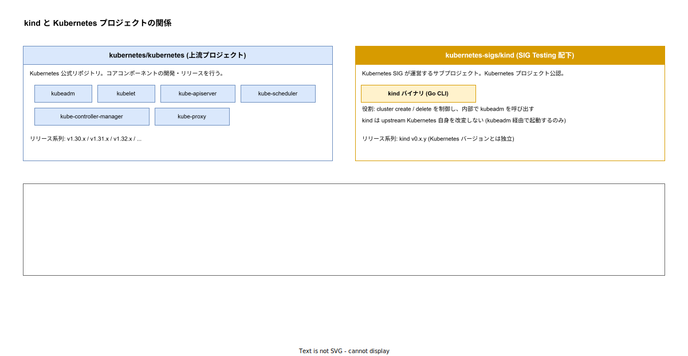

# kind: Kubernetes プロジェクトとの関係

- 対象読者: kind の基本操作を一度は試したことがある開発者で、なぜ kind が「準公式」扱いなのかを言語化したい人
- 学習目標: kind が Kubernetes 公式エコシステムにどう組み込まれているかを説明でき、kindest/node イメージと upstream Kubernetes リリースの対応を理解する
- 所要時間: 約 20 分
- 対象バージョン: kind v0.31, kindest/node v1.28〜v1.32
- 最終更新日: 2026-04-30

## 1. このドキュメントで学べること

- kind が Kubernetes プロジェクトのどの組織配下にあるかを説明できる
- kindest/node イメージのタグと Kubernetes バージョンの対応関係を把握する
- CNCF Conformance の意味と、kind がそれをパスする意義を理解する
- なぜ kind は「ローカル solution の中で本番一致度が高い」と言われるかを根拠を持って説明できる

## 2. 前提知識

- kind の基本操作: [kind: 基本](./kind_basics.md)
- kind の内部構造: [kind: クラスタアーキテクチャ](./kind_architecture.md)
- Kubernetes リリース体系（semver, minor release cadence）
- CNCF / SIG の組織構造

## 3. 概要

kind は Kubernetes プロジェクトの「内側」で開発されている。具体的には:

- ホストする GitHub Org は **`kubernetes-sigs`**（Kubernetes 公式の SIG sub-project が集まる場所）
- 直接の所属 SIG は **SIG Testing**（テスト基盤を担当する公式 SIG）
- Kubernetes 自身の e2e テストが kind の上で走るため、Kubernetes プロジェクト側の CI が kind を「ドッグフード」している

このため kind は他のローカル Kubernetes solution（minikube / k3d / k3s / microk8s）と比べて「Kubernetes プロジェクトと最も近い」位置にある。本番 Kubernetes との挙動一致度が高い理由はここにある。

## 4. 用語の整理

| 用語 | 説明 |
|------|------|
| kubernetes-sigs | Kubernetes 公式 GitHub Org の 1 つ。SIG が運営する sub-project が集まる |
| SIG Testing | テスト関連 SIG。kind を所有する。kubetest2 や test-infra も同 SIG 配下 |
| kubeadm | upstream Kubernetes 標準の cluster bootstrap ツール。kind は内部で kubeadm を呼ぶ |
| kindest/node | kind が `docker run` で起動する Docker イメージ。タグが Kubernetes バージョンと 1:1 対応 |
| CNCF Conformance | CNCF が定める Kubernetes 互換性テストプログラム |
| sonobuoy | CNCF Conformance テストランナー。kind 上でも実行できる |

## 5. 仕組み・アーキテクチャ

kind と Kubernetes プロジェクトの関係は 3 層で整理できる: **upstream プロジェクト**（kubernetes/kubernetes）→ **kindest/node イメージ** → **ダウンストリームの利用先**（CNCF Conformance / 公式 e2e）。



要点を散文で整理する:

- **kindest/node は upstream を改変せず内包する**: `kindest/node:v1.31.4` は upstream の v1.31.4 リリースの kubeadm / kubelet / kube-apiserver / ... をそのままパッケージしたもので、kind が独自パッチを当てているわけではない。
- **kind バイナリ自身は kubeadm のラッパーである**: `kind create cluster` は内部で kubeadm init/join を呼ぶ。Static Pod の配置・kubeconfig 生成・CNI セットアップは全て upstream の挙動に従う。
- **CNCF Conformance を pass している**: Kubernetes API の互換性は CNCF が公式に認定する仕組みがあり、kind はこれを通っている。kind 上でアプリが動けば、API 互換性の範囲では本番 Kubernetes でも動く。
- **Kubernetes 自身の e2e テストで kind が使われる**: `kubernetes/kubernetes` の PR ごとの CI が kind 上で走る。Kubernetes プロジェクト自身が「kind = 本番互換」と扱っている証左である。

## 6. 環境構築

本ドキュメントでは「対応関係を確認するための観察」だけ行う。kind 自体のセットアップは [kind_basics.md](./kind_basics.md) §6 を参照する。

```bash
# kind バイナリ (cluster 管理ツール) のバージョンを表示する
kind version
# kindest/node 経由で起動した Kubernetes 自身のバージョンを表示する
kubectl version --short
```

`kind version` の出力（例: `v0.31.0 go1.22.x`）と、`kubectl version` で見える Server Version（例: `v1.31.4`）が **別軸** であることを目で確認するのが第一歩。

## 7. 基本の使い方

### 7.1 Kubernetes バージョンを明示的に固定する

```bash
# kindest/node のタグで Kubernetes バージョンを v1.31.4 に固定する
kind create cluster --name pinned --image kindest/node:v1.31.4
# 起動した K8s が指定通りか確認する
kubectl --context kind-pinned version --short
```

`--image` を省略すると、その kind バイナリのリリース時点で「推奨」とされる kindest/node が使われる。CI では再現性のため必ず指定する。

#### 解説

kind v0.31.0 が公式に推奨する kindest/node は release notes に記載されている。kind バイナリと kindest/node の互換ペアは「メジャー K8s バージョン ±1〜2 minor」が一般的だが、release notes の互換表が一次情報である。

### 7.2 kindest/node の image tag を一覧する

```bash
# Docker Hub の kindest/node リポジトリから image tag を取得する
curl -sL "https://registry.hub.docker.com/v2/repositories/kindest/node/tags?page_size=20" \
  | jq -r '.results[].name'
```

得られるタグ（`v1.32.x`, `v1.31.x`, ...）は upstream Kubernetes のリリース番号と 1:1 対応する。これを目で見ると 5 章の図の「内包」関係が腹落ちしやすい。

## 8. ステップアップ

### 8.1 kind 上で CNCF Conformance を実行する

```bash
# sonobuoy を導入する (CNCF 公式の Conformance ランナー)
go install github.com/vmware-tanzu/sonobuoy@latest
# kind クラスタに対して certified-conformance モードでテストを実行する
sonobuoy run --mode certified-conformance --kubeconfig $(kind get kubeconfig --name demo)
# 結果を取得する (1〜2 時間かかる)
sonobuoy retrieve
```

完走して PASS が返れば、kind の上に立てた Kubernetes は upstream と API 互換であることが CNCF の基準で確認できる。

### 8.2 Kubernetes 公式 e2e で kind が使われている事実を確認する

`kubernetes/kubernetes` の PR が CI で走らせる prow ジョブの定義（`kubernetes/test-infra` リポジトリの `config/jobs/`）を覗くと、`pull-kubernetes-e2e-kind` のように kind を使う e2e ジョブが多数存在する。これは Kubernetes プロジェクト自身が kind を信頼している事実そのものである。

### 8.3 kindest/node を自前でビルドする（高度）

upstream の Kubernetes ソースをチェックアウトして、自分が編集した K8s を含む kindest/node を作る方法。

```bash
# upstream Kubernetes をクローンする
git clone https://github.com/kubernetes/kubernetes.git
cd kubernetes
# kind が提供する node-image build コマンドでカスタム image を作る
kind build node-image --type bazel
# 生成された custom image でクラスタを起動する
kind create cluster --image kindest/node:latest
```

これは Kubernetes 自身に PR を出す貢献者向けの機能で、通常の利用では不要。

## 9. よくある落とし穴

- **「kind バージョンと kindest/node バージョンを混同する」**: 前者は kind バイナリ（cluster 管理）のリリース、後者は Kubernetes 自身のリリース。両者は独立してバージョニングされる。
- **「古い kind で最新の Kubernetes を起動しようとする」**: kind バイナリは kindest/node の起動手順を制御するため、新しい kindest/node が要求する起動手順（例: 新しい kubeadm 引数）に古い kind は対応していないことがある。release notes の互換表を必ず確認する。
- **「CNCF Conformance pass = ベンダ実装も同等」と誤解する**: Conformance は API 互換性の保証であり、運用機能（HA、スケジューリングポリシー、アドオン）までは保証されない。

## 10. ベストプラクティス

- **kind バイナリと kindest/node の両方を CI で pin する**: どちらか片方だけ更新すると、暗黙にもう片方の挙動が変わる。両方を明示する。
- **kindest/node のタグはパッチバージョンまで指定する**: `kindest/node:v1.31` ではなく `kindest/node:v1.31.4` まで指定すると CI が決定論的になる。
- **新しい K8s バージョンを試す時は kind の release notes から互換表を確認する**: 推奨イメージは release notes に明記されている。release notes より先に試すと kind 側の対応待ちで詰まることがある。

## 11. 演習問題（任意）

1. `kind version` と `kubectl version --short` を実行し、それぞれが返す 2 つのバージョン番号が「何のバージョン」かを言語化せよ。
2. Docker Hub の kindest/node リポジトリから「現時点で最新の v1.31 系タグ」を 1 つ取得し、それが upstream Kubernetes の release tag と一致することを確認せよ。
3. CNCF Conformance を pass しているローカル Kubernetes solution を kind 以外で 2 つ列挙せよ。

## 12. さらに学ぶには

- 関連 Knowledge: [kind: 基本](./kind_basics.md) / [kind: クラスタアーキテクチャ](./kind_architecture.md) / [Kubernetes: 基本](./kubernetes_basics.md)
- SIG Testing: https://github.com/kubernetes/community/tree/master/sig-testing
- CNCF Conformance program: https://www.cncf.io/training/certification/software-conformance/

## 13. 参考資料

- kind プロジェクト: https://github.com/kubernetes-sigs/kind
- kindest/node Docker Hub: https://hub.docker.com/r/kindest/node
- Kubernetes 公式 e2e テストの prow ジョブ定義: https://github.com/kubernetes/test-infra/tree/master/config/jobs
- CNCF Conformance certified products: https://www.cncf.io/certification/software-conformance/
