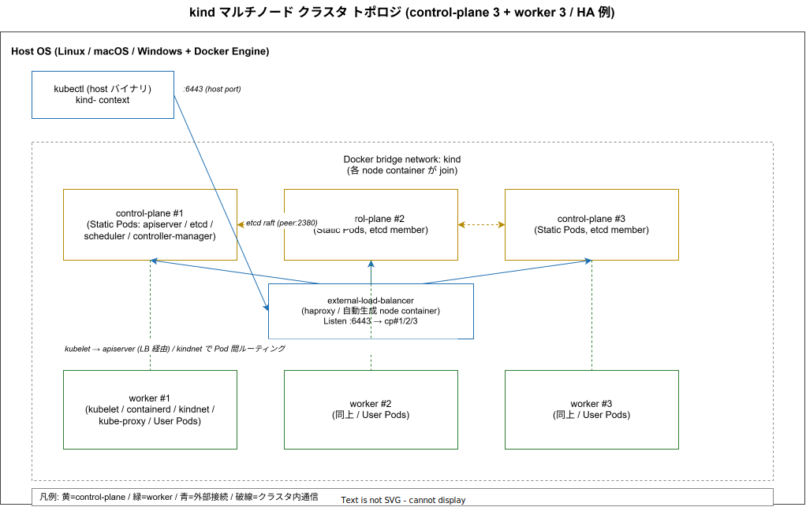
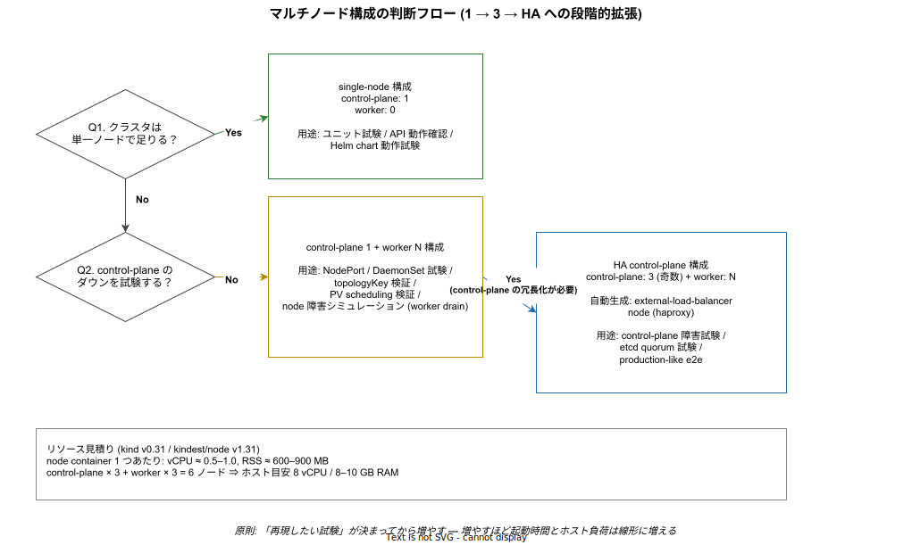

# kind: マルチノードクラスタ

- 対象読者: kind の single-node クラスタは触ったことがあり、ローカルで複数ノードの試験をしたい開発者
- 学習目標: マルチノード kind の構成定義を書ける。HA control-plane の意味と限界を説明できる。worker / control-plane への配置を taint と label で制御できる
- 所要時間: 約 35 分
- 対象バージョン: kind v0.31, kindest/node v1.31
- 最終更新日: 2026-04-30

## 1. このドキュメントで学べること

- マルチノード構成を「いつ・なぜ」採用するかを判断できる
- `kind: Cluster` 設定で control-plane と worker を任意の数で宣言できる
- HA control-plane（control-plane × 3 以上）構成で kind が自動生成する `external-load-balancer` ノードの役割を説明できる
- ノードラベル / taint / `kubeadmConfigPatches` を使って Pod 配置を制御できる
- マルチノード起因のリソース消費・etcd 負荷・worker join 失敗の落とし穴を避けられる

## 2. 前提知識

- kind の基本（クラスタ作成・削除・kubectl context）: [kind: 基本](./kind_basics.md)
- kind の内部構造（Static Pod / containerd / kindnet / Docker bridge）: [kind: クラスタアーキテクチャ](./kind_architecture.md)
- Kubernetes の Pod / Deployment / DaemonSet / nodeSelector / taint・toleration: [Kubernetes: 基本](./kubernetes_basics.md)
- Docker bridge ネットワークと port mapping の基本: [Docker: 基本](../tool/docker_basics.md)

## 3. 概要

kind は既定では control-plane 1 ノードのみで起動するが、`kind: Cluster` 設定の `nodes` 配列に複数の `role` を列挙することで、任意のノード数を持つクラスタを宣言できる。1 ノード = 1 Docker コンテナという制約はマルチノードでも変わらず、ノードを増やせばホスト側の Docker コンテナがその数だけ増える。

マルチノードを使う理由は実運用と同じ「単一ノード障害の試験」「topology / DaemonSet / NodePort の挙動確認」「複数 worker への Pod 分散検証」だが、kind はあくまでローカル / CI 用途の Kubernetes であり、本番ノードを忠実に再現するものではない（同一ホスト上の Docker ネットワークなので NIC 障害や物理隔離は試験できない）。

「何ノード必要か」は試験の目的次第で大きく変わるため、闇雲に増やすとホスト負荷だけが線形に上がる。判断基準は 5 章の図に示す。

## 4. 用語の整理

| 用語 | 説明 |
|------|------|
| マルチノード kind | `nodes` 配列に 2 つ以上の要素を持つ kind クラスタ。1 ノード = 1 Docker コンテナで、すべて同一ホストの `kind` ブリッジ上に並ぶ |
| HA control-plane | control-plane を 3 以上（奇数）並べ、API server とその Static Pod 群を冗長化する構成。kind は etcd を各 control-plane に置く stacked etcd で構成する |
| external-load-balancer node | HA 構成時に kind が自動生成する追加 node container。haproxy が動き、kubectl からの `:6443` を各 control-plane に分配する |
| stacked etcd | 各 control-plane ノードに etcd member を同居させる構成。kind は kubeadm 既定のこの形式を採用する |
| `kubeadmConfigPatches` | `kind: Cluster` の各ノード or グローバルに記述できる kubeadm 設定への JSON Patch。ノード単位の細かい初期化制御に使う |

## 5. 仕組み・アーキテクチャ

マルチノード kind は **control-plane の数** と **worker の数** を独立に決められるが、control-plane が 1 つの場合と 2 つ以上の場合で内部構造が大きく変わる。control-plane を 3 並べると kind は自動で `external-load-balancer` という追加コンテナ（haproxy）を立ち上げ、ホスト側 kubectl からの `:6443` 接続を各 control-plane に振り分ける。



control-plane 同士は `kind` ブリッジ上で etcd の peer 通信（:2380）と client 通信（:2379）を直接やり取りする。kindnet は CNI として全ノード共通で配置され、kube-proxy は DaemonSet として全ノードに展開される。一方、Static Pod として動く apiserver / etcd / scheduler / controller-manager は control-plane ノードのみに置かれ、worker には配置されない（この内部詳細は [kind: クラスタアーキテクチャ](./kind_architecture.md) §5 を参照）。

ノード数の決め方は単純な比較表より「何を試験したいか」起点で考えるほうが破綻しにくい。



判断の要点を散文で要約すると次の通り:

- 単に Pod / Service / Helm chart の動作確認なら single-node で十分。control-plane を増やすとホスト RAM が一気に膨らむため、目的が無いまま 3 にしない。
- worker を増やすのは DaemonSet が全ノードに行き渡るかを確認したい時、`topologySpreadConstraints` を試したい時、PV の affinity を確認したい時など、ノード数 ≥ 2 が前提のロジックを試す時。
- HA 構成（control-plane × 3）は etcd quorum・apiserver 多重化・rolling control-plane 障害を試したい時に限って意味がある。kind は etcd を stacked で組むため、control-plane を偶数にすると quorum を取れず壊れやすい（必ず奇数にする）。

## 6. 環境構築

### 6.1 必要なもの

- Docker Engine 20.10 以上（Docker Desktop / colima / Linux daemon）
- kind v0.31 以上、kubectl v1.28 以上
- ホスト性能の目安: control-plane × 3 + worker × 3 構成で 8 vCPU / RAM 8〜10 GB（node container 1 つあたり vCPU 0.5〜1.0、RSS 600〜900 MB が経験則）

### 6.2 セットアップ手順

```bash
# kind / kubectl は既に導入済みである前提
# クラスタ宣言の YAML を本書 7 章 / 8 章で作成し、--config で渡す
```

`kind` バイナリ自体の導入手順は [kind: 基本 §6.2](./kind_basics.md) を参照。本書はクラスタ宣言の書き方に絞る。

### 6.3 動作確認

```bash
# クラスタ起動後にノード一覧で expected な台数が並ぶか確認する
kubectl --context kind-multi get nodes -o wide
# Docker 側からも node container を一覧する
docker ps --filter label=io.x-k8s.kind.cluster=multi --format '{{.Names}}\t{{.Status}}'
```

`kubectl get nodes` の `ROLES` 列は kind が自動で `control-plane` / `<none>` を設定する。`<none>` が worker 相当である。

## 7. 基本の使い方

### 7.1 control-plane 1 + worker 2（最小マルチノード）

```yaml
# kind-multi.yaml: 単一 control-plane + worker 2 の最小構成
# クラスタ宣言を開始する
kind: Cluster
# kind 設定の API バージョンを v1alpha4 で指定する
apiVersion: kind.x-k8s.io/v1alpha4
# nodes 配列で各ノードを役割付きで宣言する
nodes:
  # 1 つ目を control-plane として起動する (Static Pod 群が動く)
  - role: control-plane
  # 2 つ目を worker として起動する (User Pod の配置先)
  - role: worker
  # 3 つ目も worker として起動する
  - role: worker
```

```bash
# 上記設定で kind クラスタを作成する (起動には 30〜90 秒かかる)
kind create cluster --name multi --config ./kind-multi.yaml
# ノードが Ready になるまで 60 秒上限で待つ
kubectl --context kind-multi wait --for=condition=Ready node --all --timeout=60s
```

### 7.2 ノードラベル・taint で配置を制御する

`kubeadmConfigPatches` を使うと kubelet が API server に登録される時のラベル / taint を直接指定できる（後付け `kubectl label` / `kubectl taint` でも可だが、宣言的に起動時から付与できる）。

```yaml
# kind-labeled.yaml: worker をストレージ専用に隔離する例
kind: Cluster
apiVersion: kind.x-k8s.io/v1alpha4
nodes:
  # control-plane は通常通り 1 ノード
  - role: control-plane
  # ストレージ専用の worker (taint で他 Pod を弾く)
  - role: worker
    # ノード単位の kubeadm 初期化パッチ
    kubeadmConfigPatches:
      - |
        kind: JoinConfiguration
        nodeRegistration:
          # ノードラベルとして role=storage を付与する
          kubeletExtraArgs:
            node-labels: "role=storage"
          # 通常 Pod を弾く NoSchedule taint を付与する
          taints:
            - key: "dedicated"
              value: "storage"
              effect: "NoSchedule"
  # 一般用途の worker
  - role: worker
```

### 解説

- `kubeadmConfigPatches` は kind が kubeadm に渡す JSON 文字列で、`kind: JoinConfiguration` は worker の join 時に効く。control-plane に付ける場合は `kind: ClusterConfiguration` / `kind: InitConfiguration` を使い分ける。
- 宣言した taint を持つ worker に Pod を載せたい場合は、Pod 側に `tolerations` を書く必要がある。これを忘れると Pod が永久に Pending になる典型的な落とし穴である。
- ラベル `role=storage` は `nodeSelector` で対象 Pod を引き寄せる用途で使う。試験の目的（topology spread / affinity / DaemonSet 配置）に応じて命名する。

## 8. ステップアップ

### 8.1 HA control-plane（control-plane × 3）

```yaml
# kind-ha.yaml: control-plane 3 + worker 3 の HA 構成
kind: Cluster
apiVersion: kind.x-k8s.io/v1alpha4
nodes:
  # control-plane は奇数 (3 / 5) にすること。偶数は etcd quorum が壊れる
  - role: control-plane
  - role: control-plane
  - role: control-plane
  - role: worker
  - role: worker
  - role: worker
```

```bash
# HA クラスタを起動する (起動時間は 2〜4 分)
kind create cluster --name ha --config ./kind-ha.yaml
# 自動生成される external-load-balancer コンテナを確認する
docker ps --filter label=io.x-k8s.kind.cluster=ha --format '{{.Names}}'
# 1 ノードを停止して apiserver が他 control-plane で生き残るか試験する
docker stop ha-control-plane2
kubectl --context kind-ha get nodes
# 試験後に元に戻す
docker start ha-control-plane2
```

`ha-external-load-balancer` という追加コンテナが kind により自動生成され、haproxy がホスト側公開ポート（`:6443` ephemeral）から各 control-plane の apiserver に round-robin 分配する。kubectl context のサーバ URL はこの LB を指すように自動設定されるため、利用者側で意識する必要はない。

### 8.2 ホストポート公開を control-plane 側に集約する

multi-node でも `extraPortMappings` は **クラスタ作成時に書いたノードの Docker コンテナ** に紐付くため、Ingress や NodePort をホストに露出する場合は受口を 1 つに絞ると分かりやすい。

```yaml
# kind-ingress.yaml: control-plane に Ingress 受口を集約する
kind: Cluster
apiVersion: kind.x-k8s.io/v1alpha4
nodes:
  - role: control-plane
    # control-plane container の 80 / 443 をホスト 8080 / 8443 にマップする
    extraPortMappings:
      - containerPort: 80
        hostPort: 8080
        protocol: TCP
      - containerPort: 443
        hostPort: 8443
        protocol: TCP
    # control-plane に Ingress controller Pod を許容するラベルを付ける
    labels:
      ingress-ready: "true"
  - role: worker
  - role: worker
```

ingress-nginx の kind 用 helm value は `nodeSelector: ingress-ready=true` と既定 control-plane の `node-role.kubernetes.io/control-plane:NoSchedule` taint への toleration を併せ持つ。マルチノードでも受口が 1 つで済むのは、`ingress-ready=true` を付けたノードに controller Pod を固定するためである。

### 8.3 全ノードへのイメージ pre-load

`kind load docker-image` はマルチノードでも全ノードへ並列に注入する。CI で registry を立てない構成では必須テクニックである。

```bash
# host で開発イメージをビルドする
docker build -t myapp:dev .
# 全ノード (control-plane 含む) の containerd へイメージをロードする
kind load docker-image myapp:dev --name multi
# 特定ノードだけにロードしたい場合は --nodes で限定する (検証用)
kind load docker-image myapp:dev --name multi --nodes multi-worker,multi-worker2
```

## 9. よくある落とし穴

- **control-plane を偶数にする**: kind の stacked etcd は quorum を `floor(N/2)+1` で計算するため、control-plane 2 では 1 台落ちただけで quorum を失い書き込めなくなる。冗長化したいなら必ず 3 以上の奇数。
- **`role: worker` を書き忘れて Pod が control-plane に集まる**: worker を宣言しないと kubelet は control-plane にしか居ないため、`node-role.kubernetes.io/control-plane:NoSchedule` taint で User Pod が弾かれて Pending になる。worker を 1 つ以上立てるか toleration を Pod 側に書く必要がある。
- **`extraPortMappings` を後から増やせない**: マルチノードでも port mapping は `docker run` 時に固定される。ノードを追加・削除するには `kind delete cluster` してから再作成するしかない。
- **ホスト RAM 不足で worker が NotReady のまま固まる**: 6 ノード超で kindest/node のメモリ要求が膨らみ、Docker Desktop の RAM 上限に当たって containerd が OOM-kill される事故が多い。`kubectl describe node` で `MemoryPressure=True` が出ていないか先に確認する。
- **`kubeadmConfigPatches` の JSON が崩れて join が無限ループする**: YAML の `|` に続く文字列が kubeadm 設定として解釈されるため、インデントを 1 段間違えると kubelet が起動せずノードが NotReady のまま無限再試行する。`docker logs <node>` で kubeadm のエラーを直接読むのが最短の切り分け。

## 10. ベストプラクティス

- **試験の目的が無いノードは追加しない**: 「何を再現するか」が言えない増設は単にホスト負荷を増やすだけ。判断は 5 章の図を起点に行う。
- **HA 構成は CI には載せず、ローカルでの試験用に留める**: 起動時間が single-node の 3〜5 倍に伸び、CI のジョブ時間を圧迫する。CI は single-node か `control-plane:1 + worker:2` 程度を上限にする。
- **ノード命名（`--name`）にプロジェクト名を含める**: 同時並走時のコンテナ名衝突（`<name>-control-plane` 等）を防ぐ。本リポジトリは `k1s0-local` を使用している。
- **`kubeadmConfigPatches` を書いたら必ず `docker logs <node>` で起動を確認する**: パッチ起因の join 失敗は kubectl からは「NotReady」としか見えず原因特定が難しい。
- **イメージは `kind load docker-image` で全ノードに pre-load する**: registry pull のネットワーク不安定性とノード差を同時に避けられる。

## 11. 演習問題（任意）

1. control-plane × 2 で kind クラスタを作成し、片方の node container を `docker stop` した時に `kubectl get nodes` がどう振る舞うかを観察せよ。挙動を 5 章の説明と突き合わせ、なぜ「偶数 control-plane」が推奨されないかを 1 文で述べよ。
2. `kubeadmConfigPatches` で worker に `role=gpu` ラベルと `dedicated=gpu:NoSchedule` taint を付与し、toleration を持たない Deployment が Pending のままになることを確認せよ。Pod 側に toleration を加えると配置されることまで観察すること。
3. control-plane × 3 + worker × 3 構成で `external-load-balancer` ノード名を `docker ps` から特定し、`kubectl config view --context kind-ha` の `server:` 行と突き合わせて、kubectl がどの URL に接続しているかを確認せよ。

## 12. さらに学ぶには

- 公式 Quick Start（multi-node 設定例）: https://kind.sigs.k8s.io/docs/user/quick-start/#multinode-clusters
- HA 構成の公式解説: https://kind.sigs.k8s.io/docs/user/ha/
- 関連 Knowledge: [kind: 基本](./kind_basics.md) / [kind: クラスタアーキテクチャ](./kind_architecture.md) / [Kubernetes: 基本](./kubernetes_basics.md)
- 本リポジトリの利用例: `tools/local-stack/`（ローカルスタック起動スクリプト）

## 13. 参考資料

- kind 公式 Configuration リファレンス: https://kind.sigs.k8s.io/docs/user/configuration/
- kind HA control-plane の設計: https://kind.sigs.k8s.io/docs/user/ha/
- kubeadm `JoinConfiguration` / `ClusterConfiguration` 仕様: https://kubernetes.io/docs/reference/config-api/kubeadm-config.v1beta4/
- kind release notes（kindest/node 互換ペア）: https://github.com/kubernetes-sigs/kind/releases
