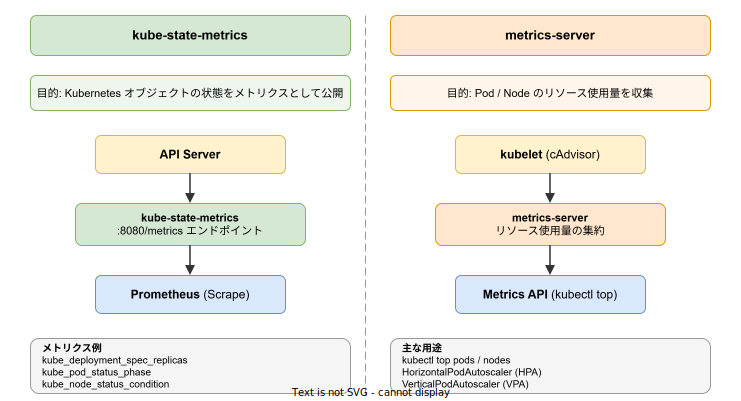

# kube-state-metrics: 基本

- 対象読者: Kubernetes の基本概念（Pod, Deployment 等）を理解している開発者・運用者
- 学習目標: kube-state-metrics の役割を理解し、Prometheus と連携した Kubernetes オブジェクト状態の監視を構築できるようになる
- 所要時間: 約 30 分
- 対象バージョン: kube-state-metrics v2.18.0
- 最終更新日: 2026-04-12

## 1. このドキュメントで学べること

- kube-state-metrics の役割と metrics-server との違いを説明できる
- kube-state-metrics を Kubernetes クラスタにデプロイできる
- 公開されるメトリクスの命名規則とデータモデルを理解できる
- Prometheus と連携してクラスタの状態を監視できる

## 2. 前提知識

- Kubernetes の基本概念（Pod, Deployment, Service, Namespace）
- kubectl の基本操作
- Prometheus のメトリクス形式（Gauge, Counter 等）の基礎知識
- 関連 Knowledge: [Kubernetes: 基本](./kubernetes_basics.md)

## 3. 概要

kube-state-metrics（以下 KSM）は、Kubernetes API Server を監視し、クラスタ内のオブジェクトの状態をメトリクスとして公開するサービスである。CNCF の SIG Instrumentation がスポンサーとなっている。

KSM が解決する課題は、Kubernetes オブジェクトの状態の可視化である。Kubernetes は API Server でクラスタの状態を管理しているが、API Server 自体はオブジェクト状態を Prometheus 形式で体系的に公開しない。KSM は API Server から Watch / List API を通じてオブジェクトの状態を取得し、Prometheus が収集可能な形式に変換して HTTP エンドポイント（:8080/metrics）で公開する。

重要な特徴として、KSM は Kubernetes API の生データを加工せずにそのまま公開する。kubectl が表示する「人間にとって分かりやすい」加工済みデータとは異なり、KSM のメトリクスは API オブジェクトの生の状態を反映する。

## 4. 用語の整理

| 用語 | 説明 |
|------|------|
| KSM | kube-state-metrics の略称 |
| metrics-server | Pod / Node のリソース使用量（CPU / メモリ）を収集するコンポーネント。KSM とは異なる |
| Watch / List | Kubernetes API Server のストリーミング機構。オブジェクトの変更をリアルタイムで取得する |
| Gauge | 増減する値を表すメトリクス型（例: 現在の Pod 数） |
| Info | ラベルのみで情報を表現するメトリクス型（値は常に 1） |
| StateSet | 列挙型の状態を表すメトリクス型（例: Pod のフェーズ） |
| シャーディング | KSM を複数インスタンスに分割して負荷を分散する手法 |

## 5. 仕組み・アーキテクチャ

KSM は Kubernetes クラスタ内に Deployment として配置される。API Server に対して Watch / List リクエストを発行し、オブジェクトの状態変化を継続的に監視する。取得したオブジェクト情報は Prometheus 形式のメトリクスに変換され、HTTP エンドポイントで公開される。


KSM は 2 つのポートを公開する。ポート 8080 は Kubernetes オブジェクトのメトリクスを、ポート 8081 は KSM 自身のテレメトリ（パフォーマンス情報）を提供する。Prometheus はこれらのエンドポイントをスクレイプし、Grafana 等で可視化する。

### kube-state-metrics と metrics-server の違い

KSM はオブジェクトの「状態」（Desired vs Actual、ラベル、フェーズ等）を公開する。一方、metrics-server は kubelet 経由で取得したリソースの「使用量」（CPU / メモリ）を提供する。両者は補完的な関係にあり、包括的な監視には両方が必要である。



## 6. 環境構築

### 6.1 必要なもの

- 稼働中の Kubernetes クラスタ（v1.26 以降推奨）
- kubectl（クラスタに接続済み）
- Prometheus（メトリクスの収集先）

### 6.2 セットアップ手順

```bash
# kube-state-metrics のリポジトリをクローンする
git clone https://github.com/kubernetes/kube-state-metrics.git

# 標準マニフェスト（RBAC / Deployment / Service）を一括適用する
kubectl apply -f kube-state-metrics/examples/standard/
```

### 6.3 動作確認

```bash
# Pod の起動状態を確認する
kubectl get pods -n kube-system -l app.kubernetes.io/name=kube-state-metrics

# メトリクスエンドポイントへのポートフォワードを設定する
kubectl port-forward -n kube-system svc/kube-state-metrics 8080:8080

# メトリクスが取得できることを確認する（別ターミナル）
curl -s http://localhost:8080/metrics | head -20
```

## 7. 基本の使い方

### メトリクスの命名規則

KSM のメトリクスは `kube_<resource>_<property>` の命名規則に従う。

| メトリクス名 | 型 | 説明 |
|------|------|------|
| `kube_pod_status_phase` | StateSet | Pod のフェーズ（Pending / Running / Succeeded / Failed） |
| `kube_deployment_spec_replicas` | Gauge | Deployment の desired レプリカ数 |
| `kube_deployment_status_replicas_available` | Gauge | Deployment の available レプリカ数 |
| `kube_node_status_condition` | StateSet | Node のコンディション（Ready / MemoryPressure 等） |
| `kube_statefulset_status_replicas` | Gauge | StatefulSet の現在のレプリカ数 |

### Prometheus でのクエリ例

```promql
# 全 Namespace の Running 状態の Pod 数を取得する
count(kube_pod_status_phase{phase="Running"})

# Deployment の desired と available レプリカ数の差分を検出する
kube_deployment_spec_replicas - kube_deployment_status_replicas_available > 0

# Ready 状態でない Node を検出する
kube_node_status_condition{condition="Ready",status="true"} == 0
```

### アラートルール例

```yaml
# Deployment のロールアウトが停滞していることを検知するアラートルール
# 15 分以上 observed generation が metadata generation に追いついていない場合に発火する
groups:
  - name: kube-state-metrics
    rules:
      # Deployment のロールアウト停滞を検知する
      - alert: DeploymentRolloutStuck
        # observed generation が metadata generation より小さい状態を検出する
        expr: kube_deployment_status_observed_generation < kube_deployment_metadata_generation
        # 15 分間継続した場合にアラートとする
        for: 15m
        labels:
          severity: critical
```

## 8. ステップアップ

### 8.1 Kubernetes ラベルの Prometheus ラベルへの公開

デフォルトでは Kubernetes ラベルは Prometheus メトリクスに含まれない。`--metric-labels-allowlist` フラグで指定したラベルを公開できる。

```yaml
# kube-state-metrics の Deployment 引数にラベル許可リストを追加する
args:
  # Pod の app と version ラベルをメトリクスに含める
  - '--metric-labels-allowlist=pods=[app,version]'
  # Deployment の app と environment ラベルをメトリクスに含める
  - '--metric-labels-allowlist=deployments=[app,environment]'
```

### 8.2 水平シャーディング

大規模クラスタでは、KSM を複数インスタンスに分割して負荷を分散できる。StatefulSet を使用した自動シャーディングでは、Pod 名から序数を自動検出する。

```yaml
# StatefulSet による自動シャーディング設定
apiVersion: apps/v1
kind: StatefulSet
spec:
  # シャード数を指定する（2 インスタンスに負荷分散）
  replicas: 2
  template:
    spec:
      containers:
        - name: kube-state-metrics
          args:
            # Pod 名から自動的にシャード番号を検出する
            - --pod=$(POD_NAME)
            # Pod の Namespace を指定する
            - --pod-namespace=$(POD_NAMESPACE)
```

### 8.3 Custom Resource State Metrics

KSM は任意の CRD（Custom Resource Definition）のメトリクスも公開できる。`--custom-resource-state-config` フラグで対象リソースとメトリクス定義を指定する。

## 9. よくある落とし穴

- **metrics-server との混同**: KSM は CPU / メモリの使用量を提供しない。リソース使用量の監視には metrics-server が必要である
- **高カーディナリティ**: `--metric-labels-allowlist` で全ラベル（`[*]`）を公開するとメトリクスのカーディナリティが爆発し、Prometheus のパフォーマンスが低下する
- **kubectl との値の差異**: KSM は API の生データを公開するため、kubectl の表示と異なる場合がある。kubectl が独自のヒューリスティクスを適用しているためである
- **RBAC 設定不足**: KSM は API Server から情報を取得するため、適切な ClusterRole と ServiceAccount が必要である。標準マニフェストに含まれる RBAC を適用すること

## 10. ベストプラクティス

- KSM と metrics-server の両方をデプロイし、状態メトリクスとリソース使用量を補完的に収集する
- Prometheus のスクレイプ設定ではポート 8080 と 8081 の両方を対象にする
- `--metric-labels-allowlist` は必要最小限のラベルに限定しカーディナリティを制御する
- 大規模クラスタ（Node 100 台以上）では StatefulSet による自動シャーディングを検討する
- kube-prometheus スタックを利用すると KSM を含む監視基盤を一括でデプロイできる

## 11. 演習問題

1. kube-state-metrics をクラスタにデプロイし、`/metrics` エンドポイントからメトリクスが取得できることを確認せよ
2. Prometheus で `kube_deployment_spec_replicas` と `kube_deployment_status_replicas_available` の差分を検出するアラートルールを作成せよ
3. kube-state-metrics と metrics-server の違いを 3 つ挙げ、それぞれの用途を説明せよ

## 12. さらに学ぶには

- 公式リポジトリ: https://github.com/kubernetes/kube-state-metrics
- メトリクス一覧: https://github.com/kubernetes/kube-state-metrics/tree/main/docs/metrics
- kube-prometheus スタック: https://github.com/prometheus-operator/kube-prometheus
- 関連 Knowledge: [Kubernetes: 基本](./kubernetes_basics.md)、[OTel Collector: 基本](./otel-collector_basics.md)

## 13. 参考資料

- kube-state-metrics README: https://github.com/kubernetes/kube-state-metrics/blob/main/README.md
- Custom Resource State Metrics: https://github.com/kubernetes/kube-state-metrics/blob/main/docs/metrics/extend/customresourcestate-metrics.md
- Metrics Best Practices: https://github.com/kubernetes/kube-state-metrics/blob/main/docs/design/metrics-best-practices.md
