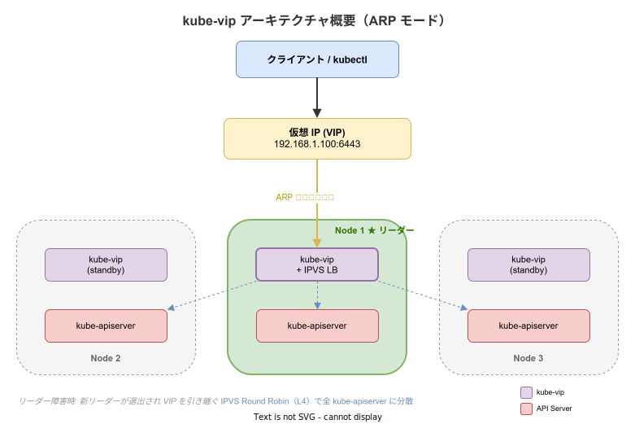
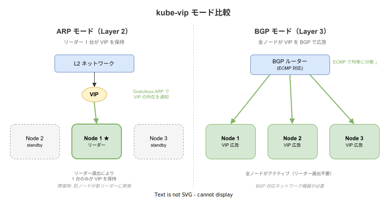

# kube-vip: 基本

- 対象読者: Kubernetes の基本概念（Pod, Service, Control Plane）を理解している開発者
- 学習目標: kube-vip の仕組みを理解し、Control Plane の HA 化と Service LoadBalancer の構成ができるようになる
- 所要時間: 約 30 分
- 対象バージョン: kube-vip v0.8
- 最終更新日: 2026-04-12

## 1. このドキュメントで学べること

- kube-vip が解決する課題と仮想 IP の役割を説明できる
- ARP モードと BGP モードの違いを理解できる
- Static Pod または DaemonSet で kube-vip をデプロイできる
- Service type LoadBalancer の IP アドレス管理を構成できる

## 2. 前提知識

- Kubernetes の基本概念（Pod, Service, Control Plane, kubelet）
  - 参照: [Kubernetes: 基本](./kubernetes_basics.md)
- k3s または kubeadm によるクラスタ構築の基礎知識
  - 参照: [k3s: 基本](./k3s_basics.md)
- ネットワークの基礎（IP アドレス、ARP、ロードバランサの概念）

## 3. 概要

kube-vip は、Kubernetes クラスタに仮想 IP（VIP）とロードバランシング機能を提供するオープンソースソフトウェアである。主に以下の 2 つの課題を解決する。

**1. Control Plane の高可用性（HA）**: Kubernetes の Control Plane を複数ノードで構成する場合、kubectl や Worker Node がアクセスする単一のエンドポイントが必要になる。kube-vip は仮想 IP を提供し、リーダーノードの障害時に自動的に別ノードへ VIP を移行する。

**2. Service type LoadBalancer の実現**: クラウド環境では LoadBalancer Service に自動で外部 IP が割り当てられるが、オンプレミスやベアメタル環境ではこの機能がない。kube-vip はオンプレミス環境でも LoadBalancer Service を利用可能にする。

外部のハードウェアロードバランサや追加ソフトウェアに依存せず、Kubernetes クラスタ内で完結する点が特徴である。

## 4. 用語の整理

| 用語 | 説明 |
|------|------|
| VIP（仮想 IP） | 物理 NIC に直接紐付かず、複数ノード間で移動可能な IP アドレス |
| ARP モード | Layer 2 で動作。リーダーノードが Gratuitous ARP で VIP を広告する |
| BGP モード | Layer 3 で動作。全ノードが BGP でルーターに VIP を広告する |
| リーダー選出 | 複数の kube-vip インスタンスから 1 台を選び VIP を保持させる仕組み |
| IPVS | Linux カーネルの Layer 4 ロードバランサ。API Server への負荷分散に使用 |
| Gratuitous ARP | 自身の IP-MAC 対応を通知する ARP パケット。VIP 移行時にネットワークを更新する |
| kube-vip-cloud-provider | Service type LoadBalancer の IP 割り当てを管理するコントローラ |
| ECMP | Equal-Cost Multi-Path。BGP モードで複数経路に均等にトラフィックを分散する方式 |

## 5. 仕組み・アーキテクチャ

### ARP モード（Layer 2）

最も一般的な構成である。kube-vip インスタンス間でリーダー選出を行い、リーダーノードが VIP を自身のネットワークインターフェースに紐付ける。リーダーは Gratuitous ARP を送信し、ネットワーク上の他機器に VIP の所在を通知する。

リーダーノード上の IPVS が Layer 4 ロードバランサとして機能し、受信トラフィックを全 Control Plane ノードの kube-apiserver に Round Robin で分散する。リーダー障害時は残りのノードが新リーダーを選出し VIP を引き継ぐ。



### BGP モード（Layer 3）

全ノードが BGP プロトコルでルーターに VIP を広告する。ルーター側の ECMP 機能によりトラフィックが複数ノードに分散される。リーダー選出は不要で全ノードがアクティブにトラフィックを処理するが、BGP 対応のネットワーク機器が必須である。



## 6. 環境構築

### 6.1 必要なもの

- Kubernetes クラスタ（kubeadm または k3s で構築済み）
- Control Plane ノード 3 台以上（HA 構成の場合）
- VIP 用の未使用 IP アドレス 1 つ（同一サブネット内）

### 6.2 セットアップ手順（Static Pod 方式）

kubeadm 環境では Static Pod として配置する。kube-vip コンテナでマニフェストを生成できる。

```bash
# 最新バージョンを取得する
export KVVERSION=$(curl -sL https://api.github.com/repos/kube-vip/kube-vip/releases | jq -r ".[0].name")
# VIP アドレスとネットワークインターフェースを指定する
export VIP=192.168.1.100
export INTERFACE=eth0
# kube-vip イメージを取得する
ctr image pull ghcr.io/kube-vip/kube-vip:$KVVERSION
# ARP モードの Static Pod マニフェストを生成して配置する
ctr run --rm --net-host ghcr.io/kube-vip/kube-vip:$KVVERSION vip \
  /kube-vip manifest pod \
  --interface $INTERFACE \
  --address $VIP \
  --controlplane \
  --arp \
  --leaderElection | tee /etc/kubernetes/manifests/kube-vip.yaml
```

### 6.3 動作確認

```bash
# VIP 経由で API Server が応答することを確認する
curl -k https://192.168.1.100:6443/version
# kube-vip Pod の状態を確認する
kubectl get pods -n kube-system | grep kube-vip
```

## 7. 基本の使い方

DaemonSet 方式は k3s など Static Pod を使用しない環境で採用する。

```yaml
# kube-vip DaemonSet マニフェスト
# Control Plane ノードのみで kube-vip を実行する
apiVersion: apps/v1
kind: DaemonSet
metadata:
  # DaemonSet の名前を指定する
  name: kube-vip
  # kube-system Namespace に配置する
  namespace: kube-system
spec:
  selector:
    # label セレクタで管理対象 Pod を指定する
    matchLabels:
      app.kubernetes.io/name: kube-vip-ds
  template:
    metadata:
      labels:
        # Pod に付与する label を指定する
        app.kubernetes.io/name: kube-vip-ds
    spec:
      # Control Plane ノードにのみ配置する
      nodeSelector:
        node-role.kubernetes.io/control-plane: "true"
      # Control Plane の taint を許容する
      tolerations:
        - effect: NoSchedule
          key: node-role.kubernetes.io/control-plane
          operator: Exists
      containers:
        # kube-vip コンテナを定義する
        - name: kube-vip
          image: ghcr.io/kube-vip/kube-vip:v0.8.9
          args: ["manager"]
          env:
            # VIP アドレスを指定する
            - name: vip_address
              value: "192.168.1.100"
            # ARP モードを有効にする
            - name: vip_arp
              value: "true"
            # Control Plane モードを有効にする
            - name: cp_enable
              value: "true"
            # Service LoadBalancer モードを有効にする
            - name: svc_enable
              value: "true"
          securityContext:
            capabilities:
              add: ["NET_ADMIN", "NET_RAW"]
      # ホストネットワークを使用する（VIP バインドに必須）
      hostNetwork: true
      # kube-vip 用の ServiceAccount を使用する
      serviceAccountName: kube-vip
```

### 解説

- `hostNetwork: true`: VIP をノードのネットワークインターフェースに紐付けるため必須
- `NET_ADMIN`, `NET_RAW`: ARP パケット送信とネットワークインターフェース操作に必要な権限
- `nodeSelector`: Control Plane ノードにのみ配置し Worker ノードでの実行を防ぐ
- `cp_enable` / `svc_enable`: Control Plane VIP と Service LoadBalancer を個別に有効化できる

## 8. ステップアップ

### 8.1 Service type LoadBalancer の IP 管理

kube-vip-cloud-provider を併用すると、LoadBalancer Service に自動で IP を割り当てられる。

```yaml
# LoadBalancer 用 IP プール設定（ConfigMap）
apiVersion: v1
kind: ConfigMap
metadata:
  # ConfigMap 名は kubevip 固定
  name: kubevip
  # kube-system Namespace に配置する
  namespace: kube-system
data:
  # グローバル IP 範囲を指定する（全 Namespace で共有）
  range-global: 192.168.1.200-192.168.1.210
```

CIDR 形式（`cidr-global: 192.168.1.200/29`）や Namespace 単位（`range-<namespace>`）の指定も可能である。

### 8.2 k3s との組み合わせ

k3s では組み込みの ServiceLB を無効化してから kube-vip を導入する。

```bash
# ServiceLB を無効化して k3s をインストールする
curl -sfL https://get.k3s.io | INSTALL_K3S_EXEC="--disable=servicelb" sh -s - server \
  --cluster-init --tls-san=192.168.1.100
```

## 9. よくある落とし穴

- **VIP が同一サブネット外**: ARP モードでは VIP は Control Plane ノードと同一 L2 セグメント上に必要
- **NET_ADMIN 権限の不足**: ARP パケット送信にカーネルレベルの権限が必要。SecurityContext の設定漏れに注意
- **ServiceLB との競合**: k3s の組み込み ServiceLB と kube-vip の Service 機能は競合するため一方を無効化する
- **リーダー選出の遅延**: ネットワーク分断時に VIP の切り替えが数秒〜十数秒遅延する場合がある

## 10. ベストプラクティス

- VIP 用の IP アドレスは DHCP 範囲外から割り当てる
- kubeadm では Static Pod、k3s では DaemonSet を使用する
- `--tls-san` フラグで VIP をクラスタ証明書の SAN に含める
- Service LoadBalancer 機能を使う場合は kube-vip-cloud-provider を併用し IP プールを事前計画する
- BGP モードは対応ネットワーク機器がある環境でのみ採用する

## 11. 演習問題

1. 3 ノード Control Plane クラスタに kube-vip を導入し、`curl -k https://<VIP>:6443/version` で応答を確認せよ
2. リーダーノードを停止し、VIP が別ノードに移行することを確認せよ
3. kube-vip-cloud-provider をデプロイし、LoadBalancer Service に自動で IP が割り当てられることを確認せよ

## 12. さらに学ぶには

- kube-vip 公式ドキュメント: <https://kube-vip.io/>
- 関連 Knowledge: [Kubernetes: 基本](./kubernetes_basics.md)
- 関連 Knowledge: [k3s: 基本](./k3s_basics.md)
- kube-vip GitHub: <https://github.com/kube-vip/kube-vip>

## 13. 参考資料

- kube-vip Architecture: <https://kube-vip.io/docs/about/architecture/>
- kube-vip ARP Mode: <https://kube-vip.io/docs/modes/arp/>
- kube-vip Static Pod Installation: <https://kube-vip.io/docs/installation/static/>
- kube-vip DaemonSet Installation: <https://kube-vip.io/docs/installation/daemonset/>
- kube-vip Cloud Provider: <https://kube-vip.io/docs/usage/cloud-provider/>
