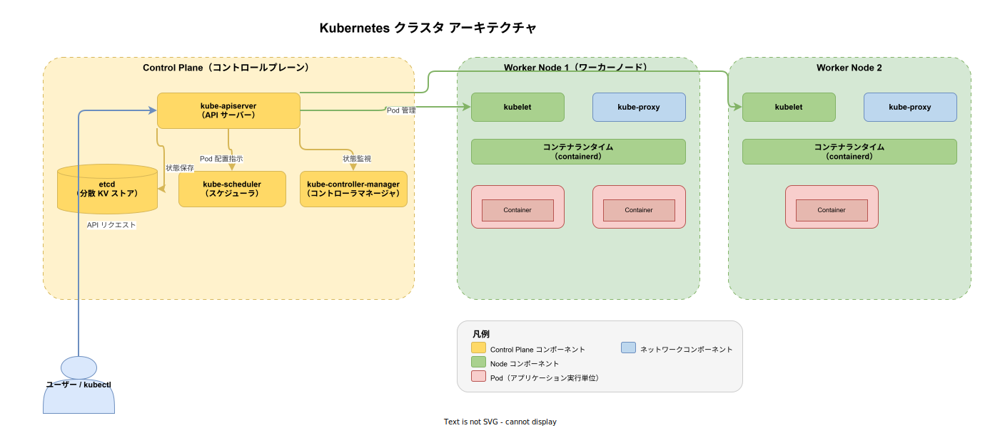
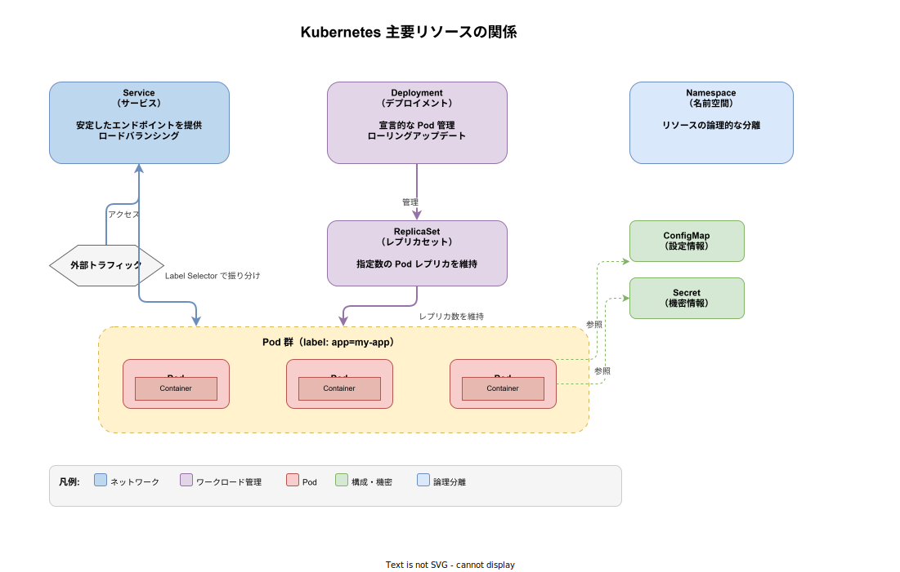

# Kubernetes: 基本

- 対象読者: コンテナ（Docker）の基礎知識を持つ開発者
- 学習目標: Kubernetes の全体像を理解し、基本リソースを使ってアプリケーションをデプロイできるようになる
- 所要時間: 約 45 分
- 対象バージョン: Kubernetes v1.32
- 最終更新日: 2026-04-12

## 1. このドキュメントで学べること

- Kubernetes が解決する課題と存在意義を説明できる
- クラスタの構成要素（Control Plane・Worker Node）の役割を理解できる
- Pod・Deployment・Service の基本操作を kubectl で実行できる
- マニフェスト（YAML）を記述してアプリケーションをデプロイできる

## 2. 前提知識

- Docker コンテナの基本概念（イメージ、コンテナ、レジストリ）
- YAML の基本的な記法
- Linux コマンドラインの基本操作

## 3. 概要

Kubernetes（略称: k8s）は、コンテナ化されたアプリケーションのデプロイ・スケーリング・運用を自動化するオープンソースのプラットフォームである。Google が社内で運用していた Borg システムの設計思想をもとに開発され、現在は CNCF（Cloud Native Computing Foundation）が管理している。

コンテナ単体では「1 台のマシンで 1 つのコンテナを動かす」ことしかできない。Kubernetes は複数のマシンをクラスタとしてまとめ、「どのマシンで何を動かすか」を自動で決定する。アプリケーションが落ちたら自動で再起動し、負荷が増えたらレプリカを増やすといった運用を宣言的に管理できる。

## 4. 用語の整理

| 用語 | 説明 |
|------|------|
| クラスタ | Kubernetes が管理するマシン群の全体。Control Plane と Worker Node で構成される |
| Node | クラスタ内の 1 台のマシン（物理・仮想問わない） |
| Pod | コンテナの実行単位。1 つ以上のコンテナをまとめたもの |
| Deployment | Pod の望ましい状態（レプリカ数・イメージ等）を宣言的に管理するリソース |
| Service | Pod 群に安定したネットワークエンドポイントを提供するリソース |
| Namespace | リソースを論理的に分離するための名前空間 |
| kubectl | Kubernetes クラスタを操作するための CLI ツール |
| マニフェスト | リソースの望ましい状態を記述した YAML ファイル |

## 5. 仕組み・アーキテクチャ

Kubernetes クラスタは **Control Plane**（コントロールプレーン）と **Worker Node**（ワーカーノード）の 2 層で構成される。



**Control Plane のコンポーネント:**

| コンポーネント | 役割 |
|---------------|------|
| kube-apiserver | クラスタ操作の入口。すべてのリクエストを受け付ける REST API サーバー |
| etcd | クラスタの状態を永続化する分散キーバリューストア |
| kube-scheduler | 未割当の Pod を適切な Node に配置する |
| kube-controller-manager | 各種コントローラ（ReplicaSet、Deployment 等）を実行し、望ましい状態を維持する |

**Worker Node のコンポーネント:**

| コンポーネント | 役割 |
|---------------|------|
| kubelet | Node 上の Pod を管理し、Control Plane と通信するエージェント |
| kube-proxy | Service のネットワークルールを管理し、Pod 間の通信を中継する |
| コンテナランタイム | コンテナの実行環境（containerd 等） |

## 6. 環境構築

### 6.1 必要なもの

- kubectl（Kubernetes CLI）
- ローカル検証用クラスタ（以下のいずれか）
  - minikube
  - kind（Kubernetes in Docker）
  - Docker Desktop 内蔵の Kubernetes

### 6.2 セットアップ手順（minikube の場合）

```bash
# minikube をインストールする（macOS の場合）
brew install minikube

# クラスタを起動する
minikube start

# クラスタの状態を確認する
kubectl cluster-info
```

### 6.3 動作確認

```bash
# Node の一覧を表示して、クラスタが稼働していることを確認する
kubectl get nodes
```

`STATUS` が `Ready` と表示されればセットアップ完了である。

## 7. 基本の使い方

Kubernetes ではリソースの状態を YAML マニフェストで宣言し、kubectl で適用する。以下は nginx をデプロイする最小構成の例である。



```yaml
# nginx アプリケーションの Deployment マニフェスト
# 2 つのレプリカで nginx コンテナを実行する
apiVersion: apps/v1
kind: Deployment
metadata:
  # Deployment の名前を定義する
  name: my-nginx
spec:
  # レプリカ数を 2 に設定する
  replicas: 2
  # 管理対象の Pod を label で選択する
  selector:
    matchLabels:
      app: my-nginx
  # Pod のテンプレートを定義する
  template:
    metadata:
      # Pod に付与する label を指定する
      labels:
        app: my-nginx
    spec:
      containers:
        # コンテナ名を指定する
        - name: nginx
          # 使用するコンテナイメージを指定する
          image: nginx:1.27
          # コンテナがリッスンするポートを指定する
          ports:
            - containerPort: 80
```

### 解説

- `apiVersion`: 使用する API のバージョン。Deployment は `apps/v1` を使用する
- `kind`: 作成するリソースの種類
- `metadata.name`: リソースの識別名
- `spec.replicas`: 維持する Pod の数。Kubernetes はこの数を常に保つよう自動調整する
- `spec.selector`: Deployment が管理する Pod を label で特定する
- `spec.template`: 実際に作成される Pod の定義

```bash
# マニフェストをクラスタに適用する
kubectl apply -f deployment.yaml

# Pod の状態を確認する
kubectl get pods

# Deployment の状態を確認する
kubectl get deployments
```

## 8. ステップアップ

### 8.1 Service で Pod を公開する

Pod は短命で IP アドレスが変わるため、直接アクセスには適さない。Service を使うことで安定したエンドポイントを確保できる。

```yaml
# nginx を外部に公開する Service マニフェスト
apiVersion: v1
kind: Service
metadata:
  # Service の名前を定義する
  name: my-nginx-service
spec:
  # NodePort タイプで外部からアクセス可能にする
  type: NodePort
  # 対象の Pod を label で選択する
  selector:
    app: my-nginx
  ports:
    # Service が受け付けるポートを指定する
    - port: 80
      # Pod 側のポートを指定する
      targetPort: 80
```

### 8.2 宣言的管理とローリングアップデート

イメージのバージョンを変更してマニフェストを再適用すると、Kubernetes は Pod を段階的に入れ替える（ローリングアップデート）。ダウンタイムなしでアプリケーションを更新できる。

```bash
# イメージを更新する（マニフェスト変更後）
kubectl apply -f deployment.yaml

# ロールアウトの進行状況を確認する
kubectl rollout status deployment/my-nginx
```

## 9. よくある落とし穴

- **Pod に直接アクセスしようとする**: Pod の IP は再作成時に変わる。必ず Service 経由でアクセスする
- **label の不一致**: Service の `selector` と Pod の `labels` が一致しないとトラフィックが届かない
- **リソース制限の未設定**: CPU・メモリの `requests`/`limits` を設定しないと、1 つの Pod がノード全体のリソースを消費する可能性がある
- **latest タグの使用**: `image: nginx:latest` はバージョンが不定になる。必ず具体的なタグを指定する

## 10. ベストプラクティス

- マニフェストは Git で管理し、`kubectl apply -f` で宣言的に適用する
- Namespace でチーム・環境ごとにリソースを分離する
- すべての Pod に `resources.requests` と `resources.limits` を設定する
- コンテナイメージには具体的なバージョンタグを指定する
- Liveness Probe・Readiness Probe を設定してヘルスチェックを自動化する

## 11. 演習問題

1. nginx の Deployment を作成し、レプリカ数を 3 に変更して再適用せよ。`kubectl get pods` で 3 つの Pod が起動することを確認せよ
2. 上記 Deployment に対応する Service（type: NodePort）を作成し、ブラウザからアクセスできることを確認せよ
3. nginx のイメージバージョンを変更し、ローリングアップデートが行われる様子を `kubectl rollout status` で観察せよ

## 12. さらに学ぶには

- 公式ドキュメント: <https://kubernetes.io/ja/docs/home/>
- 公式チュートリアル: <https://kubernetes.io/ja/docs/tutorials/>
- Kubernetes The Hard Way（構築を通じて内部構造を学ぶ）: <https://github.com/kelseyhightower/kubernetes-the-hard-way>

## 13. 参考資料

- Kubernetes 公式ドキュメント Concepts: <https://kubernetes.io/docs/concepts/>
- Kubernetes Components: <https://kubernetes.io/docs/concepts/overview/components/>
- Kubernetes API Reference v1.32: <https://kubernetes.io/docs/reference/kubernetes-api/>
