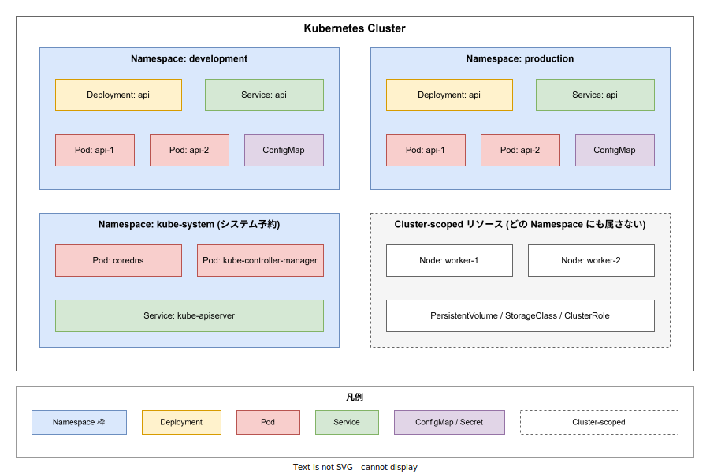
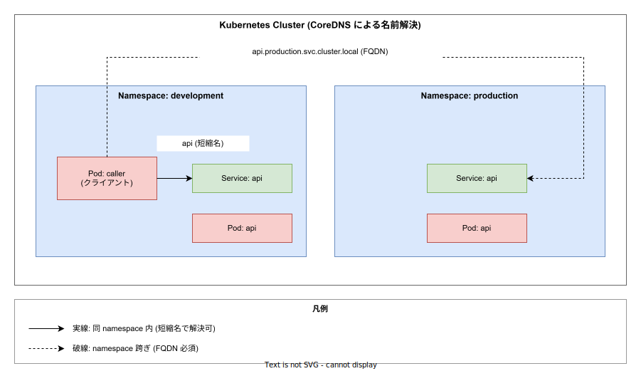

# Kubernetes: Namespace（名前空間）

- 対象読者: Kubernetes の基本（Pod / Deployment / Service）に触れた経験がある開発者・運用者
- 学習目標: Namespace が解決する課題を理解し、リソースを Namespace 単位で分離・運用できるようになる
- 所要時間: 約 30 分
- 対象バージョン: Kubernetes v1.32
- 最終更新日: 2026-04-28

## 1. このドキュメントで学べること

- Namespace が「単一クラスタ内でリソースグループを分離する」とは具体的にどういうことかを説明できる
- `default` / `kube-system` / `kube-public` / `kube-node-lease` の役割を区別できる
- Namespace スコープのリソースとクラスタスコープのリソースを判別できる
- Service の DNS 解決が Namespace によってどう変わるかを説明できる
- ResourceQuota / LimitRange / NetworkPolicy が Namespace 単位で効くことを理解できる

## 2. 前提知識

- Kubernetes の基本リソース（Pod・Deployment・Service・ConfigMap）の概念
  - 未習の場合: [kubernetes_basics.md](./kubernetes_basics.md)
- kubectl による基本操作
- DNS による名前解決の概念

## 3. 概要

Namespace（名前空間）は、Kubernetes が **単一クラスタ内** でリソースグループを論理的に分離するための仕組みである。Namespace を切ると、リソース名のスコープ・RBAC・ResourceQuota・NetworkPolicy がその範囲内に閉じる。

公式ドキュメントは「数〜十数名規模のクラスタでは Namespace を意識する必要はない。複数チーム / 複数プロジェクトに跨がる規模になったら使う」と明記している。Namespace は **マルチテナンシーの第一歩** であり、Pod の物理的な隔離（Node 単位）ではなく **論理的な区切り** に過ぎない点に注意する（実隔離は NetworkPolicy / Pod Security Admission / Node Affinity を併用して達成する）。

## 4. 用語の整理

| 用語 | 説明 |
|------|------|
| Namespace | クラスタ内でリソースを論理的に分離する境界。Pod・Service・Deployment 等の名前は Namespace 内で一意であればよい |
| Namespace スコープのリソース | いずれかの Namespace に属するリソース（Pod / Service / ConfigMap / Secret / Deployment / Role 等） |
| クラスタスコープのリソース | Namespace に属さないリソース（Node / PersistentVolume / StorageClass / ClusterRole / Namespace 自身） |
| デフォルト Namespace | クラスタ作成時に自動生成される 4 つの Namespace（`default` / `kube-system` / `kube-public` / `kube-node-lease`） |
| FQDN（Fully Qualified Domain Name） | `<service>.<namespace>.svc.cluster.local` 形式の完全修飾名 |
| Context | kubectl の接続先クラスタ・ユーザー・デフォルト Namespace を保持する設定単位 |

## 5. 仕組み・アーキテクチャ

クラスタには Namespace スコープのリソースを格納する **Namespace** と、Namespace に属さない **クラスタスコープ** のリソースが共存する。リソース名は **Namespace 内で一意** であればよく、別 Namespace に同じ名前を持たせられる（下図で `Service: api` が development と production の双方に存在することに注目）。



クラスタ作成直後に存在する 4 つの初期 Namespace の役割は以下のとおり:

| Namespace | 用途 |
|-----------|------|
| `default` | ユーザーアプリケーションの初期配置先。本番運用では避ける |
| `kube-system` | Kubernetes システムコンポーネント（CoreDNS / kube-controller-manager 等）専用 |
| `kube-public` | 全クライアント（未認証含む）が読取可能。クラスタ全体に公開する設定を置く |
| `kube-node-lease` | Node のハートビート（Lease オブジェクト）専用。Control Plane が Node 障害を検出する基盤 |

`kube-` 接頭辞の Namespace は Kubernetes システム予約のため、ユーザーが新規作成してはならない（公式ドキュメントで明記）。

Namespace スコープかクラスタスコープかは API リソースで判定できる:

```bash
# Namespace スコープのリソース一覧
kubectl api-resources --namespaced=true

# クラスタスコープのリソース一覧
kubectl api-resources --namespaced=false
```

## 6. 環境構築

Namespace は Kubernetes に標準同梱の機能のため、追加インストールは不要である。クラスタが立ち上がっていれば直ちに利用できる。

```bash
# 既存の Namespace を一覧表示する
kubectl get namespaces
```

期待出力:

```
NAME              STATUS   AGE
default           Active   5m
kube-node-lease   Active   5m
kube-public       Active   5m
kube-system       Active   5m
```

## 7. 基本の使い方

### 7.1 Namespace を作成する

```yaml
# development 環境用 Namespace を宣言する
apiVersion: v1
kind: Namespace
metadata:
  # Namespace 名はクラスタ全体で一意である必要がある
  name: development
  # 検索や分類に使う label を付与する
  labels:
    env: dev
```

```bash
# マニフェストを適用する
kubectl apply -f namespace-dev.yaml

# 一行コマンドでの簡易作成
kubectl create namespace production
```

### 7.2 リソースを特定の Namespace に配置する

Namespace は **マニフェストの `metadata.namespace`** で指定するか、**kubectl 実行時のフラグ** で指定する。

```yaml
# Pod を development Namespace に配置する例
apiVersion: v1
kind: Pod
metadata:
  # 配置先 Namespace を明示する
  namespace: development
  # Pod 名は development 内で一意であればよい
  name: api
spec:
  containers:
    # コンテナ名を指定する
    - name: app
      # 動作確認用の軽量イメージを利用する
      image: nginx:1.27
```

```bash
# kubectl のフラグで Namespace を指定する
kubectl apply -f pod.yaml --namespace=development

# 短縮形で参照する
kubectl get pods -n development
```

### 解説

- `metadata.namespace` 未指定で作成すると `default` Namespace に入る
- マニフェストと kubectl の両方で Namespace を指定した場合、マニフェスト側の値が優先される
- Namespace を削除すると配下のリソースは全て連鎖削除される（`kubectl delete namespace development` は危険操作）

## 8. ステップアップ

### 8.1 Namespace と DNS 解決

Service の DNS 名は Namespace を含む FQDN として登録される: `<service>.<namespace>.svc.cluster.local`。同じ Namespace 内の Pod からは **短縮名** で解決でき、別 Namespace の Service には **FQDN（最低でも `<service>.<namespace>` まで）** が必要となる。



```bash
# development Namespace の caller Pod から、同 Namespace の api Service へ
curl http://api/

# 別 Namespace の Service には FQDN が必須
curl http://api.production.svc.cluster.local/
```

公開 TLD（`com` 等）と同名の Namespace は作成しないこと。CoreDNS の検索順序により外部 DNS 解決が Cluster 内 Service にハイジャックされる事故が公式ドキュメントの Security Warning として報告されている。

### 8.2 Namespace 単位の制御リソース

Namespace を切ると、その範囲に閉じる制御リソースが利用可能になる:

| リソース | 役割 |
|----------|------|
| ResourceQuota | Namespace 全体の CPU / メモリ / Pod 数等の **総量上限** を強制 |
| LimitRange | Namespace 内の Pod / Container に **デフォルト値・上下限** を強制 |
| NetworkPolicy | Namespace 内 Pod の **ingress / egress トラフィック** を制御 |
| RoleBinding | Namespace スコープの **RBAC** を付与（ClusterRoleBinding はクラスタ全体） |

```yaml
# production Namespace に総量制限を課す
apiVersion: v1
kind: ResourceQuota
metadata:
  # 制限対象 Namespace を指定する
  namespace: production
  # ResourceQuota の名前を指定する
  name: prod-quota
spec:
  hard:
    # Namespace 全体で要求できる CPU の合計上限
    requests.cpu: "10"
    # Namespace 全体で要求できるメモリの合計上限
    requests.memory: 20Gi
    # Namespace 内で生成可能な Pod 数の上限
    pods: "100"
```

### 8.3 kubectl context にデフォルト Namespace を埋める

毎回 `-n production` を打つのは煩雑なので、context にデフォルト Namespace を設定する。

```bash
# 現在の context のデフォルト Namespace を production に切り替える
kubectl config set-context --current --namespace=production

# 設定の確認（minify で現在の context のみ表示）
kubectl config view --minify | grep namespace:
```

優先順位は **kubectl の `-n` フラグ > context の `namespace` > `default`** で、フラグが最強である。

## 9. よくある落とし穴

- **`default` Namespace に本番ワークロードを置く**: RBAC・ResourceQuota の境界を切れず、新規参画者の試し打ちと混在する
- **`kube-` 接頭辞で Namespace を作る**: Kubernetes システム予約のため、将来のアップグレードで衝突する恐れがある
- **Namespace を消したら配下も消える**: `kubectl delete namespace foo` は配下リソースを連鎖削除する。誤操作の影響範囲が大きい
- **Namespace で「セキュリティ隔離」されたと誤解する**: Namespace は **論理境界** に過ぎず、デフォルトでは Namespace 跨ぎの Pod 間通信は素通り。実隔離するなら NetworkPolicy が必要
- **Service 名を別 Namespace から短縮名で呼んで失敗する**: 別 Namespace では FQDN（最低 `<service>.<namespace>`）が必須

## 10. ベストプラクティス

- 用途・環境（dev / staging / prod）・チームのいずれかの軸で Namespace を切る。複数軸を 1 Namespace に押し込まない
- 全 Namespace に **ResourceQuota と LimitRange を必ず設定する**（暴走 Pod がクラスタを巻き込まない）
- 全 Namespace に **NetworkPolicy で default-deny を入れる**（明示的に許可された通信のみ通す）
- Namespace 名にはドメイン的に意味のある名前を付ける（`team-payments` / `env-prod-api` 等）。`ns1` のような番号は禁止
- マニフェストの `metadata.namespace` を必ず明記する（kubectl 側依存にしない）

## 11. 演習問題

1. `development` と `production` の 2 つの Namespace を作成し、それぞれに同名の Deployment `api`（nginx）を作成して両立できることを確認せよ
2. `development` の Pod から `production` の Service にアクセスする `kubectl exec ... -- curl ...` を実行し、短縮名では解決できず FQDN なら解決できることを観察せよ
3. `production` Namespace に `ResourceQuota`（pods: 5）を適用し、6 つ目の Pod 作成が拒否されることを確認せよ

## 12. さらに学ぶには

- 公式ドキュメント Concepts: <https://kubernetes.io/docs/concepts/overview/working-with-objects/namespaces/>
- 公式チュートリアル Walkthrough: <https://kubernetes.io/docs/tasks/administer-cluster/namespaces-walkthrough/>
- 関連 Knowledge: [kubernetes_basics.md](./kubernetes_basics.md) / [kyverno_basics.md](./kyverno_basics.md)（Namespace 単位のポリシー強制）

## 13. 参考資料

- Kubernetes 公式 Namespaces ドキュメント: <https://kubernetes.io/docs/concepts/overview/working-with-objects/namespaces/>
- Share a Cluster with Namespaces (Walkthrough): <https://kubernetes.io/docs/tasks/administer-cluster/namespaces-walkthrough/>
- Kubernetes API Reference v1.32: <https://kubernetes.io/docs/reference/kubernetes-api/cluster-resources/namespace-v1/>
