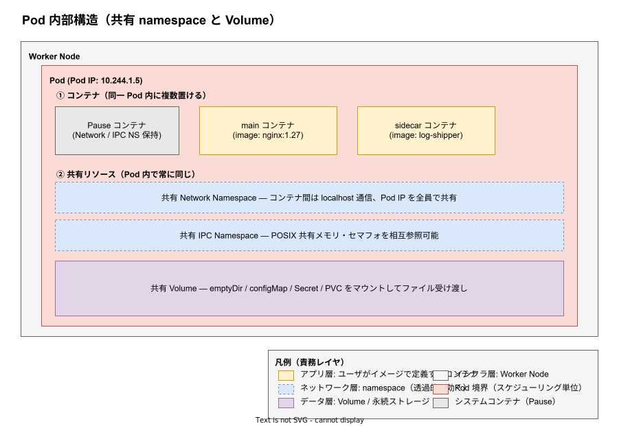
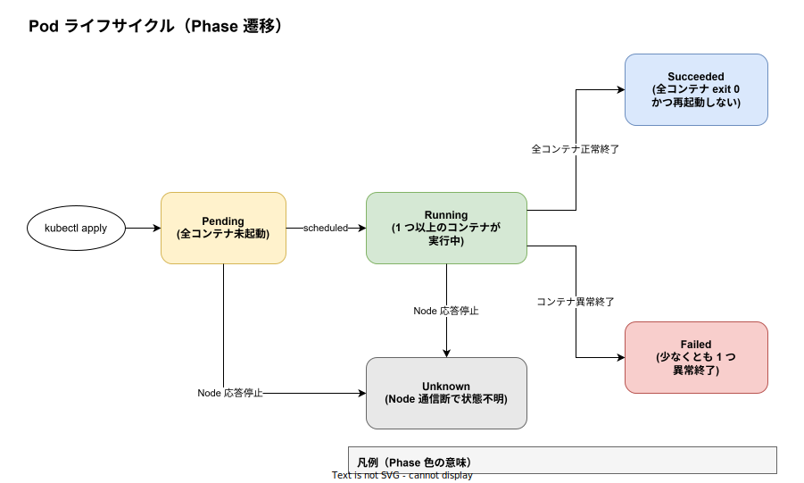

# Kubernetes: Pod

- 対象読者: [kubernetes_basics.md](kubernetes_basics.md) を読了し、Pod の内部構造と運用上の振る舞いを掘り下げて理解したい開発者
- 学習目標: Pod が「コンテナの集合体」である根拠とライフサイクル状態遷移を説明でき、なぜ Pod を Deployment 経由で間接管理すべきかを論証できる
- 所要時間: 約 30 分
- 対象バージョン: Kubernetes v1.32
- 最終更新日: 2026-04-28

## 1. このドキュメントで学べること

- Pod が Kubernetes の最小デプロイ単位として導入された理由
- Pod 内コンテナが共有するリソース（Network / IPC / Volume）の範囲
- Pause コンテナ（インフラコンテナ）が果たす役割
- Pod のライフサイクル（Pending / Running / Succeeded / Failed / Unknown）と各状態の遷移条件
- Init Container と Sidecar パターンの違い、および Probe（liveness / readiness / startup）の役割

## 2. 前提知識

- Kubernetes クラスタの基本構成（[kubernetes_basics.md](kubernetes_basics.md)）
- Linux コンテナの基礎知識（namespace / cgroup）
- YAML マニフェストの読み書き

## 3. 概要

Pod（ポッド）は Kubernetes における最小のデプロイ単位である。Docker などのコンテナランタイムが扱う「単一コンテナ」を直接スケジューリング対象にせず、1 つ以上のコンテナをまとめた Pod という抽象を導入することで、Kubernetes は協調動作するコンテナ群を 1 つのスケジューリング単位として扱う。

Pod 内のコンテナは同じ Node に配置され、ネットワーク（IP・ポート空間）・IPC・任意でファイルシステムを共有する。これによりアプリケーション本体のコンテナとログ転送 Sidecar が localhost で通信したり、共有 Volume を介してファイルを受け渡したりできる。一方、独立してスケールアウトしたい責務は別 Pod に分離するのが原則である（同じ Pod 内のコンテナはレプリカ数を個別に変更できないため）。

## 4. 用語の整理

| 用語 | 説明 |
|------|------|
| Pod | コンテナの実行単位。1 つ以上のコンテナと共有リソースをまとめたもの |
| Pause コンテナ | Pod 内の名前空間（Network / IPC）を保持するためのインフラコンテナ |
| Init Container | アプリコンテナ起動前に順次実行される初期化用コンテナ |
| Sidecar | アプリ本体に併走する補助コンテナ（ログ転送・プロキシ等） |
| Probe | コンテナの健康状態を判定する仕組み（liveness / readiness / startup） |
| Pod Phase | Pod のライフサイクル全体を表す高レベル状態（5 種類） |

## 5. 仕組み・アーキテクチャ

Pod は単なるコンテナの束ではなく、共有リソース境界を持つ独立した実行環境である。下図は 1 つの Pod に 2 つのアプリコンテナと Pause コンテナが同居し、Network / IPC / Volume を共有している様子を示す。



Pod 起動時、kubelet はまず **Pause コンテナ**を作成する。Pause コンテナは Linux の `pause(2)` システムコールを呼び続けるだけの極小プロセス（数 KB）で、その存在意義は **Network Namespace と IPC Namespace を保持し続けること**にある。アプリコンテナはこの Pause の namespace に join する形で起動するため、Pod 内の全コンテナは同じ Pod IP・ポート空間を共有する。アプリコンテナが落ちて再起動しても Pause が生きている限り Pod IP は変わらない。

ライフサイクル全体は次の 5 つの Phase で表現される。



| Phase | 意味 |
|-------|------|
| Pending | API Server に登録されたが、まだ全コンテナが起動していない（イメージ pull 中・スケジュール待ち等） |
| Running | Pod が Node に bind され、少なくとも 1 つのコンテナが実行中または起動中 |
| Succeeded | 全コンテナが正常終了（exit 0）し、`restartPolicy` により再起動されない |
| Failed | 全コンテナが終了し、少なくとも 1 つが異常終了したか強制終了された |
| Unknown | Node との通信が失われ、kubelet からの状態報告を取得できない |

`restartPolicy: Always`（Deployment 配下の Pod の既定値）では Succeeded / Failed には到達せず、コンテナが終了するたびに Running 内で再起動を繰り返す。Succeeded / Failed は主に `Job` や `restartPolicy: OnFailure` / `Never` の Pod で観測される。

## 6. 環境構築

### 6.1 必要なもの

- 動作確認可能な Kubernetes クラスタ（`minikube` / `kind` / Docker Desktop 内蔵 等）
- `kubectl` CLI

### 6.2 セットアップ確認

```bash
# クラスタが稼働しているか確認する
kubectl get nodes

# 検証用 namespace を作成する
kubectl create namespace pod-lab
```

### 6.3 動作確認

```bash
# 既存の Pod を全 namespace で一覧表示する
kubectl get pods -A
```

`kube-system` namespace に CoreDNS や kube-proxy などの Pod が `Running` で並んでいれば、クラスタは Pod を実行可能な状態である。

## 7. 基本の使い方

最小の Pod マニフェストを書いて apply する。実運用では `kind: Pod` を直接書くことは避け Deployment 経由で管理するが、Pod の挙動を学ぶ上では直接定義の理解が前提となる。

```yaml
# 単一コンテナの Pod 最小マニフェスト
apiVersion: v1
kind: Pod
metadata:
  # Pod の識別名（namespace 内でユニーク）
  name: nginx-pod
  # 配置先の namespace を指定する
  namespace: pod-lab
  labels:
    # Service から参照される label を付与する
    app: nginx
spec:
  containers:
    # コンテナ名は Pod 内でユニークでなければならない
    - name: nginx
      # 具体的なバージョンタグを指定（latest は不変性を失うため禁止）
      image: nginx:1.27
      ports:
        # Pod IP に対して公開するポート番号
        - containerPort: 80
      resources:
        # 最低保証量（スケジューラがこの値で Node 容量を確保する）
        requests:
          cpu: "50m"
          memory: "64Mi"
        # 上限（cgroup でこの値以上の使用が制限される）
        limits:
          cpu: "200m"
          memory: "128Mi"
```

### 解説

- `kind: Pod`: 直接 Pod を作成する宣言。実運用では Deployment / StatefulSet / Job 等のコントローラ経由が原則
- `containers[].image`: コンテナイメージ。`latest` ではなく具体的タグを指定する
- `resources.requests`: スケジューラが Node 容量から確保する最低保証量（QoS の基準にもなる）
- `resources.limits`: cgroup が強制する使用上限（超過時 OOMKill / CPU throttle）

```bash
# マニフェストをクラスタに適用する
kubectl apply -f nginx-pod.yaml

# Pod の Phase を確認する
kubectl get pod nginx-pod -n pod-lab

# コンテナのログを取得する
kubectl logs nginx-pod -n pod-lab
```

## 8. ステップアップ

### 8.1 マルチコンテナ Pod（Sidecar パターン）

Pod 内に複数コンテナを配置すると、共有 Volume と localhost 通信を使った密結合な協調動作を実現できる。下記は同じ Pod 内でアプリ本体とログ転送 Sidecar が `emptyDir` Volume を共有する例である。

```yaml
# アプリ + ログ転送 Sidecar を 1 Pod に同居させる
apiVersion: v1
kind: Pod
metadata:
  name: app-with-sidecar
spec:
  # コンテナ間で共有する Volume を定義する
  volumes:
    - name: shared-logs
      # emptyDir は Pod 終了時に消える一時領域
      emptyDir: {}
  containers:
    # メインアプリコンテナ
    - name: app
      image: busybox:1.36
      # 1 秒ごとにログを書き込む
      command: ["sh", "-c", "while true; do echo $(date) >> /var/log/app.log; sleep 1; done"]
      volumeMounts:
        # 共有 Volume を /var/log にマウントする
        - name: shared-logs
          mountPath: /var/log
    # ログ転送 Sidecar（共有 Volume を読み出す）
    - name: log-shipper
      image: busybox:1.36
      # tail -F でファイルを追跡する
      command: ["sh", "-c", "tail -F /var/log/app.log"]
      volumeMounts:
        # 同じ Volume を読み出し用にマウントする
        - name: shared-logs
          mountPath: /var/log
```

### 8.2 Probe による健全性検査

Probe は kubelet がコンテナの状態を判定する仕組みで、3 種類の役割が異なる。誤って混同すると、起動の遅いアプリが livenessProbe で再起動ループに陥るなどの障害につながる。

| Probe | 失敗時の挙動 | 主な用途 |
|-------|-------------|----------|
| startupProbe | livenessProbe を抑止する間の起動猶予判定 | 起動が遅いアプリの保護 |
| livenessProbe | コンテナを再起動する | デッドロック検出 |
| readinessProbe | Service エンドポイントから外す | 一時的な過負荷時のトラフィック流入抑止 |

```yaml
# 3 種の probe を備えたコンテナ定義の抜粋
containers:
  - name: api
    image: my-api:1.2.3
    # 起動判定: 30 秒以内に 1 度応答すれば OK
    startupProbe:
      httpGet:
        path: /healthz
        port: 8080
      failureThreshold: 30
      periodSeconds: 1
    # 死活判定: 3 回連続失敗で再起動
    livenessProbe:
      httpGet:
        path: /healthz
        port: 8080
      periodSeconds: 10
    # トラフィック投入判定
    readinessProbe:
      httpGet:
        path: /readyz
        port: 8080
      periodSeconds: 5
```

## 9. よくある落とし穴

- **Pod を直接マニフェスト管理する**: Pod は再スケジュールされない（Node 障害で消失したまま復元されない）。必ず Deployment / StatefulSet / DaemonSet / Job 経由で管理する。
- **Pod IP を永続前提で扱う**: Pod 再作成で IP は変わる。クライアントは Service の ClusterIP / DNS 名で参照する。
- **`latest` タグの使用**: 不変性が失われ、ロールバックや原因切り分けが事実上不能になる。
- **resources 未設定**: スケジューリングと QoS クラスが正しく機能せず、特定 Pod が Node のリソースを食い潰す。
- **Init Container と通常コンテナの混同**: Init Container は順次実行され完了が必須。常駐用途には使わない（Sidecar を使うべき）。

## 10. ベストプラクティス

- 直接 `kind: Pod` を作らず Deployment / StatefulSet / Job 等のコントローラを介する
- すべてのコンテナに `requests` / `limits` を設定し QoS クラスを意識する
- liveness / readiness Probe を最低限設定し、起動が遅いアプリには startupProbe を併用する
- Pod 内コンテナは「協調動作が必須なもの」だけに絞る。独立スケール対象は別 Pod に分割する
- イメージは具体的タグ + `imagePullPolicy: IfNotPresent` で再現性を担保する

## 11. 演習問題

1. 単一コンテナ Pod を作成し、`kubectl exec` でコンテナに入って `hostname -i` を実行し Pod IP を確認せよ。
2. マルチコンテナ Pod を作り、片方のコンテナを `kubectl exec` から `kill 1` で停止した時に、Pod IP が維持されたまま該当コンテナだけ再起動することを `kubectl describe pod` の `Restart Count` で確認せよ。
3. `livenessProbe` が連続失敗するように `path` を存在しないエンドポイントに変更し、`kubectl describe pod` の Events で `Liveness probe failed` と再起動理由を観察せよ。

## 12. さらに学ぶには

- Kubernetes 公式: Pods <https://kubernetes.io/docs/concepts/workloads/pods/>
- Kubernetes 公式: Pod Lifecycle <https://kubernetes.io/docs/concepts/workloads/pods/pod-lifecycle/>
- 関連 Knowledge: [kubernetes_basics.md](kubernetes_basics.md)

## 13. 参考資料

- Pod v1 API リファレンス: <https://kubernetes.io/docs/reference/kubernetes-api/workload-resources/pod-v1/>
- Init Container 仕様: <https://kubernetes.io/docs/concepts/workloads/pods/init-containers/>
- Sidecar コンテナ: <https://kubernetes.io/docs/concepts/workloads/pods/sidecar-containers/>
- Pause コンテナの詳細: <https://www.ianlewis.org/en/almighty-pause-container>
