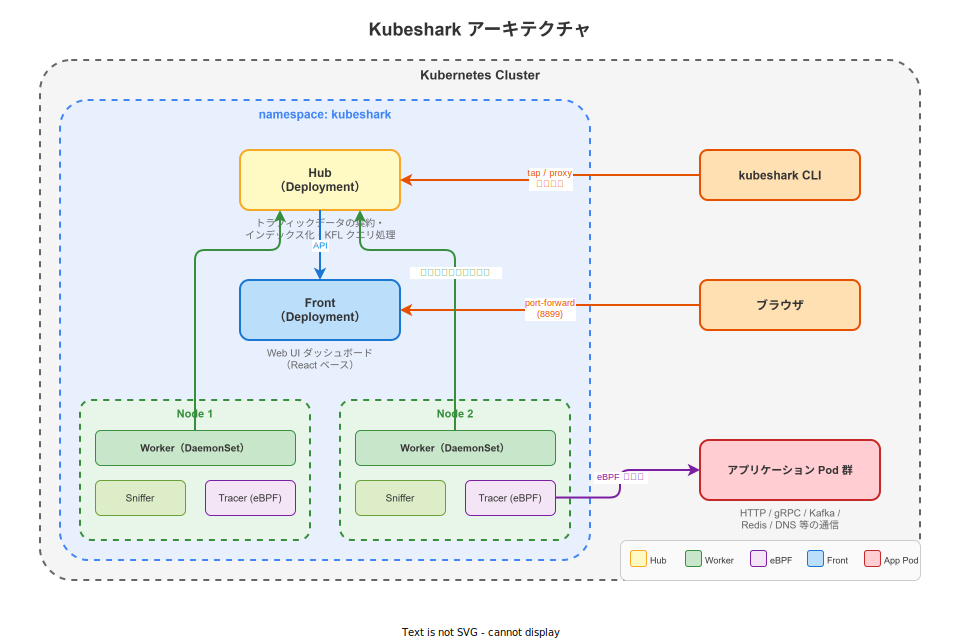
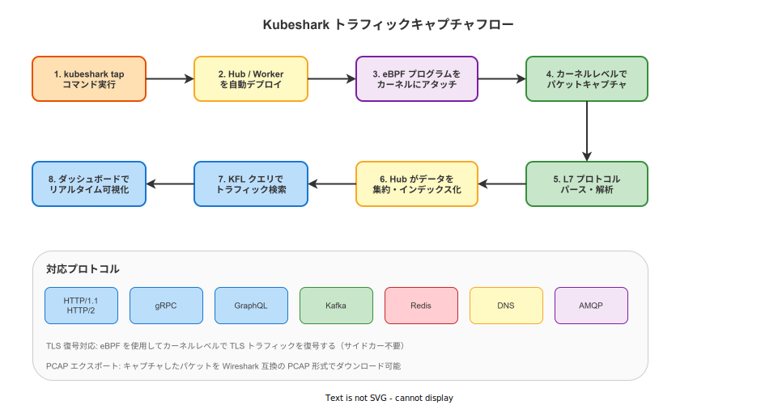

# Kubeshark: 基本

- 対象読者: Kubernetes の基本操作（kubectl, Pod, Namespace）を理解している開発者
- 学習目標: Kubeshark の仕組みを理解し、クラスタ内のネットワークトラフィックをリアルタイムに観測・フィルタリングできるようになる
- 所要時間: 約 30 分
- 対象バージョン: Kubeshark v52
- 最終更新日: 2026-04-13

## 1. このドキュメントで学べること

- Kubeshark が解決する課題とその仕組みを説明できる
- Hub・Worker・Front の各コンポーネントの役割を区別できる
- `kubeshark tap` でクラスタのトラフィックキャプチャを開始できる
- KFL（Kubeshark Filter Language）で目的のトラフィックを検索できる

## 2. 前提知識

- Kubernetes の基本概念（Pod, Namespace, DaemonSet, Deployment）
- HTTP や DNS など基本的なネットワークプロトコルの知識
- kubectl の基本操作（[Kubernetes: 基本](./kubernetes_basics.md)）

## 3. 概要

Kubeshark は Kubernetes クラスタ内のネットワークトラフィックをカーネルレベルでキャプチャ・解析するオブザーバビリティプラットフォームである。Linux カーネルの **eBPF**（extended Berkeley Packet Filter）技術を使用し、アプリケーションコードの変更やサイドカーの追加なしにクラスタ全体の通信を可視化する。

従来のネットワークデバッグでは、個別の Pod にプロキシを挿入したり tcpdump を実行する必要があった。Kubeshark はこれらの手作業を不要にし、HTTP・gRPC・Kafka・Redis・DNS など複数プロトコルのトラフィックを一元的に観測できる。TLS 暗号化された通信も eBPF を利用してカーネルレベルで復号する。

## 4. 用語の整理

| 用語 | 説明 |
|------|------|
| eBPF | Linux カーネル内で安全にプログラムを実行する技術。パケットキャプチャに利用される |
| Hub | キャプチャデータを集約・インデックス化する中央コンポーネント（Deployment） |
| Worker | 各ノードでトラフィックをキャプチャするコンポーネント（DaemonSet） |
| Sniffer | Worker 内でパケットキャプチャを行うプロセス |
| Tracer | Worker 内で eBPF プログラムを管理し TLS 復号を行うプロセス |
| Front | Web UI ダッシュボードを提供するコンポーネント（Deployment） |
| KFL | Kubeshark Filter Language。トラフィック検索用のクエリ言語 |
| PCAP | Packet Capture の略。Wireshark 等で利用可能なパケットキャプチャ形式 |
| L7 | OSI 参照モデルの第 7 層（アプリケーション層）。HTTP 等のプロトコルが該当する |

## 5. 仕組み・アーキテクチャ

Kubeshark は Hub・Worker・Front の 3 コンポーネントで構成される。



- **Hub（Deployment）**: Worker から送信されたキャプチャデータを集約し、インデックス化する。KFL クエリの処理と結果の返却を担う
- **Worker（DaemonSet）**: クラスタの各ノードに 1 つずつ配置される。内部に Sniffer（パケットキャプチャ）と Tracer（eBPF 管理・TLS 復号）を持つ
- **Front（Deployment）**: React ベースの Web UI を提供する。ユーザーはブラウザからリアルタイムにトラフィックを閲覧・検索する

`kubeshark tap` コマンドを実行すると、これらのコンポーネントが `kubeshark` Namespace に自動デプロイされる。

## 6. 環境構築

### 6.1 必要なもの

- Kubernetes クラスタ（Linux ノード）
- kubectl（クラスタに接続済み）
- Kubeshark CLI

### 6.2 セットアップ手順

```bash
# Kubeshark CLI をインストールする（Linux / macOS）
sh <(curl -Ls https://kubeshark.com/install)

# Helm でインストールする場合
helm repo add kubeshark https://helm.kubeshark.co
helm install kubeshark kubeshark/kubeshark
```

### 6.3 動作確認

```bash
# クラスタ内のトラフィックキャプチャを開始する
kubeshark tap

# Web UI が自動的に開く（デフォルト: http://localhost:8899）
```

ダッシュボードにトラフィック一覧が表示されればセットアップ完了である。

## 7. 基本の使い方

### tap コマンド

```bash
# 全 Namespace のトラフィックをキャプチャする
kubeshark tap -A

# 特定の Namespace のみキャプチャする
kubeshark tap -n production

# Pod 名の正規表現でフィルタする
kubeshark tap "payment-.*"

# ドライランで対象 Pod を確認する
kubeshark tap --dry-run
```

### KFL によるフィルタリング

KFL はダッシュボード上部の検索バーまたは API で使用する。

```text
# HTTP の 500 番台エラーを検索する
http && status_code >= 500

# 特定サービスへのリクエストを検索する
http && dst.service.name == "payment-service"

# 5 秒以上かかったリクエストを検索する
http && elapsed_time > 5000000

# DNS の名前解決失敗を検索する
dns && dns_response && status_code != 0

# 特定 Namespace 間の通信を検索する
src.pod.namespace == "frontend" && dst.pod.namespace == "backend"
```

### 解説

- `http`, `dns`, `gql` 等のキーワードでプロトコルを指定する
- `src` / `dst` で送信元・送信先の Pod やサービスを指定する
- `&&` で複数条件を組み合わせる
- `elapsed_time` はマイクロ秒単位である

## 8. ステップアップ

### 8.1 トラフィックキャプチャフロー

`kubeshark tap` 実行からダッシュボード表示までの全体フローを示す。



各ノードの Worker が eBPF でカーネルレベルのパケットをキャプチャし、L7 プロトコルとしてパースした後、Hub に送信する。Hub がデータをインデックス化し、KFL クエリに応じた結果をダッシュボードに返す。

### 8.2 PCAP エクスポート

キャプチャしたトラフィックを Wireshark 互換の PCAP 形式でダウンロードできる。

```bash
# 直近 1 時間の PCAP をエクスポートする
kubeshark pcapdump --time-range 1h --output ./captures/
```

### 8.3 リソース制限の設定

Helm の values.yaml でコンポーネントごとにリソースを設定できる。

```yaml
# values.yaml — リソース設定の例
tap:
  resources:
    hub:
      limits:
        cpu: "2"
        memory: 8Gi
    sniffer:
      limits:
        cpu: "1"
        memory: 4Gi
    tracer:
      limits:
        cpu: "1"
        memory: 4Gi
  capture:
    dbMaxSize: 2Gi
```

## 9. よくある落とし穴

- **Linux ノードのみ対応**: eBPF は Linux カーネルの機能であるため、Windows / macOS ノードでは動作しない
- **カーネルバージョン要件**: eBPF の機能は比較的新しいカーネル（4.19 以上推奨）が必要である
- **リソース消費**: 高トラフィック環境では Worker のメモリ・CPU 消費が大きくなる。`dbMaxSize` やリソース制限を適切に設定する
- **TLS 復号の制限**: 一部の TLS ライブラリや静的リンクされたバイナリでは復号できない場合がある
- **RBAC 権限**: Worker は eBPF を使用するため、特権コンテナとして実行される。セキュリティポリシーとの整合を確認する

## 10. ベストプラクティス

- 本番環境では `dbMaxSize` とリソース制限を必ず設定し、ノードリソースの枯渇を防ぐ
- `-n` オプションで対象 Namespace を限定し、不要なトラフィックのキャプチャを避ける
- `nodeSelectorTerms` を使用して Worker の配置先ノードを制御する
- 調査完了後は `kubeshark clean` でリソースを解放する
- PCAP エクスポートを活用し、Wireshark での詳細分析と組み合わせる

## 11. 演習問題

1. `kubeshark tap -n default` でデフォルト Namespace のトラフィックをキャプチャし、ダッシュボードでリアルタイムの通信を確認せよ
2. KFL で `http && status_code >= 400` を入力し、エラーレスポンスのみを表示せよ
3. `kubeshark pcapdump` で PCAP ファイルをエクスポートし、Wireshark で開いてみよ

## 12. さらに学ぶには

- 公式ドキュメント: <https://docs.kubeshark.co/>
- Kubeshark GitHub: <https://github.com/kubeshark/kubeshark>
- 関連 Knowledge: [Kubernetes: 基本](./kubernetes_basics.md)

## 13. 参考資料

- Kubeshark 公式リポジトリ README: <https://github.com/kubeshark/kubeshark/blob/master/README.md>
- Kubeshark Filter Language (KFL) ドキュメント: <https://docs.kubeshark.co/en/filtering>
- eBPF 公式サイト: <https://ebpf.io/>
