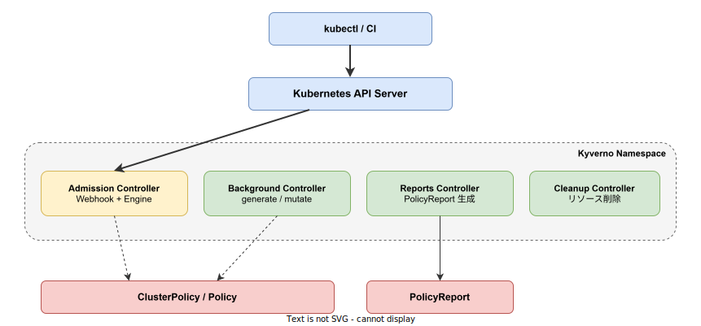
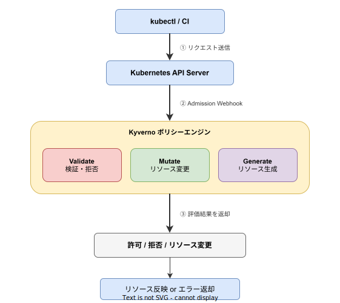

# Kyverno: 基本

- 対象読者: Kubernetes の基本操作（kubectl, YAML マニフェスト）を理解している開発者
- 学習目標: Kyverno の役割・構成を理解し、基本的なポリシーを作成・適用できるようになる
- 所要時間: 約 30 分
- 対象バージョン: Kyverno v1.12 以上
- 最終更新日: 2026-04-12

## 1. このドキュメントで学べること

- Kyverno が解決する課題と Kubernetes ポリシー管理の必要性を説明できる
- Kyverno のアーキテクチャと主要コンポーネントの役割を理解できる
- ClusterPolicy を作成してリソースの検証・変更・生成を実行できる
- PolicyReport でポリシー適用状況を確認できる

## 2. 前提知識

- Kubernetes の基本概念（Pod、Deployment、Namespace）
- kubectl による基本操作（apply、get、describe）
- YAML マニフェストの記法

## 3. 概要

Kyverno は、CNCF（Cloud Native Computing Foundation）が管理する Kubernetes ネイティブのポリシーエンジンである。Kubernetes クラスタ内のリソースが守るべきルール（ポリシー）を定義・強制する。

Kubernetes クラスタでは、ポリシーなしだと以下の問題が発生する:

- セキュリティリスク: 特権コンテナや hostNetwork の無制限な使用
- 運用ルールの逸脱: ラベル未付与、リソース制限の未設定
- ガバナンスの欠如: 組織のルールを技術的に強制する手段がない

Kyverno は Kubernetes の Admission Webhook として動作する。Admission Webhook とは、API Server がリソース操作を受けた際に外部サービスへ問い合わせる仕組みである。Kyverno は以下の 3 つの機能でポリシーを強制する:

- **Validate（検証）**: リソースがルールに適合するか検証し、違反時は作成を拒否する
- **Mutate（変更）**: リソース作成時にフィールドを自動で追加・修正する
- **Generate（生成）**: リソース作成をトリガーに別のリソースを自動生成する

最大の特徴は、ポリシーを Kubernetes ネイティブの YAML で記述できる点である。OPA/Gatekeeper のような専用言語（Rego）の学習が不要である。

## 4. 用語の整理

| 用語 | 説明 |
|------|------|
| ClusterPolicy | クラスタ全体に適用されるポリシー。Namespace を問わず有効 |
| Policy | 特定の Namespace にのみ適用されるポリシー |
| Rule | ポリシー内の個別ルール。1 つのポリシーに複数のルールを含められる |
| match / exclude | ルールの適用対象 / 除外対象を指定するフィールド |
| failureAction | 検証失敗時の動作。Enforce（拒否）または Audit（記録のみ） |
| Admission Webhook | API Server がリソース操作時に外部サービスへ問い合わせる仕組み |
| PolicyReport | ポリシーの適用結果を記録する Kubernetes リソース |

## 5. 仕組み・アーキテクチャ

Kyverno は Kubernetes クラスタ内に複数のコントローラーとしてデプロイされる。



| コンポーネント | 役割 |
|---------------|------|
| Admission Controller | Webhook と Engine を内包し、API Server からの AdmissionReview を処理する |
| Background Controller | generate ルールと mutate-existing ルールをバックグラウンドで実行する |
| Reports Controller | PolicyReport を生成・管理する |
| Cleanup Controller | TTL（有効期限）切れリソースのクリーンアップを実行する |

**ポリシー処理フロー:**



1. kubectl 等からリクエストが API Server に送信される
2. API Server が Admission Webhook として Kyverno を呼び出す
3. Kyverno エンジンが Validate / Mutate / Generate のルールを評価する
4. 評価結果（許可・拒否・変更）が API Server に返却される

## 6. 環境構築

### 6.1 必要なもの

- Kubernetes クラスタ（v1.25 以上）
- Helm（v3 以上）
- kubectl

### 6.2 セットアップ手順

```bash
# Kyverno の Helm リポジトリを追加する
helm repo add kyverno https://kyverno.github.io/kyverno

# リポジトリ情報を更新する
helm repo update

# Kyverno をインストールする
helm install kyverno kyverno/kyverno \
  --namespace kyverno --create-namespace
```

### 6.3 動作確認

```bash
# Pod の状態を確認する（すべて Running になるまで待つ）
kubectl get pods -n kyverno

# Kyverno の CRD が登録されたことを確認する
kubectl get crd | grep kyverno
```

## 7. 基本の使い方

Pod に `app` ラベルの付与を必須にする検証ポリシーの例を示す。

```yaml
# Kyverno ClusterPolicy: Pod に app ラベルを必須にする
apiVersion: kyverno.io/v1
# クラスタ全体に適用する ClusterPolicy を定義する
kind: ClusterPolicy
metadata:
  # ポリシー名を設定する
  name: require-app-label
spec:
  rules:
    # ルール名を設定する
    - name: check-app-label
      # 適用対象を Pod に限定する
      match:
        any:
          - resources:
              kinds:
                - Pod
      # 検証ルールを定義する
      validate:
        # 違反時はリクエストを拒否する
        failureAction: Enforce
        # 違反時のエラーメッセージを設定する
        message: "ラベル `app` の付与が必要です。"
        # パターンマッチで app ラベルの存在を検証する
        pattern:
          metadata:
            labels:
              # ?* は「1 文字以上の任意の文字列」を意味する
              app: "?*"
```

### 解説

- `ClusterPolicy`: クラスタ全体に適用される。Namespace 限定は `Policy` を使用する
- `match.any[].resources.kinds`: 適用対象のリソース種類を指定する
- `failureAction: Enforce`: 違反時にリクエストを拒否する。`Audit` は記録のみで許可する
- `pattern` 内の `?*`: 空でない任意の文字列にマッチするワイルドカードである

```bash
# ポリシーを適用する
kubectl apply -f require-app-label.yaml

# ラベルなし Pod は拒否される
kubectl run test --image=nginx
# Error: ラベル `app` の付与が必要です。

# ラベル付き Pod は作成できる
kubectl run test --image=nginx --labels="app=myapp"
```

## 8. ステップアップ

### 8.1 Mutate（自動変更）

リソース制限の自動付与など、運用ルールの自動適用に利用する。`patchStrategicMerge` でフィールドを追加・変更できる。

```yaml
# Kyverno ClusterPolicy: コンテナにデフォルトのメモリ制限を追加する
apiVersion: kyverno.io/v1
kind: ClusterPolicy
metadata:
  name: add-default-resources
spec:
  rules:
    - name: add-memory-limit
      match:
        any:
          - resources:
              kinds:
                - Pod
      # mutate ルールでリソースを自動変更する
      mutate:
        patchStrategicMerge:
          spec:
            containers:
              # 全コンテナにデフォルトのメモリ制限を追加する
              - (name): "*"
                resources:
                  limits:
                    memory: "256Mi"
```

### 8.2 Generate（自動生成）

Namespace 作成時にデフォルトの NetworkPolicy や Secret を自動生成する用途に利用する。`synchronize: true` で元リソースとの同期も可能である。

### 8.3 Audit モードでの段階的導入

`failureAction: Audit` に設定すると、違反を許可しつつ PolicyReport に記録する。本番導入前の影響範囲確認に有用である。

## 9. よくある落とし穴

- **Audit がデフォルト**: `failureAction` を明示的に `Enforce` にしないとポリシー違反が素通りする
- **既存リソースへの不適用**: ポリシー適用前に作成されたリソースには validate が強制されない
- **Kyverno 障害時の影響**: Kyverno ダウン時、failurePolicy 設定次第で全リソース作成がブロックされる
- **autogen 機能**: Deployment へのポリシーは自動的に Pod テンプレートにも適用される

## 10. ベストプラクティス

- 新規ポリシーは `Audit` で導入し、PolicyReport で確認後に `Enforce` へ切り替える
- ClusterPolicy より Policy を優先し、影響範囲を最小化する
- Kyverno CLI (`kyverno test`) でポリシーをテストし、CI/CD に組み込む
- Admission Controller を 3 レプリカ以上の HA 構成で運用する

## 11. 演習問題

1. `require-app-label` ポリシーを適用し、ラベルなし Pod の作成拒否を確認せよ
2. Mutate ポリシーを作成し、Pod への自動ラベル付与を確認せよ
3. Audit モードのポリシーを作成し、PolicyReport に違反記録が残ることを確認せよ

## 12. さらに学ぶには

- 公式ドキュメント: https://kyverno.io/docs/
- GitHub: https://github.com/kyverno/kyverno
- ポリシーライブラリ: https://kyverno.io/policies/

## 13. 参考資料

- Kyverno 公式ドキュメント: https://kyverno.io/docs/
- How Kyverno Works: https://kyverno.io/docs/introduction/how-kyverno-works/
- Kyverno Installation: https://kyverno.io/docs/installation/installation/
