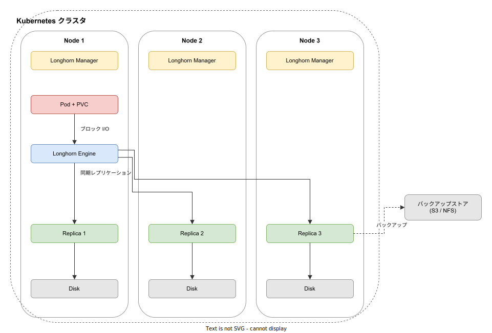
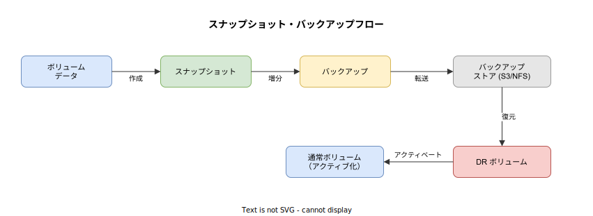

# Longhorn: 基本

- 対象読者: Kubernetes の基礎（Pod, PVC, StorageClass）を理解している開発者・インフラエンジニア
- 学習目標: Longhorn の全体像を理解し、クラスタへのインストールとボリュームの基本操作ができるようになる
- 所要時間: 約 40 分
- 対象バージョン: Longhorn v1.12.0
- 最終更新日: 2026-04-12

## 1. このドキュメントで学べること

- Longhorn が解決する課題と存在意義を説明できる
- Longhorn Manager / Engine / Replica の役割を理解できる
- Helm を使って Longhorn をクラスタにインストールできる
- PVC を作成して Pod からボリュームを利用できる
- スナップショット・バックアップの仕組みを理解できる

## 2. 前提知識

- Kubernetes の基本概念（Pod, Deployment, Service, PVC, StorageClass）
- Helm の基本操作（リポジトリ追加、install/uninstall）
- YAML の基本記法
- 関連ドキュメント: [Kubernetes: 基本](./kubernetes_basics.md)

## 3. 概要

Longhorn は、Kubernetes 向けの軽量な分散ブロックストレージシステムである。CNCF（Cloud Native Computing Foundation）のインキュベーティングプロジェクトとして管理されている。

Kubernetes でステートフルなアプリケーション（データベース等）を運用する際、永続ストレージの確保と可用性の担保が課題となる。Longhorn はコンテナとマイクロサービスの仕組みを活用して分散ブロックストレージを実現し、以下の課題を解決する。

- **データの冗長化**: ボリュームデータを複数ノードに自動レプリケーションする
- **障害耐性**: レプリカが複数ノードに分散するため、ノード障害時もデータが失われない
- **バックアップと復旧**: スナップショットと外部バックアップストアへの保存をサポートする
- **Kubernetes ネイティブ**: CSI（Container Storage Interface）に準拠し、PVC で透過的に利用できる

## 4. 用語の整理

| 用語 | 説明 |
|------|------|
| Longhorn Manager | コントロールプレーン。各ノードに DaemonSet として配置され、ボリュームの作成・管理・API リクエスト処理を担う |
| Longhorn Engine | データプレーン。ボリュームごとに 1 つ作成されるコントローラ。Pod と同じノードで動作する |
| Replica | ボリュームデータのコピー。既定で 3 つ作成され、異なるノードに分散配置される |
| Snapshot | ボリュームの特定時点の状態を記録したもの。ボリューム内にチェーンとして保持される |
| Backup | スナップショットを外部ストア（S3, NFS）に保存したもの。増分バックアップに対応する |
| DR Volume | 災害復旧用のスタンバイボリューム。バックアップから自動的に増分復元される |

## 5. 仕組み・アーキテクチャ

Longhorn は各ボリュームに専用の Engine を割り当てるマイクロサービスアーキテクチャを採用している。1 つの Engine が障害を起こしても、他のボリュームには影響しない。



**データフローの流れ:**

1. Pod が PVC を通じて Longhorn ボリュームをマウントする
2. Longhorn Engine が Pod と同じノード上でブロックデバイスを公開する
3. Engine が書き込みデータを全 Replica に同期レプリケーションする
4. 各 Replica はノードのディスクにデータを永続化する

レプリカ数が N の場合、最大 N-1 台のレプリカ障害まで耐えられる。Longhorn Manager は DaemonSet として全ノードで稼働し、Engine と Replica のライフサイクルを管理する。

**スナップショット・バックアップ:**



スナップショットはボリューム内に保持され、バックアップは外部ストアに転送される。DR ボリュームはバックアップから自動的に増分復元され、アクティベート後は通常のボリュームとして使用できる。

## 6. 環境構築

### 6.1 必要なもの

- Kubernetes クラスタ（v1.25 以上）
- Helm v3
- 各ワーカーノードに `open-iscsi` パッケージ（iSCSI イニシエータ。ブロックデバイスの提供に必要）

### 6.2 セットアップ手順

```bash
# 各ワーカーノードで open-iscsi をインストールする（Ubuntu の場合）
sudo apt-get install -y open-iscsi

# Helm リポジトリを追加する
helm repo add longhorn https://charts.longhorn.io

# リポジトリ情報を更新する
helm repo update

# Longhorn を longhorn-system 名前空間にインストールする
helm install longhorn longhorn/longhorn --namespace longhorn-system --create-namespace --version 1.12.0
```

### 6.3 動作確認

```bash
# Pod が正常に起動していることを確認する
kubectl -n longhorn-system get pod
```

すべての Pod が `Running` 状態になればインストール完了である。

## 7. 基本の使い方

Longhorn インストール時に `longhorn` という StorageClass が自動作成される。PVC を作成するだけでボリュームをプロビジョニングできる。

```yaml
# Longhorn ボリュームを要求する PVC の定義
apiVersion: v1
kind: PersistentVolumeClaim
metadata:
  # PVC の名前を指定する
  name: my-longhorn-pvc
spec:
  # ReadWriteOnce アクセスモードを指定する
  accessModes:
    - ReadWriteOnce
  # Longhorn の StorageClass を指定する
  storageClassName: longhorn
  resources:
    requests:
      # 1GiB のストレージを要求する
      storage: 1Gi
---
# PVC をマウントする Pod の定義
apiVersion: v1
kind: Pod
metadata:
  # Pod の名前を指定する
  name: my-app
spec:
  containers:
    # コンテナの名前を指定する
    - name: app
      # 使用するコンテナイメージを指定する
      image: nginx:1.27
      # ボリュームのマウント先を指定する
      volumeMounts:
        - name: data
          mountPath: /data
  # PVC を参照するボリュームを定義する
  volumes:
    - name: data
      persistentVolumeClaim:
        claimName: my-longhorn-pvc
```

### 解説

- `storageClassName: longhorn` を指定すると、Longhorn CSI ドライバが自動的にボリュームをプロビジョニングする
- 既定ではレプリカ数 3 で作成される。StorageClass の `numberOfReplicas` パラメータで変更可能
- `accessModes: ReadWriteOnce` は 1 つの Pod からのみ読み書きできるモードを意味する

## 8. ステップアップ

### 8.1 StorageClass のカスタマイズ

レプリカ数やファイルシステム種別を変更する場合は、独自の StorageClass を作成する。

```yaml
# カスタム StorageClass の定義
kind: StorageClass
apiVersion: storage.k8s.io/v1
metadata:
  # StorageClass の名前を指定する
  name: longhorn-fast
# Longhorn CSI プロビジョナを指定する
provisioner: driver.longhorn.io
# ボリュームの拡張を許可する
allowVolumeExpansion: true
# 削除時にボリュームも削除する
reclaimPolicy: Delete
parameters:
  # レプリカ数を 2 に設定する
  numberOfReplicas: "2"
  # ファイルシステムの種別を ext4 に設定する
  fsType: "ext4"
```

### 8.2 バックアップの設定

Longhorn UI または CLI からバックアップターゲット（S3 や NFS）を設定し、定期バックアップのスケジュールを構成できる。CSI VolumeSnapshot を使ったバックアップも可能である。

## 9. よくある落とし穴

- **open-iscsi の未インストール**: ノードに `open-iscsi` がないとボリュームのアタッチに失敗する。インストール前にすべてのノードで確認すること
- **レプリカ数 > ノード数**: レプリカ数が利用可能なノード数を超えると、一部のレプリカがスケジュールできない。レプリカ数はノード数以下に設定する
- **ディスク容量不足**: Longhorn はノードのディスク容量を使用する。各ノードに十分な空き容量を確保すること
- **DR ボリュームの制約**: DR ボリュームはアクティベート前にスナップショット作成やバックアップ作成ができない。アクティベート後は元に戻せない

## 10. ベストプラクティス

- レプリカは異なるノードに分散配置する（Longhorn の既定動作）
- 定期的なバックアップスケジュールを設定し、外部ストアにデータを保全する
- StorageClass の `reclaimPolicy` を用途に応じて設定する（本番環境では `Retain` を検討）
- Longhorn UI を活用してボリュームの状態やレプリカの健全性を監視する
- ノード障害に備え、少なくとも 3 ノード構成で運用する

## 11. 演習問題

1. Longhorn をインストールし、PVC を作成して Pod にマウントせよ。Pod 内からファイルを書き込み、Pod を再作成してもデータが残ることを確認せよ
2. StorageClass を作成してレプリカ数を 2 に変更し、新しい PVC で動作を確認せよ
3. Longhorn UI にアクセスし、ボリュームのスナップショットを作成してみよ

## 12. さらに学ぶには

- 公式ドキュメント: <https://longhorn.io/docs/>
- CNCF Longhorn プロジェクトページ: <https://www.cncf.io/projects/longhorn/>
- 関連ドキュメント: [Kubernetes: 基本](./kubernetes_basics.md)

## 13. 参考資料

- Longhorn 公式ドキュメント v1.12.0: <https://longhorn.io/docs/1.12.0/>
- Longhorn Architecture and Concepts: <https://longhorn.io/docs/1.12.0/concepts>
- Longhorn Terminology: <https://longhorn.io/docs/1.12.0/terminology>
- Longhorn Install with Helm: <https://longhorn.io/docs/1.12.0/deploy/install/install-with-helm>
