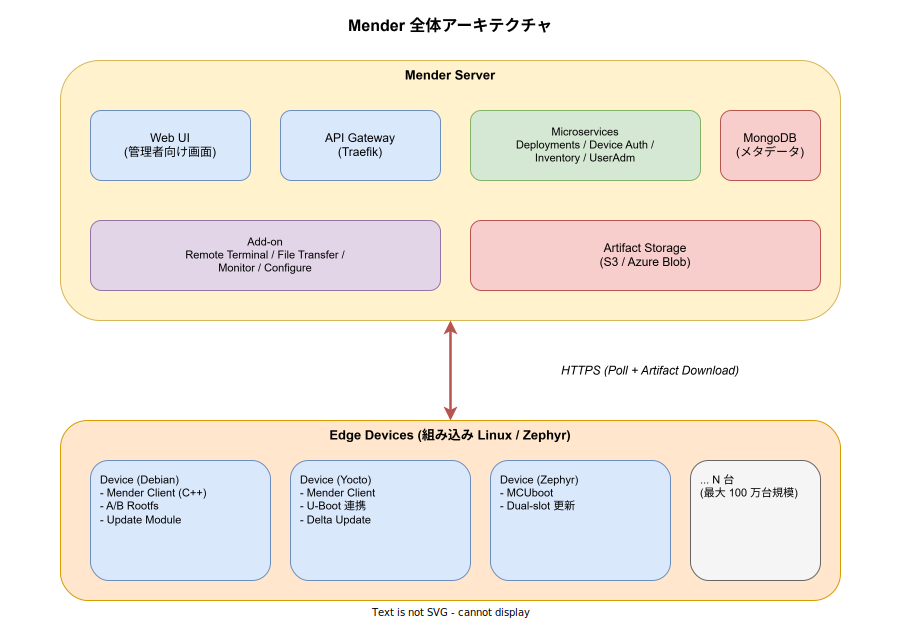
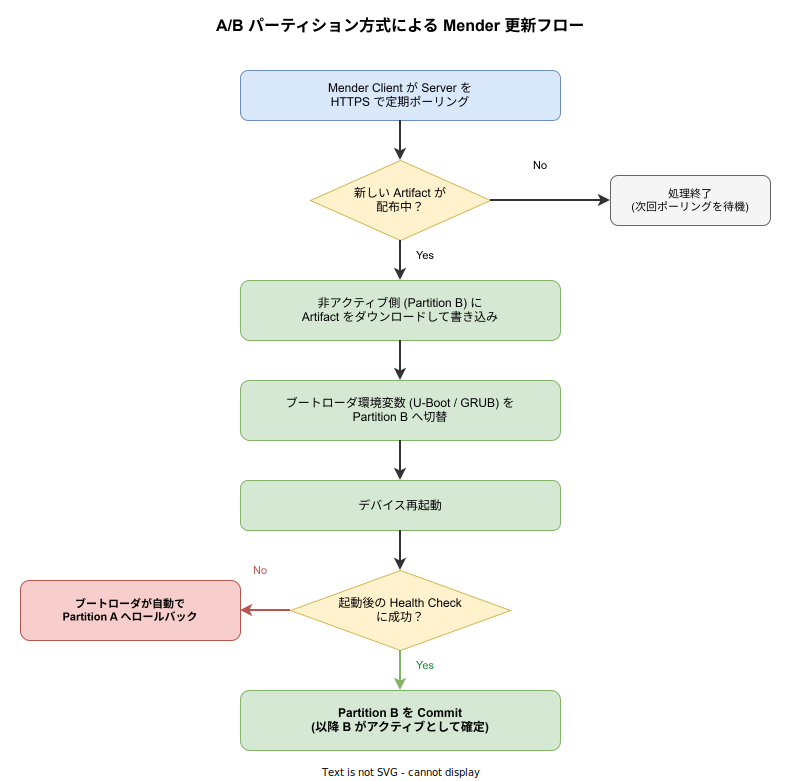

# Mender: 基本

- 対象読者: 組み込み Linux / IoT デバイス運用の経験があり、OTA (Over-The-Air) 更新基盤を学びたい開発者
- 学習目標: Mender が解決する課題と、クライアント・サーバー構成、A/B パーティション方式によるロバストな更新の仕組みを説明できるようになる
- 所要時間: 約 40 分
- 対象バージョン: Mender Client 4.x / Mender Server 3.x (2026-04 時点)
- 最終更新日: 2026-04-15

## 1. このドキュメントで学べること

- OTA 更新基盤として Mender がどのような課題を解くのかを説明できる
- Mender Server と Mender Client の責務分担を理解できる
- A/B パーティション方式による更新と、自動ロールバックの仕組みを説明できる
- Update Module / Delta Update / アドオン機能など主要な拡張点を区別できる
- Debian ベースのデバイスで Mender Client を起動する最小手順を把握できる

## 2. 前提知識

- 組み込み Linux の起動シーケンス (U-Boot / GRUB などのブートローダ) の概念
- systemd によるサービス管理の基礎
- HTTPS / REST API の通信モデル
- コンテナ実行環境 (Docker) の基本操作

## 3. 概要

Mender は、組み込み Linux デバイスおよび Zephyr を用いたマイクロコントローラ向けに、OTA でソフトウェア更新を配信・検証・ロールバックするためのオープンソース基盤である。数十万〜100 万台規模のフィールドデバイスを対象にしており、「途中で電源が落ちてもデバイスをブリック化させない」ことを設計の第一原則として持つ。

従来の組み込み機器では、更新の失敗が直接現地出張や製品回収につながるため、OTA は「動けばよい」ではなく「失敗した時に必ず元に戻せる」ことが最重要になる。Mender はこれを **デュアル A/B ルートファイルシステム** と **ブートローダ連携による自動ロールバック** で実現する。さらに、サーバー側ではマイクロサービス構成のバックエンドにより、グルーピング、段階展開 (Phased Deployment)、デルタ更新、リモートターミナルなどの運用機能を提供する。

ライセンスは Apache License 2.0 のオープンコア方式で、基本の OTA 機能は無償で使える一方、Monitor や Configure などのアドオンは Enterprise プランで提供される。

## 4. 用語の整理

| 用語 | 説明 |
|------|------|
| Mender Server | デバイス認証・更新配信・監視を担う管理サーバー。複数のマイクロサービスで構成される |
| Mender Client | 各デバイス上で動作する更新エージェント。C++ で実装されている |
| Artifact | 配布単位のバイナリパッケージ (`.mender` 形式)。ルートファイルシステムイメージやアプリケーションを内包する |
| A/B パーティション | 同一内容を 2 面持ち、片方を稼働系、もう片方を更新書き込み先として切り替える方式 |
| Update Module | Mender Client が更新対象をどう書き込むかを定義するプラグイン。rootfs, Docker, ファイルなど切替可能 |
| Delta Update | 旧イメージと新イメージの差分のみを転送して帯域を削減する更新方式 |
| Deployment | サーバー側で定義される「どのグループのデバイスに、どの Artifact を配るか」という単位 |

## 5. 仕組み・アーキテクチャ

Mender のデプロイメントは **Mender Server** と **Mender Client** の 2 層で構成される。サーバーはマイクロサービス群 (Deployments / Device Auth / Inventory / UserAdm 等) と MongoDB、S3 互換のオブジェクトストレージから成り、Traefik を API Gateway として配置する。クライアントは軽量なエージェントとして常駐し、一定間隔で HTTPS によるポーリングを行い、開放ポートを持たずに外部からの攻撃面を最小化する。



更新時には A/B パーティション方式を用い、稼働中 (Partition A) に影響を与えずに非稼働側 (Partition B) に新イメージを書き込む。書き込み完了後に再起動し、ブートローダが新パーティションからの起動を試み、起動後のヘルスチェックが成功した場合のみ Commit する。失敗した場合はブートローダが自動的に Partition A へ戻し、デバイスは稼働し続ける。ダウンタイムは通常、再起動にかかる約 60 秒に限られる。



この「失敗したら元に戻る」という性質は、単にクライアントの機能ではなく、ブートローダ (U-Boot / GRUB) と Mender Client の環境変数連携により実現される点が重要である。Mender Client がハングしただけではロールバックされず、`bootcount` の上限超過などブートローダ側の条件で初めて復帰する設計になっている。

## 6. 環境構築

### 6.1 必要なもの

- 評価用 Linux マシン (Ubuntu 22.04 以降を推奨)
- Docker および Docker Compose v2
- ターゲットデバイス (評価時は QEMU 仮想マシンでも可)

### 6.2 セットアップ手順

評価用にサーバーをローカル起動する最小手順を示す。

```bash
# Mender のデモ用リポジトリをクローンする
git clone https://github.com/mendersoftware/integration.git mender-server
# ディレクトリへ移動する
cd mender-server
# デモ構成でサーバーを起動する (初回は数分かかる)
./demo up
```

起動が完了するとローカル UI が `https://localhost` で公開される (自己署名証明書)。

### 6.3 動作確認

```bash
# 起動中のコンテナ一覧を確認する
docker compose ps
# Device Auth サービスのログを確認する
docker compose logs -f mender-device-auth
```

ブラウザで `https://localhost` にアクセスし、デモ用アカウントでログインできればサーバー側は準備完了である。

## 7. 基本の使い方

Debian 系デバイスに Mender Client を導入し、サーバーへ接続する最小構成の例を示す。

```bash
# Mender が提供する APT リポジトリを登録する
sudo install -m 0755 -d /etc/apt/keyrings
# リポジトリ署名鍵を取得する
curl -fsSL https://downloads.mender.io/repos/debian/gpg | sudo tee /etc/apt/keyrings/mender.asc > /dev/null
# APT ソースを追加する
echo "deb [signed-by=/etc/apt/keyrings/mender.asc] https://downloads.mender.io/repos/debian bookworm/stable main" | sudo tee /etc/apt/sources.list.d/mender.list
# パッケージ一覧を更新する
sudo apt-get update
# Mender Client を導入する
sudo apt-get install -y mender-client4
```

導入後、対話コマンドでサーバー URL とテナント情報を設定する。

```bash
# 対話モードで設定ファイルを生成する
sudo mender-setup
# systemd サービスとして起動する
sudo systemctl enable --now mender-client
# デーモンの状態を確認する
systemctl status mender-client
```

### 解説

- `mender-setup` は `/etc/mender/mender.conf` を生成し、サーバー URL・ポーリング間隔・Update Module 設定を書き込む
- `mender-client` は systemd サービスとして動作し、既定で 30 分間隔でサーバーにポーリングし、Deployment が割り当てられると Artifact をダウンロードする
- Debian 向けのデフォルト Update Module は rootfs ではなく `deb` パッケージ更新にフォールバックする。A/B 更新を行うには Yocto または `mender-convert` で A/B レイアウトに変換したイメージが必要である

## 8. ステップアップ

### 8.1 Update Module による拡張

Mender Client は「何をどう書き込むか」を Update Module として外部プラグインに委譲する。標準で rootfs 以外に `docker`, `file`, `script`, `directory` などが提供され、独自の Update Module をシェルスクリプトや実行ファイルで追加することもできる。これにより、OS 更新とアプリケーション更新を同一パイプラインで扱える。

### 8.2 Delta Update

Mender Enterprise は、旧イメージと新イメージの差分のみを転送する Delta Update をサポートする。帯域制約の強いセルラー環境や、数十 MB〜数 GB のイメージを頻繁に配布するシーンで有効である。差分生成はサーバー側で事前に計算され、デバイスに必要な部分のみを送信する。

### 8.3 アドオン (Remote Terminal / Configure / Monitor)

Enterprise プランでは、デバイスへの SSH 相当のシェルアクセスを提供する Remote Terminal、設定ファイルを一元管理する Configure、メトリクスとアラートを扱う Monitor などが提供される。これらは外向きの HTTPS 接続のみで動作するため、NAT 背後のデバイスにもそのまま適用できる。

## 9. よくある落とし穴

- **Debian のパッケージ更新と A/B 更新を混同する**: `apt install mender-client4` だけでは A/B 更新にならない。ルートファイルシステム全体を A/B 方式で差し替えるには Yocto か `mender-convert` で専用イメージを生成する必要がある
- **ブートローダの bootcount 連携を忘れる**: U-Boot 環境変数 (`upgrade_available`, `bootcount`, `bootlimit`) がファームウェア側で正しく扱われていないと、更新失敗時に自動ロールバックが機能せず、起動不能に陥る
- **証明書検証を無効化したまま本番投入する**: デモの `./demo up` は自己署名証明書を使うため、本番展開では Let's Encrypt などで正規の TLS 証明書を設定しないとデバイス側で検証失敗する
- **ポーリング間隔を短くしすぎる**: 既定値は数十分単位である。秒単位に縮めるとサーバー側の負荷とクライアント側の電力消費が跳ね上がる。「即時配信が必要」と感じたら、段階展開と `retry-poll-interval` の調整で代替する

## 10. ベストプラクティス

- Artifact 作成は CI/CD で自動化し、署名鍵で全 Artifact を署名する (クライアント側で検証可能)
- Deployment は必ず **Phased Deployment** で段階的に配る。全台同時配布は失敗時の影響範囲が広すぎる
- Inventory の属性 (ハードウェアリビジョン、地域、顧客) でグループを定義し、グループ単位で配布する
- 本番ではオブジェクトストレージ (S3 / Azure Blob) を別管理し、バックアップ戦略を明示する
- アップデート失敗率を Monitor やログ集約基盤で可視化し、閾値超過で新規 Deployment を自動停止する運用にする

## 11. 演習問題

1. QEMU で起動した `mender-convert` 変換済みイメージに対して、`./demo up` で起動したサーバーから Artifact を配布し、A/B 切替が発生することを確認せよ
2. 意図的に新イメージの `systemd` サービスを失敗させ、`bootlimit` 超過後に Partition A へ自動復帰する挙動を観察せよ
3. 独自の Update Module (例: 設定ファイル書き換え) を実装し、Mender Server から配布できるようにせよ

## 12. さらに学ぶには

- 公式ドキュメント: <https://docs.mender.io/>
- 仕組み解説ページ: <https://mender.io/engineers/how-mender-works>
- Mender Hub (Update Module 等のコミュニティ): <https://hub.mender.io/>
- 関連 Knowledge: [Kubernetes: 基本](./kubernetes_basics.md), [Dapr: 基本](./dapr_basics.md)

## 13. 参考資料

- Mender 公式サイト: <https://mender.io/>
- Mender Client GitHub リポジトリ: <https://github.com/mendersoftware/mender>
- Mender Server (integration) リポジトリ: <https://github.com/mendersoftware/integration>
- Mender 公式ドキュメント - Introduction: <https://docs.mender.io/overview/introduction>
