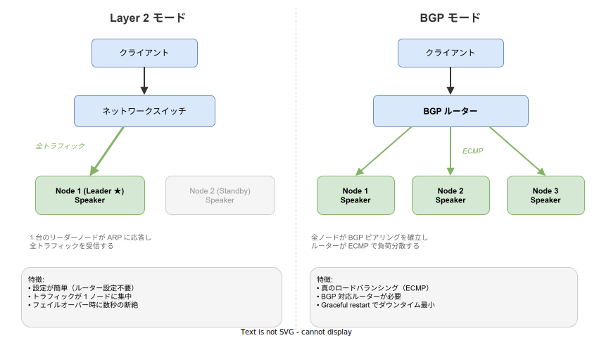

# MetalLB: 基本

- 対象読者: Kubernetes の基本操作（kubectl, Service）を理解している開発者
- 学習目標: MetalLB の仕組みを理解し、ベアメタル Kubernetes クラスタに LoadBalancer を構築できるようになる
- 所要時間: 約 30 分
- 対象バージョン: MetalLB v0.14
- 最終更新日: 2026-04-12

## 1. このドキュメントで学べること

- MetalLB が解決する課題を説明できる
- Layer 2 モードと BGP モードの違いを理解できる
- IPAddressPool と L2Advertisement を設定して LoadBalancer Service に外部 IP を割り当てられる

## 2. 前提知識

- Kubernetes の基本概念（Pod, Service, Namespace）
- kubectl の基本操作
- YAML マニフェストの記法

不足する場合は [Kubernetes: 基本](./kubernetes_basics.md) を参照すること。

## 3. 概要

クラウド環境（AWS, GCP 等）では、Service の type を `LoadBalancer` にするとクラウドプロバイダが自動で外部ロードバランサーを作成する。しかしベアメタル（物理サーバーや自前の仮想マシン）環境にはこの仕組みがないため、LoadBalancer Service は `Pending` 状態のまま外部 IP が割り当てられない。

MetalLB はこの問題を解決するオープンソースのロードバランサー実装である。クラスタ内で動作し、Service に外部 IP アドレスを割り当て、ネットワーク上でその IP を到達可能にする。

## 4. 用語の整理

| 用語 | 説明 |
|------|------|
| ベアメタル | クラウドではなく物理サーバーや自前の仮想マシンで構成された環境 |
| LoadBalancer Service | 外部トラフィックを受け付ける Kubernetes Service の一種 |
| IPAddressPool | MetalLB が Service に割り当てる IP アドレスの範囲を定義する CRD |
| L2Advertisement | Layer 2（ARP/NDP）で IP を通知する設定 CRD |
| BGPAdvertisement | BGP プロトコルで IP を通知する設定 CRD |
| Speaker | 各ノードで稼働する DaemonSet。外部への IP 通知を担当する |
| Controller | Service を監視し IP アドレスの割当を管理する Deployment |
| ARP | IPv4 で MAC アドレスを解決するプロトコル。L2 モードで使用する |
| BGP | ルーター間で経路情報を交換するプロトコル。BGP モードで使用する |
| ECMP | Equal-Cost Multi-Path の略。複数経路に均等にトラフィックを分散する技術 |

## 5. 仕組み・アーキテクチャ

MetalLB は **Controller** と **Speaker** の 2 つのコンポーネントで構成される。


- **Controller**（Deployment）: Service の作成を監視し、IPAddressPool から外部 IP を割り当てる
- **Speaker**（DaemonSet）: 全 Worker Node で稼働し、割り当てられた IP を外部ネットワークに通知する

通知方式は **Layer 2 モード** と **BGP モード** の 2 種類から選択する。



| 項目 | Layer 2 モード | BGP モード |
|------|---------------|-----------|
| 通知方式 | ARP（IPv4）/ NDP（IPv6） | BGP ピアリング |
| 負荷分散 | 1 ノードに集中 | ECMP で全ノードに分散 |
| ルーター設定 | 不要 | BGP 対応ルーターが必要 |
| フェイルオーバー | 数秒の断絶あり | Graceful restart で最小化 |
| 適用場面 | 小規模・開発環境 | 大規模・本番環境 |

## 6. 環境構築

### 6.1 必要なもの

- Kubernetes クラスタ（v1.13 以上）
- kubectl
- Helm（推奨）または kubectl apply

### 6.2 セットアップ手順（Helm の場合）

```bash
# MetalLB の Helm リポジトリを追加する
helm repo add metallb https://metallb.github.io/metallb

# リポジトリを更新する
helm repo update

# metallb-system Namespace に MetalLB をインストールする
helm install metallb metallb/metallb -n metallb-system --create-namespace
```

### 6.3 動作確認

```bash
# MetalLB の Pod が Running 状態であることを確認する
kubectl get pods -n metallb-system
```

controller と speaker の Pod が `Running` になっていればインストール完了である。

## 7. 基本の使い方

Layer 2 モードで LoadBalancer Service に外部 IP を割り当てる最小構成を示す。

```yaml
# MetalLB が割り当てる IP アドレス範囲を定義する
apiVersion: metallb.io/v1beta1
kind: IPAddressPool
metadata:
  # プール名を指定する
  name: default-pool
  # MetalLB の Namespace に配置する
  namespace: metallb-system
spec:
  addresses:
    # 割当可能な IP アドレス範囲を指定する
    - 192.168.1.240-192.168.1.250
---
# Layer 2 モードで IP アドレスを外部に通知する設定
apiVersion: metallb.io/v1beta1
kind: L2Advertisement
metadata:
  # Advertisement 名を指定する
  name: default-l2
  # MetalLB の Namespace に配置する
  namespace: metallb-system
spec:
  ipAddressPools:
    # 通知対象の IPAddressPool を指定する
    - default-pool
```

上記を適用した後、LoadBalancer タイプの Service を作成する。

```yaml
# LoadBalancer Service を作成して外部 IP を取得する
apiVersion: v1
kind: Service
metadata:
  # Service 名を指定する
  name: my-service
spec:
  # LoadBalancer タイプを指定する
  type: LoadBalancer
  selector:
    # 対象の Pod を label で選択する
    app: my-app
  ports:
    # 外部からアクセスするポートを指定する
    - port: 80
      # Pod 側のポートを指定する
      targetPort: 8080
```

```bash
# Service の EXTERNAL-IP が割り当てられたことを確認する
kubectl get svc my-service
```

`EXTERNAL-IP` に IPAddressPool の範囲から IP が割り当てられれば成功である。

## 8. ステップアップ

### 8.1 BGP モードの設定

BGP モードでは BGPPeer リソースでルーターとのピアリングを定義する。

```yaml
# BGP ピアリング先のルーター情報を定義する
apiVersion: metallb.io/v1beta2
kind: BGPPeer
metadata:
  # ピア名を指定する
  name: router-peer
  # MetalLB の Namespace に配置する
  namespace: metallb-system
spec:
  # 自クラスタの AS 番号を指定する
  myASN: 65000
  # ピアルーターの AS 番号を指定する
  peerASN: 65001
  # ピアルーターの IP アドレスを指定する
  peerAddress: 192.168.1.1
---
# BGP で IP アドレスを広告する設定
apiVersion: metallb.io/v1beta1
kind: BGPAdvertisement
metadata:
  # Advertisement 名を指定する
  name: bgp-advert
  # MetalLB の Namespace に配置する
  namespace: metallb-system
spec:
  ipAddressPools:
    # 広告対象の IPAddressPool を指定する
    - default-pool
```

### 8.2 特定の IP を Service に割り当てる

アノテーションで特定の IP を直接指定できる。

```yaml
# 特定の IP を指定する Service の定義
apiVersion: v1
kind: Service
metadata:
  # Service 名を指定する
  name: fixed-ip-service
  annotations:
    # MetalLB に割り当てる IP を直接指定する
    metallb.universe.tf/loadBalancerIPs: 192.168.1.245
spec:
  # LoadBalancer タイプを指定する
  type: LoadBalancer
  selector:
    # 対象の Pod を label で選択する
    app: my-app
  ports:
    # ポートを指定する
    - port: 80
      # Pod 側のポートを指定する
      targetPort: 8080
```

## 9. よくある落とし穴

- **EXTERNAL-IP が Pending のまま**: IPAddressPool と Advertisement リソースの両方が必要。片方だけでは IP が割り当てられない
- **IP が割り当てられるが到達できない**: L2 モードでは同一サブネット内からのみアクセス可能。異なるサブネットの場合は BGP モードを使用する
- **Speaker Pod が起動しない**: 一部の CNI プラグイン（Calico 等）と互換性の問題がある。公式ドキュメントで対応状況を確認する
- **フェイルオーバーが遅い**: L2 モードではリーダー切替時に数秒〜数十秒の断絶が発生する。高可用性が必要な場合は BGP モードを検討する

## 10. ベストプラクティス

- 本番環境では BGP モードを使用し、ECMP による真の負荷分散を活用する
- IPAddressPool のアドレス範囲は、既存のネットワーク機器と競合しない範囲を設定する
- 複数の IPAddressPool を用途別（内部向け / 外部向け）に分離する
- `autoAssign: false` を設定して、意図しない IP 割当を防止する

## 11. 演習問題

1. L2 モードで IPAddressPool と L2Advertisement を作成し、nginx の LoadBalancer Service に外部 IP が割り当てられることを確認せよ
2. 2 つの IPAddressPool を作成し、Service のアノテーションでプールを使い分けよ
3. `kubectl describe svc` でイベントを確認し、MetalLB が IP を割り当てる過程を観察せよ

## 12. さらに学ぶには

- 公式ドキュメント: <https://metallb.io/>
- 関連 Knowledge: [Kubernetes: 基本](./kubernetes_basics.md)
- CNCF Landscape（ネットワーキング）: <https://landscape.cncf.io/>

## 13. 参考資料

- MetalLB Concepts: <https://metallb.io/concepts/>
- MetalLB Configuration: <https://metallb.io/configuration/>
- MetalLB GitHub: <https://github.com/metallb/metallb>
