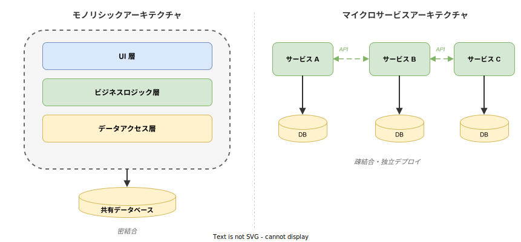
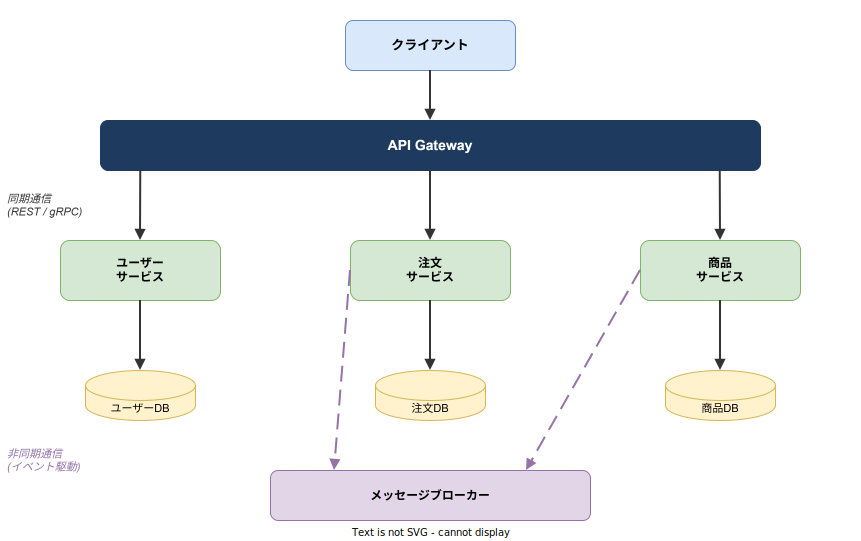

# マイクロサービスアーキテクチャ: 基本

- 対象読者: Web アプリケーション開発の基礎知識を持つ開発者
- 学習目標: マイクロサービスアーキテクチャの設計思想と構成要素を理解し、モノリスとの違いを説明できるようになる
- 所要時間: 約 40 分
- 対象バージョン: アーキテクチャパターンのため特定バージョンなし
- 最終更新日: 2026-04-12

## 1. このドキュメントで学べること

- マイクロサービスアーキテクチャが解決する課題を説明できる
- モノリシックアーキテクチャとの違いを理解できる
- 主要な構成要素（API Gateway・サービス分割・データ分離・非同期通信）の役割を理解できる
- マイクロサービスの利点とトレードオフを判断できる

## 2. 前提知識

- Web アプリケーション（HTTP リクエスト/レスポンス）の基本的な仕組み
- データベースの基本操作（CRUD）
- Docker コンテナの基本概念（推奨）: [Docker の基本](../tool/docker_basics.md)

## 3. 概要

マイクロサービスアーキテクチャは、1 つのアプリケーションを **独立してデプロイ可能な小さなサービスの集合** として構築するアーキテクチャスタイルである。各サービスは特定のビジネス機能（ユーザー管理、注文処理など）を担当し、API を介して互いに通信する。

従来のモノリシックアーキテクチャでは、全機能が 1 つのコードベース・1 つのデプロイ単位にまとめられる。アプリケーションが成長すると、一部の変更が全体に影響し、デプロイやスケーリングが困難になる。マイクロサービスはこの課題に対し、サービスを分離することで **独立した開発・デプロイ・スケーリング** を実現する。

## 4. 用語の整理

| 用語 | 説明 |
|------|------|
| モノリス | 全機能が 1 つのデプロイ単位にまとめられたアーキテクチャ |
| サービス | 特定のビジネス機能を担う独立した実行単位 |
| API Gateway | クライアントからのリクエストを適切なサービスに振り分ける入口 |
| サービス間通信 | サービス同士がデータをやり取りする仕組み（同期 / 非同期） |
| メッセージブローカー | サービス間の非同期メッセージングを仲介するミドルウェア（Kafka、RabbitMQ 等） |
| サービスディスカバリ | 各サービスのネットワーク上の位置を動的に解決する仕組み |
| Database per Service | 各サービスが専用のデータベースを持つ設計原則 |
| 境界づけられたコンテキスト | DDD（ドメイン駆動設計）の概念。サービス分割の指針となるドメインの境界 |

## 5. 仕組み・アーキテクチャ

### モノリスとマイクロサービスの比較

モノリシックアーキテクチャでは全機能が 1 つの単位に結合されるのに対し、マイクロサービスでは各機能が独立したサービスとして分離される。



### マイクロサービスの全体構成

典型的なマイクロサービスアーキテクチャは以下の要素で構成される。



**主要コンポーネント:**

| コンポーネント | 役割 |
|---------------|------|
| API Gateway | クライアントからの全リクエストを受け、認証・ルーティング・レート制限を行う |
| 各サービス | ビジネスドメインごとに分離された独立したアプリケーション |
| サービス専用 DB | 各サービスが独自に管理するデータストア。他サービスからの直接アクセスは禁止 |
| メッセージブローカー | サービス間の非同期イベント通信を仲介する |

## 6. 環境構築

### 6.1 必要なもの

- Docker および Docker Compose
- 任意のプログラミング言語のランタイム（各サービス実装用）

### 6.2 セットアップ手順

マイクロサービスのローカル開発には Docker Compose が適している。以下は最小構成の例である。

```yaml
# マイクロサービス構成の最小 Docker Compose 定義
# 2つの独立したサービスがそれぞれ専用のデータベースを持つ
services:
  # ユーザーサービス: ユーザー管理を担当する
  user-service:
    # サービスのイメージをビルドする
    build: ./user-service
    # サービスのポートを公開する
    ports:
      - "8081:8080"
    # データベース接続先を環境変数で指定する
    environment:
      DATABASE_URL: postgres://user-db:5432/users
    # データベースの起動を待つ
    depends_on:
      - user-db

  # 注文サービス: 注文処理を担当する
  order-service:
    # サービスのイメージをビルドする
    build: ./order-service
    # サービスのポートを公開する
    ports:
      - "8082:8080"
    # データベース接続先を環境変数で指定する
    environment:
      DATABASE_URL: postgres://order-db:5432/orders
    # データベースの起動を待つ
    depends_on:
      - order-db

  # ユーザーサービス専用データベース
  user-db:
    # PostgreSQL イメージを使用する
    image: postgres:16
    # データベース名を設定する
    environment:
      POSTGRES_DB: users
      POSTGRES_PASSWORD: dev_password

  # 注文サービス専用データベース
  order-db:
    # PostgreSQL イメージを使用する
    image: postgres:16
    # データベース名を設定する
    environment:
      POSTGRES_DB: orders
      POSTGRES_PASSWORD: dev_password
```

### 6.3 動作確認

```bash
# 全サービスをバックグラウンドで起動する
docker compose up -d

# 各サービスの稼働状態を確認する
docker compose ps
```

全コンテナの STATUS が `running` であればセットアップ完了である。

## 7. 基本の使い方

マイクロサービスでは、各サービスが REST API や gRPC でエンドポイントを公開し、API Gateway 経由でクライアントに提供する。以下はサービス間通信の基本パターンである。

### 同期通信（REST API）

あるサービスが別のサービスの API を直接呼び出すパターンである。即座にレスポンスが必要な場合に使用する。

```bash
# 注文サービスがユーザーサービスに問い合わせる例
curl http://user-service:8080/users/123
```

### 非同期通信（メッセージング）

イベントをメッセージブローカーに発行し、関心のあるサービスが購読するパターンである。処理の即時性が不要な場合や、サービス間の結合度を下げたい場合に使用する。

例: 注文が確定したとき「注文確定」イベントを発行し、通知サービスがそれを購読してメール送信する。

## 8. ステップアップ

### 8.1 サービス分割の指針

サービスの境界は、DDD の「境界づけられたコンテキスト」に基づいて決定する。分割の判断基準は以下の通りである。

- **ビジネス機能の独立性**: 異なるチームが独立して開発・デプロイできるか
- **データの所有権**: そのデータを「正」として管理するのはどのサービスか
- **変更頻度の違い**: 頻繁に変更される部分と安定した部分を分離する

### 8.2 データ整合性の確保

サービスごとに DB を分離すると、従来のトランザクション（ACID）が使えない。代わりに以下のパターンを使用する。

- **Saga パターン**: 複数サービスにまたがる処理を、補償トランザクション付きのステップに分割する
- **結果整合性**: 最終的にデータが一致することを許容し、即時の整合性を求めない設計

## 9. よくある落とし穴

- **サービスを細かく分割しすぎる**: 通信のオーバーヘッドと運用コストが増大する。最初は粗い粒度で始め、必要に応じて分割する
- **共有データベースの使用**: 複数サービスが同じ DB を参照すると密結合になり、独立デプロイができなくなる
- **分散モノリス**: サービスを分けただけで依存関係が密結合のままだと、モノリスより悪い状態になる
- **同期通信への過度な依存**: 全通信を同期にすると、1 つのサービスの障害が連鎖的に波及する（カスケード障害）

## 10. ベストプラクティス

- サービス分割はビジネスドメインの境界に基づいて行う（技術的な層ではなく）
- 各サービスは専用のデータストアを持ち、他サービスのデータには API 経由でアクセスする
- サービス間通信は可能な限り非同期（イベント駆動）にし、結合度を下げる
- 障害の波及を防ぐためにサーキットブレーカーパターンを導入する
- 集中ログ収集・分散トレーシング・メトリクス監視（オブザーバビリティ）を最初から組み込む
- API のバージョニングにより、後方互換性を維持する

## 11. 演習問題

1. 自分が関わっているアプリケーション（またはよく使う Web サービス）を題材に、3〜5 個のマイクロサービスに分割する設計案を作成せよ。各サービスが担当するデータと API を明確にすること
2. 「注文サービス」と「在庫サービス」の間で、注文確定時に在庫を減らす処理を Saga パターンで設計せよ。正常系と異常系（在庫不足）のフローを図示すること

## 12. さらに学ぶには

- Martin Fowler - Microservices: <https://martinfowler.com/articles/microservices.html>
- 関連 Knowledge: [Kubernetes の基本](./kubernetes_basics.md)（マイクロサービスの運用基盤）
- 関連 Knowledge: [Docker の基本](../tool/docker_basics.md)（コンテナ化の前提知識）
- 推奨書籍: Sam Newman 著「Building Microservices」（O'Reilly）

## 13. 参考資料

- Martin Fowler, James Lewis「Microservices」(2014): <https://martinfowler.com/articles/microservices.html>
- Chris Richardson「Microservices Patterns」(Manning, 2018)
- Sam Newman「Building Microservices, 2nd Edition」(O'Reilly, 2021)
