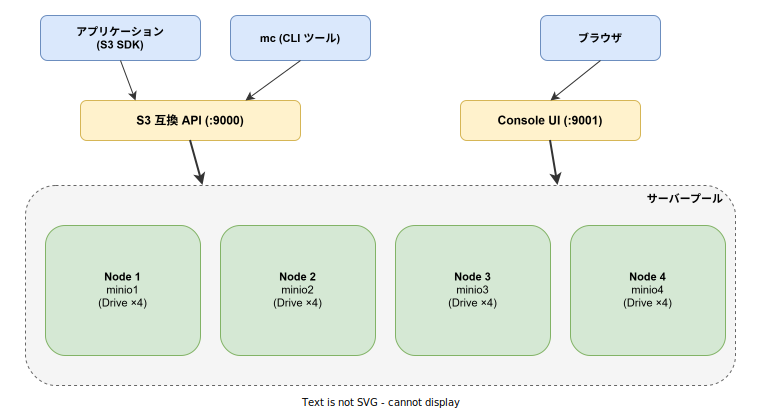
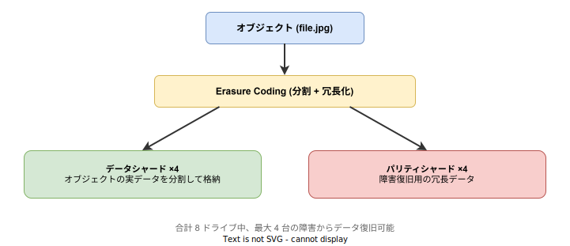

# MinIO: 基本

- 対象読者: Linux の基本操作ができ、オブジェクトストレージの経験がない開発者
- 学習目標: MinIO の役割・構成を理解し、バケットの作成やオブジェクトの操作ができるようになる
- 所要時間: 約 30 分
- 対象バージョン: MinIO RELEASE.2024 以降
- 最終更新日: 2026-04-12

## 1. このドキュメントで学べること

- オブジェクトストレージの概念と MinIO が解決する課題を説明できる
- MinIO のアーキテクチャと Erasure Coding の仕組みを理解できる
- MinIO をローカルに起動し、mc CLI でバケットとオブジェクトを操作できる
- バージョニングやオブジェクトロックの概念を理解できる

## 2. 前提知識

- Linux の基本的なコマンド操作（ファイル操作、プロセス管理）
- Docker の基本操作（docker run）
- HTTP API の基本概念

## 3. 概要

MinIO は、高性能な S3 互換オブジェクトストレージである。Amazon S3 と同じ API で操作でき、オンプレミスやプライベートクラウドに S3 互換のストレージ基盤を構築できる。

**オブジェクトストレージとは:** ファイルシステム（階層的なディレクトリ構造）とは異なり、データを「オブジェクト」という単位でフラットに格納する仕組みである。各オブジェクトはキー（パス）、データ本体、メタデータで構成される。画像、動画、ログ、バックアップなど大量の非構造化データの格納に適している。

MinIO の特徴:

- **S3 互換 API**: AWS S3 と同じ API を提供し、既存の S3 クライアントやツールがそのまま利用できる
- **高性能**: Go 言語で実装され、単一バイナリでデプロイ可能。ハードウェア性能を最大限に活用する
- **Erasure Coding**: データを分割・冗長化し、複数のドライブ障害からデータを自動復旧する
- **暗号化**: サーバーサイド暗号化（SSE-S3, SSE-C, SSE-KMS）に対応する

## 4. 用語の整理

| 用語 | 説明 |
|------|------|
| バケット | オブジェクトを格納するコンテナ。ファイルシステムの最上位ディレクトリに相当 |
| オブジェクト | MinIO に格納されるデータの単位。キー + データ本体 + メタデータで構成 |
| サーバープール | 複数の MinIO ノードをまとめたグループ |
| ノード | 1 つの MinIO サーバープロセス |
| ドライブ | データを格納する物理・論理ディスク |
| Erasure Set | Erasure Coding のためにグループ化されたドライブの集合 |
| mc | MinIO Client。CLI で MinIO を操作するツール |
| Console | MinIO 組み込みの Web UI（ポート 9001） |

## 5. 仕組み・アーキテクチャ

MinIO は S3 互換 API（ポート 9000）と Console UI（ポート 9001）の 2 つのエンドポイントを提供する。



分散構成では、複数のノードとドライブでサーバープールを構成する。MinIO はドライブを自動的に Erasure Set にグループ化し、データを分散配置する。

**Erasure Coding:**



Erasure Coding は、オブジェクトをデータシャードとパリティシャードに分割し、複数のドライブに分散配置する技術である。パリティシャードにより、一部のドライブが故障してもデータを自動復旧できる。RAID やレプリケーションよりもストレージ効率が高い。

## 6. 環境構築

### 6.1 必要なもの

- Docker（ローカル検証の場合）
- mc（MinIO Client CLI）

### 6.2 セットアップ手順（Docker）

```bash
# MinIO コンテナをシングルノードで起動する
# ポート 9000: S3 API、ポート 9001: Console UI
docker run -d \
  --name minio \
  -p 9000:9000 \
  -p 9001:9001 \
  -e MINIO_ROOT_USER=minioadmin \
  -e MINIO_ROOT_PASSWORD=minioadmin \
  minio/minio server /data --console-address ":9001"
```

### 6.3 動作確認

```bash
# mc に MinIO のエイリアスを登録する
mc alias set myminio http://localhost:9000 minioadmin minioadmin

# サーバー情報を確認する
mc admin info myminio

# ブラウザで Console UI にアクセスする（minioadmin / minioadmin）
# http://localhost:9001
```

## 7. 基本の使い方

mc CLI でバケットの作成とオブジェクトの操作を行う。

```bash
# バケットを作成する
mc mb myminio/mybucket

# ローカルファイルをオブジェクトとしてアップロードする
mc cp ./sample.txt myminio/mybucket/sample.txt

# オブジェクトの一覧を表示する
mc ls myminio/mybucket

# オブジェクトの詳細情報を確認する
mc stat myminio/mybucket/sample.txt

# オブジェクトをローカルにダウンロードする
mc cp myminio/mybucket/sample.txt ./downloaded.txt

# オブジェクトを削除する
mc rm myminio/mybucket/sample.txt
```

### 解説

- `mc mb`: Make Bucket の略。バケットを新規作成する
- `mc cp`: S3 API の PutObject / GetObject に対応する。ローカルと MinIO 間のコピーが可能
- `mc ls`: バケット内のオブジェクト一覧を表示する
- `mc stat`: オブジェクトのメタデータ（サイズ、更新日時、ETag 等）を表示する
- `mc rm`: オブジェクトを削除する

## 8. ステップアップ

### 8.1 バージョニング

バケットのバージョニングを有効にすると、オブジェクトの更新・削除時に以前のバージョンが保持される。誤操作からの復旧に有用である。

```bash
# バケットのバージョニングを有効にする
mc version enable myminio/mybucket

# バージョニングの状態を確認する
mc version info myminio/mybucket
```

### 8.2 オブジェクトロック

`mc mb --with-lock` でバケットを作成すると、オブジェクトの削除・上書きを一定期間禁止できる。コンプライアンス要件や監査ログの保護に利用する。

```bash
# オブジェクトロック付きバケットを作成する
mc mb --with-lock myminio/secure-bucket
```

### 8.3 分散構成の起動

本番環境では複数ノード・複数ドライブの分散構成で Erasure Coding を有効にする。

```bash
# 4 ノード × 4 ドライブの分散構成で起動する
minio server https://minio{1...4}.example.net/mnt/disk{1...4}
```

## 9. よくある落とし穴

- **デフォルト認証情報の放置**: minioadmin/minioadmin を本番でそのまま使用するのはセキュリティリスクである
- **シングルノードでの本番運用**: Erasure Coding が機能せず、ドライブ障害でデータが失われる
- **Erasure Set サイズの変更不可**: クラスタ初期化後に Erasure Set のドライブ数は変更できない
- **バケット名の制約**: S3 仕様に準拠し、小文字・数字・ハイフンのみ使用可能で 3〜63 文字である

## 10. ベストプラクティス

- 本番環境では最低 4 ノード × 4 ドライブの分散構成で Erasure Coding を有効にする
- TLS を有効にし、通信を暗号化する
- サーバーサイド暗号化（SSE）で保存データを暗号化する
- バージョニングを有効にし、誤操作からの復旧手段を確保する
- Prometheus / Grafana と連携し、クラスタの監視を行う

## 11. 演習問題

1. Docker で MinIO を起動し、mc CLI でバケット作成とファイルのアップロードを実行せよ
2. Console UI（http://localhost:9001）にログインし、アップロードしたファイルを確認せよ
3. バージョニングを有効にし、同一キーのファイルを 2 回アップロードして両バージョンが保持されることを確認せよ

## 12. さらに学ぶには

- 公式ドキュメント: https://min.io/docs/minio/linux/index.html
- GitHub: https://github.com/minio/minio
- mc リファレンス: https://min.io/docs/minio/linux/reference/minio-mc.html

## 13. 参考資料

- MinIO 公式ドキュメント: https://min.io/docs/minio/linux/index.html
- MinIO Architecture: https://min.io/docs/minio/linux/operations/concepts/architecture.html
- MinIO Erasure Coding: https://min.io/docs/minio/linux/operations/concepts/erasure-coding.html
