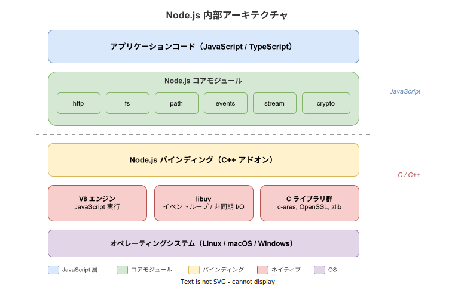
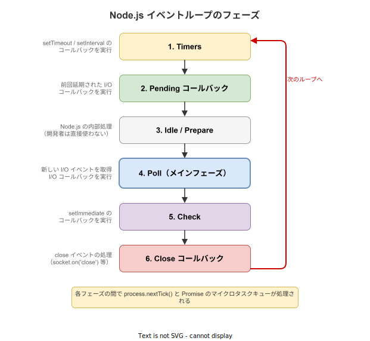

# Node.js: 基本

- 対象読者: プログラミング経験があるが Node.js は未経験の開発者
- 学習目標: Node.js の全体像を理解し、イベントループの仕組みを説明でき、簡単な HTTP サーバーを構築できるようになる
- 所要時間: 約 40 分
- 対象バージョン: Node.js v22 LTS
- 最終更新日: 2026-04-13

## 1. このドキュメントで学べること

- Node.js が何であり、なぜ存在するかを説明できる
- イベントループの仕組みとノンブロッキング I/O の概念を理解できる
- コアモジュール（http, fs, events 等）の基本的な使い方が分かる
- 簡単な HTTP サーバーを作成して動作させられる

## 2. 前提知識

- JavaScript の基本文法（変数、関数、コールバック、Promise）
- HTTP の基礎知識（リクエスト / レスポンスの概念）
- コマンドラインの基本操作

## 3. 概要

Node.js は、Chrome の V8 JavaScript エンジン上に構築されたサーバーサイド JavaScript ランタイムである。ブラウザ内でしか動作しなかった JavaScript を、サーバーサイドやコマンドラインツールなどあらゆる環境で実行できるようにした。

Node.js の最大の特徴は **シングルスレッド・ノンブロッキング I/O** モデルである。1 つのスレッドでイベントループを回し、ファイル読み書きやネットワーク通信などの I/O 操作を非同期で処理する。これにより、大量の同時接続を少ないリソースで効率的に捌くことができる。

## 4. 用語の整理

| 用語 | 説明 |
|------|------|
| V8 | Google が開発した高速 JavaScript エンジン。Node.js の JavaScript 実行基盤 |
| libuv | Node.js のイベントループと非同期 I/O を実装する C ライブラリ |
| イベントループ | I/O イベントを監視し、対応するコールバックを実行する中核メカニズム |
| コールバック | 非同期処理の完了時に呼び出される関数 |
| npm | Node.js のパッケージマネージャ。世界最大のオープンソースライブラリレジストリ |
| コアモジュール | Node.js に組み込まれた標準ライブラリ（http, fs, path, events 等） |

## 5. 仕組み・アーキテクチャ

Node.js は複数の層から構成される。アプリケーションコードは JavaScript で記述し、コアモジュールを通じて C++ バインディング経由でネイティブライブラリを呼び出す。



V8 エンジンが JavaScript を機械語にコンパイルして実行し、libuv がイベントループとプラットフォーム依存の非同期 I/O を抽象化する。この二層構造により、JavaScript から高速かつクロスプラットフォームな I/O 操作が可能になる。

### イベントループ

イベントループは Node.js の心臓部であり、6 つのフェーズを順番に繰り返す。



各フェーズの間には `process.nextTick()` と Promise のマイクロタスクキューが処理される。Poll フェーズが最も重要で、ここで新しい I/O イベントを取得しコールバックを実行する。

## 6. 環境構築

### 6.1 必要なもの

- Node.js（推奨: LTS バージョン）
- テキストエディタ

### 6.2 セットアップ手順

```bash
# Node.js をインストールする（Windows の場合）
winget install OpenJS.NodeJS.LTS

# バージョンを確認する
node --version

# npm のバージョンを確認する
npm --version
```

### 6.3 動作確認

```bash
# REPL（対話環境）を起動して動作を確認する
node -e "console.log('Hello, Node.js!')"
```

`Hello, Node.js!` と出力されればセットアップ完了である。

## 7. 基本の使い方

最小構成の HTTP サーバーを作成する例を示す。

```javascript
// HTTP サーバーの最小構成例
// Node.js 組み込みの http モジュールを読み込む
const http = require('node:http');

// サーバーがリッスンするポート番号を定義する
const PORT = 3000;

// HTTP サーバーを作成する（リクエストごとにコールバックが実行される）
const server = http.createServer((req, res) => {
  // レスポンスのステータスコードを 200（成功）に設定する
  res.statusCode = 200;
  // Content-Type ヘッダを設定する
  res.setHeader('Content-Type', 'text/plain; charset=utf-8');
  // レスポンスボディを書き込んで送信を完了する
  res.end('Hello, Node.js!\n');
});

// 指定ポートでリッスンを開始する
server.listen(PORT, () => {
  // サーバー起動完了をコンソールに出力する
  console.log(`サーバー起動: http://localhost:${PORT}/`);
});
```

### 解説

- `require('node:http')`: Node.js のコアモジュールを読み込む。`node:` プレフィックスは組み込みモジュールであることを明示する
- `http.createServer()`: コールバック関数を受け取り、リクエストごとにその関数を実行する HTTP サーバーを生成する
- `req`（IncomingMessage）: クライアントからのリクエスト情報を持つ読み取り可能ストリーム
- `res`（ServerResponse）: クライアントへのレスポンスを構築する書き込み可能ストリーム
- `server.listen()`: 指定ポートで接続を待ち受け開始する。コールバックはリッスン開始後に 1 度だけ呼ばれる

## 8. ステップアップ

### 8.1 ファイル操作（fs モジュール）

```javascript
// fs モジュールによるファイル読み書きの例
// Promise ベースの fs API を読み込む
const fs = require('node:fs/promises');

// 非同期関数でファイルを読み書きする
async function fileExample() {
  // テキストファイルに文字列を書き込む
  await fs.writeFile('example.txt', 'Node.js からの書き込み');
  // 書き込んだファイルを読み込む
  const content = await fs.readFile('example.txt', 'utf-8');
  // 読み込んだ内容を出力する
  console.log(content);
}

// 関数を実行する
fileExample();
```

### 8.2 EventEmitter パターン

Node.js の多くのコアモジュールはイベント駆動で動作する。その基盤が `EventEmitter` クラスである。

```javascript
// EventEmitter の基本的な使い方
// events モジュールから EventEmitter を読み込む
const { EventEmitter } = require('node:events');

// EventEmitter のインスタンスを生成する
const emitter = new EventEmitter();

// 'greet' イベントのリスナーを登録する
emitter.on('greet', (name) => {
  // 受け取った名前を使って挨拶を出力する
  console.log(`こんにちは、${name}さん！`);
});

// 'greet' イベントを発火する
emitter.emit('greet', 'Node.js');
```

## 9. よくある落とし穴

- **コールバック地獄**: コールバックのネストが深くなると可読性が著しく低下する。`async/await` を使って解消する
- **イベントループのブロック**: CPU 集約的な処理（大量計算、同期ファイル操作）をメインスレッドで実行するとイベントループが止まり、全リクエストが遅延する
- **エラーハンドリングの漏れ**: 非同期処理のエラーを捕捉しないとプロセスがクラッシュする。`try/catch`（async/await）や `.catch()`（Promise）で必ず処理する
- **`require` と `import` の混同**: CommonJS（`require`）と ES Modules（`import`）は異なるモジュールシステムである。`package.json` の `"type"` フィールドで切り替える

## 10. ベストプラクティス

- 非同期 API を優先し、同期 API（`readFileSync` 等）は起動時の設定読み込みなど限定的な場面でのみ使用する
- `async/await` を標準的な非同期処理パターンとして採用する
- 環境変数は `process.env` から読み取り、ハードコードしない
- `node:` プレフィックスを使ってコアモジュールとサードパーティモジュールを明確に区別する

## 11. 演習問題

1. HTTP サーバーを作成し、`/hello` パスにアクセスすると「Hello!」、それ以外のパスでは「Not Found」を返すようにせよ
2. `fs/promises` モジュールを使い、指定ディレクトリ内のファイル一覧を取得して表示するスクリプトを作成せよ
3. `EventEmitter` を拡張したクラスを作成し、独自イベントの発火と購読を実装せよ

## 12. さらに学ぶには

- 公式ドキュメント: <https://nodejs.org/docs/latest/api/>
- Node.js 入門ガイド: <https://nodejs.org/en/learn/getting-started/introduction-to-nodejs>
- 関連 Knowledge: なし（本ドキュメントが Node.js の入門にあたる）

## 13. 参考資料

- Node.js 公式 API ドキュメント: <https://nodejs.org/docs/latest-v22.x/api/>
- libuv Design Overview: <https://docs.libuv.org/en/v1.x/design.html>
- Node.js Event Loop: <https://nodejs.org/en/learn/asynchronous-work/event-loop-timers-and-nexttick>
