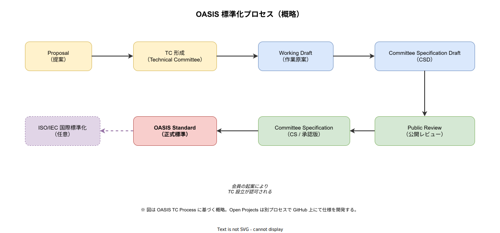
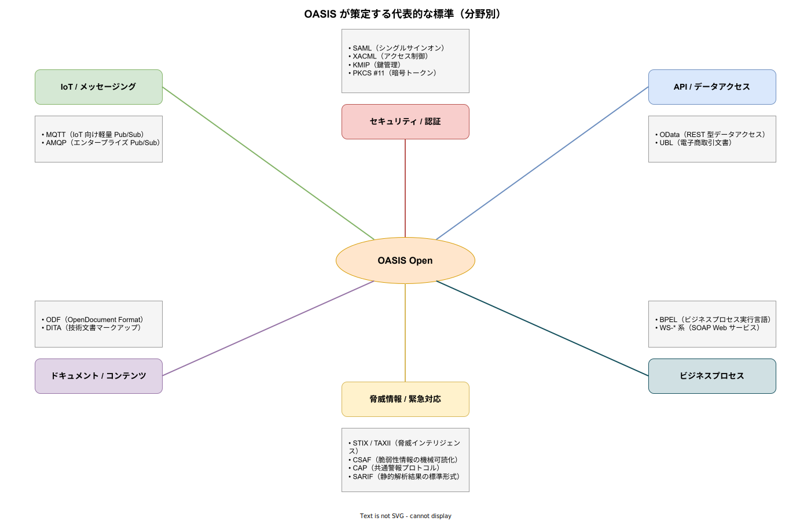

# OASIS: 基本

- 対象読者: 標準化団体やオープンスタンダードの役割を知りたい開発者・アーキテクト
- 学習目標: OASIS の位置付け・標準化プロセス・代表的な標準を理解し、技術選定時に「この仕様は誰が策定したのか」を根拠に判断できるようになる
- 所要時間: 約 30 分
- 対象バージョン: OASIS TC Process v2.0（2024 年改訂版）を基準とする
- 最終更新日: 2026-04-15

## 1. このドキュメントで学べること

- OASIS が「何を目的とする団体か」「なぜ存在するか」を説明できる
- OASIS の標準化プロセス（TC Process）の主な段階を区別できる
- MQTT・SAML・OData など、OASIS 発の代表的な標準を分野別に認識できる
- W3C・IETF・ISO など他の標準化団体との守備範囲の違いを理解できる
- OASIS 標準と OASIS Open Projects の違いを区別できる

## 2. 前提知識

- オープンスタンダード（公開仕様）と独自仕様（ベンダー固有）の違いについての基礎理解
- HTTP・XML・JSON など Web 系データフォーマットの基礎

## 3. 概要

OASIS（Organization for the Advancement of Structured Information Standards、正式名称は OASIS Open）は、構造化情報の相互運用性を高めるためのオープンスタンダードを策定する非営利コンソーシアムである。1993 年に SGML 標準の普及を目的として「SGML Open」の名で設立され、1998 年に現在の OASIS へ改称した。本拠地は米国マサチューセッツ州ボストン。

OASIS が扱う領域は広範で、IoT メッセージング（MQTT）、認証・認可（SAML、XACML）、データアクセス（OData）、事務文書（ODF）、脅威情報共有（STIX/TAXII）、緊急警報（CAP）など、エンタープライズから公共分野まで横断する。ひとつの技術領域に特化した W3C（Web）や IETF（インターネットプロトコル）とは異なり、OASIS は「構造化されたビジネス情報」という切り口で多分野にまたがる点が特徴である。

会員はベンダー・ユーザー企業・政府機関・個人からなり、会員の提案をもとに Technical Committee（TC）を設立して仕様を策定する。策定された OASIS Standard は、必要に応じて ISO/IEC の国際標準としても二次承認される（MQTT、ODF、AMQP など複数の事例がある）。

## 4. 用語の整理

| 用語 | 説明 |
|------|------|
| OASIS Open | OASIS の正式名称。「構造化情報の発展のための組織」の略ではあるが、現在はブランド名として運用されている |
| TC（Technical Committee） | 個別標準を策定するための専門委員会。会員の提案により組織される |
| TC Process | TC による仕様策定の公式ルールを定めた手続き書。最新は v2.0 |
| Working Draft | TC 内で作業中の原案。外部公開は限定的 |
| CSD（Committee Specification Draft） | TC が外部公開可能と判断した段階の草案 |
| CS（Committee Specification） | 公開レビューを経て TC が承認した仕様。事実上の標準として利用可能 |
| OASIS Standard | 全会員による承認投票を通過した最上位の仕様 |
| Open Projects | 2018 年導入の別トラック。GitHub 上で OSS と標準を同時開発する仕組み |
| Sponsor / Foundational | OASIS 会員の最上位区分。議決権と TC 運営への強い関与を持つ |

## 5. 仕組み・アーキテクチャ

### 5.1 標準化プロセス

OASIS Standard は、TC の設立から始まり公開レビューを経て正式承認されるまで、複数のマイルストーンを通過する。各段階で外部からフィードバックを受け付ける仕組みが組み込まれている。



主な段階の役割は次のとおりである。

| 段階 | 役割 |
|------|------|
| Proposal / TC 形成 | 会員 3 名以上の賛同で TC 設立を申請し、理事会承認で活動開始 |
| Working Draft | TC 内部で仕様を詰める作業段階。IP ポリシーに基づき特許開示も管理 |
| CSD / CS | 外部公開と公開レビュー（30〜60 日）を経て CS が確定する |
| OASIS Standard | 全会員投票で承認された最終版。参照実装（Reference Implementation）の存在が求められる |
| ISO/IEC 化 | OASIS Standard のうち希望するものが PAS（Publicly Available Specification）経路で ISO へ提出される |

### 5.2 代表的な標準の分野別マップ

OASIS 標準は分野ごとに大きく 6 系統に整理できる。分野間で依存する標準（例: SAML と XACML）もあるため、関連仕様をセットで把握しておくと実務で有効である。



分野ごとの代表例と用途を整理する。

| 分野 | 代表標準 | 主な用途 |
|------|----------|----------|
| IoT / メッセージング | MQTT、AMQP | デバイス〜クラウド間の Pub/Sub、エンタープライズ・メッセージング |
| セキュリティ / 認証 | SAML、XACML、KMIP、PKCS #11 | SSO、属性ベースアクセス制御、鍵管理、暗号トークン |
| API / データアクセス | OData、UBL | REST 的なデータ照会、電子商取引文書 |
| ドキュメント | ODF、DITA | 事務文書フォーマット、技術文書のモジュール化 |
| 脅威情報 / 緊急対応 | STIX/TAXII、CSAF、CAP、SARIF | 脅威インテリジェンス共有、脆弱性開示、警報配信、静的解析結果交換 |
| ビジネスプロセス | BPEL、WS-* | プロセス実行記述、SOAP 系 Web サービス |

## 6. 環境構築

OASIS 自体はソフトウェアではないため、インストールは不要である。仕様書の入手と参照方法を示す。

### 6.1 公式仕様の入手

- 仕様一覧: https://www.oasis-open.org/standards/
- GitHub（Open Projects）: https://github.com/oasis-open 以下に TC 別・プロジェクト別のリポジトリが配置されている
- 仕様の PDF / HTML 版は CC BY または RF（Royalty Free）ライセンスで無償公開される

### 6.2 バージョン特定のコツ

- URL パスに `/v1.1/` などのバージョンが入る
- ファイル名に `cs01`、`cs02`、`os`（OASIS Standard の略）が付与される。`os` 付きが最終版
- CSPRD（Committee Specification Public Review Draft）は公開レビュー中の草案であり、未確定である点に注意

## 7. 基本の使い方

OASIS 標準は「仕様書を読んで実装する」形で利用する。ここでは MQTT 仕様を対象に、仕様書から実装へ落とし込む最小例を示す。

```rust
// OASIS MQTT v5.0 仕様に準拠した最小の PUBLISH 送信例
// 依存: rumqttc = "0.24"（MQTT v5 対応クライアント）
use rumqttc::v5::{AsyncClient, MqttOptions};
use rumqttc::v5::mqttbytes::QoS;

// エントリポイント（tokio 非同期ランタイム上で動作させる）
#[tokio::main]
async fn main() -> Result<(), Box<dyn std::error::Error>> {
    // OASIS MQTT 仕様で規定された標準ポート 1883 に接続する
    let mut opts = MqttOptions::new("sample-client", "broker.example.com", 1883);
    // ブローカ未応答時の検出間隔（仕様 3.1.2.10 Keep Alive に相当）
    opts.set_keep_alive(std::time::Duration::from_secs(30));
    // クライアントとイベントループを生成する
    let (client, mut eventloop) = AsyncClient::new(opts, 10);
    // PUBLISH メッセージを送信する（トピック、QoS、Retain、ペイロードの順）
    client.publish("sensors/temp", QoS::AtLeastOnce, false, b"22.5".to_vec()).await?;
    // 送信完了後の Ack を受け取るためイベントループを 1 回回す
    let _ = eventloop.poll().await?;
    Ok(())
}
```

### 解説

- `QoS::AtLeastOnce` は MQTT 仕様 4.3.2 に定義された QoS 1 に対応し、PUBACK による送達確認を伴う。
- キープアライブ・トピック階層・ペイロードの扱いは、すべて OASIS 仕様 v5.0 の章番号をたどることで根拠を確認できる。
- このように OASIS 標準は実装ライブラリと仕様書をセットで参照するのが基本である。

## 8. ステップアップ

### 8.1 OASIS Standard と Open Projects の使い分け

- **OASIS Standard**: TC Process に基づく伝統的なトラック。厳格な IP ポリシー・正式投票・参照実装が要求される。MQTT や SAML はこちら。
- **Open Projects**: GitHub フローで OSS と仕様を同時に開発するトラック。CSAF、SARIF などはこちらで運用され、PR ベースで改版が進む。

仕様の安定性と変更頻度のトレードオフを意識して、採用する仕様がどちらのトラックで運営されているかを確認すること。

### 8.2 他の標準化団体との住み分け

- **W3C**: Web プラットフォーム（HTML、CSS、WebAuthn 等）が中心
- **IETF**: インターネットの下位層（TCP、TLS、HTTP、OAuth 2.0 等）
- **ISO/IEC**: 国際標準。OASIS Standard の一部が PAS 経路で ISO へ昇格
- **ITU-T**: 電気通信分野

同一領域でも、SSO は OASIS（SAML）と IETF（OAuth 2.0 / OIDC は OpenID Foundation 管轄）で分担されるなど、重なりと住み分けが混在する。

## 9. よくある落とし穴

- **「OASIS 標準 = ISO 標準」ではない**: ISO 化されているのは一部のみ。必要ならば対応する ISO/IEC 番号を別途確認する
- **Committee Specification を OASIS Standard と混同する**: CS は TC 承認段階で、全会員投票の OASIS Standard とは位置付けが異なる
- **Public Review 中の CSPRD を本番採用する**: 変更される可能性があり、最終版（`os`）の公開を待つのが望ましい
- **バージョン飛び（例: SAML 1.1 → 2.0）で後方互換が切れる**: OASIS 標準は互換性を保証しない場合が多い。仕様の「Compatibility」章を必ず確認する

## 10. ベストプラクティス

- 採用する仕様は「OASIS Standard（`os` 付き）」のものを優先し、CSD / CSPRD 段階の仕様は PoC に限定する
- ライセンスは各標準で明記されるため（多くは RF、一部 RAND）、商用利用の可否を事前に確認する
- 参照実装（Reference Implementation）の有無を確認し、ある場合は仕様解釈の拠りどころとして利用する
- 技術選定時は「策定元（OASIS / W3C / IETF）」と「成熟度（Standard / CS / Draft）」を併記して比較する

## 11. 演習問題

1. MQTT v5.0 の OASIS Standard 公開ページを探し、バージョン識別子（`os` の有無）と発行年を確認せよ
2. SAML 2.0 と XACML 3.0 が同じ企業内で組み合わせて使われる典型シナリオを、1 つの段落で説明せよ
3. 直近 5 年間に OASIS で承認された新規 Standard を 2 つ挙げ、どの分野に属するかを分類せよ

## 12. さらに学ぶには

- 関連 Knowledge: [CNCF: 基本](./cncf_basics.md)（オープンスタンダード団体の対比）、[gRPC: 基本](../protocol/gRPC_basics.md)（IETF / Google 主導プロトコルとの対比）
- OASIS Open 公式サイト: https://www.oasis-open.org/
- OASIS Open Projects: https://www.oasis-open.org/open-projects/
- MQTT 仕様（OASIS Standard v5.0）: https://docs.oasis-open.org/mqtt/mqtt/v5.0/mqtt-v5.0.html

## 13. 参考資料

- OASIS TC Process v2.0: https://www.oasis-open.org/policies-guidelines/tc-process-2017-05-26/
- OASIS Technical Committee 一覧: https://www.oasis-open.org/committees/
- OASIS IPR Policy: https://www.oasis-open.org/policies-guidelines/ipr/
- OASIS Standards 全一覧: https://www.oasis-open.org/standards/
