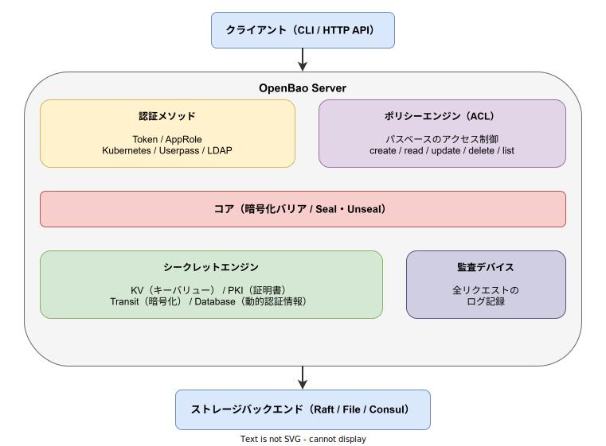
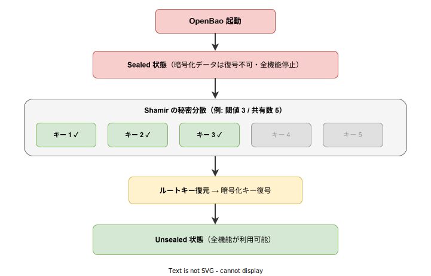

# OpenBao: 基本

- 対象読者: シークレット管理の必要性を感じているが OpenBao は未経験の開発者・インフラエンジニア
- 学習目標: OpenBao の全体像を理解し、開発サーバーでシークレットの読み書きができるようになる
- 所要時間: 約 40 分
- 対象バージョン: OpenBao v2.x
- 最終更新日: 2026-04-12

## 1. このドキュメントで学べること

- OpenBao が解決する課題と存在意義を説明できる
- Seal / Unseal の仕組みを理解できる
- シークレットエンジン・認証メソッド・ポリシーの役割を区別できる
- 開発サーバーを起動してシークレットの CRUD 操作ができる

## 2. 前提知識

- Linux / macOS / Windows のコマンドライン操作
- HTTP API の基本的な概念（リクエスト・レスポンス）
- [Kubernetes: 基本](./kubernetes_basics.md)（Kubernetes 上での運用を想定する場合）

## 3. 概要

OpenBao は、シークレット（API キー、パスワード、証明書など）を安全に管理するためのオープンソースソフトウェアである。HashiCorp Vault のフォークとして Linux Foundation 傘下で開発されている。

従来、シークレットは設定ファイルや環境変数にハードコードされがちであった。OpenBao はこれらを一元管理し、認証・認可・監査の仕組みを通じてアクセスを厳格に制御する。ID ベースのアクセス管理（Identity-based Access）により、「誰が」「何に」アクセスできるかを明確に定義できる。

CLI（コマンド名: `bao`）、HTTP API、Web UI の 3 つのインターフェースを提供する。

## 4. 用語の整理

| 用語 | 説明 |
|------|------|
| シークレット | API キー・パスワード・証明書など、厳格にアクセス制御すべき機密データ |
| Seal / Unseal | サーバー起動時の暗号化状態（Sealed）を解除して運用可能にする仕組み |
| シークレットエンジン | シークレットの生成・保存・暗号化を担うプラグイン機構 |
| 認証メソッド | クライアントの身元を検証する仕組み（Token、AppRole、Kubernetes 等） |
| ポリシー | パスベースのアクセス制御ルール。HCL 形式で記述する |
| トークン | 認証後にクライアントへ発行されるアクセス資格情報 |
| バリア（Barrier） | ストレージとの間で暗号化・復号を行う中間層 |
| Shamir の秘密分散 | ルートキーを複数の断片に分割し、閾値以上の断片でのみ復元できる仕組み |

## 5. 仕組み・アーキテクチャ

OpenBao はクライアントからのリクエストを認証メソッドで検証し、ポリシーで認可した上で、暗号化バリアを通じてシークレットエンジンやストレージにアクセスする。



サーバー起動時は Sealed 状態であり、全機能が停止している。Unseal 処理でルートキーを復元し、暗号化バリアを有効化することで運用可能になる。



Shamir の秘密分散により、ルートキーは複数のキーシェアに分割される。閾値（例: 5 分割中 3 つ）以上のシェアが揃った時点でルートキーが復元される。これにより、単一の管理者がルートキーを独占することを防ぐ。

## 6. 環境構築

### 6.1 必要なもの

- OpenBao バイナリ（公式リリースページからダウンロード）

### 6.2 セットアップ手順

```bash
# OpenBao の公式リリースからバイナリをダウンロードする
# https://github.com/openbao/openbao/releases から OS に応じたバイナリを取得する

# バージョンを確認する
bao version
```

### 6.3 動作確認

```bash
# 開発サーバーを起動する（インメモリ・自動 Unseal・テスト専用）
bao server -dev -dev-root-token-id="dev-only-token"
```

別のターミナルで環境変数を設定する。

```bash
# サーバーアドレスを設定する
export VAULT_ADDR=http://127.0.0.1:8200

# ルートトークンを設定する
export VAULT_TOKEN=dev-only-token

# サーバーの状態を確認する
bao status
```

## 7. 基本の使い方

KV（キーバリュー）シークレットエンジンでシークレットを読み書きする最小例を示す。

```bash
# KV v2 エンジンにシークレットを書き込む
bao kv put secret/myapp/config username="admin" password="s3cret"

# シークレットを読み取る
bao kv get secret/myapp/config

# 特定のフィールドだけを取得する
bao kv get -field=password secret/myapp/config

# シークレットを削除する
bao kv delete secret/myapp/config
```

### 解説

- `secret/` は開発サーバーでデフォルト有効な KV v2 エンジンのマウントパスである
- `myapp/config` はシークレットの論理パス。ディレクトリのように階層化できる
- KV v2 ではバージョン管理が有効であり、過去のバージョンへのロールバックも可能である

## 8. ステップアップ

### 8.1 ポリシーの定義

ポリシーは HCL（HashiCorp Configuration Language）で記述する。

```hcl
# myapp チームのシークレットアクセスポリシー
# secret/data/myapp 配下の読み取りと作成を許可する
path "secret/data/myapp/*" {
  capabilities = ["create", "read", "update", "list"]
}
```

```bash
# ポリシーを登録する
bao policy write myapp-policy policy.hcl

# ポリシーを確認する
bao policy read myapp-policy
```

### 8.2 認証メソッドの有効化

```bash
# Userpass 認証メソッドを有効化する
bao auth enable userpass

# ユーザーを作成してポリシーを紐付ける
bao write auth/userpass/users/dev-user password=changeme token_policies=myapp-policy

# ユーザーとしてログインする
bao login -method=userpass username=dev-user password=changeme
```

### 8.3 動的シークレット

OpenBao はオンデマンドでシークレットを生成する「動的シークレット」をサポートする。データベースの一時的な認証情報を都度生成し、TTL（有効期限）後に自動で無効化できる。静的なパスワードの共有が不要になり、漏洩リスクを低減する。

## 9. よくある落とし穴

- **開発サーバーを本番で使用する**: `-dev` モードはインメモリかつ自動 Unseal であり、再起動でデータが消失する。本番環境では永続ストレージと手動 Unseal を構成する
- **ルートトークンの常用**: ルートトークンは初期設定後に無効化し、最小権限のトークンで運用する
- **ポリシーパスの誤り**: KV v2 では実データのパスが `secret/data/` 配下になる。`secret/myapp` ではなく `secret/data/myapp` をポリシーに指定する
- **Unseal キーの紛失**: Unseal キーを全て紛失するとデータを復号できなくなる。安全な場所に分散保管する

## 10. ベストプラクティス

- Unseal キーは複数の管理者に分散配布し、単独での復元を防ぐ
- ルートトークンは初期構成後に `bao token revoke` で無効化する
- 監査デバイスを必ず有効化し、全アクセスログを記録する
- シークレットには TTL を設定し、定期的にローテーションする
- ポリシーは最小権限の原則に従い、必要最小限のパスと capabilities を付与する

## 11. 演習問題

1. 開発サーバーを起動し、KV エンジンにシークレットを書き込み・読み取り・削除せよ
2. HCL でポリシーを定義し、特定パスへのアクセスのみを許可するトークンを作成せよ
3. Userpass 認証を有効化し、ポリシーを紐付けたユーザーでログインしてシークレットにアクセスせよ

## 12. さらに学ぶには

- 公式ドキュメント: <https://openbao.org/docs/>
- OpenBao GitHub リポジトリ: <https://github.com/openbao/openbao>
- Developer Quick Start: <https://openbao.org/docs/get-started/developer-qs>
- 関連 Knowledge: [Kubernetes: 基本](./kubernetes_basics.md)、[Dapr: 基本](./dapr_basics.md)

## 13. 参考資料

- OpenBao 公式ドキュメント What is OpenBao?: <https://openbao.org/docs/what-is-openbao>
- OpenBao Concepts - Seal/Unseal: <https://openbao.org/docs/concepts/seal>
- OpenBao KV Secrets Engine: <https://openbao.org/docs/secrets/kv/kv-v2>
- OpenBao Auth Methods: <https://openbao.org/docs/auth>
