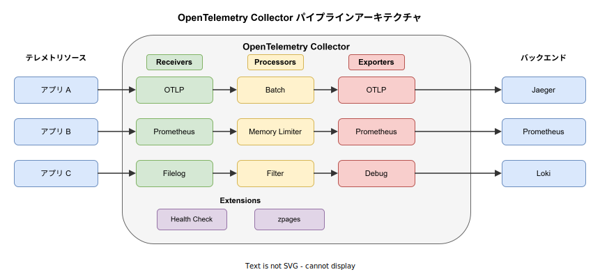
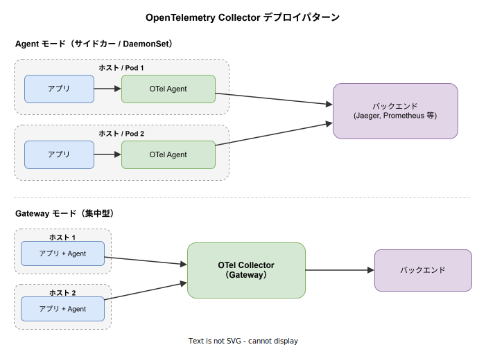

# OpenTelemetry Collector: 基本

- 対象読者: オブザーバビリティの基本概念を理解している開発者
- 学習目標: OTel Collector の全体像を理解し、パイプラインの構成と設定を説明できるようになる
- 所要時間: 約 40 分
- 対象バージョン: OpenTelemetry Collector v0.100 以降
- 最終更新日: 2026-04-12

## 1. このドキュメントで学べること

- OTel Collector が解決する課題と存在意義を説明できる
- Receiver・Processor・Exporter のパイプラインモデルを理解できる
- YAML 設定ファイルの基本構造を読み書きできる
- Agent モードと Gateway モードの違いを区別できる

## 2. 前提知識

- テレメトリデータ（トレース・メトリクス・ログ）の基本概念
- YAML の読み書き
- Docker コンテナの基本操作

## 3. 概要

OpenTelemetry Collector（以下 OTel Collector）は、テレメトリデータを受信・処理・エクスポートするためのベンダー非依存な実行ファイルである。CNCF の OpenTelemetry プロジェクトの一部として開発されている。

OTel Collector が解決する主な課題は、テレメトリデータの収集とルーティングの標準化である。OTel Collector がない場合、各アプリケーションが個別にバックエンド（Jaeger、Prometheus、Datadog 等）へデータを送信する必要がある。OTel Collector を介在させることで、アプリケーションは OTLP（OpenTelemetry Protocol）という単一のプロトコルでデータを送信すればよくなり、バックエンドの切り替えや追加がアプリケーションコードの変更なしに可能になる。

## 4. 用語の整理

| 用語 | 説明 |
|------|------|
| OTLP | OpenTelemetry Protocol。テレメトリデータ送受信の標準プロトコル |
| Receiver | テレメトリデータを Collector に取り込むコンポーネント |
| Processor | 受信したデータを加工・フィルタリングするコンポーネント |
| Exporter | 処理済みデータを外部バックエンドに送信するコンポーネント |
| Connector | パイプライン間を接続し、出力を別パイプラインの入力にするコンポーネント |
| Extension | パイプラインに直接関与せず、Collector の運用を補助する機能（ヘルスチェック等） |
| Pipeline | Receiver → Processor → Exporter を 1 本のデータ経路にまとめたもの |
| Core 版 | 安定コンポーネントのみを含む公式バイナリ |
| Contrib 版 | コミュニティ提供の追加コンポーネントを含む拡張バイナリ |

## 5. 仕組み・アーキテクチャ

OTel Collector はパイプラインモデルで動作する。テレメトリデータは Receiver で受信され、Processor で加工された後、Exporter から外部に送出される。1 つの Collector に複数のパイプラインを定義でき、同一の Receiver を複数のパイプラインで共有することも可能である。



パイプラインはシグナルタイプ（traces / metrics / logs）ごとに定義する。Processor の実行順序は設定ファイル内の記述順に従う。Extension はパイプライン外で動作し、ヘルスチェックやデバッグ用エンドポイントを提供する。

## 6. 環境構築

### 6.1 必要なもの

- Docker Desktop（コンテナで実行する場合）
- または OTel Collector バイナリ（直接実行する場合）

### 6.2 セットアップ手順

```bash
# OTel Collector の Docker イメージを取得する（Contrib 版）
docker pull otel/opentelemetry-collector-contrib:latest

# 設定ファイルを指定して Collector コンテナを起動する
# -p 4317: gRPC ポート、-p 4318: HTTP ポート、-p 13133: ヘルスチェックポート
docker run -d --name otel-collector \
  -p 4317:4317 -p 4318:4318 -p 13133:13133 \
  -v $(pwd)/otel-config.yaml:/etc/otelcol-contrib/config.yaml \
  otel/opentelemetry-collector-contrib:latest
```

### 6.3 動作確認

```bash
# ヘルスチェックエンドポイントに接続して正常起動を確認する
curl http://localhost:13133
```

`{"status":"Server available"}` のようなレスポンスが返れば起動成功である。

## 7. 基本の使い方

最小構成の設定ファイル例を示す。OTLP でデータを受信し、デバッグ出力に送信する構成である。

```yaml
# OTel Collector 最小構成の設定ファイル
# OTLP で受信しデバッグ出力するシンプルな例

# テレメトリデータの受信元を定義する
receivers:
  # OTLP レシーバを有効化する
  otlp:
    # 使用するプロトコルを指定する
    protocols:
      # gRPC でテレメトリを受信するエンドポイントを設定する
      grpc:
        endpoint: 0.0.0.0:4317
      # HTTP でテレメトリを受信するエンドポイントを設定する
      http:
        endpoint: 0.0.0.0:4318

# データの加工処理を定義する
processors:
  # 一定量のデータをまとめて送信するバッチ処理を設定する
  batch:
    # バッチの送信間隔を指定する
    timeout: 1s
    # 1 バッチあたりの最大サイズを指定する
    send_batch_size: 1024

# データの送信先を定義する
exporters:
  # 受信データをコンソールに出力するデバッグ用 Exporter を設定する
  debug:
    # 出力の詳細度を指定する
    verbosity: detailed

# ヘルスチェック等の補助機能を定義する
extensions:
  # Collector の稼働状態を確認するエンドポイントを設定する
  health_check:
    # ヘルスチェックのリッスンアドレスを指定する
    endpoint: 0.0.0.0:13133

# サービス全体の構成を定義する
service:
  # 有効化する Extension を列挙する
  extensions: [health_check]
  # データパイプラインを定義する
  pipelines:
    # トレース用パイプラインを構成する
    traces:
      receivers: [otlp]
      processors: [batch]
      exporters: [debug]
    # メトリクス用パイプラインを構成する
    metrics:
      receivers: [otlp]
      processors: [batch]
      exporters: [debug]
    # ログ用パイプラインを構成する
    logs:
      receivers: [otlp]
      processors: [batch]
      exporters: [debug]
```

### 解説

- `receivers`: データの入口。OTLP は gRPC（4317）と HTTP（4318）の両方で待ち受ける
- `processors`: 受信データへの加工。`batch` は一定量をまとめて送信しスループットを向上させる
- `exporters`: データの出口。`debug` は受信データをログに出力する（検証用途）
- `service.pipelines`: 上記コンポーネントを組み合わせてパイプラインを構成する

## 8. ステップアップ

### 8.1 デプロイパターン

OTel Collector には主に 2 つのデプロイパターンがある。



| パターン | 配置 | 適用場面 |
|----------|------|----------|
| Agent | 各ホスト / Pod にサイドカーとして配置 | ホスト固有のメタデータ付与、ローカルバッファリング |
| Gateway | クラスタに 1〜数台を集中配置 | データ集約、ルーティング、サンプリング |

実運用では Agent と Gateway を組み合わせる構成が一般的である。各ホストの Agent がローカルのテレメトリを収集し、Gateway に転送する。Gateway はデータを集約・フィルタリングした上でバックエンドに送信する。

### 8.2 Core 版と Contrib 版

| 配布形態 | 内容 | Docker イメージ |
|----------|------|----------------|
| Core | 安定した最小限のコンポーネントのみ | `otel/opentelemetry-collector` |
| Contrib | コミュニティ提供の追加コンポーネントを含む | `otel/opentelemetry-collector-contrib` |

開発・検証環境では Contrib 版が便利である。本番環境では必要なコンポーネントのみを含むカスタムビルド（OCB: OpenTelemetry Collector Builder）の利用が推奨される。

## 9. よくある落とし穴

- **Receiver を pipelines に追加し忘れる**: `receivers` セクションに定義しただけではデータは流れない。`service.pipelines` への明示的な追加が必要である
- **Processor の順序**: Processor は記述順に実行される。`memory_limiter` は最初に配置しないとメモリ制限が効果を発揮しない
- **ポートの競合**: 複数の Collector を同一ホストで起動すると、ポート 4317 / 4318 が競合する
- **Core 版に存在しないコンポーネント**: Prometheus Receiver 等は Core 版に含まれない。Contrib 版またはカスタムビルドが必要である

## 10. ベストプラクティス

- `memory_limiter` Processor を全パイプラインの先頭に配置し、OOM を防止する
- `batch` Processor を使ってエクスポート効率を向上させる
- 本番環境では `debug` Exporter を無効化する（パフォーマンスへの影響がある）
- 設定ファイルは環境変数（`${env:VAR_NAME}`）を活用し、環境ごとの差分を最小化する

## 11. 演習問題

1. Docker で OTel Collector（Contrib 版）を起動し、ヘルスチェックエンドポイントが応答することを確認せよ
2. OTLP Receiver と Debug Exporter を使った最小構成の設定ファイルを作成し、Collector を起動せよ
3. トレースとメトリクスで異なる Exporter を使うパイプラインを設定し、シグナルごとに出力先を分離せよ

## 12. さらに学ぶには

- 公式ドキュメント: https://opentelemetry.io/docs/collector/
- OpenTelemetry Collector GitHub: https://github.com/open-telemetry/opentelemetry-collector
- Contrib コンポーネント一覧: https://github.com/open-telemetry/opentelemetry-collector-contrib
- 関連 Knowledge: [Kubernetes: 基本](./kubernetes_basics.md)、[Dapr: 基本](./dapr_basics.md)

## 13. 参考資料

- OpenTelemetry Collector Architecture: https://opentelemetry.io/docs/collector/architecture/
- OpenTelemetry Collector Configuration: https://opentelemetry.io/docs/collector/configuration/
- OpenTelemetry Collector Deployment: https://opentelemetry.io/docs/collector/deployment/
- OTLP Specification: https://opentelemetry.io/docs/specs/otlp/
