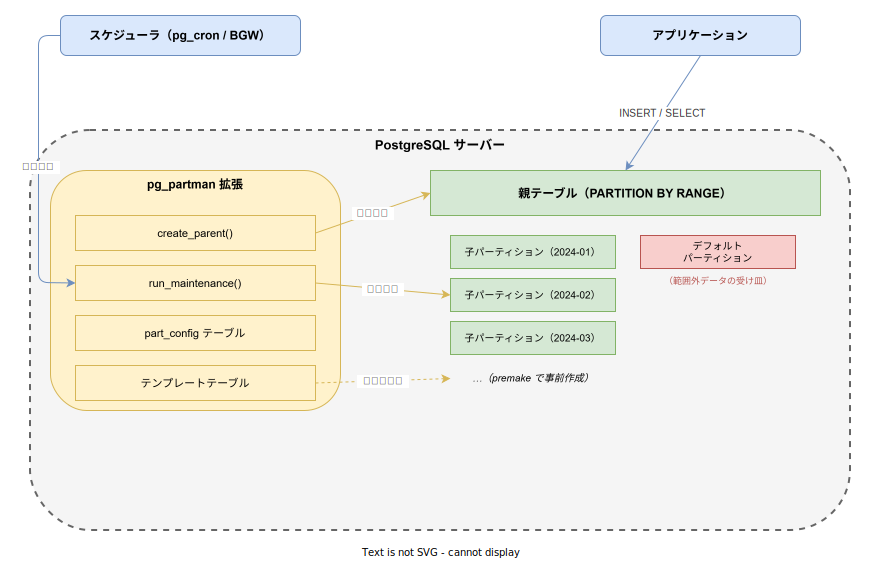
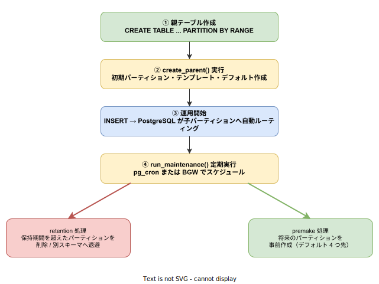

# pg_partman: 基本

- 対象読者: PostgreSQL の基本操作とパーティショニング概念を持つ開発者
- 学習目標: pg_partman を使って時間ベース・ID ベースのパーティション管理を自動化できるようになる
- 所要時間: 約 40 分
- 対象バージョン: pg_partman 5.x / PostgreSQL 14+
- 最終更新日: 2026-04-12

## 1. このドキュメントで学べること

- pg_partman が解決する課題と PostgreSQL ネイティブパーティショニングとの関係を説明できる
- `create_parent()` で自動パーティション管理を設定できる
- `run_maintenance()` による定期メンテナンスの仕組みを理解できる
- retention 設定で古いパーティションの自動削除・退避を構成できる

## 2. 前提知識

- PostgreSQL の基本操作（CREATE TABLE, INSERT, SELECT）
- `PARTITION BY RANGE` によるネイティブパーティショニングの概念
- 関連 Knowledge: [PostgreSQL: 基本](./postgresql_basics.md)

## 3. 概要

pg_partman（PostgreSQL Partition Manager）は、PostgreSQL のネイティブ宣言的パーティショニングを自動管理するための拡張機能である。

PostgreSQL 10 以降、`PARTITION BY RANGE` や `PARTITION BY LIST` によるネイティブパーティショニングが利用可能だが、子パーティションの作成・保守は手動で行う必要がある。データが増え続けるテーブルでは、新しいパーティションの事前作成と古いパーティションの削除・退避を継続的に行う運用が必要となる。

pg_partman はこの運用を自動化する。`create_parent()` で初期設定を行い、`run_maintenance()` を定期実行するだけで、パーティションのライフサイクルが自動管理される。

## 4. 用語の整理

| 用語 | 説明 |
|------|------|
| 親テーブル | `PARTITION BY RANGE` で宣言されたパーティションの起点となるテーブル |
| 子パーティション | 親テーブルの配下に作成される、特定範囲のデータを保持するテーブル |
| Control Column | パーティション分割の基準となる列。日時型または整数型を指定する |
| premake | 現在より先に事前作成するパーティション数。デフォルトは 4 |
| retention | 古いパーティションを自動的に削除・退避するまでの保持期間 |
| part_config | pg_partman の設定を保持する内部管理テーブル |
| テンプレートテーブル | 新しい子パーティション作成時にインデックスや制約を継承する雛形テーブル |
| デフォルトパーティション | どの子パーティションの範囲にも該当しないデータの受け皿 |
| BGW | PostgreSQL の Background Worker。`run_maintenance()` を自動実行する仕組み |

## 5. 仕組み・アーキテクチャ

pg_partman は PostgreSQL の拡張として動作し、ネイティブパーティショニングの管理を自動化する。



**主要コンポーネント:**

| コンポーネント | 役割 |
|---------------|------|
| create_parent() | 親テーブルのパーティション管理を初期設定する関数 |
| run_maintenance() | パーティションの作成・retention 処理を行うメンテナンス関数 |
| part_config テーブル | 各パーティションセットの設定（interval, premake, retention 等）を保持する |
| テンプレートテーブル | 新しい子パーティションに適用するインデックスや制約の雛形 |

**パーティションのライフサイクル:**



`create_parent()` で初期パーティションが作成された後、`run_maintenance()` の定期実行により新しいパーティションの事前作成と古いパーティションの retention 処理が自動的に行われる。

## 6. 環境構築

### 6.1 必要なもの

- PostgreSQL 14 以上
- pg_partman 拡張（パッケージまたはソースからインストール）

### 6.2 セットアップ手順

```sql
-- pg_partman のセットアップ手順

-- partman 用のスキーマを作成する
CREATE SCHEMA IF NOT EXISTS partman;

-- pg_partman 拡張をインストールする
CREATE EXTENSION pg_partman SCHEMA partman;
```

### 6.3 動作確認

```sql
-- インストール確認: バージョン番号が返されれば成功
SELECT extversion FROM pg_extension WHERE extname = 'pg_partman';
```

## 7. 基本の使い方

以下は、時間ベースで月次パーティションを自動管理する最小構成例である。

```sql
-- pg_partman による時間ベース月次パーティション管理の基本例

-- 親テーブルを PARTITION BY RANGE で作成する
CREATE TABLE public.orders (
    -- 注文 ID
    id BIGSERIAL,
    -- 注文日時（パーティション基準列）
    created_at TIMESTAMPTZ NOT NULL DEFAULT NOW(),
    -- 顧客 ID
    customer_id INT NOT NULL,
    -- 注文金額
    amount NUMERIC(10,2) NOT NULL,
    -- パーティションキーは主キーに含める必要がある
    PRIMARY KEY (id, created_at)
) PARTITION BY RANGE (created_at);

-- パーティション基準列にインデックスを作成する
CREATE INDEX ON public.orders (created_at);

-- pg_partman でパーティション管理を開始する
SELECT partman.create_parent(
    -- 管理対象の親テーブル（スキーマ修飾必須）
    p_parent_table := 'public.orders',
    -- パーティション基準列
    p_control := 'created_at',
    -- 月次でパーティションを分割する
    p_interval := '1 month'
);
```

### 解説

- `PARTITION BY RANGE (created_at)`: PostgreSQL ネイティブの範囲パーティションを宣言する
- `PRIMARY KEY (id, created_at)`: PostgreSQL の制約により、パーティションキーは主キーに含める必要がある
- `p_parent_table`: スキーマ名を含む完全修飾テーブル名を指定する
- `p_control`: パーティション分割の基準列。時間型または整数型が利用可能である
- `p_interval`: パーティションの間隔。`'1 month'`, `'1 day'`, `'1 hour'` 等の interval 型に変換可能な値を指定する

`create_parent()` を実行すると、現在の月 + premake 分（デフォルト 4）の子パーティションとデフォルトパーティションが自動作成される。

## 8. ステップアップ

### 8.1 定期メンテナンスの設定

`run_maintenance()` を定期的に実行することで、新しいパーティションの事前作成と retention 処理が行われる。

```sql
-- メンテナンス関数の実行例

-- 全パーティションセットのメンテナンスを実行する
SELECT partman.run_maintenance();

-- 特定テーブルのみメンテナンスを実行する
SELECT partman.run_maintenance('public.orders');
```

定期実行には pg_cron または BGW を使用する。

```sql
-- pg_cron で毎時メンテナンスをスケジュールする
SELECT cron.schedule(
    'partman-maintenance',
    '0 * * * *',
    'SELECT partman.run_maintenance()'
);
```

### 8.2 retention の設定

古いパーティションを自動処理するには、`part_config` テーブルの `retention` 列を設定する。

```sql
-- retention 設定例: 12 か月超のパーティションを自動削除

-- 保持期間と削除動作を設定する
UPDATE partman.part_config
SET retention = '12 months',
    -- false: 完全削除 / true（デフォルト）: 切り離しのみ
    retention_keep_table = false
WHERE parent_table = 'public.orders';
```

`retention_keep_table = true`（デフォルト）の場合、パーティションは親テーブルから切り離されるが削除はされない。`retention_schema` を設定すると別スキーマへの退避も可能である。

### 8.3 ID ベースのパーティション

整数型の列で分割する場合は、`p_interval` に整数値を文字列で指定する。

```sql
-- ID ベースのパーティション設定例

-- イベントテーブルを作成する
CREATE TABLE public.events (
    -- イベント ID
    id BIGSERIAL PRIMARY KEY,
    -- イベント名
    event_name TEXT NOT NULL
) PARTITION BY RANGE (id);

-- 100,000 件ごとにパーティションを作成する
SELECT partman.create_parent(
    p_parent_table := 'public.events',
    p_control := 'id',
    -- 整数値を文字列で指定する
    p_interval := '100000'
);
```

## 9. よくある落とし穴

- **スキーマ修飾の省略**: `p_parent_table` には必ずスキーマ名を含める（`public.orders`）。省略するとエラーになる
- **run_maintenance() の未実行**: `create_parent()` だけでは継続的なパーティション作成は行われない。定期実行の設定が必須である
- **主キーにパーティションキーを含めない**: PostgreSQL の制約として、パーティションキーは主キーや一意制約に含める必要がある
- **premake の不足**: 高トラフィック環境では premake のデフォルト値 4 が不足する場合がある。メンテナンス間隔を考慮して設定する
- **デフォルトパーティションの肥大化**: 範囲外のデータが蓄積される。定期的に監視すること

## 10. ベストプラクティス

- `run_maintenance()` を pg_cron または BGW で 1 時間〜1 日ごとに定期実行する
- premake はメンテナンス間隔の 2 倍以上を確保し、パーティション不足を防ぐ
- retention は最初に `retention_keep_table = true` で運用し、安全を確認してから `false` に切り替える
- テンプレートテーブルにインデックスや制約を定義し、子パーティションへの自動適用を活用する
- `EXPLAIN ANALYZE` でパーティションプルーニングが有効であることを検証する

## 11. 演習問題

1. `logs` テーブル（id, message, created_at）を作成し、pg_partman で日次パーティションを設定せよ
2. `run_maintenance()` を実行し、premake 分のパーティションが作成されることを確認せよ
3. retention を 7 日に設定し、`run_maintenance()` 実行後の動作を確認せよ
4. `EXPLAIN` で SELECT クエリのパーティションプルーニングが有効になっていることを確認せよ

## 12. さらに学ぶには

- 公式リポジトリ: <https://github.com/pgpartman/pg_partman>
- PostgreSQL パーティショニング: <https://www.postgresql.org/docs/current/ddl-partitioning.html>
- 関連 Knowledge: [PostgreSQL: 基本](./postgresql_basics.md)
- 関連 Knowledge: [CloudNativePG: 基本](./cloudnativepg_basics.md)

## 13. 参考資料

- pg_partman 公式ドキュメント: <https://github.com/pgpartman/pg_partman/blob/development/doc/pg_partman.md>
- pg_partman How-To Guide: <https://github.com/pgpartman/pg_partman/blob/development/doc/pg_partman_howto.md>
- pg_partman Migration Guide: <https://github.com/pgpartman/pg_partman/blob/development/doc/migrate_to_partman.md>
