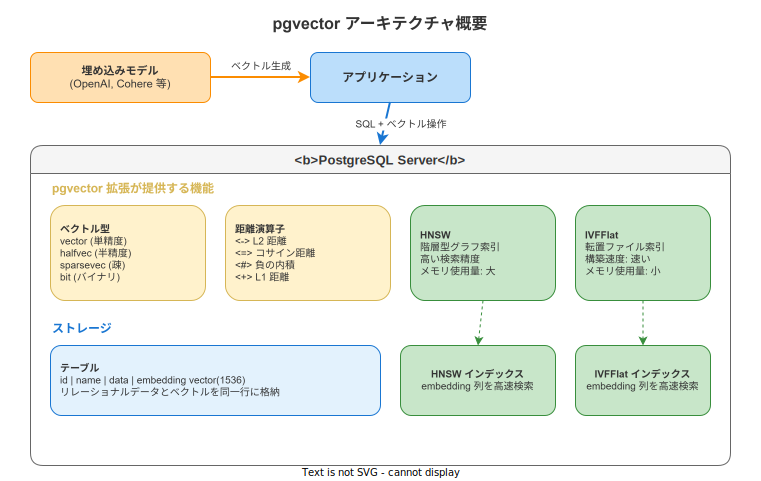
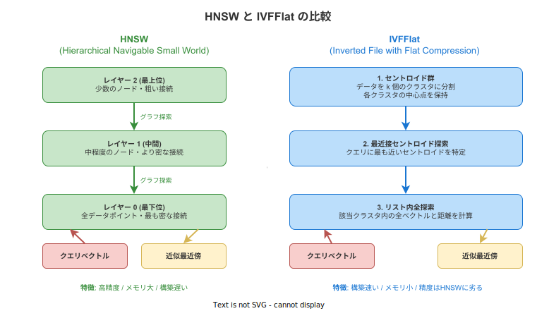

# pgvector: 基本

- 対象読者: PostgreSQL の基本操作ができる開発者
- 学習目標: pgvector を使ってベクトル類似度検索の環境を構築し、基本的なクエリを実行できるようになる
- 所要時間: 約 40 分
- 対象バージョン: pgvector 0.8.0 / PostgreSQL 17
- 最終更新日: 2026-04-12

## 1. このドキュメントで学べること

- pgvector が解決する課題と、なぜ PostgreSQL 内でベクトル検索を行うのかを説明できる
- ベクトル型（vector, halfvec, sparsevec, bit）の違いを区別できる
- 距離演算子を使った類似度検索クエリを書ける
- HNSW と IVFFlat の 2 つのインデックス手法を使い分けられる

## 2. 前提知識

- PostgreSQL の基本操作（テーブル作成、INSERT、SELECT）
- ベクトル（数値の配列）の概念
- 関連 Knowledge: [PostgreSQL: 基本](./postgresql_basics.md)

## 3. 概要

pgvector は、PostgreSQL にベクトル類似度検索機能を追加するオープンソースの拡張（extension）である。テキスト・画像・音声などを埋め込みモデル（Embedding Model）で数値ベクトルに変換し、そのベクトル間の「距離」を計算することで、意味的に近いデータを検索できる。

pgvector を使う主な利点:

- **既存の PostgreSQL に統合**: リレーショナルデータとベクトルを同一テーブルに格納し、SQL で横断的に検索できる
- **ACID 準拠**: トランザクション、レプリケーション、バックアップなど PostgreSQL の機能をそのまま活用できる
- **専用データベース不要**: Pinecone や Weaviate のような専用ベクトルデータベースを別途運用する必要がない
- **最大 16,000 次元**: 主要な埋め込みモデルの出力に対応する十分な次元数をサポートする

## 4. 用語の整理

| 用語 | 説明 |
|------|------|
| ベクトル | 数値の配列。テキストや画像の意味を数値で表現したもの |
| 埋め込み（Embedding） | データをベクトルに変換する処理。または変換後のベクトル自体 |
| 次元（Dimension） | ベクトルの要素数。`vector(1536)` は 1536 次元を意味する |
| 類似度検索 | クエリベクトルに距離が近いベクトルを検索する処理 |
| ANN | Approximate Nearest Neighbor の略。厳密な最近傍ではなく近似解を高速に返す手法 |
| HNSW | Hierarchical Navigable Small World の略。階層型グラフによる ANN インデックス |
| IVFFlat | Inverted File with Flat Compression の略。転置ファイルによる ANN インデックス |

## 5. 仕組み・アーキテクチャ

pgvector は PostgreSQL の拡張として動作し、ベクトル型・距離演算子・インデックスアクセスメソッドを提供する。



アプリケーションは埋め込みモデルでデータをベクトルに変換し、通常の SQL 文でテーブルに格納する。検索時は距離演算子を使って `ORDER BY` するだけで、PostgreSQL のクエリプランナがインデックスを自動的に活用する。

**2 つのインデックス手法:**



| 項目 | HNSW | IVFFlat |
|------|------|---------|
| 検索精度 | 高い | HNSW に劣る |
| 構築速度 | 遅い | 速い |
| メモリ使用量 | 多い | 少ない |
| 推奨場面 | 精度重視の本番環境 | プロトタイプや大量データの初期構築 |

## 6. 環境構築

### 6.1 必要なもの

- PostgreSQL 13 以上（推奨: PostgreSQL 17）
- pgvector 拡張（パッケージマネージャまたはソースからインストール）

### 6.2 セットアップ手順

```bash
# pgvector をインストールする（Ubuntu / Debian の場合）
sudo apt install postgresql-17-pgvector

# psql で接続し、拡張を有効化する
sudo -u postgres psql -d mydb
```

```sql
-- pgvector 拡張を有効化する
CREATE EXTENSION vector;
```

### 6.3 動作確認

```sql
-- vector 型が利用可能か確認する
SELECT '[1,2,3]'::vector;
```

`[1,2,3]` が返れば有効化は完了である。

## 7. 基本の使い方

```sql
-- pgvector の基本的な CRUD と類似度検索を示す例

-- ベクトル列を持つテーブルを作成する
CREATE TABLE items (
    -- 主キーを自動採番で定義する
    id BIGSERIAL PRIMARY KEY,
    -- アイテム名を格納する
    name TEXT,
    -- 3 次元の埋め込みベクトルを格納する
    embedding vector(3)
);

-- データを挿入する
INSERT INTO items (name, embedding) VALUES
    ('りんご', '[1,0,0]'),
    ('みかん', '[0.9,0.1,0]'),
    ('バナナ', '[0.5,0.5,0]'),
    ('トマト', '[0.8,0.2,0.1]'),
    ('きゅうり', '[0,0.3,0.9]');

-- L2 距離で最も近い 3 件を検索する
SELECT name, embedding <-> '[1,0,0]' AS distance
    FROM items
    ORDER BY embedding <-> '[1,0,0]'
    LIMIT 3;

-- コサイン距離で検索する
SELECT name, embedding <=> '[1,0,0]' AS cosine_dist
    FROM items
    ORDER BY embedding <=> '[1,0,0]'
    LIMIT 3;
```

### 解説

- `vector(3)`: 3 次元のベクトル型。カッコ内の数値が次元数を指定する
- `'[1,0,0]'`: ベクトルリテラル。角括弧内にカンマ区切りで値を記述する
- `<->`: L2（ユークリッド）距離演算子。値が小さいほど類似度が高い
- `<=>`: コサイン距離演算子。0 に近いほど方向が似ている
- `ORDER BY ... LIMIT N`: 距離の昇順で並べ、上位 N 件を返す

## 8. ステップアップ

### 8.1 インデックスの作成

データ量が増えると全件スキャンでは遅くなる。インデックスを作成して近似最近傍検索を高速化する。

```sql
-- HNSW インデックスをコサイン距離用に作成する
CREATE INDEX ON items USING hnsw (embedding vector_cosine_ops);

-- IVFFlat インデックスを L2 距離用に作成する（lists はデータ件数に応じて調整する）
CREATE INDEX ON items USING ivfflat (embedding vector_l2_ops) WITH (lists = 100);
```

HNSW の主要パラメータ: `m`（レイヤーあたりの接続数、デフォルト 16）、`ef_construction`（構築時の候補リストサイズ、デフォルト 64）。IVFFlat の `lists` は、100 万行以下なら `行数 / 1000`、100 万行超なら `sqrt(行数)` が目安である。

### 8.2 半精度・疎ベクトル

メモリ節約やスパースな埋め込みには専用型を使う。

```sql
-- 半精度ベクトル列を持つテーブルを作成する
CREATE TABLE docs (
    -- 主キーを自動採番で定義する
    id BIGSERIAL PRIMARY KEY,
    -- 384 次元の半精度ベクトルを格納する
    embedding halfvec(384)
);

-- 疎ベクトル列を持つテーブルを作成する
CREATE TABLE sparse_items (
    -- 主キーを自動採番で定義する
    id BIGSERIAL PRIMARY KEY,
    -- 10000 次元の疎ベクトルを格納する
    embedding sparsevec(10000)
);

-- 疎ベクトルを挿入する（{インデックス:値,...}/次元数 の形式）
INSERT INTO sparse_items (embedding) VALUES ('{1:1.5,100:2.3,5000:0.8}/10000');
```

## 9. よくある落とし穴

- **インデックスなしで大量データを検索**: インデックスがないと全件スキャンになり、数万件を超えるとレスポンスが著しく悪化する
- **次元数の不一致**: テーブル定義とクエリのベクトル次元数が異なるとエラーになる。埋め込みモデルの出力次元を事前に確認する
- **IVFFlat のインデックス作成前にデータが必要**: IVFFlat はデータからクラスタ中心を計算するため、空テーブルでは有効なインデックスを構築できない
- **lists / probes の未調整**: IVFFlat の `lists` が小さすぎると精度が低下し、`probes`（検索時のクラスタ探索数）が少なすぎると結果を見落とす
- **距離演算子とインデックスの不一致**: `vector_cosine_ops` で作成したインデックスは `<=>` でのみ使われる。`<->` で検索すると利用されない

## 10. ベストプラクティス

- 本番環境では HNSW インデックスを推奨する。精度と速度のバランスが優れている
- `CREATE INDEX CONCURRENTLY` を使い、書き込みをブロックせずにインデックスを構築する
- 埋め込みモデルの出力次元に合わせて `vector(N)` の N を正確に指定する
- IVFFlat 使用時は `SET ivfflat.probes = 10;` のようにクエリ前に probes を調整して精度を上げる
- メモリが制約になる場合は `halfvec` 型でストレージを約半分に削減する

## 11. 演習問題

1. `products` テーブル（id, name, embedding vector(4)）を作成し、5 件のデータを挿入せよ
2. L2 距離とコサイン距離でそれぞれ上位 3 件を検索し、結果の違いを観察せよ
3. HNSW インデックスを作成し、`EXPLAIN ANALYZE` で全件スキャンとの性能差を確認せよ

## 12. さらに学ぶには

- 公式リポジトリ: https://github.com/pgvector/pgvector
- 関連 Knowledge: [PostgreSQL: 基本](./postgresql_basics.md)
- 関連 Knowledge: [CloudNativePG: 基本](./cloudnativepg_basics.md)

## 13. 参考資料

- pgvector README: https://github.com/pgvector/pgvector/blob/master/README.md
- pgvector Documentation (Context7): https://context7.com/pgvector/pgvector
