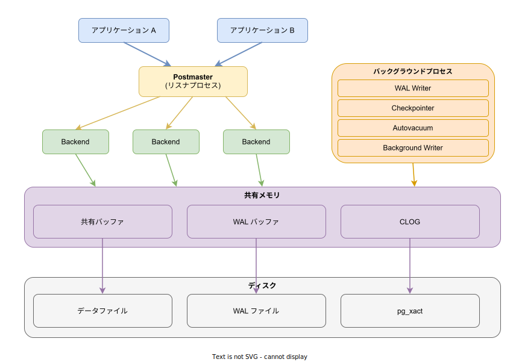
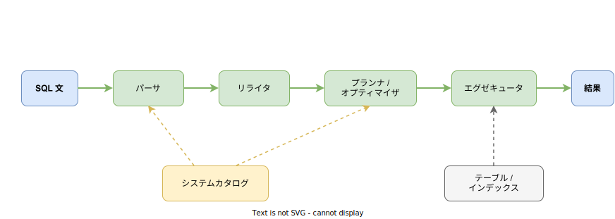

# PostgreSQL: 基本

- 対象読者: SQL の基礎知識を持つ開発者
- 学習目標: PostgreSQL のアーキテクチャを理解し、基本的なデータベース操作ができるようになる
- 所要時間: 約 45 分
- 対象バージョン: PostgreSQL 17
- 最終更新日: 2026-04-12

## 1. このドキュメントで学べること

- PostgreSQL が解決する課題と他の RDBMS との違いを説明できる
- プロセスモデルと共有メモリの役割を理解できる
- テーブルの作成、データの挿入・検索・更新・削除ができる
- トランザクションとインデックスの基本を理解できる

## 2. 前提知識

- SQL の基本構文（SELECT, INSERT, UPDATE, DELETE）の概念
- リレーショナルデータベースの基本概念（テーブル、行、列）

## 3. 概要

PostgreSQL（略称: Postgres）は、オープンソースのオブジェクトリレーショナルデータベース管理システム（ORDBMS）である。1986 年にカリフォルニア大学バークレー校の POSTGRES プロジェクトとして開発が始まり、30 年以上の歴史を持つ。

PostgreSQL の主な特徴:

- **ACID 準拠**: トランザクションの原子性・一貫性・独立性・永続性を保証する
- **MVCC**: 多版型同時実行制御により、読み取りと書き込みが互いをブロックしない
- **豊富なデータ型**: JSON, 配列, 範囲型, 幾何型など標準 SQL を超えるデータ型を提供する
- **拡張性**: 独自のデータ型・関数・演算子・インデックス手法を追加できる
- **標準 SQL 準拠**: SQL 標準への準拠度が高く、移植性に優れる

## 4. 用語の整理

| 用語 | 説明 |
|------|------|
| クラスタ | 1 つの PostgreSQL サーバーインスタンスが管理するデータベースの集合 |
| Postmaster | クライアント接続を受け付けるメインプロセス |
| Backend | 各クライアント接続に対して fork される処理プロセス |
| 共有バッファ | テーブルやインデックスのページをキャッシュする共有メモリ領域 |
| WAL | Write-Ahead Logging の略。変更をデータファイルに書く前にログに記録する仕組み |
| MVCC | Multi-Version Concurrency Control。行の複数バージョンを保持して並行アクセスを実現する |
| VACUUM | 不要になった行バージョンを回収し、ストレージを再利用可能にする処理 |
| トランザクション | 複数の SQL 操作をひとまとまりとして実行する仕組み。全て成功するか全て取り消される |

## 5. 仕組み・アーキテクチャ

PostgreSQL はクライアント/サーバーモデルで動作する。サーバー側は複数のプロセスと共有メモリで構成される。



**プロセス構成:**

| プロセス | 役割 |
|---------|------|
| Postmaster | クライアント接続を受け付け、Backend プロセスを fork する |
| Backend | SQL の解析・最適化・実行を行う。クライアント 1 接続につき 1 プロセス |
| WAL Writer | WAL バッファの内容を WAL ファイルに書き出す |
| Checkpointer | 共有バッファの変更済みページをデータファイルに一括書き出す |
| Autovacuum | 不要な行バージョンを自動的に回収する |
| Background Writer | 共有バッファのダーティページを定期的にディスクに書き出す |

**クエリ処理の流れ:**



SQL 文はパーサ（構文解析）→ リライタ（ビューの展開等）→ プランナ（最適な実行計画の生成）→ エグゼキュータ（実行）の順に処理される。パーサとプランナはシステムカタログ（テーブル定義や統計情報）を参照し、エグゼキュータが実際のデータにアクセスする。

## 6. 環境構築

### 6.1 必要なもの

- PostgreSQL 17（公式サイトまたはパッケージマネージャからインストール）
- psql（PostgreSQL 付属の CLI クライアント）

### 6.2 セットアップ手順

```bash
# PostgreSQL をインストールする（Ubuntu の場合）
sudo apt install postgresql-17

# サービスを起動する
sudo systemctl start postgresql

# postgres ユーザーで psql に接続する
sudo -u postgres psql
```

### 6.3 動作確認

```sql
-- バージョンを確認する
SELECT version();
```

バージョン情報が表示されればセットアップ完了である。

## 7. 基本の使い方

以下は、テーブルの作成から CRUD 操作までの最小構成例である。

```sql
-- PostgreSQL の基本的な CRUD 操作を示す例

-- データベースを作成する
CREATE DATABASE myapp;

-- テーブルを作成する
CREATE TABLE users (
    -- 主キーを自動採番で定義する
    id SERIAL PRIMARY KEY,
    -- ユーザー名（必須、100 文字以内）
    name VARCHAR(100) NOT NULL,
    -- メールアドレス（必須、一意制約付き）
    email VARCHAR(255) NOT NULL UNIQUE,
    -- 作成日時（デフォルトで現在時刻）
    created_at TIMESTAMP DEFAULT CURRENT_TIMESTAMP
);

-- データを挿入する
INSERT INTO users (name, email) VALUES ('田中太郎', 'tanaka@example.com');
-- 複数件のデータを挿入する
INSERT INTO users (name, email) VALUES ('鈴木花子', 'suzuki@example.com');

-- データを検索する
SELECT id, name, email FROM users WHERE name = '田中太郎';

-- データを更新する
UPDATE users SET name = '田中一郎' WHERE id = 1;

-- データを削除する
DELETE FROM users WHERE id = 1;
```

### 解説

- `SERIAL`: 自動採番の整数型。内部的にシーケンスオブジェクトが作成される
- `VARCHAR(n)`: 最大 n 文字の可変長文字列型
- `NOT NULL`: NULL 値を禁止する制約
- `UNIQUE`: 列の値の重複を禁止する制約
- `DEFAULT`: 値を指定しない場合のデフォルト値を設定する

## 8. ステップアップ

### 8.1 トランザクション

複数の操作をまとめて実行し、途中で失敗した場合は全て取り消す。PostgreSQL では個々の SQL 文も暗黙のトランザクション内で実行されるが、`BEGIN` で明示的にトランザクションを開始できる。

```sql
-- トランザクションの基本的な使い方を示す
-- トランザクションを開始する
BEGIN;

-- 口座 A から引き落とす
UPDATE accounts SET balance = balance - 1000 WHERE name = 'A';

-- 口座 B に入金する
UPDATE accounts SET balance = balance + 1000 WHERE name = 'B';

-- 全ての操作を確定する
COMMIT;
```

途中でエラーが発生した場合は `ROLLBACK` で全操作を取り消せる。

### 8.2 インデックス

検索を高速化するためにインデックスを作成する。PostgreSQL はデフォルトで B-tree インデックスを使用する。

```sql
-- インデックスの作成例を示す
-- email 列に B-tree インデックスを作成する
CREATE INDEX idx_users_email ON users (email);

-- 部分インデックス：特定条件の行のみを対象にする
CREATE INDEX idx_active_users ON users (created_at)
    WHERE active = true;
```

インデックスは検索を高速化するが、挿入・更新時にオーバーヘッドが発生する。頻繁に検索条件として使用する列にのみ作成する。

## 9. よくある落とし穴

- **VACUUM の未実行**: 長期間 VACUUM を実行しないとテーブルが肥大化する。Autovacuum を無効化しないこと
- **インデックスの過剰作成**: 全列にインデックスを作ると書き込み性能が低下する
- **SELECT * の多用**: 不要な列まで取得するとネットワーク帯域とメモリを浪費する
- **トランザクションの長時間保持**: 長時間トランザクションは VACUUM の効果を阻害し、テーブル肥大化の原因になる
- **接続数の未管理**: Backend はクライアントごとに 1 プロセス fork される。接続数が多すぎるとメモリを圧迫するため、接続プーラ（PgBouncer 等）の導入を検討する

## 10. ベストプラクティス

- 主キーには `SERIAL` または `BIGSERIAL` を使用し、適切なデータ型を選択する
- 外部キー制約を活用してデータの整合性を保証する
- `EXPLAIN ANALYZE` でクエリの実行計画を確認し、遅いクエリを特定する
- Autovacuum の設定をワークロードに合わせて調整する
- 本番環境では `pg_dump` や WAL アーカイブによるバックアップを設定する
- 接続プーラ（PgBouncer, Pgpool-II）を導入して接続数を管理する

## 11. 演習問題

1. `products` テーブル（id, name, price, stock）を作成し、3 件のデータを挿入せよ
2. `price` が 1000 以上の商品を検索するクエリを書け
3. トランザクション内で 2 つの商品の在庫を同時に更新し、`COMMIT` で確定せよ
4. `price` 列にインデックスを作成し、`EXPLAIN ANALYZE` で検索性能の変化を確認せよ

## 12. さらに学ぶには

- 公式ドキュメント: https://www.postgresql.org/docs/17/
- 公式チュートリアル: https://www.postgresql.org/docs/17/tutorial.html
- PostgreSQL Wiki: https://wiki.postgresql.org/

## 13. 参考資料

- PostgreSQL 17 Documentation - Tutorial: https://www.postgresql.org/docs/17/tutorial.html
- PostgreSQL 17 Documentation - Architecture: https://www.postgresql.org/docs/17/tutorial-arch.html
- PostgreSQL 17 Documentation - SQL Language: https://www.postgresql.org/docs/17/sql.html
