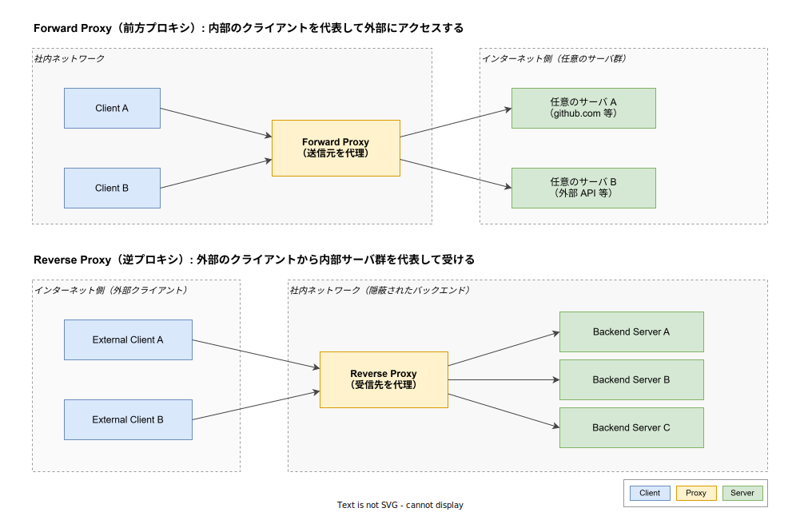
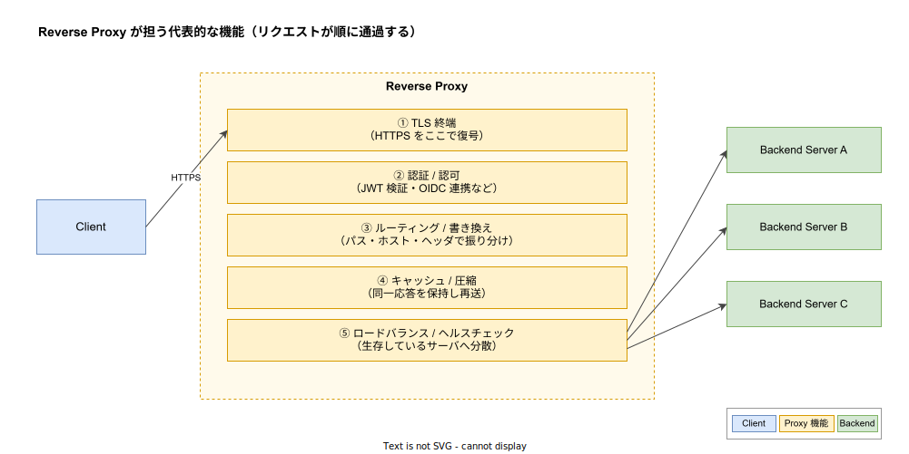

# Proxy: 基本

- 対象読者: HTTP / TCP の基本的な仕組みを理解しているが、Proxy が「何を代理するのか」を整理したことがない開発者
- 学習目標: Forward Proxy と Reverse Proxy の役割を区別して説明でき、Reverse Proxy が担う代表的な機能（TLS 終端・認証・ルーティング・キャッシュ・ロードバランス）を一通り言語化できる状態を目指す
- 所要時間: 約 30 分
- 対象バージョン: 概念解説のため特定バージョンなし。実装例は Nginx 1.27 系で確認
- 最終更新日: 2026-04-28

## 1. このドキュメントで学べること

- Proxy という語が指す「代理」の方向性（送信元の代理 / 受信先の代理）の違いを説明できる
- Forward Proxy と Reverse Proxy が解決する課題と典型的な配置位置を把握できる
- Reverse Proxy が一段の中継で同時に提供できる機能を整理できる
- API Gateway / Load Balancer / Service Mesh と Proxy の重なりと違いを区別できる

## 2. 前提知識

- HTTP リクエスト・レスポンスの基本的な往復モデル
- TCP コネクションが「クライアント・サーバの 2 端点を持つ通信路」であること
- DNS 名前解決の概念（FQDN が IP に解決される流れ）
- 関連: [マイクロサービスアーキテクチャの基本](./microservice-architecture_basics.md)（Reverse Proxy が API Gateway として組み込まれる文脈）

## 3. 概要

Proxy は「クライアントとサーバの間に挟まり、片方を代理して通信する中継者」である。クライアントの代わりにリクエストを送り出すなら Forward Proxy、サーバの代わりにリクエストを受け取るなら Reverse Proxy と呼ばれる。同じ「中継者」であっても、誰の代理かによって解決する課題が異なる。

Forward Proxy は「内部のクライアントを外部に対して匿名化したい」「組織内から外部へのアクセスを制御・監査したい」といった、送信元側の事情から導入される。一方 Reverse Proxy は「外部からの大量のリクエストを内部の複数サーバに分散したい」「TLS 復号や認証を 1 箇所に集約したい」「内部構造を外から見えなくしたい」といった、受信先側の事情から導入される。Web アプリケーション運用で「Proxy」と言えば、通常は Reverse Proxy を指す。

## 4. 用語の整理

| 用語 | 説明 |
|------|------|
| Forward Proxy | 送信元（クライアント）を代理する中継者。社内 → 外部の方向で挟まる |
| Reverse Proxy | 受信先（サーバ）を代理する中継者。外部 → 社内の方向で挟まる |
| TLS 終端 | クライアントとの HTTPS 通信を Proxy で復号し、内部は HTTP で扱うこと |
| アップストリーム | Proxy から見たバックエンドサーバ。Nginx 等の用語で頻出する |
| ヘルスチェック | バックエンドの生存確認。応答しないサーバを振り分け対象から外す |
| API Gateway | Reverse Proxy に「API キー検証」「レート制限」「変換」を加えた上位概念 |
| Service Mesh | 各アプリの隣に Proxy を配置し、サービス間通信を一括制御する分散 Proxy 構成 |
| TPROXY / 透過プロキシ | クライアントが Proxy の存在を意識せず、ネットワーク層で強制的に経路を曲げる方式 |

## 5. 仕組み・アーキテクチャ

### Forward Proxy と Reverse Proxy の対比

両者は通信路上の「位置」と「誰の代理か」が裏返しの関係にある。下図では、Forward Proxy が社内クライアントをまとめて外部の任意サーバに代理アクセスし、Reverse Proxy が外部クライアントから来るリクエストを受け止めて社内サーバ群に振り分ける構図を示す。



判別のコツは「Proxy の IP アドレスが、誰から見えるか」である。Forward Proxy は外部サーバから見て「クライアントの IP」として見え、Reverse Proxy は外部クライアントから見て「サーバの IP」として見える。つまり Proxy は常に、自分が代理している側の存在を相手から隠す。

### Reverse Proxy が一段で担う機能

Reverse Proxy はリクエストを次段に渡す前に、複数の処理をパイプラインとして適用する。下図はクライアントから入った HTTPS リクエストが、復号 → 認証 → ルーティング → キャッシュ判定 → ロードバランスの順で処理され、最終的にバックエンドに渡る様子を示している。



これらを Proxy 一段に集約する利点は、各バックエンドアプリから「TLS 証明書管理」「認証ロジック」「分散ロジック」を切り離せる点にある。アプリは平文 HTTP で自分のドメインロジックだけを実装し、横断関心事は Proxy 側に寄せる。Service Mesh の Sidecar Proxy（Istio Ambient における ztunnel / waypoint など）も、この発想を各 Pod 単位に細分化したものと位置づけられる。

## 6. 環境構築

### 6.1 必要なもの

- Docker（Nginx をコンテナで起動するため）
- 任意の HTTP クライアント（`curl` で十分）

### 6.2 セットアップ手順

ローカルで Reverse Proxy の挙動を最小構成で確認するため、Nginx を 1 つの Docker コンテナとして起動し、2 つのバックエンドへ振り分ける構成を組む。

1. 後述の 7 章の `nginx.conf` と `docker-compose.yml` を作業ディレクトリに作る
2. `docker compose up -d` で 3 コンテナを起動する
3. `curl http://localhost:8080/` を数回叩き、応答ヘッダの `X-Backend` が交互に変わることを確認する

### 6.3 動作確認

```bash
# Nginx を介してバックエンドに到達できることを確認する
curl -i http://localhost:8080/
```

`HTTP/1.1 200 OK` と `X-Backend: backend-a` または `backend-b` が返れば成功である。

## 7. 基本の使い方

最小の Reverse Proxy 設定を Nginx で書く。`upstream` ディレクティブでバックエンド群を束ね、`proxy_pass` でそこに転送する。

```nginx
# Reverse Proxy 最小構成: 2 つのバックエンドにラウンドロビンで振り分ける
# upstream でバックエンド群を 1 つの論理名 "backend" にまとめる
upstream backend {
    # backend-a:80 を振り分け候補に登録する
    server backend-a:80;
    # backend-b:80 を振り分け候補に登録する
    server backend-b:80;
}

# 8080 番ポートで外部からのリクエストを受ける
server {
    # クライアントから見える待ち受けポート
    listen 8080;

    # ルートパス配下のリクエストをすべて upstream に転送する
    location / {
        # upstream "backend" にリクエストをパスする
        proxy_pass http://backend;
        # 元のクライアント IP をバックエンドに伝える
        proxy_set_header X-Forwarded-For $proxy_add_x_forwarded_for;
        # 元のホスト名をバックエンドに伝える
        proxy_set_header Host $host;
    }
}
```

```yaml
# Nginx Reverse Proxy + 2 つのバックエンドを起動する Docker Compose 定義
services:
  # Reverse Proxy 本体
  proxy:
    # 軽量な公式 Nginx イメージを利用する
    image: nginx:1.27-alpine
    # 設定ファイルをマウントする
    volumes:
      - ./nginx.conf:/etc/nginx/conf.d/default.conf:ro
    # ホストの 8080 番にバインドする
    ports:
      - "8080:8080"
  # バックエンド A: 応答ヘッダで自分の名を返す
  backend-a:
    # 応答に X-Backend: backend-a を付ける軽量 echo サーバ
    image: hashicorp/http-echo:1.0
    command: ["-text=from backend-a"]
  # バックエンド B: 応答ヘッダで自分の名を返す
  backend-b:
    # 応答に X-Backend: backend-b を付ける軽量 echo サーバ
    image: hashicorp/http-echo:1.0
    command: ["-text=from backend-b"]
```

### 解説

`upstream backend` は「backend という名前を 2 台のサーバ群に解決する」論理グループである。`proxy_pass http://backend;` の右辺はこの論理名であり、Nginx は内部のロードバランサ（既定はラウンドロビン）で実際の転送先を毎回選ぶ。`X-Forwarded-For` を付けないと、バックエンドから見たクライアント IP が常に Proxy の IP になり、アクセスログや IP 制限が機能しなくなる。

## 8. ステップアップ

### 8.1 ロードバランサ・API Gateway との関係

Reverse Proxy / Load Balancer / API Gateway は重なり合う概念で、現実のプロダクトは複数を兼ねる。区別の軸は「何をキーに振り分けるか」「何を変換するか」である。Load Balancer は L4（TCP/UDP のポートと IP）を見て分散することが多いのに対し、Reverse Proxy は L7（HTTP メソッド・パス・ヘッダ）まで解釈する。API Gateway は Reverse Proxy に加えて API キー検証・レート制限・スキーマ変換・課金カウントなど API 公開固有の機能を持つ。Kong や Envoy ベースの Gateway はこの帯域に位置づく。

### 8.2 Service Mesh との接続

k1s0 で採用している Istio Ambient Mode は、各ノードに Reverse Proxy（ztunnel）を配置し、L7 機能が必要な場合のみ waypoint Proxy を経由させる構成である。アプリから見れば「いつの間にか Proxy が挟まっている」状態になり、TLS 相互認証や認可ポリシが Proxy 層で透過的に効く。集中型 Reverse Proxy が「入口に 1 台」なのに対し、Service Mesh は「Pod の数だけ」分散させた Proxy 群と捉えるとよい。詳細は [Istio Ambient Mode](./istio_ambient-mode.md) を参照する。

## 9. よくある落とし穴

- **クライアント IP のすり替え**: Proxy 経由になるとバックエンドから見たクライアント IP が Proxy 自身の IP になる。`X-Forwarded-For` / `Forwarded` ヘッダを設定し、バックエンド側でも信頼するヘッダを限定して読む必要がある
- **TLS 終端の境界誤認**: Proxy で復号した後、Proxy → バックエンドが平文になっていることを忘れて社内通信を保護したつもりになる事故が起きる。社外クライアント側の TLS と社内 mTLS は別概念として扱う
- **タイムアウトの不一致**: Proxy のタイムアウトがバックエンドより短いと、長い処理が途中で 504 になる。逆に長すぎると詰まったコネクションが滞留する。両端を意識して設定する
- **コネクション数の頭打ち**: Proxy はクライアント側の接続を集約するため、自身が抱える同時接続数が単一プロセスの上限を超えると詰まる。`worker_connections` 等のチューニングが要る
- **Forward と Reverse の混同**: 「企業内 LAN の出口で外部にアクセスする中継」と「社外公開サービスの入口で受ける中継」を同じ Proxy 製品で実装できるが、設定と責務はまったく別物として扱う

## 10. ベストプラクティス

- 横断関心事（TLS・認証・レート制限・ログ）は Proxy 層に寄せ、アプリのコードベースに重複させない
- ヘルスチェックは Proxy で必ず有効にし、応答しないバックエンドを自動で振り分けから外す
- 観測のために、Proxy が付与する一意なリクエスト ID（`X-Request-Id` 等）をバックエンドのログにも引き継ぐ
- TLS 証明書のローテーションは Proxy 側で完結させ、各アプリは証明書を意識しない構成にする
- API Gateway 機能（変換・課金・スキーマ管理）が必要になったら、汎用 Reverse Proxy に詰め込まずに専用プロダクト（Kong 等）に切り出す
- Service Mesh を導入する場合、入口 Proxy（Ingress / Gateway）と Sidecar Proxy の責務を明確に分け、機能が二重化しないようにする

## 11. 演習問題

1. 自社サービスの構成図を描き、「Forward Proxy が必要な場面」と「Reverse Proxy が必要な場面」を 1 つずつ挙げよ。それぞれが解決する課題を 1 文で説明すること
2. 7 章の Nginx 構成に「`/api/` パスは backend-a のみ、それ以外は backend-b のみに振り分ける」ルーティングを追加せよ。`location` ブロックの分岐で実装すること
3. Reverse Proxy で TLS 終端する構成と、TLS 終端せずパススルーする構成のトレードオフを 3 点挙げよ（鍵管理 / 観測性 / E2E 暗号化の観点）

## 12. さらに学ぶには

- 公式: Nginx Reverse Proxy ガイド <https://docs.nginx.com/nginx/admin-guide/web-server/reverse-proxy/>
- 公式: MDN「Proxy server」 <https://developer.mozilla.org/ja/docs/Glossary/Proxy_server>
- 関連 Knowledge: [Istio Ambient Mode](./istio_ambient-mode.md) — Service Mesh としての分散 Proxy 構成
- 関連 Knowledge: [マイクロサービスアーキテクチャの基本](./microservice-architecture_basics.md) — Reverse Proxy / API Gateway の文脈
- 関連 Knowledge: [REST API の基本](../protocol/rest-api_basics.md) — Proxy の上を流れる代表的なプロトコル

## 13. 参考資料

- RFC 9110「HTTP Semantics」§ 7.6 Intermediaries: <https://www.rfc-editor.org/rfc/rfc9110#name-intermediaries>
- RFC 7239「Forwarded HTTP Extension」: <https://www.rfc-editor.org/rfc/rfc7239>
- Nginx 公式ドキュメント `ngx_http_proxy_module`: <https://nginx.org/en/docs/http/ngx_http_proxy_module.html>
- Envoy Proxy Architecture Overview: <https://www.envoyproxy.io/docs/envoy/latest/intro/arch_overview/intro/intro>
