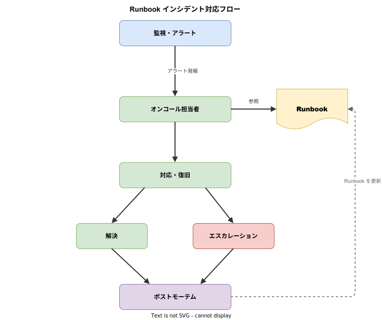
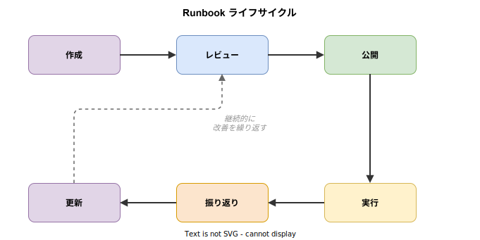

# Runbook: 基本

- 対象読者: システム運用に関わる開発者・SRE・インフラエンジニア
- 学習目標: Runbook の目的と構成を理解し、実用的な Runbook を自力で作成できるようになる
- 所要時間: 約 25 分
- 対象バージョン: 概念のため特定バージョンなし
- 最終更新日: 2026-04-13

## 1. このドキュメントで学べること

- Runbook が「何であるか」「なぜ必要か」を説明できる
- Runbook の種類と使い分けを理解できる
- 効果的な Runbook の構成要素を把握できる
- Runbook のライフサイクル（作成から更新まで）を理解できる
- 最小限の Runbook を作成できる

## 2. 前提知識

- システム運用の基本概念（監視、アラート、インシデント対応）
- マークダウンの基本記法
- 参照: [Chaos Engineering: 基本](./chaos-engineering_basics.md)（インシデント対応の実践と関連）

## 3. 概要

Runbook（ランブック）は、システム運用における手順を文書化したものである。「誰が対応しても同じ品質で作業を完了できる」ことを目的とする。

従来、運用手順は担当者の経験と記憶に依存していた。これは以下の問題を引き起こす。

- 担当者不在時に対応できない（バスファクター問題）
- 対応品質が担当者のスキルに左右される
- 新規メンバーのオンボーディングに時間がかかる
- インシデント対応時に焦りから手順を誤る

Runbook はこれらの問題を解決する。手順を明文化することで、経験の浅いメンバーでもベテランと同等の手順で対応できる。Google の SRE プラクティスにおいても、Runbook はインシデント対応時間（MTTR）の短縮に不可欠な要素として位置づけられている。

## 4. 用語の整理

| 用語 | 説明 |
|------|------|
| Runbook | システム運用の手順を文書化したドキュメント。手順書・操作手順書とも呼ばれる |
| MTTR | Mean Time To Recovery の略。障害発生から復旧までの平均時間 |
| オンコール | 障害発生時に対応する待機当番の仕組み |
| エスカレーション | 自身で解決できない問題を上位の担当者やチームに引き継ぐこと |
| ポストモーテム | インシデント後に原因分析と再発防止策を検討する振り返りプロセス |
| SRE | Site Reliability Engineering の略。Google が提唱したシステム信頼性工学 |

## 5. 仕組み・アーキテクチャ

### Runbook のインシデント対応フロー

Runbook はインシデント対応の中心的な役割を果たす。以下の図は、アラート発報から復旧、そして Runbook の更新までの流れを示す。



監視システムがアラートを発報すると、オンコール担当者が該当する Runbook を参照し、記載された手順に従って対応する。対応後のポストモーテムで得られた知見は Runbook に反映され、次回以降の対応品質を向上させる。

### Runbook のライフサイクル

Runbook は一度作成して終わりではなく、継続的に改善するものである。



初回の作成後、レビューを経て公開する。実際の運用で使用したあと、振り返りで改善点を洗い出し、更新する。更新後は再度レビューを行い品質を担保する。

## 6. 環境構築

Runbook は特定のツールに依存しない。以下の環境があれば作成・運用できる。

### 6.1 必要なもの

- テキストエディタ（VS Code、Vim など）
- バージョン管理システム（Git）
- ドキュメントホスティング（GitHub Wiki、Confluence、Notion など）

### 6.2 推奨ディレクトリ構成

```
runbooks/
├── incident/          # インシデント対応用
│   ├── high-cpu.md
│   └── database-down.md
├── maintenance/       # 定期メンテナンス用
│   ├── certificate-renewal.md
│   └── log-rotation.md
└── deployment/        # デプロイ手順用
    └── production-deploy.md
```

### 6.3 動作確認

Runbook は文書であるため、「動作確認」は作成した Runbook を別のメンバーに渡し、手順どおりに実行できるかを確認する形で行う。

## 7. 基本の使い方

以下は CPU 使用率高騰時の対応 Runbook の最小構成例である。

```markdown
# CPU使用率高騰の対応手順

## 概要
- アラート名: HighCPUUsage
- 重要度: Warning
- 対象: アプリケーションサーバー

## 前提条件
- サーバーへのアクセス権限を持っていること
- kubectl コマンドが使用可能であること

## 対応手順

### 1. 状況の確認

# 対象Podの状態を確認する
kubectl top pods -n production

# CPU使用率の高いプロセスを特定する
kubectl exec -it <pod-name> -n production -- top -bn1

### 2. 原因の切り分け
- 特定プロセスがCPUを占有 → 手順3aへ
- 全体的に高い → 手順3bへ

### 3a. プロセス単位の対応

# 該当プロセスのログを確認する
kubectl logs <pod-name> -n production --tail=100

### 3b. スケールアウト

# レプリカ数を増やす
kubectl scale deployment <app> -n production --replicas=<N+1>

## エスカレーション基準
- 30分以内に解決しない場合 → インフラチームへ連絡
- サービス影響がある場合 → 即座にインシデントコマンダーへ連絡

## 復旧確認

# CPU使用率が閾値以下に戻ったことを確認する
kubectl top pods -n production
```

### 解説

- **概要**: アラート名と対象を明記し、正しい Runbook を素早く特定できるようにする
- **前提条件**: 必要な権限やツールを列挙し、対応開始前に準備を完了させる
- **対応手順**: 番号付きの手順で記述し、判断が必要な箇所は分岐を明示する
- **エスカレーション基準**: 自力解決の限界を明確にし、適切なタイミングで引き継ぐ
- **復旧確認**: 対応完了の判定条件を示す

## 8. ステップアップ

### 8.1 Runbook の種類

| 種類 | 目的 | 例 |
|------|------|----|
| インシデント対応 | 障害発生時の復旧手順 | CPU 高騰、DB 接続断、証明書期限切れ |
| 定期メンテナンス | 定期的な運用作業の手順 | ログローテーション、バックアップ検証 |
| デプロイ | リリース・デプロイの手順 | 本番デプロイ、ロールバック |
| 診断 | 問題の原因調査の手順 | パフォーマンス劣化調査、メモリリーク調査 |

### 8.2 自動化のレベル

Runbook は段階的に自動化できる。

| レベル | 説明 | 適用場面 |
|--------|------|----------|
| 手動 | すべての手順を人が実行する | 判断が必要な複雑な対応 |
| 半自動 | 一部の手順をスクリプト化する | 定型的な診断コマンドの実行 |
| 全自動 | すべての手順を自動実行する | 定期メンテナンス、セルフヒーリング |

## 9. よくある落とし穴

- **手順が古いまま放置される**: インシデント対応後に Runbook を更新しないと、次回使用時に誤った手順を実行する危険がある。ポストモーテムで必ず Runbook の更新を行う
- **前提条件の記載漏れ**: 「このコマンドを実行する」だけでは、必要な権限やツールが不明で手順が止まる。前提条件は必ず明記する
- **手順が曖昧**: 「適宜対応する」「状況に応じて判断する」は Runbook として機能しない。具体的なコマンドと判断基準を記載する
- **一人だけで作成する**: 作成者の暗黙知に依存した手順になりやすい。必ず他のメンバーにレビューしてもらう
- **保管場所が分散する**: Wiki、Slack、ローカルファイルなどに散在すると必要な時に見つからない。一元管理する

## 10. ベストプラクティス

- Runbook はバージョン管理し、変更履歴を追跡できるようにする
- アラートから対応する Runbook へ直接リンクを貼り、検索の手間を省く
- 定期的に Runbook を棚卸しし、陳腐化した手順を更新・削除する
- 新規メンバーに Runbook を実行してもらい、手順の分かりやすさを検証する
- エスカレーション基準を明確に定め、対応者が判断に迷わないようにする

## 11. 演習問題

1. 自分のチームで最も頻度の高いインシデントを 1 つ選び、対応手順を Runbook 形式で記述せよ
2. 作成した Runbook を別のメンバーに渡し、手順どおりに実行できるか検証せよ
3. 既存の Runbook を 1 つ選び、「エスカレーション基準」と「復旧確認」が明記されているか確認せよ

## 12. さらに学ぶには

- Google SRE Book: https://sre.google/sre-book/table-of-contents/
- PagerDuty Incident Response: https://response.pagerduty.com/
- 関連 Knowledge: [Chaos Engineering: 基本](./chaos-engineering_basics.md)

## 13. 参考資料

- Google Site Reliability Engineering — Chapter 14 Managing Incidents: https://sre.google/sre-book/managing-incidents/
- PagerDuty Incident Response Documentation: https://response.pagerduty.com/
- Atlassian Runbook Guide: https://www.atlassian.com/incident-management/kbs/runbooks
