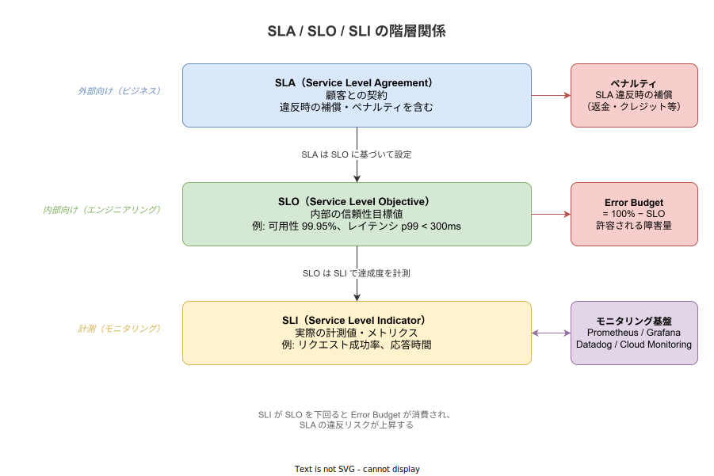
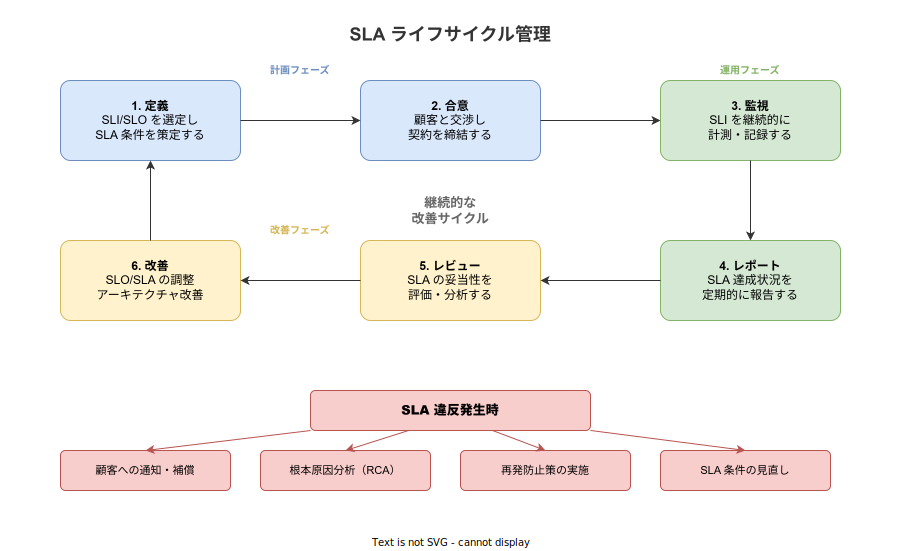

# SLA: 基本

- 対象読者: Web サービスの開発・運用に携わる開発者
- 学習目標: SLA の構成要素と設計方法を理解し、自チームのサービスに適切な SLA を定義できるようになる
- 所要時間: 約 30 分
- 対象バージョン: -（契約・方法論のため特定バージョンなし）
- 最終更新日: 2026-04-13

## 1. このドキュメントで学べること

- SLA が「何であるか」「なぜ必要なのか」を説明できる
- SLA・SLO・SLI の違いと関係を正しく説明できる
- SLA の構成要素（対象指標・目標値・計測方法・補償条件）を理解できる
- 主要クラウドプロバイダの SLA 設計を参考に、自サービスの SLA を検討できる

## 2. 前提知識

- Web サービスの基本的な構成（フロントエンド・バックエンド・データベース）を知っていること
- 可用性やレイテンシの概念を知っていること
- 参照: [SRE: 基本](./sre_basics.md)（SLI/SLO/Error Budget の詳細を扱う）

## 3. 概要

SLA（Service Level Agreement）は、サービス提供者と顧客の間で合意する「サービス品質の契約」である。サービスがどの程度の品質で提供されるか、その品質を下回った場合にどのような補償が行われるかを明文化した文書である。

SLA は単なる目標値ではない。SLO（Service Level Objective）が社内の技術目標であるのに対し、SLA は顧客との法的拘束力を持つ契約である。SLA に違反すると、返金・サービスクレジット・契約解除などのペナルティが発生する。

SLA が必要な理由は、サービス品質に対する期待値を提供者・顧客双方で明確に合意するためである。SLA がなければ「稼働率 100% が当然」という暗黙の期待が生まれ、わずかな障害でも契約紛争の原因となり得る。SLA を定めることで、許容範囲を明確にし、両者にとって公正な関係を構築できる。

## 4. 用語の整理

| 用語 | 説明 |
|------|------|
| SLA（Service Level Agreement） | サービス品質に関する提供者と顧客の契約。違反時の補償を含む |
| SLO（Service Level Objective） | SLA の裏付けとなる内部目標値。SLA より厳しく設定する |
| SLI（Service Level Indicator） | SLO の達成度を計測する定量的な指標 |
| 可用性（Availability） | サービスが正常に利用可能な時間の割合 |
| ダウンタイム（Downtime） | サービスが利用不可能な時間 |
| 計画メンテナンス | 事前に告知した上で実施する保守作業。多くの SLA で除外対象 |
| サービスクレジット | SLA 違反時に顧客に付与される利用料の割引・返金 |
| 除外条件（Exclusions） | SLA の計測から除外される事象（不可抗力、顧客起因の障害等） |

## 5. 仕組み・アーキテクチャ

SLA は SLO・SLI の上位に位置する。SLI で計測した実績値が SLO を満たしているかを監視し、SLO に基づいて SLA の遵守状況を判断する。



SLA は一度定めたら終わりではなく、継続的な管理サイクルで運用する。定義・合意・監視・レポート・レビュー・改善の 6 段階を繰り返し、ビジネス要件の変化に追従する。



SLA 違反が発生した場合は、顧客への通知・補償、根本原因分析（RCA）、再発防止策の実施、SLA 条件の見直しを行う。

## 6. 環境構築

SLA は契約であり、ソフトウェアのインストールは不要である。ただし、SLA の運用にはモニタリング基盤が必要となる。

### 6.1 必要なもの

- メトリクス収集: Prometheus, Datadog, Cloud Monitoring 等
- ダッシュボード: Grafana, Datadog Dashboard 等
- SLA レポート生成: 各クラウドプロバイダの SLA ダッシュボード、または自前のレポート

### 6.2 SLA 策定の手順

1. サービスの重要なユーザー体験（CUJ）を特定する
2. 各 CUJ に対して SLI を定義する
3. SLI に対して SLO を設定する（SLA よりバッファを持たせる）
4. SLO をもとに SLA の目標値を決定する
5. 補償条件・除外条件を定義する
6. 顧客と合意し、契約書として締結する

### 6.3 動作確認

SLA ダッシュボードで以下が表示・追跡可能であることを確認する。

- 現在の SLI 実績値と SLA 目標値の比較
- 月間・四半期の SLA 達成率
- SLA 違反のインシデント履歴

## 7. 基本の使い方

SLA の運用においては、SLI の計測と SLA 達成状況の判定を自動化することが重要である。以下は Prometheus で可用性 SLA の達成率を算出する PromQL の例である。

```promql
# 可用性 SLA の達成率を算出するクエリ
# 直近30日間のリクエスト成功率を計算する
(
  # 成功リクエスト数（非5xxレスポンス）を集計する
  sum(increase(http_requests_total{status!~"5.."}[30d]))
  /
  # 全リクエスト数を集計する
  sum(increase(http_requests_total[30d]))
) * 100
```

### 解説

- `http_requests_total{status!~"5.."}`: HTTP 5xx 以外のレスポンスを「成功」として扱う
- `increase(...[30d])`: 直近 30 日間の増分を計算する。SLA の計測期間に合わせて調整する
- 算出結果が SLA の目標値（例: 99.9%）を上回っていれば SLA を遵守している

SLA レポートの生成は一般的に月次で行い、以下の情報を含める。

| レポート項目 | 内容 |
|-------------|------|
| 計測期間 | 対象月（例: 2026年3月1日〜3月31日） |
| SLA 目標値 | 契約で合意した値（例: 99.9%） |
| 実績値 | 計測した SLI の値（例: 99.95%） |
| ダウンタイム | サービス停止の合計時間 |
| インシデント一覧 | 発生した障害とその影響時間 |
| 判定 | 達成 / 未達 |

## 8. ステップアップ

### 8.1 SLA と SLO のバッファ設計

SLA は顧客との契約であるため、SLO は SLA より厳しく設定する。これにより、SLO 違反の段階で対処でき、SLA 違反を未然に防げる。

| SLA 目標 | 推奨 SLO | バッファ | 月間 SLA 許容ダウンタイム |
|----------|---------|---------|------------------------|
| 99.5% | 99.9% | 0.4% | 約 3.6 時間 |
| 99.9% | 99.95% | 0.05% | 約 43 分 |
| 99.95% | 99.99% | 0.04% | 約 22 分 |
| 99.99% | 99.995% | 0.005% | 約 4.3 分 |

### 8.2 主要クラウドプロバイダの SLA 事例

各クラウドプロバイダは自社サービスに対して SLA を公開している。SLA 設計の参考として有用である。

| プロバイダ | サービス | SLA 目標 | 補償内容 |
|-----------|---------|---------|---------|
| AWS | EC2（単一インスタンス） | 99.5% | 10〜30% のサービスクレジット |
| AWS | S3 | 99.9% | 10〜25% のサービスクレジット |
| GCP | Compute Engine（複数ゾーン） | 99.99% | 10〜50% の金銭クレジット |
| Azure | Virtual Machines（可用性ゾーン） | 99.99% | 10〜100% のサービスクレジット |

これらの事例から、SLA の補償は段階的に設定されることが分かる。違反の度合いが大きいほど補償率が高くなる。

### 8.3 複合 SLA の計算

複数のサービスに依存するシステムでは、全体の SLA は各サービスの SLA を掛け合わせた値になる（直列構成の場合）。

- サービス A（SLA 99.9%） × サービス B（SLA 99.9%） = 全体 SLA 99.8%
- 依存サービスが増えるほど全体の SLA は低下する
- 冗長化（並列構成）を導入すると、全体の可用性は `1 - (1 - A) × (1 - B)` で向上する

## 9. よくある落とし穴

- **SLO と SLA を同じ値に設定する**: バッファがないため、わずかな揺らぎで即座に SLA 違反となる
- **依存サービスの SLA を考慮しない**: 依存先の SLA より高い SLA は原理的に達成できない
- **計画メンテナンスの除外を明記しない**: メンテナンス時間がダウンタイムとして計上され、SLA 違反と判定される
- **計測方法を曖昧にする**: 「何をもってダウンタイムとするか」の定義が不明確だと紛争の原因になる
- **過剰に高い SLA を約束する**: 99.99% と 99.9% ではコストが桁違いに異なる。ビジネス要件に見合わない SLA は避ける

## 10. ベストプラクティス

- SLA は SLO より緩く設定し、十分なバッファを確保する
- 計測方法・計測期間・除外条件を契約書に明記する
- 補償はサービスクレジット等の段階的な仕組みにし、段階ごとの条件を明確にする
- SLA の対象指標はユーザー体験に直結するものを選ぶ（内部メトリクスではなく外部から観測可能な指標）
- 四半期または年次で SLA の妥当性を見直し、ビジネス要件の変化に追従する
- 複合 SLA を計算し、依存サービスの SLA が自サービスの SLA を制約していないか確認する

## 11. 演習問題

1. 自チームが運用するサービスについて、SLA として約束すべき指標（可用性・レイテンシ等）を 3 つ挙げよ
2. 依存する外部サービスの SLA を調査し、自サービスの複合 SLA を計算せよ
3. SLA 違反が発生した場合の補償条件（段階的なサービスクレジット）を設計せよ

## 12. さらに学ぶには

- 関連 Knowledge: [SRE: 基本](./sre_basics.md)（SLI/SLO/Error Budget の詳細）
- 関連 Knowledge: [Chaos Engineering: 基本](./chaos-engineering_basics.md)（障害耐性の検証手法）
- Google SRE Book — Service Level Objectives: <https://sre.google/sre-book/service-level-objectives/>
- Google Cloud SLA 一覧: <https://cloud.google.com/terms/sla>
- AWS SLA 一覧: <https://aws.amazon.com/legal/service-level-agreements/>

## 13. 参考資料

- Betsy Beyer et al., "Site Reliability Engineering", O'Reilly Media, 2016, Chapter 4: Service Level Objectives
- Google SRE Book: <https://sre.google/sre-book/service-level-objectives/>
- AWS Service Level Agreements: <https://aws.amazon.com/legal/service-level-agreements/>
- Google Cloud Service Level Agreements: <https://cloud.google.com/terms/sla>
- Microsoft Azure SLA: <https://www.microsoft.com/licensing/docs/view/Service-Level-Agreements-SLA-for-Online-Services>
