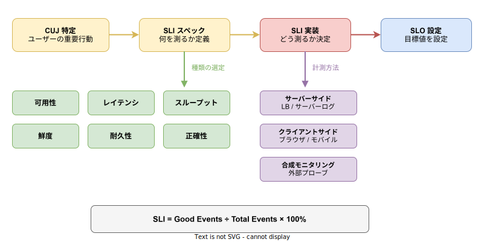
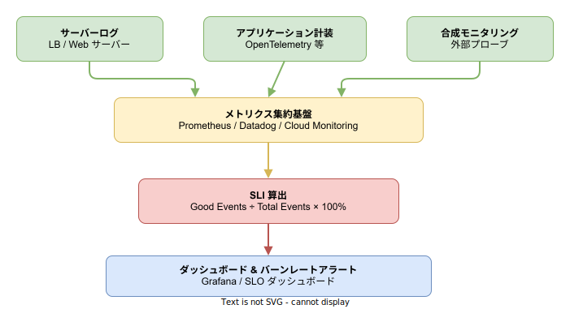

# SLI: 基本

- 対象読者: SRE の基本概念を理解している開発者
- 学習目標: SLI の種類と選定基準を理解し、自サービスの SLI をスペックから実装まで定義できるようになる
- 所要時間: 約 30 分
- 対象バージョン: -（方法論のため特定バージョンなし）
- 最終更新日: 2026-04-13

## 1. このドキュメントで学べること

- SLI の定義と「Good Events / Total Events」の計算式を説明できる
- 6 種類の SLI（可用性・レイテンシ・スループット・鮮度・耐久性・正確性）を区別できる
- SLI スペックと SLI 実装の違いを理解し、段階的に定義できる
- 計測方法（サーバーサイド・クライアントサイド・合成モニタリング）の特性を説明できる
- Prometheus で SLI を算出する PromQL クエリを書ける

## 2. 前提知識

- SRE の基本概念（SLO・Error Budget）を知っていること → [SRE: 基本](./sre_basics.md)
- Prometheus / PromQL の基礎的な読み書き
- HTTP ステータスコードの意味を知っていること

## 3. 概要

SLI（Service Level Indicator）は、サービスの信頼性を定量的に測るための指標である。Google の SRE プラクティスにおいて、信頼性管理の出発点として位置づけられる。

SLI は「Good Events（正常なイベント数） ÷ Total Events（全イベント数） × 100%」で算出する比率である。この定義により、SLI は常に 0% から 100% の範囲に収まり、異なる種類の指標を統一的に扱える。

SLI の定義は 2 段階で行う。まず「SLI スペック」で何を良い/悪いとみなすかを定義し、次に「SLI 実装」でそれをどのように計測するかを決定する。この分離により、計測基盤が変わっても SLI の定義自体は変わらない。

## 4. 用語の整理

| 用語 | 説明 |
|------|------|
| SLI（Service Level Indicator） | サービスの信頼性を測る定量指標。Good Events / Total Events で算出する |
| SLI スペック | 何を「Good」とし何を「Bad」とするかの定義。計測手段に依存しない |
| SLI 実装 | SLI スペックを実際に計測する具体的な方法。ログ解析、メトリクス収集等 |
| CUJ（Critical User Journey） | ユーザーにとって重要な行動経路。SLI の選定起点となる |
| Good Events | SLI スペックの基準を満たすイベント（例: 200 OK のレスポンス） |
| Total Events | 計測対象の全イベント（例: 全 HTTP リクエスト） |
| バーンレート | Error Budget の消費速度。SLI の低下を早期検出するために使う |

## 5. 仕組み・アーキテクチャ

SLI の定義は CUJ の特定から始まり、SLI スペック → SLI 実装 → SLO 設定へと段階的に進む。



SLI スペックでは 6 種類の指標から適切なものを選定し、SLI 実装では 3 つの計測方法から最適なものを選ぶ。SLI は最終的に「Good Events ÷ Total Events × 100%」の比率として算出される。

SLI の計測データはメトリクス基盤に集約され、SLI の算出・ダッシュボード表示・アラート発火に利用される。



サーバーログ・アプリケーション計装・合成モニタリングの 3 つのデータソースからメトリクス基盤にデータを集め、SLI を算出する。算出結果はダッシュボードとバーンレートアラートに反映される。

## 6. 環境構築

SLI は方法論であり、特定ツールに依存しない。計測基盤として以下のスタックが一般的である。

### 6.1 必要なもの

- メトリクス収集: Prometheus、Datadog、Cloud Monitoring
- SLI 算出: PromQL、Datadog SLO モニター
- ダッシュボード: Grafana、Datadog Dashboard
- アラート: Alertmanager、PagerDuty

### 6.2 セットアップ手順

1. サービスが HTTP メトリクス（`http_requests_total` 等）を公開していることを確認する
2. Prometheus でメトリクスをスクレイプする設定を追加する
3. Grafana に SLI ダッシュボードを作成する

### 6.3 動作確認

Prometheus の Web UI で以下のクエリを実行し、データが取得できることを確認する。

```promql
# HTTP リクエストの総数を確認するクエリ
sum(rate(http_requests_total[5m]))
```

## 7. 基本の使い方

Prometheus で可用性 SLI を算出する PromQL クエリの最小例を示す。

```promql
# 可用性 SLI を算出する PromQL クエリ
# HTTP 5xx 以外のレスポンスを Good Events とみなす

# 直近 30 日間の可用性 SLI（%）を算出する
(
  # Good Events: 5xx 以外のレスポンス数を集計する
  sum(increase(http_requests_total{status!~"5.."}[30d]))
  /
  # Total Events: 全レスポンス数を集計する
  sum(increase(http_requests_total[30d]))
) * 100
```

### 解説

- `http_requests_total`: HTTP リクエスト数を記録するカウンターメトリクスである
- `status!~"5.."`: ステータスコードが 5xx でないものを正規表現で抽出する。これが Good Events の定義となる
- `increase([30d])`: 30 日間の増分を算出する。SLO の評価期間に対応させる
- 結果は 0〜100 の数値（%）となる。例えば 99.95 であれば可用性 99.95% を意味する

## 8. ステップアップ

### 8.1 SLI の 6 種類

サービスの種類と SLI の対応を以下に示す。

| SLI 種類 | 定義 | Good Events の例 | 適用サービス |
|----------|------|-----------------|-------------|
| 可用性 | リクエストが正常に処理される割合 | HTTP 2xx/3xx レスポンス | API、Web |
| レイテンシ | リクエストが閾値以内に応答する割合 | p99 < 200ms のリクエスト | API、Web |
| スループット | 単位時間の処理量が基準を満たす割合 | 処理件数 ≥ 1000件/秒 | バッチ、ストリーム |
| 鮮度 | データが一定時間以内に更新される割合 | 更新遅延 < 5分のレコード | データパイプライン |
| 耐久性 | データが失われない割合 | 読み取り可能なオブジェクト | ストレージ |
| 正確性 | 処理結果が正しい割合 | 期待値と一致するレスポンス | ML 推論、計算 |

### 8.2 計測方法の比較

| 計測方法 | 計測場所 | 長所 | 短所 |
|----------|---------|------|------|
| サーバーサイド | LB / サーバーのログ・メトリクス | 導入が容易で高精度 | クライアント側の問題を検出できない |
| クライアントサイド | ブラウザ / モバイルアプリ | ユーザー体験に最も近い | データ量が膨大で欠損リスクがある |
| 合成モニタリング | 外部プローブからの定期リクエスト | 一定条件で再現可能 | 実ユーザーの多様な条件を反映しない |

サーバーサイド計測が最も一般的である。クライアントサイド計測はユーザー体験の正確な把握に有効だが、データの信頼性に課題がある。合成モニタリングはベースラインの確認に適する。

## 9. よくある落とし穴

- **内部メトリクスを SLI にする**: CPU 使用率やメモリ使用量はユーザー体験を直接反映しない。ユーザー視点の指標を選ぶ
- **SLI を多く設定しすぎる**: CUJ あたり 1〜3 個に絞る。多すぎると優先順位が不明確になる
- **計測期間を短く設定する**: 1 日単位では統計的に不安定である。30 日間のローリングウィンドウが一般的である
- **ヘルスチェックを SLI に含める**: ヘルスチェックは合成トラフィックであり、実ユーザーの体験を反映しない
- **SLI スペックを曖昧にする**: 「レスポンスが速い」ではなく「p99 < 200ms」のように定量的に定義する

## 10. ベストプラクティス

- CUJ から逆算して SLI を選定する。技術メトリクスではなくユーザー体験を起点にする
- SLI スペックと SLI 実装を分離し、ドキュメント化する
- 最初はサーバーサイド計測から始め、必要に応じてクライアントサイド計測を追加する
- レイテンシ SLI はパーセンタイル（p50, p99）ベースで設定する。平均値は外れ値を隠す
- SLI の定義を四半期ごとに見直し、CUJ の変化に追従する
- 依存サービスの SLI を把握し、自サービスの SLI への影響を考慮する

## 11. 演習問題

1. 自チームの Web API に対して CUJ を 2 つ特定し、それぞれに可用性とレイテンシの SLI スペックを定義せよ
2. 定義した SLI スペックに対して、Prometheus メトリクスを使った SLI 実装（PromQL クエリ）を記述せよ
3. バッチ処理システムに適切な SLI の種類を選定し、Good Events と Total Events の定義を記述せよ

## 12. さらに学ぶには

- Google SRE Book Chapter 4: https://sre.google/sre-book/service-level-objectives/
- Google SRE Workbook Chapter 2: https://sre.google/workbook/implementing-slos/
- The Art of SLOs（Google）: https://sre.google/resources/practices-and-processes/art-of-slos/
- 関連 Knowledge: [SRE: 基本](./sre_basics.md)、[OpenTelemetry Collector: 基本](./otel-collector_basics.md)

## 13. 参考資料

- Betsy Beyer et al., "Site Reliability Engineering", O'Reilly Media, 2016, Chapter 4
- Betsy Beyer et al., "The Site Reliability Workbook", O'Reilly Media, 2018, Chapter 2
- Alex Hidalgo, "Implementing Service Level Objectives", O'Reilly Media, 2020
- Google Cloud SLO Guide: https://cloud.google.com/architecture/adopting-slos
