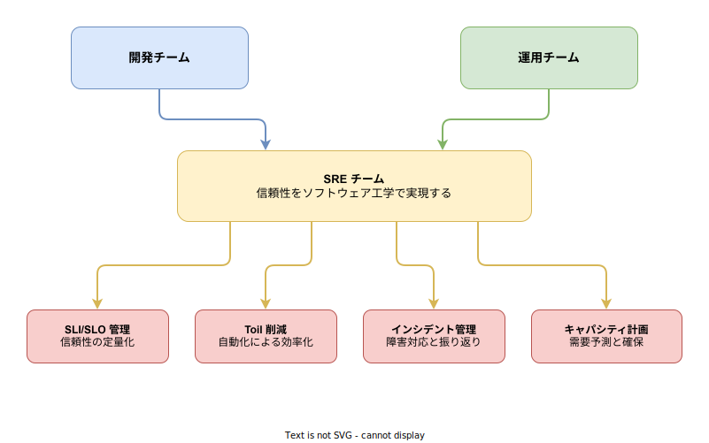
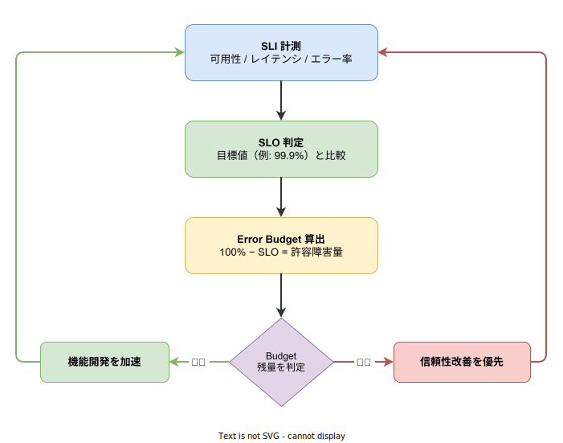

# SRE: 基本

- 対象読者: Web サービスの開発・運用経験がある開発者
- 学習目標: SRE の原則と主要概念（SLI/SLO/Error Budget）を理解し、自チームのサービスに SLO を定義できるようになる
- 所要時間: 約 30 分
- 対象バージョン: -（方法論のため特定バージョンなし）
- 最終更新日: 2026-04-13

## 1. このドキュメントで学べること

- SRE が「なぜ」生まれ、従来の運用と何が違うのかを説明できる
- SLI・SLO・SLA・Error Budget の違いと関係を正しく説明できる
- Toil の定義を理解し、自チームの Toil を特定できる
- 自チームのサービスに対して SLO を定義できる

## 2. 前提知識

- Web サービスの基本的な構成（フロントエンド・バックエンド・データベース）
- 可用性やレイテンシの概念を知っていること
- モニタリングツール（Prometheus, Grafana 等）の存在を知っていること

## 3. 概要

SRE（Site Reliability Engineering）は、Google が 2003 年頃に確立した、ソフトウェアエンジニアリングの手法を用いてシステムの信頼性を実現するアプローチである。Google の VP of Engineering である Ben Treynor Sloss が「SRE とは、ソフトウェアエンジニアに運用の設計を依頼したときに出来上がるもの」と定義した。

従来の運用チーム（Ops）は、手動作業や属人的な対応でシステムを維持していた。SRE はこれを根本から見直し、運用上の課題をソフトウェアエンジニアリングで解決する。手動作業を自動化し、信頼性を定量的に測定・管理し、開発速度と信頼性のバランスをデータに基づいて判断する。

SRE の核心は「100% の信頼性は目指さない」という考え方にある。完璧な信頼性はコストが非常に高く、機能開発の速度を著しく低下させる。代わりに「どこまでの障害を許容するか」を Error Budget として定量化し、その範囲内で最大限の開発速度を追求する。

## 4. 用語の整理

| 用語 | 説明 |
|------|------|
| SRE（Site Reliability Engineering） | ソフトウェア工学の手法で信頼性を実現するアプローチ。Google が提唱した |
| SLI（Service Level Indicator） | サービスの信頼性を測る定量的な指標。例: リクエスト成功率、レスポンス時間 |
| SLO（Service Level Objective） | SLI に対して設定する目標値。例: 可用性 99.9%（月間ダウンタイム約 43 分） |
| SLA（Service Level Agreement） | SLO を基に顧客と結ぶ契約。SLO 未達時の補償内容を含む |
| Error Budget | SLO で許容される障害の量。100% − SLO で算出（例: 0.1%） |
| Toil | 手動的・繰り返し的・自動化可能な運用作業。SRE はこれを 50% 以下に抑える |
| ポストモーテム | 障害後の振り返り文書。原因分析と再発防止策を記録する。非難を目的としない |
| オンコール | 障害発生時に対応する当番制度。SRE では負荷の上限を明確に定める |

## 5. 仕組み・アーキテクチャ

SRE チームは開発チームと運用チームの間に位置し、ソフトウェア工学の手法で両者を橋渡しする。



SRE の活動は主に 4 つの領域に分類される。SLI/SLO 管理で信頼性を定量化し、Toil 削減で自動化を推進し、インシデント管理で障害対応と振り返りを行い、キャパシティ計画で将来の需要に備える。

SRE の最も特徴的な仕組みが Error Budget フィードバックループである。



SLI で計測した実績値を SLO と比較し、Error Budget の残量を算出する。Budget が十分であれば機能開発を加速し、不足していれば信頼性改善を優先する。このサイクルを継続的に回すことで、開発速度と信頼性のバランスをデータに基づいて維持する。

## 6. 環境構築

SRE は方法論であり、特定のツールに依存しない。ただし実践には以下のツールスタックが一般的である。

### 6.1 必要なもの

- メトリクス収集: Prometheus, Datadog, Cloud Monitoring 等
- ダッシュボード: Grafana, Datadog Dashboard 等
- アラート: Alertmanager, PagerDuty, Opsgenie 等
- インシデント管理: PagerDuty, incident.io 等

### 6.2 SLO 導入の手順

1. サービスのクリティカルユーザージャーニー（CUJ）を特定する
2. 各 CUJ に対して SLI を定義する（何を計測するか）
3. SLI に対して SLO を設定する（どこまで許容するか）
4. SLO を監視するダッシュボードとアラートを構築する
5. Error Budget ポリシーをチームで合意する

### 6.3 動作確認

SLO ダッシュボードで以下が表示されることを確認する。

- 現在の SLI 実績値
- SLO 目標値との差分
- Error Budget の残量と消費速度

## 7. 基本の使い方

SLO を Prometheus で実装する最小構成を示す。以下は可用性 SLO のバーンレートアラートを定義する例である。

```yaml
# Prometheus アラートルール定義ファイル
# 可用性 SLO のバーンレートアラートを設定する
groups:
  # SLO アラートグループを定義する
  - name: slo-alerts
    rules:
      # 高速バーンレートアラートを定義する
      - alert: HighErrorBudgetBurn
        # 直近1時間のエラー率が SLO の14.4倍を超えた場合に発火する
        expr: |
          (
            sum(rate(http_requests_total{status=~"5.."}[1h]))
            /
            sum(rate(http_requests_total[1h]))
          ) > (14.4 * 0.001)
        # 5分間継続した場合にアラートを発火する
        for: 5m
        labels:
          # 重要度を critical に設定する
          severity: critical
        annotations:
          # アラートの説明文を記載する
          summary: "Error Budget の高速消費を検出"
          # 詳細情報を記載する
          description: "直近1時間のエラー率が SLO バーンレートの閾値を超過"
```

### 解説

- `http_requests_total{status=~"5.."}`: HTTP 5xx レスポンスの総数を SLI として使用する
- `14.4 * 0.001`: SLO 99.9% に対するバーンレート閾値である。14.4 倍は「このペースが続くと 1 時間で 1 日分の Error Budget を消費する」速度を意味する
- `for: 5m`: 一時的なスパイクを無視し、5 分間持続した場合にのみアラートを発火する

## 8. ステップアップ

### 8.1 SLI の選定基準

サービスの種類によって適切な SLI は異なる。

| サービス種別 | 推奨 SLI | 計測方法 |
|-------------|---------|---------|
| リクエスト駆動型（API） | 可用性、レイテンシ | 成功率、p50/p99 応答時間 |
| データ処理型（バッチ） | スループット、鮮度 | 処理件数/秒、データ遅延時間 |
| ストレージ型（DB） | 耐久性、可用性 | データ損失率、読み書き成功率 |

### 8.2 SLO の数値設定

SLO の設定指針を以下に示す。

| 可用性 SLO | 月間許容ダウンタイム | 適用例 |
|-----------|-------------------|--------|
| 99% | 約 7.3 時間 | 社内ツール |
| 99.9% | 約 43 分 | 一般的な Web サービス |
| 99.99% | 約 4.3 分 | 決済システム |
| 99.999% | 約 26 秒 | 緊急通報システム |

## 9. よくある落とし穴

- **SLO を 100% に設定する**: 達成不可能であり、Error Budget が常にゼロになるため開発が停止する
- **SLI を多く設定しすぎる**: 重要なものが埋もれる。CUJ あたり 3〜5 個に絞る
- **SLO を厳しく設定しすぎる**: 依存サービスの SLO より厳しい値は原理的に達成できない
- **Toil を放置する**: Toil が 50% を超えるとエンジニアリング作業の時間が確保できなくなる
- **ポストモーテムで個人を非難する**: 心理的安全性が損なわれ、障害の報告・共有が減少する

## 10. ベストプラクティス

- SLO はユーザー体験に基づいて設定する（内部メトリクスではなくユーザー視点の指標を選ぶ）
- Error Budget ポリシーを事前にチームで合意し、文書化する
- Toil の割合を定期的に計測し、50% 以下を維持する
- ポストモーテムは Blameless（非難なし）で実施し、再発防止策に注力する
- オンコール負荷を定量的に管理し、持続可能な体制を維持する
- SLO は定期的（四半期ごと等）に見直し、ビジネス要件の変化に追従する

## 11. 演習問題

1. 自チームが運用するサービスの CUJ を 3 つ挙げ、それぞれに SLI を定義せよ
2. 定義した SLI に対して SLO を設定し、月間 Error Budget を算出せよ
3. 自チームの日常業務のうち Toil に該当する作業を列挙し、自動化の優先順位を検討せよ

## 12. さらに学ぶには

- Google SRE Book（無料公開）: <https://sre.google/sre-book/table-of-contents/>
- Google SRE Workbook: <https://sre.google/workbook/table-of-contents/>
- Google SLO ガイド: <https://sre.google/resources/practices-and-processes/art-of-slos/>
- 関連 Knowledge: [Chaos Engineering: 基本](./chaos-engineering_basics.md)

## 13. 参考資料

- Betsy Beyer et al., "Site Reliability Engineering", O'Reilly Media, 2016
- Betsy Beyer et al., "The Site Reliability Workbook", O'Reilly Media, 2018
- Google SRE 公式サイト: <https://sre.google/>
- Ben Treynor Sloss, "What is Site Reliability Engineering?": <https://sre.google/in-conversation/>
