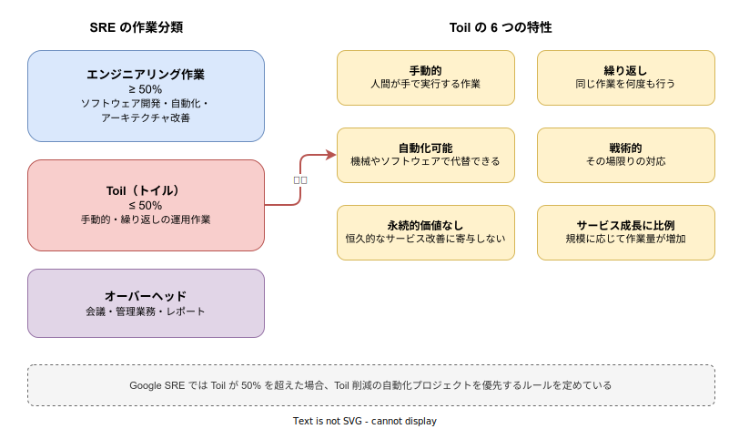
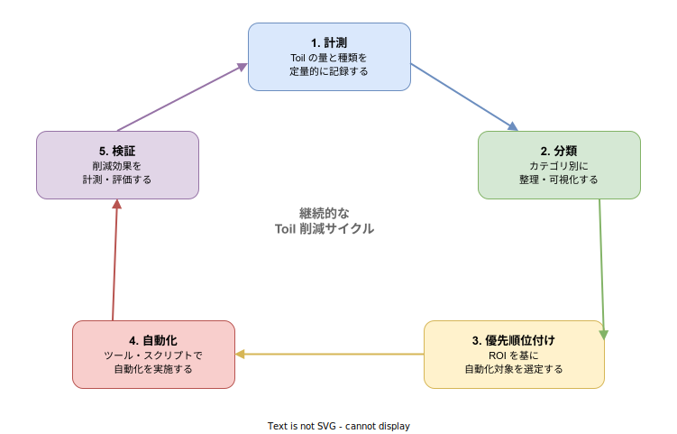

# SRE: Toil（トイル）

- 対象読者: SRE の基本概念を理解している開発者・運用エンジニア
- 学習目標: Toil の定義と特性を理解し、自チームの Toil を特定・計測・削減できるようになる
- 所要時間: 約 30 分
- 対象バージョン: -（方法論のため特定バージョンなし）
- 最終更新日: 2026-04-13

## 1. このドキュメントで学べること

- Toil が何であるかを正確に定義し、他者に説明できる
- Toil の 6 つの特性を使って、ある作業が Toil かどうかを判別できる
- Toil とエンジニアリング作業・オーバーヘッドの違いを区別できる
- 自チームの Toil を特定・計測する方法を実践できる
- Toil 削減の優先順位を決定し、自動化戦略を策定できる

## 2. 前提知識

- SRE の基本概念（SLI/SLO/Error Budget）を理解していること
  - 参照: [SRE: 基本](./sre_basics.md)
- Web サービスの基本的な運用経験があること

## 3. 概要

Toil（トイル）とは、本番サービスの運用に関連する作業のうち、手動的・繰り返し的・自動化可能で、永続的な価値を生まない作業を指す。Google の SRE Book（Chapter 5 "Eliminating Toil"）で定義された概念である。

Toil は「必要悪」ではなく「削減すべき対象」として明確に位置づけられている。Google SRE では、SRE チームの作業時間のうち Toil が 50% を超えないようにするルールを設けている。残りの 50% 以上をエンジニアリング作業（自動化の開発、ツール構築、アーキテクチャ改善など）に充てることで、Toil を継続的に削減していく。

重要なのは、すべての手動作業が Toil ではないという点である。たとえば、チームミーティングや人事評価は「オーバーヘッド」に分類される。新しいシステムの設計やコードレビューは「エンジニアリング作業」であり、Toil ではない。Toil かどうかは、後述する 6 つの特性に基づいて判断する。

## 4. 用語の整理

| 用語 | 説明 |
|------|------|
| Toil（トイル） | 手動的・繰り返し的・自動化可能で永続的価値を生まない運用作業 |
| エンジニアリング作業 | 恒久的な改善をもたらすソフトウェア開発・設計作業 |
| オーバーヘッド | 管理業務・会議・レポートなどの間接作業 |
| Toil Budget | SRE チームの作業時間における Toil の上限（50%） |
| 自動化 ROI | 自動化にかかるコストと、削減される Toil の時間の比率 |
| ランブック | 手順書。Toil の自動化前に作業を標準化するために使用する |

## 5. 仕組み・アーキテクチャ

SRE の作業時間は大きく 3 つに分類される。Toil はその中で「削減対象」として明確に位置づけられている。



Toil であるかどうかは、以下の 6 つの特性すべてに当てはまるかで判断する。

| 特性 | 説明 | 例 |
|------|------|----|
| 手動的 | 人間が手で実行する | サーバーに SSH して手動でログを確認する |
| 繰り返し | 同じ作業を何度も行う | 毎週のディスク容量確認と手動クリーンアップ |
| 自動化可能 | 機械で代替できる | スクリプトで自動化できるデプロイ作業 |
| 戦術的 | その場限りの対応である | アラートに対する一時的な手動リスタート |
| 永続的価値なし | 恒久的改善に寄与しない | 問題の根本原因を解決せず症状だけ抑える |
| サービス成長に比例 | 規模に応じて作業量が増加する | ユーザー数増加に伴い手動のアカウント作成が増える |

## 6. 環境構築

Toil の管理に特定のツールは必須ではないが、以下を用意すると計測と削減が効率的に進む。

### 6.1 必要なもの

- 時間追跡ツール: スプレッドシート、Toggl、Clockify 等
- タスク管理: Jira、Linear、GitHub Issues 等
- ダッシュボード: Grafana、Google Sheets 等（Toil の推移を可視化）

### 6.2 Toil 計測の準備

1. チーム全員で「Toil とは何か」の定義を共有する
2. 時間追跡ツールに「Toil」「エンジニアリング」「オーバーヘッド」のカテゴリを作成する
3. 1〜2 週間、全メンバーが作業ごとにカテゴリを記録する
4. 集計して Toil の割合を算出する

### 6.3 動作確認

以下のデータが取得できることを確認する。

- 各メンバーの Toil 割合（%）
- チーム全体の Toil 割合（%）
- Toil の種類別内訳

## 7. 基本の使い方

Toil を特定し記録する基本的な手法を示す。以下は Toil を YAML 形式で構造化して記録する例である。

```yaml
# Toil 記録テンプレート
# チームの Toil を構造化して記録するための定義ファイル
toil_records:
  # Toil 項目を定義する
  - name: "手動デプロイ"
    # 作業の詳細を記載する
    description: "本番環境へのデプロイを手動で実施する"
    # 週あたりの発生頻度を記録する
    frequency_per_week: 5
    # 1回あたりの所要時間（分）を記録する
    duration_minutes: 30
    # Toil の 6 特性への該当を記録する
    characteristics:
      # 人間が手動で実行するか
      manual: true
      # 同じ作業を繰り返すか
      repetitive: true
      # 機械で代替可能か
      automatable: true
      # その場限りの対応か
      tactical: true
      # 恒久的価値を生むか
      no_enduring_value: true
      # サービス規模に比例するか
      scales_with_service: true
    # 自動化の優先度を設定する
    automation_priority: "high"
    # 自動化方針を記載する
    automation_plan: "CI/CD パイプライン構築で完全自動化"
```

### 解説

- `frequency_per_week` と `duration_minutes` の積が週あたりの Toil 時間となる（この例では 150 分/週）
- `characteristics` の 6 項目がすべて `true` であれば、その作業は Toil と判定できる
- 一部が `false` の場合は Toil ではない可能性があり、チームで議論する
- `automation_priority` は後述する ROI 分析に基づいて決定する

## 8. ステップアップ

### 8.1 Toil の定量化と ROI 分析

Toil 削減の優先順位は、自動化の ROI（投資対効果）で決定する。

| 指標 | 計算式 |
|------|--------|
| 週あたり Toil 時間 | 頻度/週 × 所要時間 |
| 年間 Toil コスト | 週あたり時間 × 52 × エンジニア時給 |
| 自動化コスト | 開発時間 × エンジニア時給 |
| 回収期間 | 自動化コスト ÷ 年間 Toil コスト |

回収期間が 1 年未満の Toil から優先的に自動化する。

### 8.2 Toil 削減サイクル

Toil 削減は一度きりの作業ではなく、継続的なサイクルとして回す。



5 つのステップを繰り返し実行することで、チームの Toil 割合を段階的に低下させる。計測で現状を把握し、分類で整理し、ROI に基づいて優先順位を付け、自動化を実施し、効果を検証する。このサイクルを四半期ごとに回すことが推奨される。

## 9. よくある落とし穴

- **「忙しいから Toil 削減の時間がない」**: Toil を放置するほど時間はさらに減る。小さな自動化から始める
- **Toil とオーバーヘッドを混同する**: 会議やレポートは Toil ではなくオーバーヘッドである
- **すべてを自動化しようとする**: ROI が低い Toil の自動化は費用対効果が合わない
- **自動化の品質を軽視する**: 不安定な自動化は新たな Toil を生む
- **個人の努力に依存する**: Toil 削減はチーム・組織の取り組みとして制度化する必要がある

## 10. ベストプラクティス

- Toil の割合を定期的（週次または月次）に計測し、50% 以下を維持する
- 新しい Toil が発生したら、まずランブック（手順書）を作成して標準化する
- ランブックが安定したら自動化に着手する（手順が不安定なまま自動化すると失敗する）
- 自動化の成果をチーム全体で共有し、Toil 削減の文化を醸成する
- Toil 削減の時間を明示的にスプリントに組み込む（20% ルールなど）
- 組織の成長に伴って新たに発生する Toil を早期に検出する仕組みを持つ

## 11. 演習問題

1. 自チームの直近 1 週間の作業を列挙し、Toil・エンジニアリング・オーバーヘッドに分類せよ
2. 特定した Toil について 6 つの特性チェックを実施し、本当に Toil であるか検証せよ
3. Toil のうち最も ROI の高いものを 1 つ選び、自動化計画を策定せよ
4. チームの Toil 割合が 60% だった場合、どのような対策を取るべきか検討せよ

## 12. さらに学ぶには

- Google SRE Book Chapter 5 "Eliminating Toil": https://sre.google/sre-book/eliminating-toil/
- Google SRE Workbook Chapter 6 "Eliminating Toil": https://sre.google/workbook/eliminating-toil/
- 関連 Knowledge: [SRE: 基本](./sre_basics.md)

## 13. 参考資料

- Betsy Beyer et al., "Site Reliability Engineering" Chapter 5, O'Reilly Media, 2016
- Betsy Beyer et al., "The Site Reliability Workbook" Chapter 6, O'Reilly Media, 2018
- Vivek Rau, "Identifying and Tracking Toil Using SRE Principles", Google Cloud Blog
- Google SRE 公式サイト: https://sre.google/
