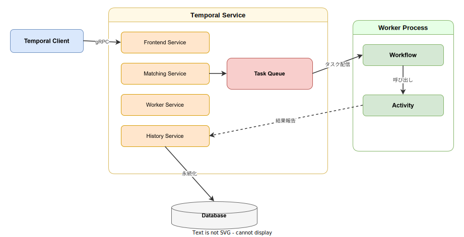
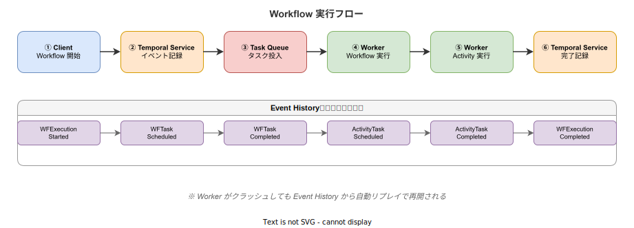

# Temporal: 基本

- 対象読者: 分散システムの基本概念を理解している開発者
- 学習目標: Temporal の全体像を理解し、Workflow・Activity・Worker の役割を説明できるようになる
- 所要時間: 約 45 分
- 対象バージョン: Temporal Server v1.25 / Go SDK v1.31
- 最終更新日: 2026-04-13

## 1. このドキュメントで学べること

- Temporal が解決する課題と Durable Execution の概念を説明できる
- Workflow・Activity・Worker・Task Queue の役割を区別できる
- Temporal Service のアーキテクチャを理解できる
- Go SDK を使って最小構成の Workflow を実装できる

## 2. 前提知識

- 分散システムの基本概念（リトライ、タイムアウト、冪等性）
- Go 言語の基本文法
- マイクロサービスアーキテクチャの基礎知識（[マイクロサービスアーキテクチャ: 基本](./microservice-architecture_basics.md)）

## 3. 概要

Temporal は **Durable Execution**（耐久実行）プラットフォームである。分散システムにおけるワークフローの状態管理・リトライ・障害復旧を自動化し、開発者がビジネスロジックに集中できるようにする。

従来の分散システム開発では、ネットワーク障害・サービスダウン・タイムアウトに対処するために複雑なエラーハンドリングやリトライロジックを実装する必要があった。Temporal はこれらの課題を基盤側で解決する。Workflow のコードは通常の関数として記述でき、障害が発生しても Temporal が自動的に中断箇所から再開する。

## 4. 用語の整理

| 用語 | 説明 |
|------|------|
| Workflow | ビジネスロジック全体を定義する耐久性のある関数。失敗しても途中から再開できる |
| Activity | 外部システムへの API 呼び出しや副作用を伴う処理の単位 |
| Worker | Workflow と Activity を実際に実行するプロセス。Task Queue をポーリングする |
| Task Queue | Temporal Service が Worker にタスクを配信するための名前付きキュー |
| Temporal Service | Workflow の状態管理・タスク配信・イベント永続化を行うバックエンドサービス |
| Event History | Workflow 実行中の全イベントを記録する耐久性のあるログ |
| Namespace | Workflow を論理的に分離するための名前空間 |
| Signal | 実行中の Workflow に外部からデータを送信する仕組み |
| Query | 実行中の Workflow の状態を読み取り専用で取得する仕組み |

## 5. 仕組み・アーキテクチャ

Temporal は Client・Temporal Service・Worker の 3 層で構成される。



Temporal Service は 4 つのサービスで構成される。

- **Frontend Service**: クライアントからの gRPC リクエストを受付け、認証・レート制限・ルーティングを行う
- **Matching Service**: Task Queue を管理し、タスクを適切な Worker に配信する
- **History Service**: Workflow の状態と Event History を管理・永続化する
- **Worker Service**: Temporal 内部のバックグラウンドワークフローを実行する

Worker はユーザーが運用するプロセスであり、Task Queue をポーリングしてタスクを受け取り、Workflow や Activity を実行する。実行結果は History Service に記録され、Database に永続化される。

## 6. 環境構築

### 6.1 必要なもの

- Temporal CLI（開発用サーバー内蔵）
- Go 1.21 以上

### 6.2 セットアップ手順

```bash
# Temporal CLI をインストールする（macOS の場合）
brew install temporal

# 開発用 Temporal Server を起動する
temporal server start-dev

# Go SDK をプロジェクトに追加する
go get go.temporal.io/sdk
```

### 6.3 動作確認

```bash
# Temporal Server の Namespace を確認する
temporal operator namespace describe default
```

Web UI（`http://localhost:8233`）にアクセスし、ダッシュボードが表示されればセットアップ完了である。

## 7. 基本の使い方

最小構成の Workflow・Activity・Worker の実装例を示す。

```go
// Temporal の最小構成サンプル：挨拶 Workflow
package main

import (
 // コンテキストパッケージをインポートする
 "context"
 // フォーマットパッケージをインポートする
 "fmt"
 // ログパッケージをインポートする
 "log"
 // 時間パッケージをインポートする
 "time"

 // Temporal クライアントをインポートする
 "go.temporal.io/sdk/client"
 // Temporal Worker をインポートする
 "go.temporal.io/sdk/worker"
 // Temporal Workflow をインポートする
 "go.temporal.io/sdk/workflow"
)

// Greet は名前を受け取り挨拶メッセージを返す Activity である
func Greet(ctx context.Context, name string) (string, error) {
 // 挨拶メッセージを生成して返す
 return fmt.Sprintf("Hello, %s!", name), nil
}

// GreetWorkflow は Greet Activity を呼び出す Workflow である
func GreetWorkflow(ctx workflow.Context, name string) (string, error) {
 // Activity のタイムアウトを設定する
 opts := workflow.ActivityOptions{
  // Activity の実行制限時間を 10 秒に設定する
  StartToCloseTimeout: 10 * time.Second,
 }
 // コンテキストに Activity オプションを適用する
 ctx = workflow.WithActivityOptions(ctx, opts)
 // Activity の実行結果を格納する変数を宣言する
 var result string
 // Greet Activity を実行して結果を取得する
 err := workflow.ExecuteActivity(ctx, Greet, name).Get(ctx, &result)
 // 結果を返す
 return result, err
}

func main() {
 // Temporal Service に接続する
 c, err := client.Dial(client.Options{})
 if err != nil {
  // 接続失敗時にログ出力して終了する
  log.Fatalln("接続に失敗した:", err)
 }
 // main 関数終了時にクライアントを閉じる
 defer c.Close()
 // Task Queue を指定して Worker を作成する
 w := worker.New(c, "greeting-queue", worker.Options{})
 // Workflow を Worker に登録する
 w.RegisterWorkflow(GreetWorkflow)
 // Activity を Worker に登録する
 w.RegisterActivity(Greet)
 // Worker を起動する
 err = w.Run(worker.InterruptCh())
 if err != nil {
  // Worker 起動失敗時にログ出力して終了する
  log.Fatalln("Worker の起動に失敗した:", err)
 }
}
```

### 解説

- `GreetWorkflow` が Workflow 定義であり、Activity の実行順序を制御する
- `Greet` が Activity 定義であり、実際の処理（この例では文字列生成）を行う
- Worker は `greeting-queue` という Task Queue をポーリングし、タスクを受信する
- Workflow 開始は別プロセスから `client.ExecuteWorkflow` を呼び出して行う

## 8. ステップアップ

### 8.1 Workflow 実行フロー

Workflow の実行は以下の流れで進む。



Temporal Service は各ステップを Event History に記録する。Worker がクラッシュしても、Event History を再生（リプレイ）することで中断箇所から実行を再開できる。これが Durable Execution の核心である。

### 8.2 Signal と Query

- **Signal**: 外部から実行中の Workflow にデータを送信できる。承認待ち Workflow に承認結果を通知する用途などに使う
- **Query**: 実行中の Workflow の現在の状態を取得できる。Workflow の実行を中断せずに内部状態を読み取る

## 9. よくある落とし穴

- **Workflow 内での非決定的な処理**: `time.Now()` やランダム値を直接使うと、リプレイ時に結果が変わり失敗する。`workflow.Now()` や `workflow.SideEffect()` を使用する
- **Workflow 内での直接的な I/O**: HTTP リクエストやファイル操作は Activity として実装する。Workflow 内で直接行うとリプレイ時に副作用が発生する
- **Activity のタイムアウト未設定**: `StartToCloseTimeout` を設定しないと Activity が無期限に実行される可能性がある
- **Task Queue 名の不一致**: Workflow 開始時と Worker 登録時の Task Queue 名が一致しないとタスクが配信されない

## 10. ベストプラクティス

- Workflow は決定的（deterministic）に保つ。外部通信は全て Activity に委譲する
- Activity は冪等に設計する。Temporal のリトライにより同じ Activity が複数回実行される可能性がある
- Task Queue をサービス単位で分離し、Worker のスケーリングを独立させる
- Workflow ID にビジネス上の意味を持たせ、重複実行を防止する

## 11. 演習問題

1. Temporal CLI で開発サーバーを起動し、Web UI（`localhost:8233`）にアクセスせよ
2. 上記のサンプルコードを実行し、別ターミナルから `temporal workflow start --task-queue greeting-queue --type GreetWorkflow --input '"Temporal"'` で Workflow を開始せよ
3. Web UI で Workflow の Event History を確認し、記録されたイベントの種類を列挙せよ

## 12. さらに学ぶには

- 公式ドキュメント: <https://docs.temporal.io/>
- Temporal Go SDK リファレンス: <https://pkg.go.dev/go.temporal.io/sdk>
- 関連 Knowledge: [マイクロサービスアーキテクチャ: 基本](./microservice-architecture_basics.md)、[Dapr: 基本](./dapr_basics.md)

## 13. 参考資料

- Temporal 公式ドキュメント Concepts: <https://docs.temporal.io/temporal>
- Understanding Temporal: <https://docs.temporal.io/evaluate/understanding-temporal>
- Temporal Server Architecture: <https://docs.temporal.io/temporal-service/temporal-server>
- Event History: <https://docs.temporal.io/encyclopedia/event-history>
