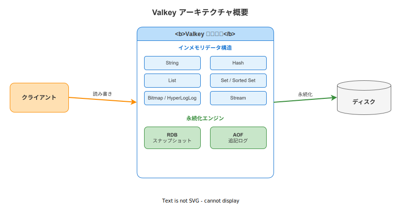
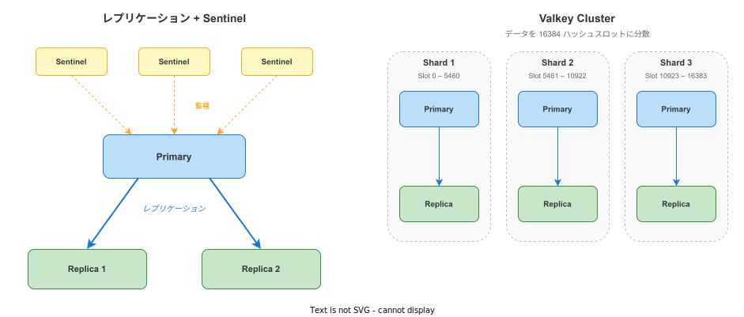

# Valkey: 基本

- 対象読者: データベースやキャッシュの基礎概念を持つ開発者
- 学習目標: Valkey の全体像を理解し、基本的なデータ操作と構成パターンを説明できるようになる
- 所要時間: 約 40 分
- 対象バージョン: Valkey 8.x / 9.x
- 最終更新日: 2026-04-12

## 1. このドキュメントで学べること

- Valkey が解決する課題と Redis との関係を説明できる
- 主要なデータ構造（String・Hash・List・Set・Sorted Set・Stream）の用途を区別できる
- RDB と AOF の永続化方式の違いを理解できる
- Sentinel と Cluster による高可用性構成の概要を把握できる
- valkey-cli を使った基本操作を実行できる

## 2. 前提知識

- キーバリューストアの基本概念
- Linux コマンドラインの基本操作
- Docker の基本操作（環境構築で使用）

## 3. 概要

Valkey は、BSD ライセンスで公開されているオープンソースのインメモリデータ構造ストアである。データベース、キャッシュ、メッセージブローカーとして利用できる。2024 年に Redis のライセンス変更を受けて Linux Foundation のもとでフォークされたプロジェクトであり、Redis との互換性を維持しつつ独自の機能拡張を進めている。

すべてのデータをメモリ上に保持するため、ディスクベースのデータベースと比較して桁違いの読み書き速度を実現する。一方で、永続化機能（RDB・AOF）によりデータの耐久性も確保できる。

## 4. 用語の整理

| 用語 | 説明 |
|------|------|
| インメモリストア | データを主にメモリ上に保持するデータベース。ディスクアクセスがないため高速 |
| RDB | Valkey Database の略。特定の間隔でデータのスナップショットをディスクに保存する方式 |
| AOF | Append Only File の略。すべての書き込み操作をログとして追記する方式 |
| Sentinel | Valkey の監視・自動フェイルオーバーを行うプロセス |
| Cluster | データを複数ノードに分散（シャーディング）して保持する構成 |
| Primary | 読み書き両方を受け付けるメインのノード |
| Replica | Primary からデータを複製して保持する読み取り専用ノード |
| ハッシュスロット | Cluster でキーの配置先を決定するための論理的な区画（全 16384 個） |

## 5. 仕組み・アーキテクチャ

Valkey は、クライアントからのコマンドをインメモリで処理し、必要に応じてディスクへ永続化する構成をとる。



**主要なデータ構造:**

| データ構造 | 概要 | 代表的な用途 |
|-----------|------|-------------|
| String | 最大 512MB のバイナリセーフな文字列 | キャッシュ、カウンター |
| Hash | フィールドと値のペアのマップ | ユーザープロフィール、設定値 |
| List | 挿入順を保持する文字列のリスト | メッセージキュー、タイムライン |
| Set | 一意な文字列の集合 | タグ管理、ユニークユーザー集計 |
| Sorted Set | スコア付きの一意な文字列の集合 | ランキング、優先度キュー |
| Stream | 追記専用のログ型データ構造 | イベントソーシング、リアルタイムデータ |

**永続化方式:**

- **RDB**: 指定間隔でメモリ全体のスナップショットを取得する。復旧が高速だが、最後のスナップショット以降のデータが失われる可能性がある
- **AOF**: すべての書き込みコマンドをログに追記する。データ損失が少ないが、ファイルサイズが大きくなりやすい
- **RDB + AOF**: 両方を併用することで、高速な復旧とデータ安全性を両立できる

## 6. 環境構築

### 6.1 必要なもの

- Docker（推奨：Docker Desktop または Docker Engine）
- ターミナル

### 6.2 セットアップ手順

```bash
# Valkey コンテナを起動する
docker run -d --name myvalkey -p 6379:6379 valkey/valkey:8

# コンテナが起動していることを確認する
docker ps | grep myvalkey
```

### 6.3 動作確認

```bash
# valkey-cli で接続して疎通を確認する
docker exec -it myvalkey valkey-cli ping
```

`PONG` と返れば接続成功である。

## 7. 基本の使い方

valkey-cli で基本的なデータ操作を行う。Redis CLI と同じコマンド体系を使用する。

```bash
# valkey-cli に接続する
docker exec -it myvalkey valkey-cli

# 文字列型のキーに値を設定する
SET greeting "Hello Valkey"

# キーの値を取得する
GET greeting

# 有効期限（秒）を付けて値を設定する
SET session:abc123 "user1" EX 300

# キーの残り有効期限を確認する
TTL session:abc123

# ハッシュ型でユーザー情報を設定する
HSET user:1 name "Taro" age "30" role "engineer"

# ハッシュの全フィールドを取得する
HGETALL user:1

# リスト型の末尾に要素を追加する
RPUSH tasks "task-a" "task-b" "task-c"

# リストの全要素を取得する
LRANGE tasks 0 -1
```

### 解説

- `SET` / `GET`: String 型の基本操作。`EX` オプションで TTL（有効期限）を秒単位で指定できる
- `HSET` / `HGETALL`: Hash 型の操作。1 つのキーに複数のフィールドを持たせられる
- `RPUSH` / `LRANGE`: List 型の操作。`LRANGE 0 -1` で全要素を取得する

## 8. ステップアップ

### 8.1 高可用性構成

Valkey は 2 つの高可用性パターンを提供する。



**Sentinel 構成**: 3 台以上の Sentinel プロセスが Primary を監視し、障害時に Replica を自動で Primary に昇格させる。データの分散は行わない。

**Cluster 構成**: 16384 個のハッシュスロットを複数の Shard に分散する。各 Shard は Primary と Replica で構成され、プロキシなしで水平スケールを実現する。

### 8.2 エビクションポリシー

`maxmemory` に達した際のキー削除戦略を設定できる。

| ポリシー | 動作 |
|---------|------|
| noeviction | 新規書き込みを拒否する（デフォルト） |
| allkeys-lru | 最も長く使われていないキーを削除する |
| allkeys-lfu | 最も使用頻度が低いキーを削除する |
| volatile-ttl | TTL が短いキーを優先して削除する |

## 9. よくある落とし穴

- **永続化未設定でのデータ損失**: デフォルト設定では RDB のみ有効。重要なデータには AOF の併用を検討する
- **maxmemory 未設定**: 制限なしではメモリを際限なく消費する。本番環境では必ず設定する
- **大きなキーの作成**: 数 MB を超える値はネットワーク遅延やメモリ断片化の原因になる
- **KEYS コマンドの本番使用**: 全キーをスキャンするため本番環境ではブロッキングが発生する。代わりに `SCAN` を使用する

## 10. ベストプラクティス

- `maxmemory` と適切なエビクションポリシーを設定する
- キー名に `object:id:field` 形式の命名規則を統一する（例: `user:1:name`）
- 本番環境では RDB + AOF の併用で永続化する
- Sentinel または Cluster で冗長性を確保する
- `KEYS` の代わりに `SCAN` でキーを列挙する

## 11. 演習問題

1. Valkey コンテナを起動し、Hash 型でユーザー情報（名前・メール・年齢）を格納して取得せよ
2. `SET` コマンドの `EX` オプションで TTL 付きキーを作成し、`TTL` コマンドで残り秒数が減っていくことを確認せよ
3. Sorted Set を使ってスコアランキング（3 人以上）を作成し、`ZREVRANGE` で降順に取得せよ

## 12. さらに学ぶには

- 公式ドキュメント: <https://valkey.io/docs/>
- Valkey コマンドリファレンス: <https://valkey.io/commands/>
- GitHub リポジトリ: <https://github.com/valkey-io/valkey>

## 13. 参考資料

- Valkey 公式ドキュメント Introduction: <https://valkey.io/topics/introduction/>
- Valkey Persistence: <https://valkey.io/topics/persistence/>
- Valkey Cluster Specification: <https://valkey.io/topics/cluster-spec/>
- Valkey Sentinel: <https://valkey.io/topics/sentinel/>
