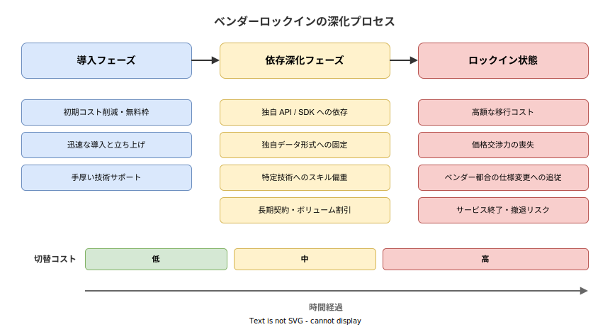
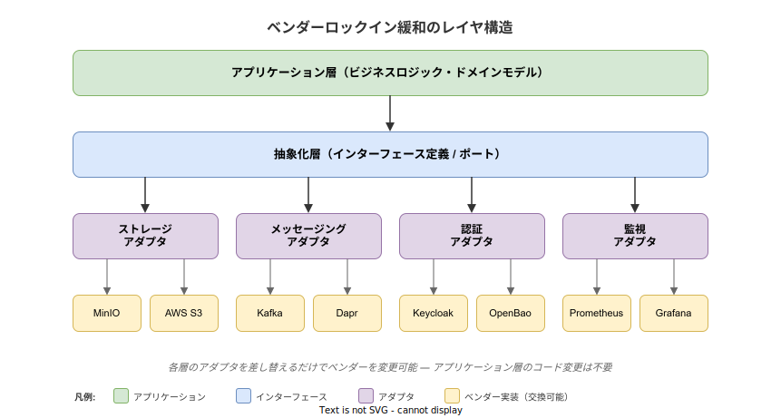

# ベンダーロックイン: 基本

- 対象読者: ソフトウェア開発の基礎知識を持つ開発者・アーキテクト
- 学習目標: ベンダーロックインの発生メカニズムと類型を理解し、設計段階で緩和策を講じられるようになる
- 所要時間: 約 30 分
- 対象バージョン: 概念のため特定バージョンなし
- 最終更新日: 2026-04-16

## 1. このドキュメントで学べること

- ベンダーロックインの定義と発生メカニズムを説明できる
- ロックインの 4 類型（技術・データ・契約・スキル）を区別できる
- ロックインが事業にもたらすリスクを評価できる
- 抽象化層やオープン標準を活用した緩和策を設計に組み込める

## 2. 前提知識

- ソフトウェア開発の基本的な設計パターン（インターフェースと実装の分離）
- クラウドサービス（AWS、Azure、GCP 等）の基本概念
- 関連 Knowledge: [マイクロサービスアーキテクチャの基本](./microservice-architecture_basics.md)

## 3. 概要

ベンダーロックインとは、特定のベンダー（製品・サービス提供者）の技術やサービスに深く依存した結果、他の選択肢への移行が技術的・経済的に困難になる状態を指す。クラウドサービス、SaaS、データベース、ミドルウェアなど、あらゆる技術選定の場面で発生しうる。

ロックインの本質的な問題は、選択肢の喪失にある。初期段階ではコスト削減や迅速な導入というメリットを享受できるが、依存が深まるにつれてベンダーの価格改定、仕様変更、サービス終了といったリスクに対して無防備になる。2024 年の Broadcom による VMware ライセンス体系の変更（年間費用が数倍に跳ね上がったケース）は、ロックインリスクが現実化した代表的事例である。

一方で、ロックインの完全な排除を目指すことは過剰設計につながる。重要なのは、ロックインの度合いを可視化し、許容できるリスクと対策すべきリスクを区別することである。

## 4. 用語の整理

| 用語 | 説明 |
|------|------|
| ベンダーロックイン | 特定ベンダーへの依存により、他の選択肢への切替が困難になる状態 |
| スイッチングコスト | ベンダーを切り替える際に発生する費用・工数・リスクの総体 |
| マルチクラウド | 複数のクラウドプロバイダを併用し、単一ベンダーへの依存を軽減する戦略 |
| 抽象化層 | アプリケーションとベンダー固有実装の間に設けるインターフェース層 |
| オープン標準 | 特定ベンダーに属さない公開された技術仕様（例: gRPC、OCI、S3 互換 API） |
| ポータビリティ | システムやデータを別の環境に移行できる性質 |

## 5. 仕組み・アーキテクチャ

### ロックインの深化プロセス

ベンダーロックインは一度に発生するのではなく、導入から時間の経過とともに段階的に深化する。初期の利便性が依存を生み、依存が切替コストを押し上げ、最終的に選択肢の喪失に至る。



### ロックインの 4 類型

ロックインは発生する領域によって 4 つの類型に分類できる。実際のプロジェクトでは複数の類型が同時に進行することが多い。

**技術的ロックイン** は最も一般的な類型である。ベンダー独自の API、SDK、設定形式、デプロイ手法に依存することで発生する。例えば、AWS Lambda のイベント形式に合わせたコードは、Azure Functions への移植に大幅な書き換えを要する。

**データロックイン** はデータの格納形式や取り出し手段がベンダーに紐づくことで発生する。独自形式で蓄積されたデータの変換コスト、エグレス料金（データ持ち出し費用）、データ量に比例する移行期間が障壁となる。

**契約的ロックイン** は長期契約、ボリュームディスカウント、年間コミットメントなどの商取引条件で発生する。技術的には移行可能でも、契約上の違約金や残存期間が移行を阻む。

**スキルロックイン** は組織内の人材が特定ベンダーの技術に特化することで発生する。チーム全体が特定のエコシステムに習熟すると、別の技術スタックへの移行には再教育コストが加わる。

### 緩和のためのレイヤ構造

技術的ロックインの緩和には、アプリケーションとベンダー固有実装の間に抽象化層を設ける設計が有効である。アプリケーション層はインターフェースにのみ依存し、ベンダー固有の実装はアダプタとして差し替え可能にする。



## 6. ロックイン度の評価

### 6.1 評価の観点

ロックインの対策を講じる前に、現状のロックイン度を評価する必要がある。以下の観点で各技術要素を棚卸しする。

- **代替可能性**: そのコンポーネントを別ベンダーの製品に置換できるか
- **移行コスト**: 置換に必要な工数・期間・費用はどの程度か
- **データ持ち出し**: データをエクスポートする手段と、それにかかるコスト・時間
- **契約条件**: 解約違約金、最低利用期間、データ返却条項の有無
- **スキル市場**: 代替技術のエンジニアを採用・育成できるか

### 6.2 簡易チェックリスト

- 使用している API はオープン標準か、それともベンダー固有か
- データのエクスポート機能が提供されており、実際にテスト済みか
- 契約終了時のデータ返却条項が明記されているか
- 同等機能を提供する代替ベンダーが 2 社以上存在するか
- 移行を想定したアーキテクチャ（抽象化層）が設計に含まれているか

## 7. 基本の使い方

技術的ロックインの緩和で最も基本となるのは、インターフェースによる抽象化である。以下は Go でストレージ操作をインターフェースとして定義し、ベンダー固有の実装を差し替え可能にする例である。

```go
// ベンダー非依存のストレージインターフェース定義例
// アプリケーション層はこのインターフェースにのみ依存する
package storage

// コンテキスト管理用のパッケージをインポートする
import "context"

// ObjectStore はオブジェクトストレージ操作を抽象化するインターフェースである
type ObjectStore interface {
	// オブジェクトを保存する
	Put(ctx context.Context, key string, data []byte) error
	// オブジェクトを取得する
	Get(ctx context.Context, key string) ([]byte, error)
	// オブジェクトを削除する
	Delete(ctx context.Context, key string) error
}
```

### 解説

`ObjectStore` インターフェースはベンダー固有の型を一切含まない。MinIO、AWS S3、GCS のいずれを使う場合も、このインターフェースを実装するアダプタを用意すれば、アプリケーション側のコードを変更せずにベンダーを切り替えられる。依存性注入（DI）で実装を差し込むことで、テスト時のモック化も容易になる。

## 8. ステップアップ

### 8.1 データポータビリティの確保

データロックインの緩和には、保存形式と取り出し手段の標準化が重要である。独自形式ではなく JSON、Parquet、CSV 等の汎用フォーマットを採用し、定期的にデータエクスポートを実行・検証する。データベースについては、PostgreSQL のように複数のマネージドサービス（CloudNativePG、Amazon RDS、Cloud SQL）で動作する OSS を選定することで移植性を確保できる。

### 8.2 オープン標準の活用

ベンダー固有 API の代わりにオープン標準を採用することで、技術的ロックインを構造的に回避できる。サービス間通信には gRPC / Protocol Buffers、コンテナイメージには OCI 仕様、オブジェクトストレージには S3 互換 API（MinIO 等が実装）、オブザーバビリティには OpenTelemetry を選択することで、実装を特定ベンダーに縛られずに済む。CNCF（Cloud Native Computing Foundation）のプロジェクト群はこの方針に沿って設計されている。

## 9. よくある落とし穴

- **完全な排除を目指す過剰設計**: あらゆるベンダー依存を排除しようとすると、抽象化層の開発・保守コストがロックインのリスクを上回る。リスクの大きさに応じて対策の粒度を調整すべきである
- **抽象化層の漏洩**: インターフェースの設計が特定ベンダーの機能に引きずられ、結局ベンダー固有の概念が漏れ出すケース。インターフェースはビジネス要件から導出する
- **移行テストの先送り**: 「いつでも切り替えられる設計」のつもりが、実際にはテストしていないため移行時に想定外の問題が発覚する。定期的にフェイルオーバー訓練やデータエクスポート検証を行う
- **隠れたロックイン**: CI/CD パイプライン、監視ダッシュボード、ログ基盤など、主要サービス以外の周辺ツールにもロックインは潜む。棚卸しの対象から漏らさないこと

## 10. ベストプラクティス

- 技術選定時にスイッチングコストを評価項目に含め、「撤退コスト」を可視化する
- ビジネスクリティカルな領域ほど OSS・オープン標準を優先し、ベンダー固有機能は付加価値として位置づける
- インターフェースと実装を分離するクリーンアーキテクチャを採用し、ベンダー依存をアダプタ層に封じ込める
- データのエクスポート・インポートを定期的にテストし、移行手順を文書化しておく
- 契約時にデータ返却条項・エクスポート支援・解約後の猶予期間を明記する

## 11. 演習問題

1. 自分が関わるプロジェクトで使用している外部サービスを 5 つ挙げ、それぞれについてロックインの 4 類型（技術・データ・契約・スキル）のどれに該当するかを分析せよ
2. 最もスイッチングコストが高いと判断したサービスについて、抽象化層を導入する設計案を作成せよ。インターフェース定義と、現行ベンダー・代替ベンダーそれぞれのアダプタ実装方針を示すこと

## 12. さらに学ぶには

- 関連 Knowledge: [マイクロサービスアーキテクチャの基本](./microservice-architecture_basics.md)（サービス分割による柔軟性確保）
- 関連 Knowledge: [クリーンアーキテクチャの基本](../architecture/clean-architecture_basics.md)（依存性逆転によるベンダー依存の封じ込め）
- 関連 Knowledge: [CNCF の基本](./cncf_basics.md)（クラウドネイティブのオープン標準エコシステム）
- Martin Fowler「StranglerFigApplication」: ベンダー移行時の段階的置換パターン
- Gregor Hohpe「Cloud Strategy」: クラウド戦略とロックイン管理の体系的な解説

## 13. 参考資料

- Opara-Martins, J. et al.「Critical analysis of vendor lock-in and its impact on cloud computing migration」(Journal of Cloud Computing, 2016)
- CNCF Technical Oversight Committee「CNCF Cloud Native Definition v1.0」(2018)
- Broadcom VMware ライセンス変更に関する公開報道（2024 年）
- Martin Fowler「StranglerFigApplication」: <https://martinfowler.com/bliki/StranglerFigApplication.html>
