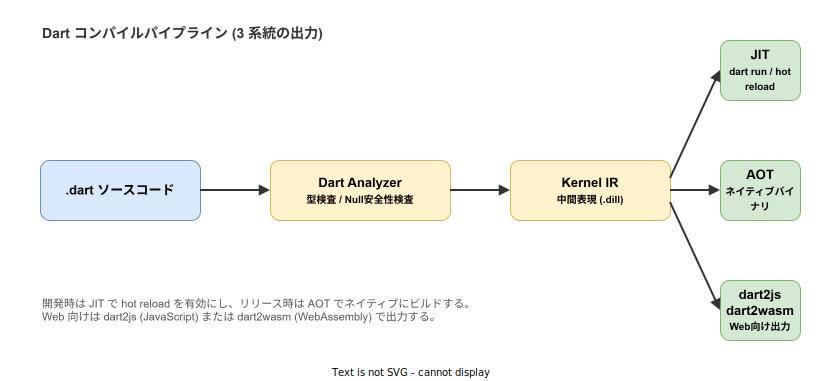
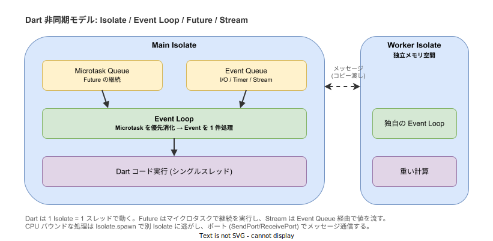

# Dart: 概要

- 対象読者: 他言語（JavaScript/TypeScript、Java/Kotlin、Swift、Go 等）の経験がある開発者
- 学習目標: Dart の設計思想・特徴を理解し、基本的なプログラムを書け、Flutter などの上位フレームワークを学ぶ前提を整える
- 所要時間: 約 40 分
- 対象バージョン: Dart 3.5（2024-08 時点の安定版を基準）
- 最終更新日: 2026-04-28

## 1. このドキュメントで学べること

- Dart がどのような経緯と目的で設計され、現在は何のために使われているかを説明できる
- 健全な型システム（sound null safety）を備えた静的型付けの基本ルールを理解できる
- クラス・records・patterns といった主要な言語機能の役割を区別できる
- `Future` / `Stream` / `Isolate` を組み合わせた非同期モデルの全体像を説明できる
- JIT / AOT / Web (`dart2js`・`dart2wasm`) という 3 系統のコンパイル出力の使い分けを理解できる

## 2. 前提知識

- 何らかのプログラミング言語でのコーディング経験
- クラス・継承・インターフェースなどオブジェクト指向の基本概念
- 同期処理と非同期処理の区別、コールバックや Promise／Future の概念
- ターミナル（コマンドライン）の基本操作

## 3. 概要

Dart は Google の Lars Bak と Kasper Lund が中心となって設計し、2011 年に公開、2013 年に 1.0 をリリースしたプログラミング言語である。当初は Chrome ブラウザ内に Dart VM を載せ JavaScript を置き換える構想だったが、2015 年に方針が転換され、JavaScript へのコンパイラ `dart2js` を主軸とする「JavaScript と共存する言語」へと位置付けが変わった。

その後 2017 年に発表された Flutter（クロスプラットフォーム UI フレームワーク）の唯一の実装言語として採用されたことで Dart の用途は大きく変化した。2018 年の Dart 2.0 で型システムが健全（sound）になり、2021 年の Dart 2.12 で null safety が導入され、2023 年の Dart 3.0 で 100% sound null safety、records、patterns、sealed クラスが追加された。現在の Dart は次の特徴を持つ。

- **静的型付けと sound null safety**: 型はコンパイル時に検査され、`null` を許容するかどうかが型に明示される
- **JIT と AOT の両対応**: 開発時は JIT で hot reload を効かせ、リリース時は AOT でネイティブバイナリを生成する
- **マルチターゲット**: 同じソースから iOS / Android / Windows / macOS / Linux のネイティブと、Web 向けの JavaScript / WebAssembly を出力できる
- **シングルスレッド + Isolate**: 1 Isolate は 1 スレッドで動き、共有メモリを持たない。並列性は別 Isolate へのメッセージ送信で実現する
- **クラスベースのオブジェクト指向**: すべての値はオブジェクトで、`int` や `bool` も例外ではない
- **充実した標準ツール**: `dart` コマンド単体で実行・整形・解析・テスト・パッケージ管理を提供する

## 4. 用語の整理

| 用語 | 説明 |
|------|------|
| Isolate | Dart 実行の単位。独立したヒープと Event Loop を持ち、他 Isolate とはメッセージのみで通信する |
| Event Loop | 1 Isolate につき 1 つ存在する処理ループ。Microtask Queue を優先消化し、その後 Event Queue を処理する |
| `Future<T>` | 将来 1 度だけ値 `T` または例外を返す非同期計算を表す型 |
| `Stream<T>` | 0 個以上の値や例外を非同期に流し続ける列を表す型 |
| sound null safety | `T` 型は決して null にならず、null を許す場合は `T?` と書く規則。コンパイル時に保証される |
| records | 名前付き／位置のフィールドを束ねる軽量な複合型。`(int, String)` や `({int x, int y})` の形で書く |
| patterns | `switch` や代入で値の構造を分解・照合する構文 |
| mixin | クラス階層とは独立にメソッドを混ぜ込む再利用機構。`with` キーワードで適用する |
| pub | Dart のパッケージマネージャ。レジストリは <https://pub.dev/> |
| AOT / JIT | Ahead-Of-Time（事前）／Just-In-Time（実行時）コンパイル。Dart は両方を持つ |

## 5. 仕組み・アーキテクチャ

Dart のソースコードは Dart Analyzer による静的検査を経て、まず Kernel と呼ばれる中間表現（`.dill`）に変換される。Kernel から先は出力ターゲットに応じて 3 系統に分かれる。開発時は JIT バックエンドにより `dart run` や Flutter の hot reload が動き、リリース時は AOT バックエンドがネイティブバイナリを生成する。Web 向けには `dart2js`（JavaScript）または `dart2wasm`（WebAssembly）が使われる。



実行時モデルもこの言語の重要な特徴である。1 Isolate = 1 スレッド = 独立したヒープという設計のため、データ競合は構造的に発生しない。代わりに、CPU バウンドな処理は `Isolate.spawn` で別 Isolate に逃がし、`SendPort` / `ReceivePort` 経由でメッセージを渡す。1 Isolate 内では Event Loop が Microtask Queue（`Future` の継続）と Event Queue（タイマー・I/O・`Stream` のイベント）を順に処理する。



## 6. 環境構築

### 6.1 必要なもの

- Dart SDK 3.5 以上（Flutter SDK を入れると同梱される）
- テキストエディタ（VS Code + Dart 拡張、または IntelliJ IDEA + Dart プラグインを推奨）

### 6.2 セットアップ手順

```bash
# macOS の例（Homebrew）。Linux/Windows は https://dart.dev/get-dart を参照
brew tap dart-lang/dart
brew install dart

# バージョンを確認する
dart --version
```

### 6.3 動作確認

```bash
# 新しいプロジェクトを生成する（コンソールアプリの雛形）
dart create -t console hello_dart
cd hello_dart

# 実行する
dart run
```

## 7. 基本の使い方

```dart
// Dart の基本構文を示すサンプルプログラム
// エントリーポイント: main 関数
void main() {
  // 型推論で String 変数を宣言する
  final name = 'Dart';
  // 文字列補間で値を埋め込んで標準出力に表示する
  print('Hello, $name!');

  // 明示的に型を指定して可変変数を宣言する
  int count = 0;
  // 値を変更する
  count++;
  // 計算結果を表示する
  print('count = $count');

  // 関数を呼び出して戻り値を受け取る
  final result = add(3, 5);
  // 結果を表示する
  print('3 + 5 = $result');
}

// 2 つの整数を受け取り、その合計を返す関数
int add(int a, int b) {
  // 合計を返す
  return a + b;
}
```

### 解説

- `void main()` がプログラムのエントリーポイントで、コンソールアプリ・Flutter アプリ問わず必須である
- `final` は再代入を禁止するローカル変数宣言で、`const` はコンパイル時定数を意味する。両者は使い分けが厳密に区別される
- 文字列リテラル中の `$変数名` や `${式}` で値を埋め込める（文字列補間）
- 文末のセミコロンは必須である（JavaScript のような自動挿入はない）
- すべての値はオブジェクトで、`null` も `Null` 型のインスタンスである。型注釈に `?` を付けない限り `null` は代入できない

## 8. ステップアップ

### 8.1 クラスと sound null safety

```dart
// クラスと null 安全のサンプルプログラム
// User クラスを定義する
class User {
  // 名前は必ず存在する（非 nullable）
  final String name;
  // 年齢は省略可（nullable）
  final int? age;

  // 名前付き引数のコンストラクタ。required で必須項目を強制する
  User({required this.name, this.age});

  // 自己紹介を返すメソッド
  String greet() {
    // age が null かどうかを ?? でフォールバックして表示する
    return '$name (${age ?? '年齢非公開'})';
  }
}

// エントリーポイント
void main() {
  // 名前付き引数でインスタンスを生成する
  final u1 = User(name: '太郎', age: 30);
  // age を省略しても sound null safety により安全に扱える
  final u2 = User(name: '花子');
  // 両者の挨拶を表示する
  print(u1.greet());
  print(u2.greet());
}
```

### 8.2 records と patterns

```dart
// records と patterns のサンプルプログラム
// 2 つの値を返す関数（戻り値は record 型）
(int min, int max) range(List<int> xs) {
  // 最小と最大をまとめて返す
  return (xs.reduce((a, b) => a < b ? a : b), xs.reduce((a, b) => a > b ? a : b));
}

// エントリーポイント
void main() {
  // record の戻り値を分解代入で受け取る
  final (min, max) = range([3, 1, 4, 1, 5, 9, 2, 6]);
  // 結果を表示する
  print('min=$min max=$max');

  // switch 式と patterns で値の構造を判定する
  final point = (x: 3, y: 4);
  // 名前付きフィールドを持つ record を分解照合する
  final desc = switch (point) {
    (x: 0, y: 0) => '原点',
    (x: final x, y: 0) => 'x 軸上 ($x)',
    (x: 0, y: final y) => 'y 軸上 ($y)',
    _ => '一般の点',
  };
  // 判定結果を表示する
  print(desc);
}
```

### 8.3 async / await と Stream

```dart
// 非同期処理のサンプルプログラム
// async 関数: Future<int> を返す
Future<int> fetchScore() async {
  // 1 秒待機する（疑似的な I/O）
  await Future.delayed(Duration(seconds: 1));
  // 計算結果を返す
  return 42;
}

// 1 秒ごとに整数を流す Stream を返す関数
Stream<int> tick() async* {
  // 0..2 を順に yield する
  for (var i = 0; i < 3; i++) {
    // 1 秒待機する
    await Future.delayed(Duration(seconds: 1));
    // 値を Stream に送出する
    yield i;
  }
}

// エントリーポイント（async）
Future<void> main() async {
  // Future の完了を待って値を受け取る
  final score = await fetchScore();
  // 結果を表示する
  print('score = $score');

  // Stream の各値を await for で受け取る
  await for (final n in tick()) {
    // 受け取った値を表示する
    print('tick $n');
  }
}
```

## 9. よくある落とし穴

- **`null` 起因のコンパイルエラー**: sound null safety では `T?` 型の値を `T` 型として使う前に必ず判定する必要がある。`!`（強制非 null 化）に頼ると実行時例外の温床になるため、`if (x != null)` や `?.`、`??` で安全に扱うこと
- **Isolate 間の共有メモリ誤解**: Isolate は独立ヒープのため、グローバル変数は他 Isolate から見えない。値はコピーで渡される（Dart 2.15 以降は一部の型で zero-copy 転送がある）
- **`const` と `final` の混同**: `final` は実行時に決まる値の不変参照、`const` はコンパイル時定数で深いリテラルである。コレクションをコンパイル時定数にしたい場合は `const [1, 2, 3]` のように書く
- **`print` のブロッキング誤解**: `print` は同期だが、`Future.delayed(Duration.zero)` は次の Event Queue で実行される。Microtask（`scheduleMicrotask` や `Future.microtask`）はそれより優先される
- **Dart 2 系コードの参照**: Web 上には null safety 移行前のサンプルが残っている。`?` の付かないコードを見たら 2.12 以前の可能性が高く、現代の Dart に直訳できないことがある

## 10. ベストプラクティス

- `dart format` で整形し、`dart analyze` を CI で実行する。`analysis_options.yaml` で `package:lints/recommended.yaml` を有効にすると Dart 公式が推奨する lint が一括で入る
- 公開 API には型注釈を明示し、内部のローカル変数では型推論を活用する。読み手に対する意図と型推論の安全性のバランスを取る
- 非同期は `Completer` を直接触らず、`async` / `await` を優先する。`Completer` は外部コールバックを `Future` にラップするときの最終手段とする
- CPU バウンドな処理は `compute`（Flutter）や `Isolate.run`（Dart 3.0 以降）に逃がし、UI / イベントループの応答性を損なわない
- 例外型は `Exception` 系を継承させ、プログラムの整合性違反は `Error` 系（`StateError` など）にして区別する。`catch` で握りつぶすのは避ける

## 11. 演習問題

1. `User` クラスを拡張し、`age` が null の場合は「年齢非公開」と表示し、それ以外は「N 歳」と表示するメソッドを追加せよ。null safety を活用した分岐を書くこと
2. `Stream<int>` を 1 秒ごとに値を流す形で実装し、`await for` で受け取りつつ受信値が 5 を超えた時点で購読を打ち切るプログラムを書け
3. 配列の合計を計算する重い処理を `Isolate.run` で別 Isolate に投げ、メイン側がブロックされないことを確認せよ

## 12. さらに学ぶには

- 公式チュートリアル: <https://dart.dev/language>
- Effective Dart: <https://dart.dev/effective-dart>
- DartPad（ブラウザで Dart を試す）: <https://dartpad.dev/>
- 関連 Knowledge: 非同期の詳細・Isolate の運用・Flutter との統合は別ドキュメントに分割予定

## 13. 参考資料

- Dart Language Specification: <https://dart.dev/guides/language/specifications/DartLangSpec-v2.10.pdf>
- Dart SDK ソース: <https://github.com/dart-lang/sdk>
- Dart 3 announcement: <https://medium.com/dartlang/announcing-dart-3-53f065a10635>
- Sound null safety: <https://dart.dev/null-safety>
- Isolates and event loops: <https://dart.dev/language/concurrency>
